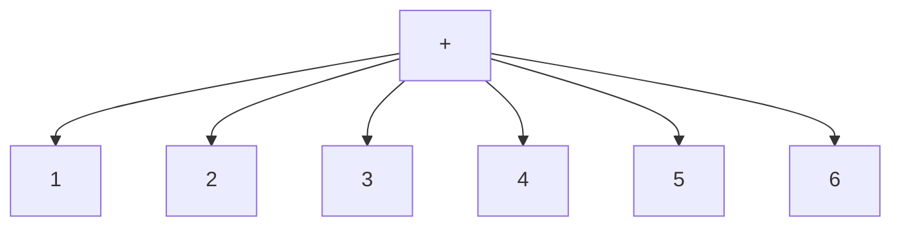
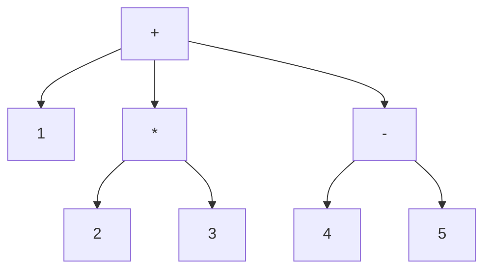

+++
title = '002 好奇先生四处打量Lisp'
date = 2024-07-23T10:52:24+08:00
draft = true
mathjax = false
categories = ['lisp', 'programming-language']
+++


## 鲁莽先生什么都不管

鲁莽先生打开电脑，安装一堆东西，噼里啪啦敲了一堆代码，叽里呱啦说了一堆话，然后累了就回家睡觉了。

这可把好奇先生的兴趣勾起来，他怎么也睡不着。好奇先生打开电脑，看了看鲁莽先生留下的代码和可执行文件，然后开始研究起来。

## 好奇先生第一次见到Lisp

好奇先生看到了一堆括号，他不知道这是什么，但是他知道这是一种编程语言，于是他开始查资料，了解到这是一种叫做Lisp的语言。

这个语言最大的特点就是括号，括号里面是函数名，括号外面是参数。因为括号很多，Lisp也被称为Lots of Irritating Silly Parentheses（许多令人烦恼的愚蠢括号）。

真是好玩啊！好奇先生想，真想要试试看。

好奇先生按照鲁莽先生的说明，安装SBCL，然后打开REPL，输入了一行代码：

    This is SBCL 2.4.6, an implementation of ANSI Common Lisp.
    More information about SBCL is available at <http://www.sbcl.org/>.

    SBCL is free software, provided as is, with absolutely no warranty.
    It is mostly in the public domain; some portions are provided under
    BSD-style licenses.  See the CREDITS and COPYING files in the
    distribution for more information.
    * (+ 1 2)
    3

好的，这下可以做加法啦！实际上，Lisp的加法可以加多个数：

```lisp
(+ 1 2 3 4 5 6)
21
```

这不是很好理解吗？括号里面是一个列表，列表的第一个元素是`+`，后面的元素是被加的数字。画出来就是这样的：




这不算什么，好奇先生想，我可以用Lisp来做更复杂的事情。

```lisp
(+ 1 (* 2 3) (- 4 5))
6
```
再按照上面的方法画出来：



$1 + 2 * 3 + (4 - 5) = 6$ ，结果是6。其实很直观！

好奇先生觉得自己完全懂了：每个列表第一个元素是要干什么，后面的元素是对谁干。而且，后面的元素也可以是列表，这个列表的第一个元素同样是要干什么，后面的元素是对谁干。

## 好奇先生更好奇了

好奇先生觉得自己完全懂了，Lisp的代码就是一个括号套住的内容（包括括号本身），可以称为表达式（expression），表达式的左边一个括号，右边一个括号，中间是一个操作符（operator）和零个或多个操作数（operand）。

```BNF
<left_parenthesis> = "("
<right_parenthesis> = ")"
<expression> ::= <left_parenthesis> <operator> <operand>* <right_parenthesis>
<operand> ::= <expression> | <???>
```

这个`<operator>`是什么？这个`<operand>`是什么？到底是几个？为什么还能是0个？这个`<???>`是什么？好奇先生更好奇了。

## 好奇先生继续研究

好奇先生因为很好奇，早就学过无数种编程语言，他能理解这个`<operator>`是一个函数或者方法或者操作符，比如`+`、`-`、`*`、`/`、`sin`、`cos`、`tan`、`sqrt`、`log`、`exp`等等。而这个`<operand>`是一个值，或者一个变量。当然，无论是值或者变量，其实都有一个很本质的含义，就是内存中的一块区域，这个区域在某些程序设计语言中，表达为地址头、内存长度，这两个两可以完全定位这个区域。但是在Lisp中，到底是什么呢？

### Lisp的数据类型

好奇先生查了一下，Lisp中貌似就只有两类大类数据类型：列表（list）和原子（atom）。

- 列表
  - 由括号括起来的列表
  - 列表的元素可以是列表
  - 列表的元素可以是atom
  - `listp`可以判断是否是列表
- Atom，中文直译为原子，在这里可以理解为不可再分的最小单位，比如：
  - 数字，`numberp`可以判断是否是数字
  - 字符串，`stringp`可以判断是否是字符串
  - 符号，`symbolp`可以判断是否是符号
  - 函数，`functionp`可以判断是否是函数

通过这些操作符（函数）就能够探索各种`对象`的类型。好奇先生对自己的说法又有了亿点点更多的好奇。`对象`？什么对象？Lisp里面操作的是什么？好奇先生继续研究。

### Lisp中的字面量

字面量，就是直接表示的值，比如`1`、`"hello"`、`'a`、`t`、`nil`、`:my-key`等等。这些值是直接表示的，不需要计算，不需要解释，不需要转换，就是它们自己。实际上，这些值就是Lisp中基本被操作的`对象`。并非是面向对象编程中的对象。

那么，跟C中间每个量实际上都是一块内存区域是否一样呢？好奇先生不停地问出新问题。


