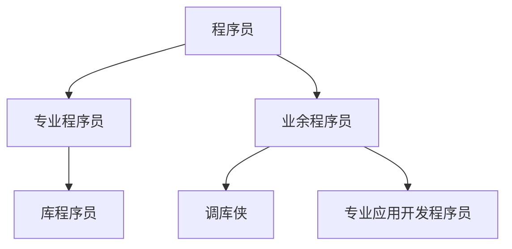

+++
title = '003 颠倒先生的数学表达式'
date = 2024-08-05T12:51:40+08:00
draft = true
mathjax = false
categories = ['posts\']
tags = ['lisp', '编程','实用主义', '入门', '教程','math', 'infix', 'prefix', 'postfix']
toc = true
tocBorder = true
+++


## 程序员taxonomy

颠倒先生成为了一个程序员，然后学会了开发库程序，然后学会了开发应用程序，然后阅读了Lisp入门编程教程。

这都不是重要，重要的是，颠倒先生是一个什么样的程序员。

前面粗鲁先生展示了如何用Lisp开发一个应用程序，并且把应用程序编译成一个可执行文件，其实，这是大部分程序设计语言的使用场景。开发应用程序的程序员，也就是大部分程序员，也就是调包侠。本质上，我们跟业务关系比较大、自己喜欢用程序设计语言进行自动化日常工作的人，都属于调包侠。Python能够如此流行，就是因为调包侠成长快、能力强。

而懒惰先生，是另外一种程序员，也就是库开发程序员。Python能够如此流行，就是因为C语言的库程序员为Python提供了大量的、功能强大的库。



## 颠倒先生的救赎：Julian时间

一般的Lisp教程，总是不会从数学开始，而是从符号和列表这写更加基础（或者高深）的概念开始，从`cons`、`car`、`cdr`这些列表操作的基石概念，逐步引入`lambda`、`defun`这些概念，最后再讲宏、S表达式、lexical scope等等。

颠倒先生就只是想要用Lisp来做一点点计算。因为，颠倒先生，怎么说呢，都说他颠三倒四，那不就是时间前后颠倒了吗？那么，颠倒先生就想利用Lisp来理顺一下时间。git

```lisp
(defun days (mm dd yyyy)
  (+ dd (* 31 (+ mm (* 12 yyyy)))))

(defconstant IGREG (days 10 15 1582))

(defun julday (mm dd yyyy)
  "julday returns the Julian Day Number that begins at noon of the calendar date
specified by month mm, day id, and year iyyy, all integer variables. Positive year signifies A.D.;
negative, B.C. Remember that the year after 1 B.C. was 1 A.D."
  (let* ((current-days (days mm dd yyyy))
         (jy-orig (cond ((eq yyyy 0) (error "julday: there is no year 0"))
                        ((< yyyy 0) (+ yyyy 1))
                        (t yyyy)))
         (jy (if (> mm 2) jy-orig (- jy-orig 1)))
         (jm (if (> mm 2) (+ mm 1) (+ mm 13)))
         (ja (floor (/ jy 100.0)))
         (jul-delta (if (>= current-days IGREG)
                        (+ (- 2 ja) (floor (* 0.25 ja)))
                        0))
         (jul (floor (+
                      (floor (* 365.25 jy))
                      (floor (* 30.6001 jm))
                      dd
                      1720995
                      jul-delta))))
    jul))

(defun caldat (julian)
  "Inverse of the function julday given above. Here julian is input as a Julian Day Number, and
the routine outputs mm,id, and iyyy as the month, day, and year on which the specified Julian
Day started at noon."
  (let* ((IGREG_J 2299161) ;; <==(julday 10 15 1582)
         (ja (cond ((>= julian IGREG_J)
                     ;; Gregorian calendar
                     (let ((jalpha (floor (/ (- (- julian 1867216) 0.25d0) 36524.25d0))))
                       (- (+ julian 1 jalpha) (floor (* 0.25d0 jalpha)))))
                   ((< julian 0)
                     ;; Julian centuries
                     (+ julian (* 36525 (- 1 (floor (/ julian 36525))))))
                   (t julian)))
         (jb (+ ja 1524))
         (jc (floor (+ 6680.0d0 (/ (- (- jb 2439870) 122.1d0) 365.25d0))))
         (jd (floor (+ (* 365 jc) (* 0.25d0 jc))))
         (je (floor (/ (- jb jd) 30.6001d0)))
         (dd (- jb jd (floor (* 30.6001d0 je))))
         (mm-pre (- je 1))
         (mm (if (> mm-pre 12) (- mm-pre 12) mm-pre))
         (yyyy-pre (- jc 4715 (if (> mm 2) 1 0)))
         (yyyy-pre2 (if (<= yyyy-pre 0) (- yyyy-pre 1) yyyy-pre))
         (yyyy (if (< julian 0) (- yyyy-pre2 (* 100 (- 1 (floor (/ julian 36525))))) yyyy-pre2)))
    (values mm dd yyyy)))
```

