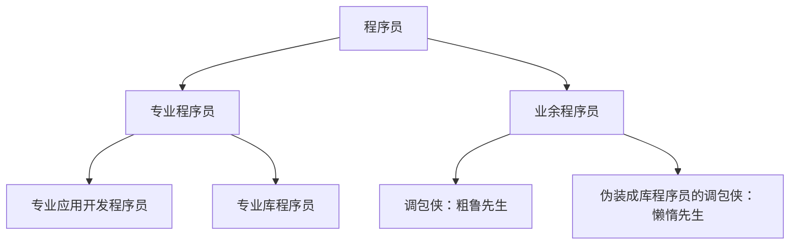

+++
title = '003 颠倒先生的数学表达式'
date = 2024-08-07T12:51:40+08:00
draft = false
mathjax = false
categories = ['lisp', 'programming-language']
tags = ['lisp', '编程','实用主义', '入门', '教程','math', 'infix', 'prefix', 'postfix']
toc = true
tocBorder = true
+++


## 程序员taxonomy

颠倒先生成为了一个程序员，然后学会了开发库程序，然后学会了开发应用程序，然后阅读了Lisp入门编程教程。

这都不重要，重要的是，颠倒先生是一个什么样的程序员。

前面粗鲁先生展示了如何用Lisp开发一个应用程序，并且把应用程序编译成一个可执行文件，其实，这是大部分程序设计语言的使用场景。开发应用程序的程序员，也就是大部分程序员，也就是调包侠。本质上，我们跟业务关系比较大、自己喜欢用程序设计语言进行自动化日常工作的人，都属于调包侠。Python能够如此流行，就是因为调包侠成长快、能力强。

而懒惰先生，是另外一种程序员，也就是库开发程序员。Python能够如此流行，就是因为C语言的库程序员为Python提供了大量的、功能强大的库。



## 颠倒先生的救赎：Julian时间

一般的Lisp教程，总是不会从数学开始，而是从符号和列表这写更加基础（或者高深）的概念开始，从`cons`、`car`、`cdr`这些列表操作的基石概念，逐步引入`lambda`、`defun`这些概念，最后再讲宏、S表达式、lexical scope等等。

颠倒先生就只是想要用Lisp来做一点点计算。因为，颠倒先生，怎么说呢，都说他颠三倒四，那不就是时间前后颠倒了吗？那么，颠倒先生就想利用Lisp来理顺一下时间。

Julian时间，是一种历法，是一种计算时间的方法。Julian时间是从公元前4713年1月1日12时开始的，这个时间点被称为儒略日的起点。只要确定一个时间点，就可以计算出这个时间点对应的儒略日。同样，知道一个儒略日，也可以计算出对应的时间点。下面，用Lisp来实现这个计算过程，代码如下。


```lisp
(defun days (mm dd yyyy)
  (+ dd (* 31 (+ mm (* 12 yyyy)))))

(defconstant IGREG (days 10 15 1582))

(defun julday (mm dd yyyy)
  "julday returns the Julian Day Number that begins at noon of the calendar date
specified by month mm, day id, and year iyyy, all integer variables. Positive year signifies A.D.;
negative, B.C. Remember that the year after 1 B.C. was 1 A.D."
  (let* ((current-days (days mm dd yyyy))
         (jy-orig (cond ((eq yyyy 0) (error "julday: there is no year 0"))
                        ((< yyyy 0) (+ yyyy 1))
                        (t yyyy)))
         (jy (if (> mm 2) jy-orig (- jy-orig 1)))
         (jm (if (> mm 2) (+ mm 1) (+ mm 13)))
         (ja (floor (/ jy 100.0)))
         (jul-delta (if (>= current-days IGREG)
                        (+ (- 2 ja) (floor (* 0.25 ja)))
                        0))
         (jul (floor (+
                      (floor (* 365.25 jy))
                      (floor (* 30.6001 jm))
                      dd
                      1720995
                      jul-delta))))
    jul))

(defun caldat (julian)
  "Inverse of the function julday given above. Here julian is input as a Julian Day Number, and
the routine outputs mm,id, and iyyy as the month, day, and year on which the specified Julian
Day started at noon."
  (let* ((IGREG_J 2299161) ;; <==(julday 10 15 1582)
         (ja (cond ((>= julian IGREG_J)
                     ;; Gregorian calendar
                     (let ((jalpha (floor (/ (- (- julian 1867216) 0.25d0) 36524.25d0))))
                       (- (+ julian 1 jalpha) (floor (* 0.25d0 jalpha)))))
                   ((< julian 0)
                     ;; Julian centuries
                     (+ julian (* 36525 (- 1 (floor (/ julian 36525))))))
                   (t julian)))
         (jb (+ ja 1524))
         (jc (floor (+ 6680.0d0 (/ (- (- jb 2439870) 122.1d0) 365.25d0))))
         (jd (floor (+ (* 365 jc) (* 0.25d0 jc))))
         (je (floor (/ (- jb jd) 30.6001d0)))
         (dd (- jb jd (floor (* 30.6001d0 je))))
         (mm-pre (- je 1))
         (mm (if (> mm-pre 12) (- mm-pre 12) mm-pre))
         (yyyy-pre (- jc 4715 (if (> mm 2) 1 0)))
         (yyyy-pre2 (if (<= yyyy-pre 0) (- yyyy-pre 1) yyyy-pre))
         (yyyy (if (< julian 0) (- yyyy-pre2 (* 100 (- 1 (floor (/ julian 36525))))) yyyy-pre2)))
    (values mm dd yyyy)))
```

调用上面的两个函数就，就可以打印出一些时间的对应关系。比如，下面的代码，打印出了1900年到1902年的1月到3月所有日期对应的儒略日。

```lisp
(loop for yyyy from 1900 to 1902
      do (loop for mm from 1 to 3
               do (loop for dd from 1 to 31
                        do (let* ((julian (julday mm dd yyyy))
                                  (result (multiple-value-list (caldat julian)))
                                  (mm-c (first result))
                                  (dd-c (second result)))
                             (when (and (eq mm-c mm) (eq dd-c dd))
                                   (format t "~4,d-~02,d-~02,d ~10,d~%" yyyy mm-c dd-c julian))))))
```

这个里面有一个判断，比如2月只有28日，那么2月29日对应就是3月1日，转换到Julian时间，时间就是连续的，没有跳跃的日期。啊，颠倒先生觉得自己有救了！感谢Lisp！

## 颠倒先生的一点点小问题

即便颠倒先生是一个颠三倒四的人，经常把`1 + 1`写成`1 1 +`。

但是，前面Lisp代码中间很长很长数学表达式，例如`(+ dd (* 31 (+ mm (* 12 yyyy))))`，连颠倒先生都觉得眼睛不舒服。颠倒先生觉得，这个表达式应该是`dd + 31 * (mm + 12 * yyyy)`，这样看起来更加直观。颠倒先生就该庆幸，因为还有更加颠三倒四的写法，`dd 31 mm 12 yyyy * + * +`。

这三个表达数学计算的方式分别是：

1. 中缀表达式：`dd + 31 * (mm + 12 * yyyy)`
2. 前缀表达式：`(+ dd (* 31 (+ mm (* 12 yyyy))))`
3. 后缀表达式：`dd 31 mm 12 yyyy * + * +`

把计算算符放到前面，是Lisp的一大特色，其解释也很简单，如果把所有的计算算符表示为函数，把函数放在括号外面，就可以很容易写成：`+(dd, *(31, +(mm, *(12, yyyy))))`，这就容易理解多了，括号数量也没有改变。

虽然如此，颠倒先生感觉前缀表达式很符合他的胃口，可是看前面两个例子就知道，简直太难调试。

## 中缀表达式转前缀表达式

颠倒先生想要一个工具，可以把中缀表达式转换成前缀表达式。这个工具，就是`infix-math`，代码如下。

```lisp
(ql:quickload :infix-math)
```

这个工具包提供了一个宏（暂时也当做函数吧），`infix-math/infix-math:$`，这个宏接受一个中缀表达式，返回一个按照对应中缀语法计算得到的结果。

```lisp
(infix-math/infix-math:$ 2 + 3)
;; => 5
```

还有一个问题，如果这个式子访问起来都必须用这样的方式，那实在是太麻烦了。有没有什么办法，可以直接用`($ 2 + 3)`？这是每一个调包侠都要解决的问题。

有三种方式：

1. 使用`in-package`，这样就可以直接使用包中的符号。
2. 在定义包的时候使用`:use`关键字，这样就可以直接使用包中的符号。
3. 使用`import`，这样就可以直接使用包中的符号。

第三种方式就是直接使用`import`，这样就可以直接使用包中的符号。

```lisp
;; 载入infix-math包
(require 'infix-math)

;; 导入infix-math包中的符号$
(import 'infix-math:$)

;; 在当前包中使用$符号
($ 2 + 3)
;; => 5
```


这第二种方式是开发库程序时常用的方式：
```lisp
(defpackage :infix-math-test
  (:use :cl :infix-math))

(in-package :infix-math-test)

($ 2 + 3)
;; => 5
```

第一种方式是把Lisp当做计算器（利用REPL快速验证概念）时常用的方式：
```lisp
(require 'infix-math)

(in-package :infix-math)
;; #<PACKAGE "INFIX-MATH/INFIX-MATH">

($ 2 + 3)
;; => 5
```

那么，调包侠颠倒先生，就可以直接使用`($ 2 + 3)`这样的方式，来计算中缀表达式了。但是有两个疑问：

1. `infix-math/infix-math`和`infix-math`有什么区别？就是怎么回事？
2. `in-package`之后怎么退出包？怎么知道自己在哪个包里面？

## 调包侠必备技能组

问题二的答案很简单，有一个变量`*package*`，这个变量就是当前包。问题一的答案，就是`infix-math/infix-math`的昵称叫做：`infix-math`。

```lisp
(find-package :infix-math)
;; #<PACKAGE "INFIX-MATH/INFIX-MATH">

(package-nicknames (find-package :infix-math/infix-math))
;; ("INFIX-MATH")
```

上面这两个函数，分别可以找到包和包的昵称。这样，颠倒先生就可以知道，`infix-math/infix-math`和`infix-math`是同一个包，只是昵称不同。这在定义包的时候，可以用一个关键字来设定昵称，以简化访问。

```lisp
(defpackage :infix-math/infix-math
  (:use :cl)
  (:nicknames :infix-math))
```

我们最常见的`cl`包，其实就是`common-lisp`包的昵称。因为可以同时设置多个昵称，所以得到的昵称是一个列表。

```lisp
(package-nicknames (find-package :common-lisp-user))      
;; ("CL-USER")
(package-nicknames (find-package :common-lisp))      
;; ("CL")
```

此外，还有一系列函数来让我们查看当前包的信息：

```lisp
(list-all-packages)
;; ...
;; ...

(package-name *package*)
;; ("COMMON-LISP-USER")

(package-nicknames *package*)
;; ("CL-USER")
```

除此之外，调包侠还需要如何找到函数，并且了解函数的帮助。

那么比如对于'infix-math'这个包，我们可以使用`apropos`函数来查看：

```lisp
(apropos 'infix-math)

;; INFIX-MATH
;; :INFIX-MATH = :INFIX-MATH
;; :INFIX-MATH/DATA = :INFIX-MATH/DATA
;; :INFIX-MATH/INFIX-MATH = :INFIX-MATH/INFIX-MATH
;; :INFIX-MATH/SYMBOLS = :INFIX-MATH/SYMBOLS
```

这就对这个包的内容有一定的了解。那么要知道`infix-math`导出了哪些符号，可以使用`do-external-symbols`函数：

```lisp
(do-external-symbols (s (find-package :infix-math))
  (format t "~a~%" s))
;; $
;; OVER
;; DECLARE-UNARY-OPERATOR
;; DECLARE-BINARY-OPERATOR
;; ^
```

这样就知道，哪些是我们可以调用的函数（宏）。那么对于`$`，我们怎么得到一些帮助呢？

```lisp
(describe '$)
;; INFIX-MATH/INFIX-MATH:$
;;   [symbol]
;; 
;; $ names a macro:
;;   Lambda-list: (&REST FORMULA)
;;   Documentation:
;;     Compile a mathematical formula in infix notation.
;;   Source file: C:/Users/User/quicklisp/dists/quicklisp/software/infix-math-20211020-git/infix-math.lisp
```
## 颠倒先生的数学表达式

有了这个工具，颠倒先生就可以直接使用`($ 2 + 3)`这样的方式，来计算中缀表达式了。前面的两个函数顿时变成：

```lisp
(defun days (mm dd yyyy)
  ($ dd + 31 * (mm + 12 * yyyy)))


(defconstant IGREG (days 10 15 1582))

(defun julday (mm dd yyyy)
  "julday returns the Julian Day Number that begins at noon of the calendar date
specified by month mm, day id, and year iyyy, all integer variables. Positive year signifies A.D.;
negative, B.C. Remember that the year after 1 B.C. was 1 A.D."
  (let* ((current-days (days mm dd yyyy))
         (jy-orig (cond ((eq yyyy 0) (error "julday: there is no year 0"))
                        ((< yyyy 0) ($ yyyy + 1))
                        (t yyyy)))
         (jy (if (> mm 2) jy-orig ($ jy-orig - 1)))
         (jm (if (> mm 2) ($ mm + 1) ($ mm + 13)))
         (ja (floor ($ jy / 100.0)))
         (jul-delta (if (>= current-days IGREG)
                        ($ (2 - ja) + (floor (0.25 * ja)))
                        0))
         (jul (floor ($
                       (floor (365.25 * jy)) +
                       (floor (30.6001 * jm)) +
                       dd +
                       1720995 +
                       jul-delta))))
    jul))

(defun caldat (julian)
  "Inverse of the function julday given above. Here julian is input as a Julian Day Number, and
the routine outputs mm,id, and iyyy as the month, day, and year on which the specified Julian
Day started at noon."
  (let* ((IGREG_J (julday 10 15 1582))
         (ja (cond ((>= julian IGREG_J)
                     ;; Gregorian calendar
                     (let ((jalpha (floor ($ (julian - 1867216 - 0.25d0) / 36524.25d0))))
                       ;  (format t "jalpha = ~A ~%" jalpha)
                       ($ julian + 1 + jalpha - (floor (0.25d0 * jalpha)))))
                   ((< julian 0)
                     ;; Julian centuries
                     ($ julian + 36525 * (1 - (floor (julian / 36525)))))
                   (t julian)))
         (jb ($ ja + 1524))
         (jc (floor ($ 6680.0d0 + (jb - 2439870 - 122.1d0) / 365.25d0)))
         (jd (floor ($ (365 * jc) + (0.25d0 * jc))))
         (je (floor ($ (jb - jd) / 30.6001d0)))
         (dd ($ jb - jd - (floor (30.6001d0 * je))))
         (mm-pre ($ je - 1))
         (mm (if (> mm-pre 12) ($ mm-pre - 12) mm-pre))
         (yyyy-pre ($ jc - 4715 - (if (> mm 2) 1 0)))
         (yyyy-pre2 (if (<= yyyy-pre 0) ($ yyyy-pre - 1) yyyy-pre))
         (yyyy (if (< julian 0) ($ yyyy-pre2 - (100 * (1 - (floor (julian / 36525))))) yyyy-pre2)))
    ; (format t "ja=~A jb=~A jc=~A jd=~A ~%" ja jb jc jd)
    ; (format t "dd=~A julian=~A yyyy=~A ~%" dd julian yyyy)
    ; (format t "~A ~A ~A ~A ~%" mm-pre mm yyyy-pre yyyy-pre2)
    (values mm dd yyyy)))
```

这样看起来是不是好多了呢……（颠倒先生学的并没有，如果能够写成逆序表达式就好了！）


## 总结

1. 调包是专业程序员和业余程序员重要的工作方式，也是程序员的重要技能。
2. 调用包内的函数，在`(require 'package-name)`之后，可以使用全称前缀方式访问，也可以使用`in-package`，`use`，`import`等方式把符号引入到当前包内。
3. Lisp的包中的函数，可以通过`apropos`和`do-external-symbols`来查看。
4. 可以通过`describe`来查看函数的帮助。