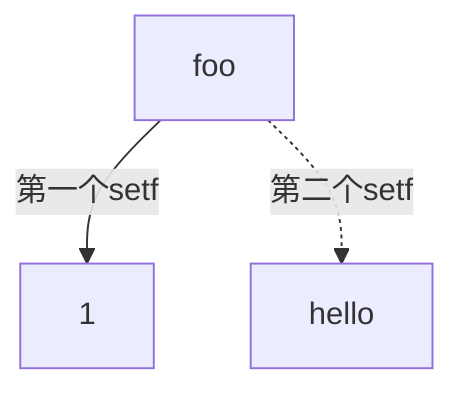

+++
title = '004 完美先生的完美Lisp'
date = 2024-08-16T08:53:00+08:00
draft = false
mathjax = true
categories = ['lisp', 'programming-language']
tags = ['lisp', '编程','实用主义', '入门', '教程','repl', '24 points', 'file', 'postfix']
toc = true
tocBorder = true
+++


## Lisp程序

粗鲁先生、懒惰先生、颠倒先生都对Lisp很满意：

- 粗鲁先生能够粗暴地用VS Code编写小程序，然后用SBCL编译成单一的可执行文件；
- 懒惰先生用`quicklisp`管理依赖关系，形成一个自动化的开发过程，几个简单的Lisp命令就能干一大堆事情；
- 颠倒先生颠三倒四地，用几种方式调用Lisp的包，用中缀的方式写了一个Julian日期计算器。

这三个调包侠热烈地讨论掌握了如此强大的工具之后能够做些什么，完美先生迈着每秒钟整好75步、每步0.8米的完美步伐走了过来，说道：“你们这些调包侠，你们知道Lisp的核心是什么吗？”

### Lisp的核心理念

Lisp的核心理念是代码即数据，数据即代码。有些不追求完美的调包侠、粗暴简陋地认为Lisp是一个函数式程序设计语言，完美先生内心充满痛苦地呻吟：Lisp是一个符号式程序设计语言。符号式设计语言就是程序能够非常方便地操作程序本身，也就是代码和数据地完美对称关系。

从计算机科学的观点看，也就是Lisp中的代码可以把Lisp代码作为直接操作对象，这种特性使得Lisp成为一个非常强大的语言，可以用来实现各种各样的编程范式，例如函数式编程、面向对象编程、过程式编程等等。实际上，任何编程范式都可以用Lisp来实现，实际上也在Lisp中实现过。

这个代码即数据的核心理念之上，Lisp依靠`reader`算法和`readtable`的支持直接对符号`symbol`进行编程，在语法上则是表达为`cons`及其迭代定义形式表达类似于链表、树等复杂数据结构。

### 历史

早期Lisp专注于其完美而有限的核心概念，在此之上构建各个研究人员对完美程序设计语言的理想，因此，Lisp形成太多各种意义上完美的方言。这些方言都很完美，但在大多数时候都只是对于发明人来说。

在以《ANSI Common Lisp》为代表的努力方向上，Lisp语言的标准特性被逐步固化、增加了众多新的构造、工具，例如动态绑定、变量定义等等更加适应现代计算机体系结构的特性。在某些人理论家的眼中，Lisp变得没那么纯粹，但是CLTL孕育了更大的可能性。比如写英文文章会用到的Grammarly，其核心代码就是Lisp编写的，采用的是SBCL实现。

### 代码即数据

从运行方式来看，Lisp是一个解释型的语言。Read-Evaluate-Print-Loop（REPL）是Lisp的标准运行方式，也是Lisp的标准交互方式。在REPL中，我们可以输入Lisp代码，Lisp会立即解释这段代码，并返回结果。

这里输入的源代码是一个字符串，这个字符串在两种情况下是合法的Lisp代码：

1. 输入是一个变量（可以看做是一个对象的名字）、字面量（数字、字符串）
2. 由`(`和`)`作为边界，构成一个列表，列表的每个元素也是合法的Lisp代码

如果采用BNF来表达Lisp的语法，大概是这样的：

```bnf
<expression> ::= <symbol> | <literal> | <list>
<symbol> ::= <identifier>
<literal> ::= <number> | <string>
<list> ::= "(" <expression>* ")"
```

这个语法定义了Lisp的基本语法，Lisp的基本语法就是由符号、字面量、列表构成的。符号是Lisp中的变量名、函数名、宏名等等，字面量是Lisp中的数字、字符串等等，列表是Lisp中的最基本的数据结构，也是Lisp中的源代码的基本形式。


这里变量有两个好玩的事情。

1. 符号是Lisp中的对象的代号，按照惯例，符号是以一个或多个非空白字符组成的字符串，符号是Lisp中的变量名、函数名、宏名等等。跟其他编程语言最大的不同就是，Lisp本身也包含了对符号的操作，当我们访问符号本身时，我们可以使用`quote`或者`'`来访问，例如`(quote foo)`和`'foo`是等价的。而`foo`则可能是一个变量（指向一个值），也可能是一个函数（指向一段代码）。
2. 变量是否对应一个对象，分为两类来判断，函数和值分别在两个命名空间中绑定；
   1. 函数用，`fboundp`，这里的函数有集中，普通的Function、Special、Macro等等；
   2. 对象用，`boundp`，这里的对象绑定，也称为动态绑定，基本上可以采用`defvar`、`defparameter`、`defconstant`等等来定义。

```lisp
(fboundp 'quote)
;; #<FUNCTION (:SPECIAL QUOTE) {100003525B}>

(fboundp 'if)
;; #<FUNCTION (:SPECIAL IF) {100008142B}>

(fboundp 'loop)
;; #<FUNCTION (:MACRO LOOP) {100008152B}>

(defun a ())
;; A

(fboundp 'a)
;; #<FUNCTION A>

(boundp 'quote)
;; NIL

(fboundp 'if)
;; NIL

(boundp '*package*)
;; T

(defvar b 1.0) 
;; B

(boundp 'b)
;; T

(defparameter *b* 20.0)
;; *B*

(boundp '*b*)
;; T

(defconstant +b+ 2)
;; +B+

(boundp '+b+)
;; T
```

关于代码与数据，最后还有一句话：对列表而言，只有第一个元素符号采用`fboundp`返回不是`NIL`的数据才是合法的代码。

## 符号绑定的两种基本形式

### 动态绑定、全局变量、函数

上面，提到的动态绑定概念，也就是一个变量对应一个对象，这种对应关系是运行时确定的。

这里有一个刚学会`setq`、`setf`的人常常碰到的一个问题（特别针对使用SBCL的人），

当按照教程输入下面的代码时，会出现一个警告：

```lisp
(setq foo 1)

; in: SETQ FOO
;     (SETQ FOO 1)
;
; caught WARNING:
;   undefined variable: COMMON-LISP-USER::FOO
;
; compilation unit finished
;   Undefined variable:
;     FOO
;   caught 1 WARNING condition
1
```

在Common Lisp的规范中，对这个行为是没有定义的，因此在不同的实现中，可能会有不同的行为。在SBCL中，这个行为是未定义的，因此会出现一个警告。

这个警告，是因为在`setq`中，`foo`是一个未定义的符号，因此会出现这个警告。在Common Lisp中，我们应该使用`defvar`或者`defparameter`来定义一个符号，这样就不会出现这个警告了。或者在SBCL中，`set `也是可以的。

这里还可以进一步解释一下，因为这里试图绑定的变量（符号），其此法作用域是一个全局的作用域。因此，当我们使用`setq`来绑定一个全局变量时，这个全局变量必须是在全局作用域中已经定义的。如果这个全局变量没有定义，就会出现这个警告。

通常，Lisp不鼓励使用动态全局变量，这样的变量，甚至都推荐使用特别的命名规范，例如`*foo*`。这样的变量，通常是在全局作用域中定义的。另外还有一个全局词法作用域中的常量，通常使用`defconstant`来定义，命名规范是增加前缀/后缀`+`，例如`+FOO+`。


```lisp
;; 一个符号
'foo ; => foo

(defvar foo)

;; 一个符号指向一个数字
(setf foo 1)
foo ; => 1

;; 一个符号指向一个字符串
(setf foo "hello")
foo ; => "hello"
```

实际上，我们不应该引用别的编程语言的概念，因为在Lisp中，符号通常标识一个位置（内存中的位置），这个位置对应的对象是一个值。



这个符号可能在不同的时间指向不同的位置，这就是为什么Lisp中可以采用`setf`来改变奇怪的东西，比如字符串中间的某个字符、数组中的某个元素、列表中的某个元素等等。

### 静态绑定与lexical scope（词法作用域）

静态绑定是另一种绑定符号的方式，这种方式是在编译时确定的，这种方式是在**词法作用域*中确定的，这个绑定关系在运行时是不会改变的。


词法作用域是一个环境（闭包），它包含了符号和值的对应关系。这个环境是一个栈，每次进入一个新的作用域时，就会在栈上压入一个新的环境，当离开这个作用域时，就会弹出这个环境。在Lisp中，我们可以通过`let`来创建一个新的作用域，这个作用域中的符号和值的对应关系就是在`let`中定义的。

```lisp
(let ((foo 1))  
  (print foo))
;; 1
```
这个是典型的Lisp代码，`let`中的`(foo 1)`就是在创建一个新的作用域，这个作用域中，`foo`就是一个符号，它指向的值是1。在这个作用域中，我们可以通过`foo`来访问这个值。当我们离开这个作用域时，这个绑定就会被销毁，`foo`就不再指向1了。

```lisp
(let* ((foo 1)
       (bar foo))
  (print bar))
;; 1
```

这里的`let*`是一个特殊的`let`，它的绑定是有序的，也就是说，后面的绑定可以引用前面的绑定。


实际上，除了`let`，还有其他的方式来创建一个新的作用域，例如`lambda`、`defun`、`defmacro`等等。这些方式都是创建一个新的作用域，这个作用域中的符号和值的对应关系是在这个作用域中定义的。

实际上，原教旨追求完美的Lisp程序员完美先生对符号的动态绑定是不太满意的，因为这种绑定方式实际上是**全局变量**！太不完美了！因此，完美先生更喜欢使用词法作用域，把符号的绑定的限制区域完全控制在一个作用域中。这样，符号的绑定就不会影响到其他的作用域，这样就可以构成完美无瑕的程序了。

```lisp
(defun foo ()
  (let ((foo 1))
    (print foo)))
```

Lisp中存在大量的绑定词法作用域的语法构造，例如`multiple-value-bind`、`with-open-file`、`with-open-stream`等等。这些语法构造都是用来创建一个新的作用域，这个作用域中的符号和值的对应关系是在这个作用域中定义的。

```lisp
(multiple-value-bind (a b)
    (values 1 2)
  (print a)
  (print b))
```

这个是典型的Lisp代码，`multiple-value-bind`中的`(a b)`就是在创建一个新的作用域，这个作用域中，`a`和`b`就是两个符号，它们分别指向1和2。在这个作用域中，我们可以通过`a`和`b`来访问这两个值。当我们离开这个作用域时，这个绑定就会被销毁，`a`和`b`就不再指向1和2了。

```lisp
(with-open-file (stream "test.txt" :direction :output)
  (format stream "Hello, world!"))
```

这里的`with-open-file`有两个作用，一是构成一个新的作用域，二是在这个作用域中打开一个文件。在这个作用域中，我们可以通过`stream`来访问这个文件。当我们离开这个作用域时，这个文件就会被自动关闭。

最后，还可以进行一个测试，看看静态绑定的符号如何判定其是否绑定了一个对象。

```lisp
(defun pol ()   
  (let ((pol 1))     
  (list (fboundp 'pol) (boundp 'pol))))
;; ; in: DEFUN POL
;; ;     (POL 1)
;; ; 
;; ; caught STYLE-WARNING:
;; ;   The variable POL is defined but never used.
;; ; 
;; ; compilation unit finished
;; ;   caught 1 STYLE-WARNING condition
;; POL
(pol)
;; (#<FUNCTION POL> NIL)


(let ((x 2)) (declare (special x)) (boundp 'x))
;; T
```

此外，可以用`makunbound`和`fmakunbound`来解除绑定。

关于词法作用域、变量、位置、值等等的概念，就简单的介绍到这里。接下来，我们就来讨论Lisp中的值的类型。

## 关于对象（值）的类型

### 基本类型

在Lisp中，符号代表的对象（值）有类型，但是符号本身没有类型，实际上符号可以随意的指向任何对象。对象（值）的类型，限定了该值可能的外延，通过类型就可以进行代数分析，这是程序设计中的一个重要的概念。ADT，抽象数据类型，是函数式编程中的一个重要的概念，它同样能够用于Lisp中。

例如，Lisp中的值大概有以下类型。除了后面给出的例外，下面的类型所对应的值的集合相互之间都是两两不相交的。

- cons
- symbol
- array
- number
- character
- hash-table
- function
- readtable
- package
- pathname
- stream
- random-state
- condition
- restart
- defstruct
- define-condition
- defclass

后面两个`define-condition`和`defclass`是用来定义新的类型的，可以直接设置超类（`superclasses`）。`defstruct`是用来定义结构体的，可以通过`:include`来继承其他结构体。


### `cons`类型

cons是Lisp中最基本的数据结构，它是一个二元组，第一个元素是car，第二个元素是cdr。cons可以用来构建链表，树等数据结构。

```lisp
;; 两个元素的cons
(cons 1 2) ; => (1 . 2)

;; 最小的cons就是nil/()
(cons nil nil) ; => (nil . nil), (nil . ()), (nil) 都是一样的
; 这个`cons`的`car`和`cdr`都是nil


```

当一个cons的第二个元素是nil时，我们可以省略这个nil。因此，在Lisp中，`nil`和`()`是等价的，它们都是一个空的cons。


```lisp
;; 接下来就是正常的cons
(cons 1 nil) ; => (1), (1 . nil), (1 . ()) 都是一样的
(cons 1 '()) ; => (1)
(equal nil '()) ; => t

;; cons的car和cdr
(car (cons 1 nil)) ; => 1
(cdr (cons 1 nil)) ; => nil

(car (cons 1 2)) ; => 1
(cdr (cons 1 2)) ; => 2


;; 最后一个元素为nil的cons
(cons 1 (cons 2 nil)) ; => (1 2)

; 当两个元素是对象和cons，最后一个元素是nil时，就可以看作是一个链表
(car (cons 1 (cons 2 nil))) ; => 1
(cdr (cons 1 (cons 2 nil))) ; => (2)
; 请比较上面的结果和此处的结果

```

要完整的理解`cons`，需要理解`car`和`cdr`。`car`和`cdr`是Lisp中的两个基本操作符，它们分别用来获取cons的第一个元素和第二个元素。

当`cdr`得到的是一个cons时，我们可以继续使用`car`和`cdr`来获取更深层的元素。

当这个最简单的两个元素连接的数据结构，跟递归的思路联系起来之后，就可以构建出任意复杂的数据结构。

```lisp
;; 一个简单的链表
(cons 1 (cons 2 (cons 3 nil))) 
; => (1 2 3)

;; 一个简单的树
(cons 1 (cons (cons 2 nil) (cons 3 nil))) 
; => (1 (2) 3)

;; 一个简单的二叉树
(cons 1 (cons (cons 2 (cons 4 nil)) (cons 3 (cons 5 nil)))) 
; => (1 (2 4) (3 5))
```


## 操作符号的实例
完美先生越觉得，Lisp简直是完美无缺、遥遥领先！

这么完美的符号编程语言，完美先生的不完美的儿子刚好有一个暑假作业就是要求进行算24的游戏，完美先生就想到了用Lisp来实现这个游戏。

这个游戏就是随机抽2-10中间的四个数字（因为是扑克牌，所以无放回抽取），然后通过加减乘除运算，使得这四个数字的运算结果是24。

完美先生就开始了他的Lisp之旅，他首先想到的是一直生成随机表达式，直到这个表达式的结果是24。在别的编程语言中，这个生成表达式的过程可能需要包含用字符、字符串表达表达式，然后用一个栈或者树来表达表达式，最后实现一个求值器来计算表达式的值。但是在完美的符号编程语言Lisp中，这个过程就十分自然，因为Lisp中的代码就是数据，数据就是代码，我们可以直接操作代码，生成代码，然后求值这个代码。

### 生成表达式

首先，完美先生需要生成随机表达式。

```lisp
;; 生成一个随机的表达式
(defun random-expression-1 ()
  (let ((operator (nth (random (length *operators*)) *operators*))
        (number1 (nth (random (length *numbers*)) *numbers*))
        (number2 (nth (random (length *numbers*)) *numbers*)))
    (list operator number1 number2)))

(defparameter *operators* '(+ - * /))

(defparameter *numbers* '(2 3 4 5 6 7 8 9 10))

(random-expression-1)
;; (+ 3 9)

(let ((expr (random-expression-1)))
  (format t "~A => ~A~%" expr (eval (random-expression-1))))
;; (+ 4 6) => 40
```

这个程序就是完美先生大脑里的第一个念头，随机抽取运算符和数字，然后生成一个表达式。这个表达式就是一个列表，第一个元素是运算符，第二个和第三个元素是数字。这个表达式本身就是一个Lisp代码，我们可以直接求值这个代码，得到这个表达式的值。

上面这个随机表达式，跟我们的游戏还有一点点差距，因为只有两个操作数、一个操作符，而我们的游戏需要四个操作数、三个操作符。完美先生就想到了，可以用递归的方式来生成表达式。

```lisp
; random expression recursive
(defun random-expression-2 ()
  (let ((operator (nth (random (length *operators*)) *operators*))
        (number1 (nth (random (length *numbers*)) *numbers*))
        (number2 (nth (random (length *numbers*)) *numbers*)))
    (case (random 4)
      (0 (list operator number1 number2))
      (1 (list operator number1 (random-expression-2)))
      (2 (list operator (random-expression-2) number2))
      (3 (list operator (random-expression-2) (random-expression-2))))))

(defun show-expression (expr-func)
  (let ((expr (funcall expr-func)))
    (format t "~A => ~A~%" expr (eval expr))))

(show-expression 'random-expression-2)
;; (*
;;  (/
;;   (-
;;    (- (+ 3 2)
;;       (/
;;        (/
;;         (+
;;          (-
;;           (* (* (- 8 2) (+ (- 7 2) (+ (* 6 (- 8 4)) 6)))
;;              (/ 4
;;                 (*
;;                  (*
;;                   (+ 9
;;                      (- 7
;;                         (+ 5
;;                            (*
;;                             (/
;;                              (- (- 10 7)
;;                                 (* 10
;;                                    (+
;;                                     (- 6
;;                                        (- 7
;;                                           (- 2
;;                                              (+
;;                                               (* 7 (/ (+ 2 (/ 4 (* 10  3))) 2))
;;                                               9))))
;;                                     10)))
;;                              (* (+ (* (+ 8 9) 2) 2) 7))
;;                             4))))
;;                   10)
;;                  9)))
;;           10)
;;          7)
;;         5)
;;        2))
;;    (+ (/ (/ (* 8 10) 7) 7) 6))
;;   5)
;;  (/ 2 (- (+ 9 (+ 5 (+ (* 9 3) (+ 9 8)))) 8))) => -1132497/58371250
```

哈哈，真是疯狂！这真是太好玩，完美先生感觉Lisp就是一个完美的玩具，他可以玩一年！

写了两个生成表达式的函数之后，完美先生的想法就更加清晰了，接下来就是尝试以下几个考虑：

1. 表达式的值中间可能出现除以0的情况，需要在求表达式的值时处理这种情况；
2. 表达式的操作数从`*numbers*`中随机抽取，需要考虑无放回抽取的问题；
3. 表达式应该从随机抽取的四个操作数中选择，刚好每个用一次，这个问题可以通过递归的方式来解决；

为了解决第三个问题，完美先生想到了一个完美的迭代解决方案：

1. 把四个操作数放在一个列表$\mathcal{L}$
2. 重复如下步骤：
   1. 如果$\mathcal{L}$中只有一个操作数，那么这个操作数就是表达式的值，返回结束程序
   2. 从$\mathcal{L}$中随机抽取两个操作数，然后从$\mathcal{L}$中删除这两个操作数
   3. 从$\mathcal{L}$中随机抽取一个操作符，然后生成一个表达式，把这个表达式放回$\mathcal{L}$中

这个算法包含一个终止条件和一个迭代过程。这个过程可以用递归的方式来实现。

```lisp
; generate a random expression with 4 unique numbers
(defun random-expression-3 (numbers)
  (if (equal (length numbers) 1)
      (first numbers)
      (let* ((operator (nth (random (length *operators*)) *operators*)))
        (multiple-value-bind (number1 numbers) (pop-random numbers)
          (multiple-value-bind (number2 numbers) (pop-random numbers)
            (push (list operator number1 number2) numbers)
            (random-expression-3 numbers))))))
```

真是太完美了！完美先生感觉自己比鲁莽先生、懒惰先生、颠倒先生加起来还要完美！这里还需要实现一个随机无放回抽取的函数`pop-random`，这个函数会从一个列表中随机抽取一个元素，并返回这个元素和剩下的列表。

```lisp
; remove an element from a list, return the value and the list
(defun pop-random (list)
  (let ((index (random (length list))))
    (values (nth index list) (remove (nth index list) list))))
```

```lisp
(show-expression (lambda () (random-expression-3 '(2 3  4 5))))
;; (- (- 2 4) (+ 3 5)) => -10
```
完美！完美先生感觉自己就是一个完美的完美先生！

还有两个小问题，就是计算中的除0，Lisp也有完美的解决方案，就是`handler-case`，这个函数可以捕获异常，然后处理异常。

```lisp
(defun eval-expr-default-zero (expr)
  (handler-case
      (eval expr)
    (error () 0)))

(eval-expr-default-zero '(+ 1 2))
;; 3

(eval-expr-default-zero '(/ 1 0))
;; 0
```

最后，随机选择四个数字，然后生成一个表达式，计算这个表达式的值，如果这个值是24，那么就是一个解。

```lisp
; randomly select 4 unique numbers from *numbers*
(defun select-four-unique ()
  (let ((numbers (copy-list *numbers*))
        (result nil))
    (dotimes (i 4 result)
      (let ((index (random (length numbers))))
        (push (nth index numbers) result)
        (setf numbers (remove (nth index numbers) numbers))))))

(defun generate-random-solution (numbers)
  (let* ((expr (random-expression-3 numbers))
         (value (eval-expr-default-zero expr)))
    (values expr value)))

;; for a combination of four numbers, generate all possible expressions that evaluate to 24
(defun generate-all-solutions (numbers &optional (random-count *random-count*))
  (let ((solutions nil))
    (dotimes (i random-count solutions)
      (multiple-value-bind (expr answer) (generate-random-solution numbers)
        (when (= answer 24)
              (unless (expr-not-in-list-p expr solutions)
                (push expr solutions)))))))

; number of random expressions to generate
(defparameter *random-count* 100000)
```

完美先生最满意的并不只是这个程序本身，更是这个程序的开发过程，从简单的想法出发，逐步增加小小的功能，进行小小的改进，最终得到越来越完美的结局方案。这里面对于开发最有用的工具：

1. REPL，可以实时的查看代码的运行结果，可以实时的修改代码，可以实时的查看代码的结构；
2. 函数，可以把代码分解成一个个小的函数，每个函数只做一件事情，这样就可以逐步的增加功能，逐步的改进功能；
3. 递归，可以用递归的方式来解决问题，这样就可以把一个大的问题分解成一个个小的问题，然后逐步的解决这些小的问题；
4. 动态的运行过程，可以在代码中先写框架，再写具体功能的实现函数，这个方式其实非常高效，能够快速的通过试错来完成一个程序。

最后，给出完整的程序，增加了把结果写入文件的功能，这样就可以把所有的解保存到文件中，然后可以随时查看这些解。


### 完整的程序

```lisp
;;;; code-as-data-as-code.lisp

(defparameter *operators* '(+ - * /))

(defparameter *numbers* '(2 3 4 5 6 7 8 9 10))

(defparameter *random-count* 100000)

;;; human readable time
(defconstant +day-names+
             '("Monday" "Tuesday" "Wednesday"
                        "Thursday" "Friday" "Saturday"
                        "Sunday"))

(defun human-readable-time ()
  "Return human readable time"
  (multiple-value-bind
      (second minute hour date month year day-of-week dst-p tz)
      (get-decoded-time)
    (declare (ignore dst-p))
    (format nil "~2,'0d:~2,'0d:~2,'0d of ~a, ~d/~2,'0d/~d (GMT~@d)"
      hour
      minute
      second
      (nth day-of-week +day-names+)
      month
      date
      year
      (- tz))))


;;; randomly select 4 unique numbers from *numbers*
(defun select-four-unique ()
  (let ((numbers (copy-list *numbers*))
        (result nil))
    (dotimes (i 4 result)
      (let ((index (random (length numbers))))
        (push (nth index numbers) result)
        (setf numbers (remove (nth index numbers) numbers))))))

; remove an element from a list, return the value and the list
(defun pop-random (list)
  (let ((index (random (length list))))
    (values (nth index list) (remove (nth index list) list))))


; generate a random expression with 4 unique numbers
(defun random-expression-3 (numbers)
  (if (equal (length numbers) 1)
      (first numbers)
      (let* ((operator (nth (random (length *operators*)) *operators*)))
        (multiple-value-bind (number1 numbers) (pop-random numbers)
          (multiple-value-bind (number2 numbers) (pop-random numbers)
            (push (list operator number1 number2) numbers)
            (random-expression-3 numbers))))))

(defun generate-random-solution (numbers)
  (let* ((expr (random-expression-3 numbers))
         (value (handler-case
                    (eval expr)
                  (error () 0))))
    (values expr value)))

(multiple-value-bind (expr answer) (generate-random-solution (select-four-unique))
  (format t "~A   => ~A ~%" expr answer)
  expr)

(defun cummulative-expr-equal-p (expr1 expr2)
  "Check if two expressions are equal, regardless of the order of the operands"
  (and (expr-equal-p (second expr1) (third expr2))
       (expr-equal-p (third expr1) (second expr2))))

(defun commulative-expr-p (expr)
  "Check if an expression is commulative"
  (or (equal (first expr) '+) (equal (first expr) '*)))

(defun expr-type-equal-p (expr1 expr2)
  "Check if an expression is of a certain type"
  (and (listp expr1) (listp expr2) (equal (first expr1) (first expr2))))

(defun expr-equal-p (expr1 expr2)
  (if (or (not (listp expr1)) (not (listp expr2)))
      (equal expr1 expr2)
      (and (expr-type-equal-p expr1 expr2)
           (or (and (commulative-expr-p expr1)
                    (cummulative-expr-equal-p expr1 expr2))
               (and (expr-equal-p (second expr1) (second expr2))
                    (expr-equal-p (third expr1) (third expr2)))))))

(defun expr-not-in-list-p (expr list)
  (dolist (e list)
    (if (expr-equal-p e expr)
        (return t))))

;; for a combination of four numbers, generate all possible expressions that evaluate to 24
(defun generate-all-solutions (numbers)
  (let ((solutions nil))
    (dotimes (i *random-count* solutions)
      (multiple-value-bind (expr answer) (generate-random-solution numbers)
        (when (= answer 24)
              (unless (expr-not-in-list-p expr solutions)
                (push expr solutions)))))))

;;; filenames
(defun list-to-string (list &optional (separator " "))
  (reduce
      (lambda (a b) (concatenate 'string (format nil "~A" a) separator (format nil "~A" b)))
      list))

(defun generate-solutions-file-name (numbers)
  "Generate file name for solutions"
  (concatenate 'string "solutions-" (list-to-string numbers "-") ".lisp"))


;; generate solutions for all combinations of 4 numbers that evaluate to 24
(defun random-gen-puzzle ()
  (let* ((numbers (select-four-unique))
         (fn (generate-solutions-file-name numbers)))
    (with-open-file (stream fn :direction :output)
      (let
          ((exprs (generate-all-solutions numbers)))

        (format stream ";; ~A~%" numbers)
        ;; print generation date and time in human readable format

        (format stream ";; Generated: ~A~%" (human-readable-time))
        (format stream ";; Total solutions: ~D~%" (length exprs))
        ; print all expressions that evaluate to 24
        (dolist (expr exprs)
          (print expr stream))

        (format t "~A~%" numbers)
        (dolist (expr exprs)
          (format t "    ~A~%" expr))))))
```

完美先生就可以用这个完美的程序来干什么来着？干什么来着？

```lisp
(load "point24.lisp")
(setf *random-state* (make-random-state t))
(random-gen-puzzle)
```

一个文件就出现在当前目录：

```lisp
;; (9 5 4 7)
;; Generated: 08:41:56 of Friday, 8/16/2024 (GMT+8)
;; Total solutions: 11

(- (* (- 9 5) 7) 4) 
(- (* 4 9) (+ 5 7)) 
(+ 9 (* (- 7 4) 5)) 
(- (* 7 4) (- 9 5)) 
(- 5 (- 9 (* 7 4))) 
(- (- (* 9 4) 5) 7) 
(- 9 (* (- 4 7) 5)) 
(- (+ 5 (* 4 7)) 9) 
(+ (- 5 9) (* 4 7)) 
(+ 5 (- (* 7 4) 9)) 
(- (- (* 4 9) 7) 5) 
```

完美地耍了几个小时的Lisp，啊，Lisp真快乐啊。
## 总结

1. Lisp是一个符号编程语言，符号是Lisp中的对象的代号，符号是Lisp中的变量名、函数名、宏名等等。
2. Lisp的开发过程因为其REPL而高效，可以实时的查看代码的运行结果，可以实时的修改代码，这个功能在Vs Code+Alive中支持的很好，在Emacs中也有很好的支持。
3. 直接操作代码，生成代码，求值代码，是Lisp中一个核心理念和功能，在宏中有很好的体现（以后再写）。