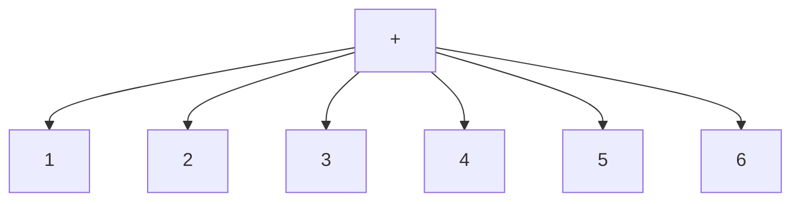
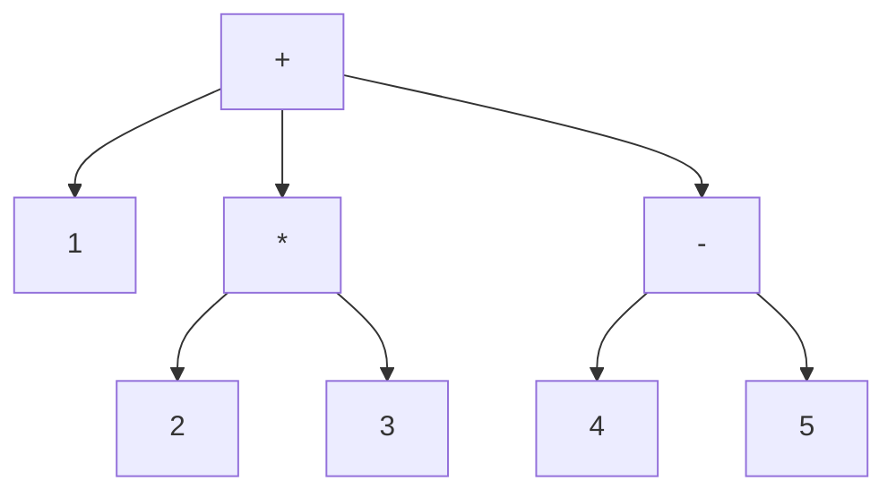

+++
title = '005 用Lisp来探索Lisp'
date = 2024-08-22T10:32:31+08:00
draft = false
mathjax = false
categories = ['lisp', 'programming-language']
tags = ['lisp', 'programming', 'syntax', 'lisp-objects']
toc = true
tocBorder = true
+++

## 鲁莽先生什么都不管

鲁莽先生打开电脑，安装一堆东西，噼里啪啦敲了一堆代码，叽里呱啦说了一堆话，然后累了就回家睡觉了。

这可把好奇先生的兴趣勾起来，他怎么也睡不着。好奇先生打开电脑，看了看鲁莽先生留下的代码和可执行文件，然后开始研究起来。

## 好奇先生第一次见到Lisp

好奇先生看到了一堆括号，他不知道这是什么，但是他知道这是一种编程语言，于是他开始查资料，了解到这是一种叫做Lisp的语言。

这个语言最大的特点就是括号，括号里面是函数名，括号外面是参数。因为括号很多，Lisp也被称为Lots of Irritating Silly Parentheses（许多令人烦恼的愚蠢括号）。

真是好玩啊！好奇先生想，真想要试试看。

好奇先生按照鲁莽先生的说明，安装SBCL，然后打开REPL，输入了一行代码：

```shell
This is SBCL 2.4.6, an implementation of ANSI Common Lisp.
More information about SBCL is available at <http://www.sbcl.org/>.

SBCL is free software, provided as is, with absolutely no warranty.
It is mostly in the public domain; some portions are provided under
BSD-style licenses.  See the CREDITS and COPYING files in the
distribution for more information.
* (+ 1 2)
3
```

好的，这下可以做加法啦！实际上，Lisp的加法可以加多个数：

```lisp
(+ 1 2 3 4 5 6)
21
```

这不是很好理解吗？括号里面是一个列表，列表的第一个元素是`+`，后面的元素是被加的数字。画出来就是这样的：




这不算什么，好奇先生想，我可以用Lisp来做更复杂的事情。

```lisp
(+ 1 (* 2 3) (- 4 5))
6
```
再按照上面的方法画出来：



1 + 2 * 3 + (4 - 5) = 6 ，结果是6。其实很直观！

好奇先生觉得自己完全懂了：每个列表第一个元素是要干什么，后面的元素是对谁干。而且，后面的元素也可以是列表，这个列表的第一个元素同样是要干什么，后面的元素是对谁干。

## 好奇先生更好奇了

好奇先生觉得自己完全懂了，Lisp的代码就是一个括号套住的内容（包括括号本身），可以称为表达式（expression），表达式的左边一个括号，右边一个括号，中间是一个操作符（operator）和零个或多个操作数（operand）。

```BNF
<left_parenthesis> = "("
<right_parenthesis> = ")"
<expression> ::= <left_parenthesis> <operator> <operand>* <right_parenthesis>
<operand> ::= <expression> | <???>
```

这个`<operator>`是什么？这个`<operand>`是什么？到底是几个？为什么还能是0个？这个`<???>`是什么？好奇先生更好奇了。

## 好奇先生继续研究

好奇先生因为很好奇，早就学过无数种编程语言，他能理解这个`<operator>`是一个函数或者方法或者操作符，比如`+`、`-`、`*`、`/`、`sin`、`cos`、`tan`、`sqrt`、`log`、`exp`等等。而这个`<operand>`是一个值，或者一个变量。当然，无论是值或者变量，其实都有一个很本质的含义，就是内存中的一块区域，这个区域在某些程序设计语言中，表达为地址头、内存长度，这两个两可以完全定位这个区域。但是在Lisp中，到底是什么呢？

### Lisp的数据类型

好奇先生查了一下，Lisp中貌似就只有两类大类数据类型：列表（list）和原子（atom）。

- 列表
  - 由括号括起来的列表
  - 列表的元素可以是列表
  - 列表的元素可以是atom
  - `listp`可以判断是否是列表
- Atom，中文直译为原子，在这里可以理解为不可再分的最小单位，比如：
  - 数字，`numberp`可以判断是否是数字
  - 字符串，`stringp`可以判断是否是字符串
  - 符号，`symbolp`可以判断是否是符号
  - 函数，`functionp`可以判断是否是函数

通过这些操作符（函数）就能够探索各种`对象`的类型。好奇先生对自己的说法又有了亿点点更多的好奇。`对象`？什么对象？Lisp里面操作的是什么？好奇先生继续研究。

### Lisp中的字面量

字面量，就是直接表示的值，比如`1`、`"hello"`、`'a`、`t`、`nil`、`:my-key`等等。这些值是直接表示的，不需要计算，不需要解释，不需要转换，就是它们自己。实际上，这些值就是Lisp中基本被操作的`对象`。并非是面向对象编程中的对象。

那么，跟C中间每个量实际上都是一块内存区域是否一样呢？好奇先生不停地问出新问题。


啊，问题太多了，太多啦！好奇先生觉得自己的好奇心已经被点燃了，他决定继续研究，继续探索，继续学习。

## 好奇先生工具箱

好奇先生每次到第一个新地方，总是最先想知道公共交通能到哪里，所以在打探一个新的编程语言时，他总是先找找有没有什么探索工具可以用。

比如上面的`type-of`，以及哪些判断类型的命令。此外，`lisp`还有一些其他的工具，比如：

- `list-all-packages`，可以列出所有的包
- `do-external-symbols`，可以遍历一个包中的所有符号
- `apropos`，可以找到一个符号的定义

好奇先生最喜欢这种工具箱！用这些工具，他就能探索这个SBCL世界！

### packages

Common Lisp中的包（package）是一种组织符号的方式，可以把符号分组，然后通过包的名字来访问这些符号。比如，`cl-user`包中有`+`这个符号，那么我们可以通过`cl-user:+`来访问这个符号。

```lisp
(apropos 'list-all-packages)

;; LIST-ALL-PACKAGES (fbound)
;; NIL
```

好像没有提供太多的信息。

```lisp
(list-all-packages)

;; (#<PACKAGE "QUICKLISP-CLIENT"> #<PACKAGE "UIOP/FILESYSTEM">
;; #<PACKAGE "ALIVE/SBCL/SYMBOLS"> #<PACKAGE "IMPL-SPECIFIC-GRAY">
;; #<PACKAGE "QL-IMPL"> #<PACKAGE "UIOP/DRIVER"> #<PACKAGE "ALIVE/INSPECTOR">
;; #<PACKAGE "SB-WALKER"> #<PACKAGE "ASDF/FIND-COMPONENT"> #<PACKAGE "SB-MOP">
;; #<PACKAGE "UIOP/PACKAGE"> #<PACKAGE "ASDF/BACKWARD-INTERNALS">
;; #<PACKAGE "ALIVE/LSP/TYPES/FORMAT-OPTIONS"> #<PACKAGE "QL-MKCL">
;; #<PACKAGE "SB-BIGNUM"> #<PACKAGE "ALIVE/PACKAGES">
;; #<PACKAGE "UIOP/BACKWARD-DRIVER"> #<PACKAGE "ALIVE/UTILS">
;; #<PACKAGE "UIOP/LAUNCH-PROGRAM"> #<PACKAGE "ALIVE/SBCL/THREADS">
;; #<PACKAGE "ASDF/FOOTER"> #<PACKAGE "ALIVE/SESSION"> #<PACKAGE "SB-REGALLOC">
;; #<PACKAGE "QL-CMUCL"> #<PACKAGE "SB-PCL"> #<PACKAGE "QL-CCL">
;; #<PACKAGE "SB-EXT"> #<PACKAGE "ASDF/OPERATE"> #<PACKAGE "ALIVE/RANGE">
;; #<PACKAGE "ALIVE/FILE"> #<PACKAGE "UIOP/RUN-PROGRAM">
;; #<PACKAGE "ALIVE/LSP/DEFINITION"> #<PACKAGE "ASDF/PARSE-DEFSYSTEM">
;; #<PACKAGE "ALIVE/LSP/COMPLETIONS"> #<PACKAGE "ALIVE/STREAMS">
;; #<PACKAGE "QL-DIST-USER"> #<PACKAGE "ALIVE/SBCL/FILE"> #<PACKAGE "QL-INFO">
;; #<PACKAGE "SB-SYS"> #<PACKAGE "QL-CONFIG"> #<PACKAGE "ALIVE/LSP/UTILS">
;; #<PACKAGE "ALIVE/SBCL/STREAMS"> #<PACKAGE "ALIVE/LSP/TYPES/SEM-TOKENS">
;; #<PACKAGE "SB-DISASSEM"> #<PACKAGE "BORDEAUX-THREADS">
;; #<PACKAGE "ALIVE/LSP/PACKET"> #<PACKAGE "ALIVE/LSP/MESSAGE/RESPONSE">
;; #<PACKAGE "SB-FASL"> #<PACKAGE "UIOP/UTILITY"> #<PACKAGE "JSON-SYSTEM">
;; #<PACKAGE "QL-SETUP"> #<PACKAGE "SB-POSIX"> #<PACKAGE "ALIVE/PARSE/TOKENIZER">
;; #<PACKAGE "ASDF/FIND-SYSTEM"> #<PACKAGE "SB-UNICODE">
;; #<PACKAGE "FLEXI-STREAMS-SYSTEM"> #<PACKAGE "ASDF/CONCATENATE-SOURCE">
;; #<PACKAGE "SB-DEBUG"> #<PACKAGE "ALIVE/FORMAT"> #<PACKAGE "QL-UTIL">
;; #<PACKAGE "SB-LOCKLESS"> #<PACKAGE "SB-ALIEN-INTERNALS">
;; #<PACKAGE "BORDEAUX-THREADS-2"> #<PACKAGE "SB-ALIEN">
;; #<PACKAGE "ALEXANDRIA-2"> #<PACKAGE "QL-SCL"> #<PACKAGE "ASDF/USER">
;; #<PACKAGE "ALIVE/TYPES"> #<PACKAGE "ALIVE/THREADS">
;; #<PACKAGE "SPLIT-SEQUENCE"> #<PACKAGE "ASDF/COMPONENT">
;; #<PACKAGE "ASDF/FORCING"> #<PACKAGE "QL-GUNZIPPER"> #<PACKAGE "SB-INTROSPECT">
;; #<PACKAGE "UIOP/STREAM"> #<PACKAGE "ASDF/PACKAGE-INFERRED-SYSTEM">
;; #<PACKAGE "SB-PRETTY"> #<PACKAGE "ASDF/SOURCE-REGISTRY">
;; #<PACKAGE "SB-SEQUENCE"> #<PACKAGE "ASDF/SYSTEM-REGISTRY">
;; #<PACKAGE "SB-APROF"> #<PACKAGE "ALIVE/POSITION"> #<PACKAGE "SB-PROFILE">
;; #<PACKAGE "ALIVE/COMPILE-MESSAGE"> #<PACKAGE "ALEXANDRIA">
;; #<PACKAGE "UIOP/OS"> #<PACKAGE "QL-NETWORK"> #<PACKAGE "ASDF/LISP-ACTION">
;; #<PACKAGE "ALIVE/LSP/HOVER"> #<PACKAGE "ALIVE/LSP/SYMBOL">
;; #<PACKAGE "ASDF/PLAN"> #<PACKAGE "ALIVE/LOGGER"> #<PACKAGE "SB-C">
;; #<PACKAGE "QL-BUNDLE"> #<PACKAGE "UIOP/PATHNAME"> #<PACKAGE "SB-BSD-SOCKETS">
;; #<PACKAGE "ALIVE/TEXT-EDIT"> #<PACKAGE "ASDF/SESSION"> #<PACKAGE "JSON">
;; #<PACKAGE "ALIVE/SELECTION"> #<PACKAGE "QL-HTTP"> #<PACKAGE "ASDF/INTERFACE">
;; #<PACKAGE "ASDF/OUTPUT-TRANSLATIONS"> #<PACKAGE "ALIVE/LSP/PARSE">
;; #<PACKAGE "QL-MINITAR"> #<PACKAGE "ASDF/ACTION"> #<PACKAGE "UIOP/VERSION">
;; #<PACKAGE "ALIVE/LSP/MESSAGE/REQUEST"> #<PACKAGE "SB-THREAD">
;; #<PACKAGE "QL-SBCL"> #<PACKAGE "ASDF/BUNDLE"> #<PACKAGE "KEYWORD">
;; #<PACKAGE "ALIVE/EVAL"> #<PACKAGE "ALIVE/PARSE/FORMS">
;; #<PACKAGE "ALIVE/LSP/MESSAGE/ABSTRACT"> #<PACKAGE "SB-LOOP">
;; #<PACKAGE "SB-DI"> #<PACKAGE "SB-UNIX"> #<PACKAGE "UIOP/CONFIGURATION">
;; #<PACKAGE "UIOP/IMAGE"> #<PACKAGE "SB-IMPL"> #<PACKAGE "SB-GRAY">
;; #<PACKAGE "COMMON-LISP-USER"> #<PACKAGE "SB-BROTHERTREE">
;; #<PACKAGE "ASDF/OPERATION"> #<PACKAGE "ALIVE/DEBUGGER">
;; #<PACKAGE "QL-IMPL-UTIL"> #<PACKAGE "ALIVE/PARSE/TOKEN">
;; #<PACKAGE "ALIVE/LSP/SEM-ANALYSIS"> #<PACKAGE "ALIVE/MACROS">
;; #<PACKAGE "QL-LISPWORKS"> #<PACKAGE "SB-VM"> #<PACKAGE "GLOBAL-VARS">
;; #<PACKAGE "SB-ASSEM"> #<PACKAGE "UIOP/COMMON-LISP">
;; #<PACKAGE "ALIVE/LSP/TYPES/CONFIG-ITEM"> #<PACKAGE "TRIVIAL-GARBAGE">
;; #<PACKAGE "ASDF/BACKWARD-INTERFACE"> #<PACKAGE "ALIVE/LSP/TYPES/RESTART-INFO">
;; #<PACKAGE "SB-FORMAT"> #<PACKAGE "ASDF/UPGRADE"> #<PACKAGE "SB-INT">
;; #<PACKAGE "QL-CLISP"> #<PACKAGE "USOCKET"> #<PACKAGE "ALIVE/PARSE/FORM">
;; #<PACKAGE "ALIVE/LSP/MESSAGE/NOTIFICATION"> #<PACKAGE "SB-WIN32">
;; #<PACKAGE "ALIVE/SYMBOLS"> #<PACKAGE "SB-EVAL"> #<PACKAGE "SB-X86-64-ASM">
;; #<PACKAGE "QL-MEZZANO"> #<PACKAGE "QL-PROGRESS"> #<PACKAGE "QL-ALLEGRO">
;; #<PACKAGE "COMMON-LISP"> #<PACKAGE "ALIVE/SERVER">
;; #<PACKAGE "ALIVE/LSP/MESSAGE/FORMAT-UTILS"> #<PACKAGE "QL-CDB">
;; #<PACKAGE "ALIVE/ERRORS"> #<PACKAGE "ALIVE/FRAMES"> #<PACKAGE "JSON-RPC">
;; #<PACKAGE "QL-CLASP"> #<PACKAGE "UIOP/LISP-BUILD"> #<PACKAGE "SB-KERNEL">
;; #<PACKAGE "FLEXI-STREAMS"> #<PACKAGE "TRIVIAL-GRAY-STREAMS">
;; #<PACKAGE "ASDF/SYSTEM"> #<PACKAGE "QL-DIST"> #<PACKAGE "ALIVE/LSP/ERRORS">
;; #<PACKAGE "QL-ECL"> #<PACKAGE "ALIVE/ASDF">
;; #<PACKAGE "SB-BSD-SOCKETS-INTERNAL"> #<PACKAGE "QL-ABCL">)
```

原来好奇先生已经安装这么多有用的（或者没用的）包。

还可以自己定义一个包，并且看看自己定义的包是不是能被找到。好奇先生看到结果，高兴得不得了。

```lisp
(let ((before (list-all-packages))) 
  (make-package 'temp) 
  (set-difference (list-all-packages) before))

;; (#<PACKAGE "TEMP">)
```

当然，我们还可以查找一个包，这里用的是`find-package`。

```lisp
(find-package 'cl-user)
(find-package :cl-user)
(find-package "CL-USER")
```
这三种形式都可以，只是注意，最后那个用字符串的方式，必须是大写的。太麻烦，好奇先生动动手指，写了一个函数。

```lisp
(defun find-package-ignore-case (name)
  "Find a package by name, ignoring case"
  (if (stringp name)
      (find-package (string-upcase name))
      (find-package name)))
```

这下子，就可以直接忽视大小写了。那么，能不能用一个包的名字的一部分来查找一个包呢？好奇先生又动动手指，写了一个函数。

```lisp
(defun part-in-list-p (part list)
  "Return true if any element of list contains part"
  (find-if (lambda (x) (search part x)) list))

(defun find-package-with-part (part)
  "Find a package by part of its name or nickname"
  (let ((result '())
        (part-upcase (string-upcase part)))
    (dolist (package (list-all-packages))
      (if (or (search part-upcase (package-name package))
              (part-in-list-p part-upcase (package-nicknames package)))
          (push package result)))
    result))
```

第一个函数，用来在一个列表中找到是否包含一个字符串，如果包含，就返回真。第二个函数，用来查找一个包的名字或者别名中是否包含一个字符串。

```lisp
(find-package-with-part "cl")
; (#<PACKAGE "QL-ABCL"> #<PACKAGE "QL-ECL"> #<PACKAGE "QL-CLASP">
;  #<PACKAGE "COMMON-LISP"> #<PACKAGE "QL-CLISP"> #<PACKAGE "UIOP/COMMON-LISP">
;  #<PACKAGE "COMMON-LISP-USER"> #<PACKAGE "QL-SBCL"> #<PACKAGE "JSON">
;  #<PACKAGE "QL-SCL"> #<PACKAGE "ALIVE/SBCL/STREAMS">
;  #<PACKAGE "ALIVE/SBCL/FILE"> #<PACKAGE "QL-CCL"> #<PACKAGE "SB-PCL">
;  #<PACKAGE "QL-CMUCL"> #<PACKAGE "ALIVE/SBCL/THREADS"> #<PACKAGE "QL-MKCL">
;  #<PACKAGE "ALIVE/SBCL/SYMBOLS"> #<PACKAGE "QUICKLISP-CLIENT">)
```

现在，好奇先生对自己系统中的包了如指掌，**完全**满足了他的部分好奇心，因为好奇先生的好奇先生是无穷无尽的！知道自己的系统中有这么多包之后，好奇先生的好奇心简直要爆炸了，每个包里到底有什么？


### 包里有什么呢？当然是symbols

粗鲁先生看到好奇先生噼里啪啦地敲着键盘，嘴里念念有词，突然听到一句”包里有什么呢？“，他大声回答：“当然是符号啦！”好奇先生听到这个回答，觉得很有道理，于是他开始查找一个包里面的所有符号。

```lisp

;; list all external symbols in a package
(defun dir (package)
  (let ((result '())
        (len 0))
    (do-external-symbols (s package (values result len))
      ;   (format t "~a~%" s)
      (push s result)
      (incf len))))
```

因为这就像是列出一个目录的文件，好奇先生当然把这个函数命名为`dir`。

```lisp
(dir (find-package 'cl))
； (READ-BYTE FIND-PACKAGE ROUND LET* +++ COPY-SYMBOL BREAK ARRAY
；            LISP-IMPLEMENTATION-TYPE PPRINT-FILL REMHASH FILE-LENGTH FLOOR
；            MOST-POSITIVE-LONG-FLOAT STRING= BOOLE-C1 LOGNAND BIT-IOR
；            SYNONYM-STREAM-SYMBOL STANDARD-GENERIC-FUNCTION
；            GET-INTERNAL-REAL-TIME DESCRIBE-OBJECT IN-PACKAGE SET
；            *COMPILE-FILE-PATHNAME* ISQRT PROBE-FILE UNION VECTOR MEMBER-IF-NOT
；            LOGBITP STREAM-ERROR-STREAM APPEND NSUBLIS PATHNAME
；            SET-DISPATCH-MACRO-CHARACTER CDAADR PROG SYNONYM-STREAM CONJUGATE
；            LOGTEST SPECIAL NIL DOUBLE-FLOAT-EPSILON SHADOW TRACE SYMBOL-PLIST
；            CADAR DELETE-FILE COPY-ALIST PATHNAME-DIRECTORY SIN SHIFTF
；            STANDARD-METHOD TYPE PROG1 FLOAT-SIGN BIT-AND PLUSP COMPILER-MACRO
；            NOT STREAM-ELEMENT-TYPE CADDDR STRING<= ADJOIN REMPROP CHAR-EQUAL
；            RETURN-FROM LEAST-POSITIVE-NORMALIZED-SHORT-FLOAT BOOLE-CLR LCM
；            POSITION HANDLER-CASE COMPUTE-APPLICABLE-METHODS DEFMETHOD BOOLE-1
；            CONTROL-ERROR CLASS CHAR-LESSP DELETE-PACKAGE
；            BROADCAST-STREAM-STREAMS LEAST-POSITIVE-NORMALIZED-DOUBLE-FLOAT NULL
；            FIFTH EXP WITH-OUTPUT-TO-STRING FTRUNCATE LAST STRING-CAPITALIZE
；            MAPCON CDDDDR LOGORC2 PRINT-OBJECT >= USER-HOMEDIR-PATHNAME
；            *MODULES* CAAADR SLOT-MISSING RATIONALIZE TANH BIT-EQV ///
；            ROW-MAJOR-AREF *LOAD-PATHNAME* *PRINT-ESCAPE* READTABLE-CASE NCONC
；            BOOLE-2 STANDARD-CLASS SIMPLE-BIT-VECTOR COUNT-IF BOOLE-SET
；            DEFPARAMETER ZEROP DYNAMIC-EXTENT FILE-STRING-LENGTH STRUCTURE
；            RPLACD SET-MACRO-CHARACTER CHAR/= SYMBOL-MACROLET CAAAR // *PACKAGE*
；            WITH-OPEN-FILE DEFSTRUCT TWO-WAY-STREAM ASSOC-IF-NOT SHORT-FLOAT
；            EXTENDED-CHAR < READ-CHAR-NO-HANG LOGAND ECHO-STREAM-INPUT-STREAM T
；            CHAR< FUNCTION BOOLE-ORC2 *MACROEXPAND-HOOK* STRING/= FBOUNDP /
；            RASSOC EVAL-WHEN CLRHASH WARN AND LISTEN RANDOM-STATE
；            SPECIAL-OPERATOR-P SYMBOL-PACKAGE COMPILATION-SPEED *LOAD-PRINT*
；            PPRINT-POP SEARCH LONG-FLOAT-EPSILON *TERMINAL-IO* CDDDAR
；            ADJUST-ARRAY MAKE-PATHNAME KEYWORD MERGE NO-APPLICABLE-METHOD
；            *PRINT-PPRINT-DISPATCH* VECTOR-POP SEQUENCE BIGNUM POP CHAR SETQ MOD
；            SIMPLE-STRING-P CERROR MAKE-ECHO-STREAM STRING-NOT-LESSP
；            *PRINT-BASE* UPDATE-INSTANCE-FOR-DIFFERENT-CLASS
；            FLOATING-POINT-UNDERFLOW HASH-TABLE-REHASH-THRESHOLD INCF LDB-TEST
；            LIST MEMBER-IF ARRAY-HAS-FILL-POINTER-P OPEN-STREAM-P THIRD &WHOLE
；            BIT-NOT GENSYM CCASE BOOLE-XOR SET-SYNTAX-FROM-CHAR DOLIST
；            ALPHANUMERICP STRING-STREAM MOST-NEGATIVE-SINGLE-FLOAT ELT TRUENAME
；            NSTRING-DOWNCASE LEAST-POSITIVE-NORMALIZED-SINGLE-FLOAT *READ-BASE*
；            NSET-DIFFERENCE THROW PHASE THE BIT-ANDC1 ASSERT ACOS
；            WILD-PATHNAME-P CDR DIGIT-CHAR-P MACROEXPAND-1 NSET-EXCLUSIVE-OR
；            TYPECASE PPRINT-INDENT CDADR CLASS-NAME COMPILE-FILE-PATHNAME
；            FDEFINITION RASSOC-IF APROPOS-LIST INTEGER-LENGTH *READ-SUPPRESS*
；            UNLESS NSTRING-CAPITALIZE FTYPE BUILT-IN-CLASS ** MAKE-CONDITION
；            STRING ENCODE-UNIVERSAL-TIME BIT-ANDC2 HASH-TABLE-SIZE CELL-ERROR
；            ATANH RATIONALP NAME-CHAR SET-DIFFERENCE BIT-NAND CONDITION
；            CHAR-GREATERP &OPTIONAL DISASSEMBLE ERROR CADDR SAFETY CHAR-CODE
；            WARNING ENDP *PRINT-RADIX* STANDARD-OBJECT MAPCAN PATHNAMEP
；            TWO-WAY-STREAM-OUTPUT-STREAM FMAKUNBOUND ARRAY-ROW-MAJOR-INDEX
；            SUBSEQ LOAD DELETE-IF-NOT UNBOUND-SLOT-INSTANCE LOGORC1 OPTIMIZE
；            STRING< STABLE-SORT NSUBSTITUTE DIGIT-CHAR ENOUGH-NAMESTRING
；            BYTE-POSITION PPRINT-LOGICAL-BLOCK SUBSTITUTE-IF TAILP
；            FLOATING-POINT-INEXACT EQL FIND-METHOD FLET ARRAY-TOTAL-SIZE-LIMIT
；            UNUSE-PACKAGE RATIO LEAST-NEGATIVE-NORMALIZED-LONG-FLOAT
；            GET-DISPATCH-MACRO-CHARACTER MAKE-SEQUENCE NBUTLAST NRECONC MACROLET
；            CHAR<= MINUSP PRINT-UNREADABLE-OBJECT LOWER-CASE-P STANDARD
；            HASH-TABLE-COUNT FLOAT-PRECISION REVAPPEND CALL-ARGUMENTS-LIMIT
；            READ-FROM-STRING UNDEFINED-FUNCTION COPY-READTABLE ASIN
；            DEFINE-SETF-EXPANDER HANDLER-BIND
；            LEAST-POSITIVE-NORMALIZED-LONG-FLOAT PPRINT-TAB NUNION REALP
；            POSITION-IF BOOLE-ANDC1 ABORT NUMBER DECLAIM COMPILED-FUNCTION-P
；            PACKAGE-USED-BY-LIST CHAR-NOT-LESSP WITH-INPUT-FROM-STRING
；            SIMPLE-WARNING STORE-VALUE *COMPILE-VERBOSE* DELETE-DUPLICATES
；            MOST-NEGATIVE-FIXNUM DELETE AREF DEFUN STREAM-ERROR BOOLE-C2
；            PPRINT-LINEAR MULTIPLE-VALUE-SETQ FILE-STREAM STRING-TRIM
；            REMOVE-IF-NOT UNREAD-CHAR OTHERWISE DESCRIBE RPLACA WRITE-SEQUENCE
；            MIN SOFTWARE-VERSION *PRINT-LEVEL* SECOND CHECK-TYPE PPRINT BUTLAST
；            BASE-CHAR COMPLEXP PATHNAME-NAME SLOT-UNBOUND ODDP PRIN1-TO-STRING
；            STRING-RIGHT-TRIM COMPILE-FILE ++ FILE-ERROR-PATHNAME PRINC
；            GET-PROPERTIES MOST-POSITIVE-FIXNUM MAKE-LOAD-FORM-SAVING-SLOTS
；            REALPART DIRECTORY CDADAR CONSTANTLY
；            FLOATING-POINT-INVALID-OPERATION NOTANY PATHNAME-MATCH-P DECF MEMBER
；            MULTIPLE-VALUE-PROG1 DEFGENERIC IDENTITY CHAR-CODE-LIMIT VECTOR-PUSH
；            DEFINE-SYMBOL-MACRO + GETF LEAST-NEGATIVE-LONG-FLOAT CHAR-DOWNCASE
；            LEAST-NEGATIVE-DOUBLE-FLOAT SINGLE-FLOAT-NEGATIVE-EPSILON
；            ADJUSTABLE-ARRAY-P SUBTYPEP *FEATURES* NUMBERP FILE-ERROR
；            POSITION-IF-NOT > DEFPACKAGE PPRINT-DISPATCH
；            MOST-POSITIVE-SINGLE-FLOAT SUBSTITUTE-IF-NOT COMPILED-FUNCTION LOG
；            DO* PARSE-INTEGER SIMPLE-ERROR LEAST-NEGATIVE-SINGLE-FLOAT
；            DEFINE-COMPILER-MACRO LOGANDC2 KEYWORDP FIND-ALL-SYMBOLS BIT-ORC1
；            *PRINT-CIRCLE* ARRAY-DIMENSION-LIMIT CAAR SPACE DOCUMENTATION
；            UPGRADED-COMPLEX-PART-TYPE STREAM PROGRAM-ERROR PUSHNEW MASK-FIELD
；            CHARACTERP LDIFF DIRECTORY-NAMESTRING LOOP-FINISH DPB
；            CHAR-NOT-GREATERP LENGTH LEAST-NEGATIVE-NORMALIZED-SINGLE-FLOAT
；            DRIBBLE SLOT-VALUE PPRINT-TABULAR SIMPLE-BASE-STRING SIGNED-BYTE
；            PACKAGE-ERROR-PACKAGE DEFINE-MODIFY-MACRO SHORT-SITE-NAME
；            ARRAY-RANK-LIMIT CODE-CHAR FUNCALL DEPOSIT-FIELD MAKE-ARRAY ED
；            COPY-PPRINT-DISPATCH BIT-ORC2 LOGICAL-PATHNAME FIND-SYMBOL
；            WRITE-STRING DO WRITE-BYTE CHAR-NOT-EQUAL MAPLIST BOOLEAN
；            ECHO-STREAM MAPL NSUBST-IF DEFTYPE EVAL USE-VALUE
；            TRANSLATE-LOGICAL-PATHNAME PRINT-NOT-READABLE-OBJECT PROG2
；            SUBSTITUTE *PRINT-PRETTY* TENTH FFLOOR STRING-NOT-EQUAL
；            INVOKE-RESTART-INTERACTIVELY /= DO-SYMBOLS MAP-INTO CTYPECASE
；            MULTIPLE-VALUE-BIND FOURTH CAADR MOST-NEGATIVE-SHORT-FLOAT &BODY
；            BOOLE *TRACE-OUTPUT* LOAD-LOGICAL-PATHNAME-TRANSLATIONS
；            SHORT-FLOAT-NEGATIVE-EPSILON ACOSH ALPHA-CHAR-P SIMPLE-ARRAY
；            PACKAGE-NAME RANDOM APROPOS DEBUG HASH-TABLE-P OR INVOKE-DEBUGGER
；            PRINT-NOT-READABLE CHAR-INT MAKE-SYNONYM-STREAM
；            MAKE-DISPATCH-MACRO-CHARACTER SIMPLE-BIT-VECTOR-P COUNT FILL
；            IGNORE-ERRORS LEAST-NEGATIVE-NORMALIZED-SHORT-FLOAT
；            LOGICAL-PATHNAME-TRANSLATIONS DO-ALL-SYMBOLS REVERSE MAKUNBOUND SOME
；            DECODE-UNIVERSAL-TIME SHORT-FLOAT-EPSILON COMPILER-MACRO-FUNCTION
；            RETURN PATHNAME-VERSION SUBLIS FIND-IF *STANDARD-INPUT*
；            MAKE-INSTANCE CLEAR-INPUT SINGLE-FLOAT-EPSILON MAKE-SYMBOL IMPORT
；            *PRINT-GENSYM* LET CADDAR BIT-VECTOR NSTRING-UPCASE
；            UPGRADED-ARRAY-ELEMENT-TYPE MULTIPLE-VALUE-LIST NUMERATOR =
；            SIMPLE-VECTOR-P SCALE-FLOAT ARITHMETIC-ERROR-OPERANDS PROG*
；            BOOLE-NAND UNTRACE INPUT-STREAM-P PSETF READTABLE METHOD-QUALIFIERS
；            FILE-POSITION USE-PACKAGE SYMBOL-VALUE NEXT-METHOD-P SIMPLE-STRING
；            GRAPHIC-CHAR-P STREAMP CDDAAR CALL-NEXT-METHOD
；            MOST-NEGATIVE-DOUBLE-FLOAT FILE-AUTHOR WHEN TYPE-OF BIT-NOR CHAR>
；            SINGLE-FLOAT ENSURE-GENERIC-FUNCTION PI *RANDOM-STATE* PSETQ EQ
；            HASH-TABLE EVENP *PRINT-RIGHT-MARGIN* OPEN REQUIRE GENTEMP
；            *READTABLE* MAKE-STRING-OUTPUT-STREAM CDAR LOGEQV DEFINE-CONDITION
；            CLASS-OF SIMPLE-CONDITION-FORMAT-CONTROL STANDARD-CHAR PACKAGE-ERROR
；            LOAD-TIME-VALUE PACKAGE 1- PROGV STORAGE-CONDITION <= FORMATTER
；            FILE-WRITE-DATE BOOLE-NOR UPDATE-INSTANCE-FOR-REDEFINED-CLASS TAN
；            END-OF-FILE IMAGPART BIT-VECTOR-P EQUAL FIND-CLASS DEFMACRO Y-OR-N-P
；            REST PATHNAME-DEVICE FUNCTION-KEYWORDS SET-EXCLUSIVE-OR NAMESTRING
；            HASH-TABLE-REHASH-SIZE GET-DECODED-TIME *COMPILE-PRINT*
；            CELL-ERROR-NAME INTEGERP ABS FLOAT-DIGITS SIMPLE-VECTOR
；            MOST-NEGATIVE-LONG-FLOAT FIND-RESTART IF REMF
；            DEFINE-METHOD-COMBINATION SHADOWING-IMPORT COMPLEX GO
；            WITH-HASH-TABLE-ITERATOR SET-PPRINT-DISPATCH CONCATENATED-STREAM
；            TYPE-ERROR-DATUM SLOT-MAKUNBOUND LEAST-POSITIVE-SINGLE-FLOAT
；            MAKE-INSTANCES-OBSOLETE SORT NSUBST PRINC-TO-STRING
；            TYPE-ERROR-EXPECTED-TYPE VALUES-LIST YES-OR-NO-P FLOAT-RADIX SIGNUM
；            READ-SEQUENCE *BREAK-ON-SIGNALS* MULTIPLE-VALUES-LIMIT CONCATENATE
；            PPRINT-NEWLINE COPY-TREE &REST &ENVIRONMENT METHOD-COMBINATION-ERROR
；            *GENSYM-COUNTER* STRUCTURE-CLASS ETYPECASE PARSE-ERROR
；            STRING-DOWNCASE * MAP SUBST-IF *DEBUG-IO* STRING-LEFT-TRIM SYMBOL
；            LONG-FLOAT-NEGATIVE-EPSILON PAIRLIS STRINGP LOOP LOGIOR VECTORP
；            BROADCAST-STREAM WITH-SLOTS CATCH MAKE-RANDOM-STATE FORMAT COPY-SEQ
；            STRING-LESSP APPLY REM CALL-METHOD IGNORE CONSP SYMBOLP
；            *PRINT-LENGTH* READ-DELIMITED-LIST SBIT READER-ERROR RESTART-CASE
；            PPRINT-EXIT-IF-LIST-EXHAUSTED FUNCTION-LAMBDA-EXPRESSION SIXTH FIND
；            SYMBOL-FUNCTION LOGNOT TRANSLATE-PATHNAME VALUES MACHINE-INSTANCE
；            STRING-UPCASE CADADR PEEK-CHAR *PRINT-READABLY* RESTART-BIND ASSOC
；            INTERACTIVE-STREAM-P SINH CDDAR UNBOUND-SLOT STRING> GCD PACKAGEP
；            UPPER-CASE-P TRUNCATE RENAME-FILE CADAAR BOOLE-IOR
；            INITIALIZE-INSTANCE MAKE-STRING STANDARD-CHAR-P &AUX NSUBSTITUTE-IF
；            DECLARE CDDR CLOSE ARRAY-DISPLACEMENT WRITE INTEGER CHAR>= VARIABLE
；            MERGE-PATHNAMES WITH-SIMPLE-RESTART BYTE-SIZE ASH COMPILE IGNORABLE
；            NOTEVERY MISMATCH INVALID-METHOD-ERROR FORCE-OUTPUT
；            REMOVE-DUPLICATES UNSIGNED-BYTE MAKE-METHOD RESTART-NAME BOOLE-AND
；            FINISH-OUTPUT UNWIND-PROTECT BOOLE-EQV *PRINT-CASE* WITH-ACCESSORS
；            *PRINT-ARRAY* SVREF ARRAY-DIMENSIONS - METHOD DEFVAR SEVENTH
；            MOST-POSITIVE-DOUBLE-FLOAT REMOVE-METHOD PATHNAME-TYPE TIME BOUNDP
；            LAMBDA-PARAMETERS-LIMIT ROTATEF LONG-SITE-NAME LOCALLY
；            DIVISION-BY-ZERO SLOT-BOUNDP SIMPLE-CONDITION BOTH-CASE-P
；            GET-MACRO-CHARACTER LIST-ALL-PACKAGES STRUCTURE-OBJECT MAKE-LIST
；            SIMPLE-CONDITION-FORMAT-ARGUMENTS BOOLE-ORC1 MAKE-HASH-TABLE
；            FIND-IF-NOT COPY-LIST CEILING GETHASH BYTE
；            CONCATENATED-STREAM-STREAMS DELETE-IF *QUERY-IO* PUSH
；            FLOATING-POINT-OVERFLOW ROOM TYPEP FRESH-LINE PRINT REMOVE NREVERSE
；            MAPHASH DO-EXTERNAL-SYMBOLS ECHO-STREAM-OUTPUT-STREAM COND NTH LISTP
；            FLOAT ARRAYP SHARED-INITIALIZE ASSOC-IF EQUALP ALLOCATE-INSTANCE BIT
；            BOOLE-ANDC2 HOST-NAMESTRING CONS BASE-STRING
；            ARITHMETIC-ERROR-OPERATION NSUBSTITUTE-IF-NOT RANDOM-STATE-P
；            NSUBST-IF-NOT READ-LINE READ-CHAR TERPRI MAKE-BROADCAST-STREAM
；            SUBSETP MULTIPLE-VALUE-CALL MAKE-LOAD-FORM STRING-EQUAL
；            VECTOR-PUSH-EXTEND MAKE-STRING-INPUT-STREAM TREE-EQUAL CAADDR GET
；            EXPT CONTINUE LEAST-POSITIVE-LONG-FLOAT TAGBODY STRING-NOT-GREATERP
；            OUTPUT-STREAM-P BIT-XOR CLEAR-OUTPUT RASSOC-IF-NOT
；            REINITIALIZE-INSTANCE SXHASH SIMPLE-TYPE-ERROR
；            LEAST-POSITIVE-SHORT-FLOAT INVOKE-RESTART RESTART EXPORT QUOTE
；            ADD-METHOD PACKAGE-USE-LIST COPY-STRUCTURE TYPE-ERROR
；            PARSE-NAMESTRING PATHNAME-HOST READ-PRESERVING-WHITESPACE CASE
；            ARRAY-TOTAL-SIZE INSPECT LIST* COMPUTE-RESTARTS DEFCONSTANT
；            DENOMINATOR PROCLAIM MACHINE-VERSION LONG-FLOAT CDADDR CAR READ
；            MAKE-TWO-WAY-STREAM GENERIC-FUNCTION DEFSETF LABELS ATAN
；            ARRAY-ELEMENT-TYPE PACKAGE-SHADOWING-SYMBOLS COUNT-IF-NOT
；            ARITHMETIC-ERROR MOST-POSITIVE-SHORT-FLOAT CDDADR LDB
；            HASH-TABLE-TEST *DEFAULT-PATHNAME-DEFAULTS* LAMBDA
；            LEAST-NEGATIVE-NORMALIZED-DOUBLE-FLOAT MACRO-FUNCTION
；            WRITE-TO-STRING REPLACE REMOVE-IF SUBST-IF-NOT ARRAY-RANK MAX INLINE
；            LOGXOR INTERNAL-TIME-UNITS-PER-SECOND NTH-VALUE
；            DOUBLE-FLOAT-NEGATIVE-EPSILON COSH SCHAR NINTERSECTION SATISFIES
；            REDUCE ECASE INTERN CDAAR LOGNOR *** INTERSECTION SPEED STRING>=
；            DECLARATION *LOAD-VERBOSE* *PRINT-LINES* LEAST-POSITIVE-DOUBLE-FLOAT
；            RATIONAL UNBOUND-VARIABLE CHAR-UPCASE FILL-POINTER SLEEP PRIN1 1+
；            COMPLEMENT INTEGER-DECODE-FLOAT EVERY RENAME-PACKAGE
；            GET-INTERNAL-RUN-TIME UNEXPORT STREAM-EXTERNAL-FORMAT
；            ARRAY-IN-BOUNDS-P WITH-PACKAGE-ITERATOR LISP-IMPLEMENTATION-VERSION
；            CAADAR DOTIMES CIS ENSURE-DIRECTORIES-EXIST CHAR-NAME MUFFLE-WARNING
；            *DEBUGGER-HOOK* FIRST ASINH CONSTANTP DOUBLE-FLOAT
；            *READ-DEFAULT-FLOAT-FORMAT* DEFCLASS STEP METHOD-COMBINATION
；            WITH-CONDITION-RESTARTS PROVIDE *STANDARD-OUTPUT* MACHINE-TYPE NINTH
；            SQRT COS LOGANDC1 PACKAGE-NICKNAMES FUNCTIONP NO-NEXT-METHOD MAPC
；            CHARACTER CDDDR NOTINLINE MAKE-CONCATENATED-STREAM REAL CDAAAR
；            GET-SETF-EXPANSION SLOT-EXISTS-P BLOCK WRITE-LINE CHANGE-CLASS SUBST
；            WRITE-CHAR READTABLEP NTHCDR SOFTWARE-TYPE
；            TWO-WAY-STREAM-INPUT-STREAM MAKE-PACKAGE ACONS
；            LEAST-NEGATIVE-SHORT-FLOAT FLOATP CAAAAR MAPCAR LOGCOUNT ATOM
；            FCEILING ARRAY-DIMENSION DECODE-FLOAT SERIOUS-CONDITION SYMBOL-NAME
；            STRING-GREATERP SIGNAL *ERROR-OUTPUT* *COMPILE-FILE-TRUENAME*
；            FILE-NAMESTRING *PRINT-MISER-WIDTH* UNINTERN GET-UNIVERSAL-TIME
；            LIST-LENGTH CADR FIXNUM WITH-STANDARD-IO-SYNTAX WITH-OPEN-STREAM
；            DESTRUCTURING-BIND *LOAD-TRUENAME* FROUND WITH-COMPILATION-UNIT
；            EIGHTH SETF &KEY PROGN LAMBDA-LIST-KEYWORDS STYLE-WARNING
；            &ALLOW-OTHER-KEYS CHAR= MACROEXPAND GET-OUTPUT-STREAM-STRING COERCE
；            *READ-EVAL*)
； 
(nth-value 1 (dir (find-package 'cl)))
; 978

```

天啦天啦天啦，这个`common-lisp`包里居然有978个可供外部访问的符号！好奇先生简直要疯了！

好奇先生想要对每一个符号使用`describe`，并且把所有的符号都输出到一个文件里，于是他写了一个函数。

```lisp
;; print all symbols and doc strings in a file
(defun dir-package (package)
  "List all external symbols in a package and their doc strings in a file"
  (let ((sorted-names (sort (dir package) #'string<))
        (fn (format nil "~a.md" package)))
    (with-open-stream (s (open fn :direction :output :if-exists :supersede))
      ;; header line
      (format s "# ~a external symbols~%~%~%" package)
      ;; list all external symbols     
      (let ((index 1))
        (dolist (name sorted-names)
          (format s "~d. [~A](#~A)~%" index name name)
          (incf index)))
      (format s "~%~%")
      ;; describe all external symbols
      (dolist (name sorted-names)
        (format s "##  `~a`~%~%" name)
        (format s "```lisp~%")
        (describe name s)
        (format s "```~%")))))
```

这下好了，好奇先生有一个`markdown`文件，里面包含了所有的符号和他们的文档字符串。好奇先生对这个文件简直是爱不释手。

```markdown
# CL external symbols


1. [&ALLOW-OTHER-KEYS](#&ALLOW-OTHER-KEYS)
2. [&AUX](#&AUX)
3. [&BODY](#&BODY)
4. [&ENVIRONMENT](#&ENVIRONMENT)
5. [&KEY](#&KEY)
6. [&OPTIONAL](#&OPTIONAL)
7. [&REST](#&REST)
8. [&WHOLE](#&WHOLE)
9. [*](#*)
10. [**](#**)
11. [***](#***)
12. [*BREAK-ON-SIGNALS*](#*BREAK-ON-SIGNALS*)
13. [*COMPILE-FILE-PATHNAME*](#*COMPILE-FILE-PATHNAME*)
14. [*COMPILE-FILE-TRUENAME*](#*COMPILE-FILE-TRUENAME*)
15. [*COMPILE-PRINT*](#*COMPILE-PRINT*)
16. [*COMPILE-VERBOSE*](#*COMPILE-VERBOSE*)
17. [*DEBUG-IO*](#*DEBUG-IO*)
18. [*DEBUGGER-HOOK*](#*DEBUGGER-HOOK*)
19. [*DEFAULT-PATHNAME-DEFAULTS*](#*DEFAULT-PATHNAME-DEFAULTS*)
20. [*ERROR-OUTPUT*](#*ERROR-OUTPUT*)
21. [*FEATURES*](#*FEATURES*)
22. [*GENSYM-COUNTER*](#*GENSYM-COUNTER*)
23. [*LOAD-PATHNAME*](#*LOAD-PATHNAME*)
24. [*LOAD-PRINT*](#*LOAD-PRINT*)
25. [*LOAD-TRUENAME*](#*LOAD-TRUENAME*)
26. [*LOAD-VERBOSE*](#*LOAD-VERBOSE*)
27. [*MACROEXPAND-HOOK*](#*MACROEXPAND-HOOK*)
28. [*MODULES*](#*MODULES*)
29. [*PACKAGE*](#*PACKAGE*)
30. [*PRINT-ARRAY*](#*PRINT-ARRAY*)
31. [*PRINT-BASE*](#*PRINT-BASE*)
32. [*PRINT-CASE*](#*PRINT-CASE*)
33. [*PRINT-CIRCLE*](#*PRINT-CIRCLE*)
34. [*PRINT-ESCAPE*](#*PRINT-ESCAPE*)
35. [*PRINT-GENSYM*](#*PRINT-GENSYM*)

...
```

这个文件实在太长了，只能每个人都产生了在自己电脑上查看。

好奇先生的部分好奇心暂时得到完全的满足，他有一整套工具对自己的Lisp系统进行探索。真是太棒了！

### 总结

1. 包是Lisp中的一个重要概念，它可以帮助我们组织符号。
2. 一个包可以包含很多符号，我们可以通过`do-external-symbols`来遍历一个包中的所有符号。
3. 一个符号可以有文档字符串，我们可以通过`describe`来查看一个符号的文档字符串。
4. 对于Lisp的学习，应该尽快建立`REPL`工具，然后用Lisp来探索Lisp。