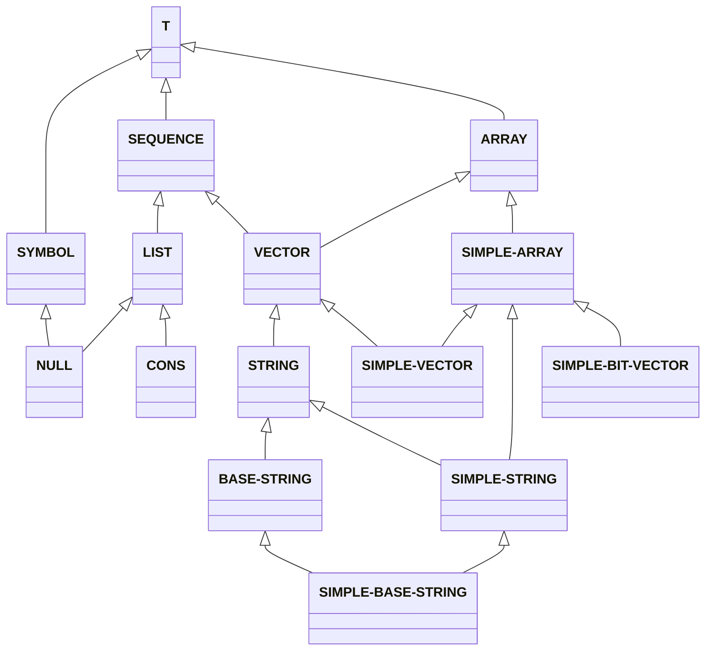

+++
title = '006 挠痒痒先生的手到底有多长？'
date = 2024-08-26T09:30:54+08:00
draft = true
mathjax = false
categories = ['lisp', 'sequence', 'common-lisp', 'programming']
tags = ['lisp', 'sequence', 'common-lisp', 'programming']
toc = true
tocBorder = true
+++


## 在Lisp的初始化Image里面挖呀挖

### Lisp的开发模式


### 什么是Sequence

好奇先生不断探索，挖掘Lisp运行后到底有些什么可以在REPL中挖出来，就在Lisp初始化Image里面哇呀哇呀哇，挖出了一堆东西，其中有一个叫做`sequence`的东西，这个东西到底是什么呢？





## 附录A: Sequence相关的函数附加中文说明和例子

1. [CONCATENATE](#CONCATENATE)
2. [COPY-SEQ](#COPY-SEQ)
3. [COUNT](#COUNT)
4. [COUNT-IF](#COUNT-IF)
5. [COUNT-IF-NOT](#COUNT-IF-NOT)
6. [DELETE](#DELETE)
7. [DELETE-DUPLICATES](#DELETE-DUPLICATES)
8. [DELETE-IF](#DELETE-IF)
9. [DELETE-IF-NOT](#DELETE-IF-NOT)
10. [ELT](#ELT)
11. [EVERY](#EVERY)
12. [FILL](#FILL)
13. [FIND](#FIND)
14. [FIND-IF](#FIND-IF)
15. [FIND-IF-NOT](#FIND-IF-NOT)
16. [LENGTH](#LENGTH)
17. [MAP](#MAP)
18. [MAP-INTO](#MAP-INTO)
19. [MERGE](#MERGE)
20. [MISMATCH](#MISMATCH)
21. [NOTANY](#NOTANY)
22. [NOTEVERY](#NOTEVERY)
23. [NREVERSE](#NREVERSE)
24. [NSUBSTITUTE](#NSUBSTITUTE)
25. [NSUBSTITUTE-IF](#NSUBSTITUTE-IF)
26. [NSUBSTITUTE-IF-NOT](#NSUBSTITUTE-IF-NOT)
27. [POSITION](#POSITION)
28. [POSITION-IF](#POSITION-IF)
29. [POSITION-IF-NOT](#POSITION-IF-NOT)
30. [REDUCE](#REDUCE)
31. [REMOVE](#REMOVE)
32. [REMOVE-DUPLICATES](#REMOVE-DUPLICATES)
33. [REMOVE-IF](#REMOVE-IF)
34. [REMOVE-IF-NOT](#REMOVE-IF-NOT)
35. [REPLACE](#REPLACE)
36. [REVERSE](#REVERSE)
37. [SEARCH](#SEARCH)
38. [SOME](#SOME)
39. [SORT](#SORT)
40. [STABLE-SORT](#STABLE-SORT)
41. [SUBSEQ](#SUBSEQ)
42. [SUBSTITUTE](#SUBSTITUTE)
43. [SUBSTITUTE-IF](#SUBSTITUTE-IF)
44. [SUBSTITUTE-IF-NOT](#SUBSTITUTE-IF-NOT)


### `CONCATENATE`

```lisp
COMMON-LISP:CONCATENATE
  [symbol]

CONCATENATE names a compiled function:
  Lambda-list: (RESULT-TYPE &REST SEQUENCES)
  Declared type: (FUNCTION
                  ((OR CONS SYMBOL SB-KERNEL:CLASSOID CLASS) &REST
                   SEQUENCE)
                  (VALUES
                   (OR LIST (SIMPLE-ARRAY * (*))
                       SB-KERNEL:EXTENDED-SEQUENCE)
                   &OPTIONAL))
  Derived type: (FUNCTION (T &REST T)
                 (VALUES
                  (OR LIST (SIMPLE-ARRAY * (*))
                      SB-KERNEL:EXTENDED-SEQUENCE)
                  &OPTIONAL))
  Documentation:
    Return a new sequence of all the argument sequences concatenated together
      which shares no structure with the original argument sequences of the
      specified RESULT-TYPE.
  Source file: SYS:SRC;CODE;SEQ.LISP

```

### `COPY-SEQ`

```lisp
COMMON-LISP:COPY-SEQ
  [symbol]

COPY-SEQ names a compiled function:
  Lambda-list: (SEQUENCE)
  Declared type: (FUNCTION (SEQUENCE)
                  (VALUES
                   (OR LIST (SIMPLE-ARRAY * (*))
                       SB-KERNEL:EXTENDED-SEQUENCE)
                   &OPTIONAL))
  Derived type: (FUNCTION (T) *)
  Documentation:
    Return a copy of SEQUENCE which is EQUAL to SEQUENCE but not EQ.
  Known attributes: flushable, unsafely-flushable
  Source file: SYS:SRC;CODE;SEQ.LISP

```

### `COUNT`

```lisp
COMMON-LISP:COUNT
  [symbol]

COUNT names a compiled function:
  Lambda-list: (ITEM SEQUENCE &REST ARGS &KEY FROM-END (START 0)
                (END NIL) (KEY NIL) (TEST (FUNCTION EQL) TEST-P)
                (TEST-NOT NIL TEST-NOT-P))
  Dynamic-extent arguments: keyword=(:KEY :TEST :TEST-NOT)
  Declared type: (FUNCTION
                  (T SEQUENCE &REST T &KEY (:TEST (OR FUNCTION SYMBOL))
                   (:TEST-NOT (OR FUNCTION SYMBOL))
                   (:START (UNSIGNED-BYTE 45))
                   (:END (OR NULL (UNSIGNED-BYTE 45))) (:FROM-END T)
                   (:KEY (OR FUNCTION SYMBOL)))
                  (VALUES (UNSIGNED-BYTE 45) &OPTIONAL))
  Derived type: (FUNCTION
                 (T T &REST T &KEY (:TEST . #1=((OR FUNCTION SYMBOL)))
                  (:TEST-NOT . #1#)
                  (:START . #2=(#3=(UNSIGNED-BYTE 45)))
                  (:END (OR NULL . #2#)) (:FROM-END T) (:KEY . #1#))
                 (VALUES #3# &OPTIONAL))
  Documentation:
    Return the number of elements in SEQUENCE satisfying a test with ITEM,
       which defaults to EQL.
  Known attributes: call, foldable, flushable, unsafely-flushable
  Source file: SYS:SRC;CODE;SEQ.LISP

```

### `COUNT-IF`

```lisp
COMMON-LISP:COUNT-IF
  [symbol]

COUNT-IF names a compiled function:
  Lambda-list: (PREDICATE SEQUENCE &REST ARGS &KEY FROM-END (START 0)
                (END NIL) (KEY NIL))
  Dynamic-extent arguments: positional=(0), keyword=(:KEY)
  Declared type: (FUNCTION
                  ((OR FUNCTION SYMBOL) SEQUENCE &REST T &KEY
                   (:FROM-END T) (:START (UNSIGNED-BYTE 45))
                   (:END (OR NULL (UNSIGNED-BYTE 45)))
                   (:KEY (OR FUNCTION SYMBOL)))
                  (VALUES (UNSIGNED-BYTE 45) &OPTIONAL))
  Derived type: (FUNCTION
                 (#1=(OR FUNCTION SYMBOL) T &REST T &KEY (:FROM-END T)
                  (:START . #2=(#3=(UNSIGNED-BYTE 45)))
                  (:END (OR NULL . #2#)) (:KEY #1#))
                 (VALUES #3# &OPTIONAL))
  Documentation:
    Return the number of elements in SEQUENCE satisfying PRED(el).
  Known attributes: call, foldable, flushable, unsafely-flushable
  Source file: SYS:SRC;CODE;SEQ.LISP

```

### `COUNT-IF-NOT`

```lisp
COMMON-LISP:COUNT-IF-NOT
  [symbol]

COUNT-IF-NOT names a compiled function:
  Lambda-list: (PREDICATE SEQUENCE &REST ARGS &KEY FROM-END (START 0)
                (END NIL) (KEY NIL))
  Dynamic-extent arguments: positional=(0), keyword=(:KEY)
  Declared type: (FUNCTION
                  ((OR FUNCTION SYMBOL) SEQUENCE &REST T &KEY
                   (:FROM-END T) (:START (UNSIGNED-BYTE 45))
                   (:END (OR NULL (UNSIGNED-BYTE 45)))
                   (:KEY (OR FUNCTION SYMBOL)))
                  (VALUES (UNSIGNED-BYTE 45) &OPTIONAL))
  Derived type: (FUNCTION
                 (#1=(OR FUNCTION SYMBOL) T &REST T &KEY (:FROM-END T)
                  (:START . #2=(#3=(UNSIGNED-BYTE 45)))
                  (:END (OR NULL . #2#)) (:KEY #1#))
                 (VALUES #3# &OPTIONAL))
  Documentation:
    Return the number of elements in SEQUENCE not satisfying TEST(el).
  Known attributes: call, foldable, flushable, unsafely-flushable
  Source file: SYS:SRC;CODE;SEQ.LISP

```

### `DELETE`

```lisp
COMMON-LISP:DELETE
  [symbol]

DELETE names a compiled function:
  Lambda-list: (ITEM SEQUENCE &REST ARGS &KEY FROM-END
                (TEST (FUNCTION EQL)) (TEST-NOT NIL) (START 0)
                (END NIL) (COUNT NIL) (KEY NIL))
  Dynamic-extent arguments: keyword=(:TEST :TEST-NOT :KEY)
  Declared type: (FUNCTION
                  (T SEQUENCE &REST T &KEY (:FROM-END T)
                   (:TEST (OR FUNCTION SYMBOL))
                   (:TEST-NOT (OR FUNCTION SYMBOL))
                   (:START (UNSIGNED-BYTE 45))
                   (:END (OR NULL (UNSIGNED-BYTE 45)))
                   (:COUNT (OR NULL INTEGER))
                   (:KEY (OR FUNCTION SYMBOL)))
                  (VALUES SEQUENCE &OPTIONAL))
  Derived type: (FUNCTION
                 (T T &REST T &KEY (:FROM-END T)
                  (:TEST . #1=((OR FUNCTION SYMBOL))) (:TEST-NOT . #1#)
                  (:START . #2=((UNSIGNED-BYTE 45)))
                  (:END (OR NULL . #2#)) (:COUNT (OR NULL INTEGER))
                  (:KEY . #1#))
                 (VALUES T &OPTIONAL))
  Documentation:
    Return a sequence formed by destructively removing the specified ITEM from
      the given SEQUENCE.
  Known attributes: call, important-result
  Source file: SYS:SRC;CODE;SEQ.LISP

```

### `DELETE-DUPLICATES`

```lisp
COMMON-LISP:DELETE-DUPLICATES
  [symbol]

DELETE-DUPLICATES names a compiled function:
  Lambda-list: (SEQUENCE &REST ARGS &KEY (TEST (FUNCTION EQL))
                (TEST-NOT NIL) (START 0) (END NIL) FROM-END (KEY NIL))
  Dynamic-extent arguments: keyword=(:TEST :TEST-NOT :KEY)
  Declared type: (FUNCTION
                  (SEQUENCE &REST T &KEY (:TEST (OR FUNCTION SYMBOL))
                   (:TEST-NOT (OR FUNCTION SYMBOL))
                   (:START (UNSIGNED-BYTE 45))
                   (:END (OR NULL (UNSIGNED-BYTE 45))) (:FROM-END T)
                   (:KEY (OR FUNCTION SYMBOL)))
                  (VALUES SEQUENCE &OPTIONAL))
  Derived type: (FUNCTION
                 (T &REST T &KEY (:TEST . #1=((OR FUNCTION SYMBOL)))
                  (:TEST-NOT . #1#) (:START . #2=((UNSIGNED-BYTE 45)))
                  (:END (OR NULL . #2#)) (:FROM-END T) (:KEY . #1#))
                 (VALUES T &OPTIONAL))
  Documentation:
    The elements of SEQUENCE are examined, and if any two match, one is
       discarded. The resulting sequence, which may be formed by destroying the
       given sequence, is returned.
    
       The :TEST-NOT argument is deprecated.
  Known attributes: call, important-result
  Source file: SYS:SRC;CODE;SEQ.LISP

```

### `DELETE-IF`

```lisp
COMMON-LISP:DELETE-IF
  [symbol]

DELETE-IF names a compiled function:
  Lambda-list: (PREDICATE SEQUENCE &REST ARGS &KEY FROM-END (START 0)
                (KEY NIL) (END NIL) (COUNT NIL))
  Dynamic-extent arguments: positional=(0), keyword=(:KEY)
  Declared type: (FUNCTION
                  ((OR FUNCTION SYMBOL) SEQUENCE &REST T &KEY
                   (:FROM-END T) (:COUNT (OR NULL INTEGER))
                   (:START (UNSIGNED-BYTE 45))
                   (:END (OR NULL (UNSIGNED-BYTE 45)))
                   (:KEY (OR FUNCTION SYMBOL)))
                  (VALUES SEQUENCE &OPTIONAL))
  Derived type: (FUNCTION
                 (#1=(OR FUNCTION SYMBOL) T &REST T &KEY (:FROM-END T)
                  (:COUNT (OR NULL INTEGER))
                  (:START . #2=((UNSIGNED-BYTE 45)))
                  (:END (OR NULL . #2#)) (:KEY #1#))
                 (VALUES T &OPTIONAL))
  Documentation:
    Return a sequence formed by destructively removing the elements satisfying
      the specified PREDICATE from the given SEQUENCE.
  Known attributes: call, important-result
  Source file: SYS:SRC;CODE;SEQ.LISP

```

### `DELETE-IF-NOT`

```lisp
COMMON-LISP:DELETE-IF-NOT
  [symbol]

DELETE-IF-NOT names a compiled function:
  Lambda-list: (PREDICATE SEQUENCE &REST ARGS &KEY FROM-END (START 0)
                (END NIL) (KEY NIL) (COUNT NIL))
  Dynamic-extent arguments: positional=(0), keyword=(:KEY)
  Declared type: (FUNCTION
                  ((OR FUNCTION SYMBOL) SEQUENCE &REST T &KEY
                   (:FROM-END T) (:COUNT (OR NULL INTEGER))
                   (:START (UNSIGNED-BYTE 45))
                   (:END (OR NULL (UNSIGNED-BYTE 45)))
                   (:KEY (OR FUNCTION SYMBOL)))
                  (VALUES SEQUENCE &OPTIONAL))
  Derived type: (FUNCTION
                 (#1=(OR FUNCTION SYMBOL) T &REST T &KEY (:FROM-END T)
                  (:COUNT (OR NULL INTEGER))
                  (:START . #2=((UNSIGNED-BYTE 45)))
                  (:END (OR NULL . #2#)) (:KEY #1#))
                 (VALUES T &OPTIONAL))
  Documentation:
    Return a sequence formed by destructively removing the elements not
      satisfying the specified PREDICATE from the given SEQUENCE.
  Known attributes: call, important-result
  Source file: SYS:SRC;CODE;SEQ.LISP

```

### `ELT`

```lisp
COMMON-LISP:ELT
  [symbol]

ELT names a compiled function:
  Lambda-list: (SEQUENCE INDEX)
  Declared type: (FUNCTION (SEQUENCE (UNSIGNED-BYTE 45))
                  (VALUES T &OPTIONAL))
  Derived type: (FUNCTION (T (UNSIGNED-BYTE 45)) (VALUES T &OPTIONAL))
  Documentation:
    Return the element of SEQUENCE specified by INDEX.
  Known attributes: foldable, unsafely-flushable
  Source file: SYS:SRC;CODE;SEQ.LISP

(SETF ELT) names a compiled function:
  Lambda-list: (NEWVAL SEQUENCE INDEX)
  Derived type: (FUNCTION (T SEQUENCE (UNSIGNED-BYTE 45))
                 (VALUES T &OPTIONAL))
  Inline proclamation: INLINE (inline expansion available)
  Source file: SYS:SRC;CODE;SETF-FUNS.LISP

(SETF ELT) has setf-expansion: SB-KERNEL:%SETELT

```

### `EVERY`

```lisp
COMMON-LISP:EVERY
  [symbol]

EVERY names a compiled function:
  Lambda-list: (PRED FIRST-SEQ &REST MORE-SEQS)
  Dynamic-extent arguments: positional=(0)
  Declared type: (FUNCTION
                  ((OR FUNCTION SYMBOL) SEQUENCE &REST SEQUENCE)
                  (VALUES BOOLEAN &OPTIONAL))
  Derived type: (FUNCTION ((OR FUNCTION SYMBOL) SEQUENCE &REST T)
                 (VALUES BOOLEAN &OPTIONAL))
  Documentation:
    Apply PREDICATE to the 0-indexed elements of the sequences, then
       possibly to those with index 1, and so on. Return NIL as soon
       as any invocation of PREDICATE returns NIL, or T if every invocation
       is non-NIL.
  Known attributes: call, foldable, unsafely-flushable
  Source file: SYS:SRC;CODE;QUANTIFIERS.LISP

```

### `FILL`

```lisp
COMMON-LISP:FILL
  [symbol]

FILL names a compiled function:
  Lambda-list: (SEQUENCE ITEM &KEY (START 0) END)
  Declared type: (FUNCTION
                  (SEQUENCE T &REST T &KEY (:START (UNSIGNED-BYTE 45))
                   (:END (OR NULL (UNSIGNED-BYTE 45))))
                  (VALUES SEQUENCE &OPTIONAL))
  Derived type: (FUNCTION
                 (T T &KEY (:START . #1=((UNSIGNED-BYTE 45)))
                  (:END (OR NULL . #1#)))
                 (VALUES SEQUENCE &OPTIONAL))
  Documentation:
    Replace the specified elements of SEQUENCE with ITEM.
  Source file: SYS:SRC;CODE;SEQ.LISP

```

### `FIND`

```lisp
COMMON-LISP:FIND
  [symbol]

FIND names a compiled function:
  Lambda-list: (ITEM SEQUENCE &REST ARGS &KEY FROM-END (START 0) END
                KEY TEST TEST-NOT)
  Dynamic-extent arguments: keyword=(:KEY :TEST :TEST-NOT)
  Declared type: (FUNCTION
                  (T SEQUENCE &REST T &KEY (:TEST (OR FUNCTION SYMBOL))
                   (:TEST-NOT (OR FUNCTION SYMBOL))
                   (:START (UNSIGNED-BYTE 45))
                   (:END (OR NULL (UNSIGNED-BYTE 45))) (:FROM-END T)
                   (:KEY (OR FUNCTION SYMBOL)))
                  (VALUES T &OPTIONAL))
  Derived type: (FUNCTION
                 (T T &REST T &KEY (:TEST . #1=((OR FUNCTION SYMBOL)))
                  (:TEST-NOT . #1#) (:START . #2=((UNSIGNED-BYTE 45)))
                  (:END (OR NULL . #2#)) (:FROM-END T) (:KEY . #1#))
                 (VALUES T &OPTIONAL))
  Known attributes: call, foldable, flushable, unsafely-flushable
  Source file: SYS:SRC;CODE;SEQ.LISP

```

### `FIND-IF`

```lisp
COMMON-LISP:FIND-IF
  [symbol]

FIND-IF names a compiled function:
  Lambda-list: (PREDICATE SEQUENCE &REST ARGS &KEY FROM-END (START 0)
                END KEY)
  Dynamic-extent arguments: positional=(0), keyword=(:KEY)
  Declared type: (FUNCTION
                  ((OR FUNCTION SYMBOL) SEQUENCE &REST T &KEY
                   (:FROM-END T) (:START (UNSIGNED-BYTE 45))
                   (:END (OR NULL (UNSIGNED-BYTE 45)))
                   (:KEY (OR FUNCTION SYMBOL)))
                  (VALUES T &OPTIONAL))
  Derived type: (FUNCTION
                 (#1=(OR FUNCTION SYMBOL) T &REST T &KEY (:FROM-END T)
                  (:START . #2=((UNSIGNED-BYTE 45)))
                  (:END (OR NULL . #2#)) (:KEY #1#))
                 (VALUES T &OPTIONAL))
  Known attributes: call, foldable, flushable, unsafely-flushable
  Source file: SYS:SRC;CODE;SEQ.LISP

```

### `FIND-IF-NOT`

```lisp
COMMON-LISP:FIND-IF-NOT
  [symbol]

FIND-IF-NOT names a compiled function:
  Lambda-list: (PREDICATE SEQUENCE &REST ARGS &KEY FROM-END (START 0)
                END KEY)
  Dynamic-extent arguments: positional=(0), keyword=(:KEY)
  Declared type: (FUNCTION
                  ((OR FUNCTION SYMBOL) SEQUENCE &REST T &KEY
                   (:FROM-END T) (:START (UNSIGNED-BYTE 45))
                   (:END (OR NULL (UNSIGNED-BYTE 45)))
                   (:KEY (OR FUNCTION SYMBOL)))
                  (VALUES T &OPTIONAL))
  Derived type: (FUNCTION
                 (#1=(OR FUNCTION SYMBOL) T &REST T &KEY (:FROM-END T)
                  (:START . #2=((UNSIGNED-BYTE 45)))
                  (:END (OR NULL . #2#)) (:KEY #1#))
                 (VALUES T &OPTIONAL))
  Known attributes: call, foldable, flushable, unsafely-flushable
  Source file: SYS:SRC;CODE;SEQ.LISP

```

### `LENGTH`

```lisp
COMMON-LISP:LENGTH
  [symbol]

LENGTH names a compiled function:
  Lambda-list: (SEQUENCE)
  Declared type: (FUNCTION (SEQUENCE)
                  (VALUES (UNSIGNED-BYTE 45) &OPTIONAL))
  Derived type: (FUNCTION (T) *)
  Documentation:
    Return an integer that is the length of SEQUENCE.
  Known attributes: dx-safe, foldable, flushable, unsafely-flushable
  Source file: SYS:SRC;CODE;SEQ.LISP

```

### `MAP`

```lisp
COMMON-LISP:MAP
  [symbol]

MAP names a compiled function:
  Lambda-list: (RESULT-TYPE FUNCTION FIRST-SEQUENCE &REST
                MORE-SEQUENCES)
  Dynamic-extent arguments: positional=(1)
  Declared type: (FUNCTION
                  ((OR CONS SYMBOL SB-KERNEL:CLASSOID CLASS)
                   (OR FUNCTION SYMBOL) SEQUENCE &REST SEQUENCE)
                  (VALUES
                   (OR LIST (SIMPLE-ARRAY * (*))
                       SB-KERNEL:EXTENDED-SEQUENCE)
                   &OPTIONAL))
  Derived type: (FUNCTION (T T T &REST T)
                 (VALUES
                  (OR LIST (SIMPLE-ARRAY * (*))
                      SB-KERNEL:EXTENDED-SEQUENCE)
                  &OPTIONAL))
  Known attributes: call
  Source file: SYS:SRC;CODE;SEQ.LISP

```

### `MAP-INTO`

```lisp
COMMON-LISP:MAP-INTO
  [symbol]

MAP-INTO names a compiled function:
  Lambda-list: (RESULT-SEQUENCE FUNCTION &REST SEQUENCES)
  Dynamic-extent arguments: positional=(1)
  Declared type: (FUNCTION
                  (SEQUENCE (OR FUNCTION SYMBOL) &REST SEQUENCE)
                  (VALUES SEQUENCE &OPTIONAL))
  Derived type: (FUNCTION (T T &REST T) (VALUES T &OPTIONAL))
  Known attributes: call
  Source file: SYS:SRC;CODE;SEQ.LISP

```

### `MERGE`

```lisp
COMMON-LISP:MERGE
  [symbol]

MERGE names a compiled function:
  Lambda-list: (RESULT-TYPE SEQUENCE1 SEQUENCE2 PREDICATE &KEY KEY)
  Dynamic-extent arguments: positional=(3), keyword=(:KEY)
  Declared type: (FUNCTION
                  ((OR CONS SYMBOL SB-KERNEL:CLASSOID CLASS) SEQUENCE
                   SEQUENCE (OR FUNCTION SYMBOL) &KEY
                   (:KEY (OR FUNCTION SYMBOL)))
                  (VALUES SEQUENCE &OPTIONAL))
  Derived type: (FUNCTION (T T T T &KEY (:KEY T)) (VALUES T &OPTIONAL))
  Documentation:
    Merge the sequences SEQUENCE1 and SEQUENCE2 destructively into a
       sequence of type RESULT-TYPE using PREDICATE to order the elements.
  Known attributes: call, important-result
  Source file: SYS:SRC;CODE;SORT.LISP

```

### `MISMATCH`

```lisp
COMMON-LISP:MISMATCH
  [symbol]

MISMATCH names a compiled function:
  Lambda-list: (SEQUENCE1 SEQUENCE2 &REST ARGS &KEY FROM-END
                (TEST (FUNCTION EQL)) (TEST-NOT NIL) (START1 0)
                (END1 NIL) (START2 0) (END2 NIL) (KEY NIL))
  Dynamic-extent arguments: keyword=(:TEST :TEST-NOT :KEY)
  Declared type: (FUNCTION
                  (SEQUENCE SEQUENCE &REST T &KEY (:FROM-END T)
                   (:TEST (OR FUNCTION SYMBOL))
                   (:TEST-NOT (OR FUNCTION SYMBOL))
                   (:START1 (UNSIGNED-BYTE 45))
                   (:END1 (OR NULL (UNSIGNED-BYTE 45)))
                   (:START2 (UNSIGNED-BYTE 45))
                   (:END2 (OR NULL (UNSIGNED-BYTE 45)))
                   (:KEY (OR FUNCTION SYMBOL)))
                  (VALUES (OR NULL (UNSIGNED-BYTE 45)) &OPTIONAL))
  Derived type: (FUNCTION
                 (T T &REST T &KEY (:FROM-END T)
                  (:TEST . #1=((OR FUNCTION SYMBOL))) (:TEST-NOT . #1#)
                  (:START1 . #2=((UNSIGNED-BYTE 45)))
                  (:END1 . #3=((OR NULL . #2#))) (:START2 . #2#)
                  (:END2 . #3#) (:KEY . #1#))
                 (VALUES
                  (OR
                   (INTEGER -4611686018427387904 4611686018427387904)
                   NULL)
                  &OPTIONAL))
  Documentation:
    The specified subsequences of SEQUENCE1 and SEQUENCE2 are compared
       element-wise. If they are of equal length and match in every element, the
       result is NIL. Otherwise, the result is a non-negative integer, the index
       within SEQUENCE1 of the leftmost position at which they fail to match; or,
       if one is shorter than and a matching prefix of the other, the index within
       SEQUENCE1 beyond the last position tested is returned. If a non-NIL
       :FROM-END argument is given, then one plus the index of the rightmost
       position in which the sequences differ is returned.
  Known attributes: call, foldable, flushable, unsafely-flushable
  Source file: SYS:SRC;CODE;SEQ.LISP

```

### `NOTANY`

```lisp
COMMON-LISP:NOTANY
  [symbol]

NOTANY names a compiled function:
  Lambda-list: (PRED FIRST-SEQ &REST MORE-SEQS)
  Dynamic-extent arguments: positional=(0)
  Declared type: (FUNCTION
                  ((OR FUNCTION SYMBOL) SEQUENCE &REST SEQUENCE)
                  (VALUES BOOLEAN &OPTIONAL))
  Derived type: (FUNCTION ((OR FUNCTION SYMBOL) SEQUENCE &REST T)
                 (VALUES BOOLEAN &OPTIONAL))
  Documentation:
    Apply PREDICATE to the 0-indexed elements of the sequences, then
       possibly to those with index 1, and so on. Return NIL as soon
       as any invocation of PREDICATE returns a non-NIL value, or T if the end
       of any sequence is reached.
  Known attributes: call, foldable, unsafely-flushable
  Source file: SYS:SRC;CODE;QUANTIFIERS.LISP

```

### `NOTEVERY`

```lisp
COMMON-LISP:NOTEVERY
  [symbol]

NOTEVERY names a compiled function:
  Lambda-list: (PRED FIRST-SEQ &REST MORE-SEQS)
  Dynamic-extent arguments: positional=(0)
  Declared type: (FUNCTION
                  ((OR FUNCTION SYMBOL) SEQUENCE &REST SEQUENCE)
                  (VALUES BOOLEAN &OPTIONAL))
  Derived type: (FUNCTION ((OR FUNCTION SYMBOL) SEQUENCE &REST T)
                 (VALUES BOOLEAN &OPTIONAL))
  Documentation:
    Apply PREDICATE to 0-indexed elements of the sequences, then
       possibly to those with index 1, and so on. Return T as soon
       as any invocation of PREDICATE returns NIL, or NIL if every invocation
       is non-NIL.
  Known attributes: call, foldable, unsafely-flushable
  Source file: SYS:SRC;CODE;QUANTIFIERS.LISP

```

### `NREVERSE`

```lisp
COMMON-LISP:NREVERSE
  [symbol]

NREVERSE names a compiled function:
  Lambda-list: (SEQUENCE)
  Declared type: (FUNCTION (SEQUENCE) (VALUES SEQUENCE &OPTIONAL))
  Derived type: (FUNCTION (T) (VALUES SEQUENCE &OPTIONAL))
  Documentation:
    Return a sequence of the same elements in reverse order; the argument
       is destroyed.
  Known attributes: important-result
  Source file: SYS:SRC;CODE;SEQ.LISP

```

### `NSUBSTITUTE`

```lisp
COMMON-LISP:NSUBSTITUTE
  [symbol]

NSUBSTITUTE names a compiled function:
  Lambda-list: (NEW OLD SEQUENCE &REST ARGS &KEY FROM-END
                (TEST (FUNCTION EQL)) (TEST-NOT NIL) (END NIL)
                (COUNT NIL) (KEY NIL) (START 0))
  Dynamic-extent arguments: keyword=(:TEST :TEST-NOT :KEY)
  Declared type: (FUNCTION
                  (T T SEQUENCE &REST T &KEY (:FROM-END T)
                   (:TEST (OR FUNCTION SYMBOL))
                   (:TEST-NOT (OR FUNCTION SYMBOL))
                   (:START (UNSIGNED-BYTE 45))
                   (:END (OR NULL (UNSIGNED-BYTE 45)))
                   (:COUNT (OR NULL INTEGER))
                   (:KEY (OR FUNCTION SYMBOL)))
                  (VALUES SEQUENCE &OPTIONAL))
  Derived type: (FUNCTION
                 (T T T &REST T &KEY (:FROM-END T)
                  (:TEST . #1=((OR FUNCTION SYMBOL))) (:TEST-NOT . #1#)
                  (:START . #2=((UNSIGNED-BYTE 45)))
                  (:END (OR NULL . #2#)) (:COUNT (OR NULL INTEGER))
                  (:KEY . #1#))
                 *)
  Documentation:
    Return a sequence of the same kind as SEQUENCE with the same elements
      except that all elements equal to OLD are replaced with NEW. SEQUENCE
      may be destructively modified.
  Known attributes: call
  Source file: SYS:SRC;CODE;SEQ.LISP

```

### `NSUBSTITUTE-IF`

```lisp
COMMON-LISP:NSUBSTITUTE-IF
  [symbol]

NSUBSTITUTE-IF names a compiled function:
  Lambda-list: (NEW PREDICATE SEQUENCE &REST ARGS &KEY FROM-END
                (START 0) (END NIL) (COUNT NIL) (KEY NIL))
  Dynamic-extent arguments: positional=(1), keyword=(:KEY)
  Declared type: (FUNCTION
                  (T (OR FUNCTION SYMBOL) SEQUENCE &REST T &KEY
                   (:FROM-END T) (:COUNT (OR NULL INTEGER))
                   (:START (UNSIGNED-BYTE 45))
                   (:END (OR NULL (UNSIGNED-BYTE 45)))
                   (:KEY (OR FUNCTION SYMBOL)))
                  (VALUES SEQUENCE &OPTIONAL))
  Derived type: (FUNCTION
                 (T #1=(OR FUNCTION SYMBOL) T &REST T &KEY
                  (:FROM-END T) (:COUNT (OR NULL INTEGER))
                  (:START . #2=((UNSIGNED-BYTE 45)))
                  (:END (OR NULL . #2#)) (:KEY #1#))
                 *)
  Documentation:
    Return a sequence of the same kind as SEQUENCE with the same elements
       except that all elements satisfying PREDICATE are replaced with NEW.
       SEQUENCE may be destructively modified.
  Known attributes: call
  Source file: SYS:SRC;CODE;SEQ.LISP

```

### `NSUBSTITUTE-IF-NOT`

```lisp
COMMON-LISP:NSUBSTITUTE-IF-NOT
  [symbol]

NSUBSTITUTE-IF-NOT names a compiled function:
  Lambda-list: (NEW PREDICATE SEQUENCE &REST ARGS &KEY FROM-END
                (START 0) (END NIL) (COUNT NIL) (KEY NIL))
  Dynamic-extent arguments: positional=(1), keyword=(:KEY)
  Declared type: (FUNCTION
                  (T (OR FUNCTION SYMBOL) SEQUENCE &REST T &KEY
                   (:FROM-END T) (:COUNT (OR NULL INTEGER))
                   (:START (UNSIGNED-BYTE 45))
                   (:END (OR NULL (UNSIGNED-BYTE 45)))
                   (:KEY (OR FUNCTION SYMBOL)))
                  (VALUES SEQUENCE &OPTIONAL))
  Derived type: (FUNCTION
                 (T #1=(OR FUNCTION SYMBOL) T &REST T &KEY
                  (:FROM-END T) (:COUNT (OR NULL INTEGER))
                  (:START . #2=((UNSIGNED-BYTE 45)))
                  (:END (OR NULL . #2#)) (:KEY #1#))
                 *)
  Documentation:
    Return a sequence of the same kind as SEQUENCE with the same elements
       except that all elements not satisfying PREDICATE are replaced with NEW.
       SEQUENCE may be destructively modified.
  Known attributes: call
  Source file: SYS:SRC;CODE;SEQ.LISP

```

### `POSITION`

```lisp
COMMON-LISP:POSITION
  [symbol]

POSITION names a compiled function:
  Lambda-list: (ITEM SEQUENCE &REST ARGS &KEY FROM-END (START 0) END
                KEY TEST TEST-NOT)
  Dynamic-extent arguments: keyword=(:KEY :TEST :TEST-NOT)
  Declared type: (FUNCTION
                  (T SEQUENCE &REST T &KEY (:TEST (OR FUNCTION SYMBOL))
                   (:TEST-NOT (OR FUNCTION SYMBOL))
                   (:START (UNSIGNED-BYTE 45))
                   (:END (OR NULL (UNSIGNED-BYTE 45))) (:FROM-END T)
                   (:KEY (OR FUNCTION SYMBOL)))
                  (VALUES (OR (MOD 35184372088831) NULL) &OPTIONAL))
  Derived type: (FUNCTION
                 (T T &REST T &KEY (:TEST . #1=((OR FUNCTION SYMBOL)))
                  (:TEST-NOT . #1#) (:START . #2=((UNSIGNED-BYTE 45)))
                  (:END (OR NULL . #2#)) (:FROM-END T) (:KEY . #1#))
                 (VALUES (OR (MOD 35184372088831) NULL) &OPTIONAL))
  Known attributes: call, foldable, flushable, unsafely-flushable
  Source file: SYS:SRC;CODE;SEQ.LISP

```

### `POSITION-IF`

```lisp
COMMON-LISP:POSITION-IF
  [symbol]

POSITION-IF names a compiled function:
  Lambda-list: (PREDICATE SEQUENCE &REST ARGS &KEY FROM-END (START 0)
                END KEY)
  Dynamic-extent arguments: positional=(0), keyword=(:KEY)
  Declared type: (FUNCTION
                  ((OR FUNCTION SYMBOL) SEQUENCE &REST T &KEY
                   (:FROM-END T) (:START (UNSIGNED-BYTE 45))
                   (:END (OR NULL (UNSIGNED-BYTE 45)))
                   (:KEY (OR FUNCTION SYMBOL)))
                  (VALUES (OR (MOD 35184372088831) NULL) &OPTIONAL))
  Derived type: (FUNCTION
                 (#1=(OR FUNCTION SYMBOL) T &REST T &KEY (:FROM-END T)
                  (:START . #2=((UNSIGNED-BYTE 45)))
                  (:END (OR NULL . #2#)) (:KEY #1#))
                 (VALUES (OR (MOD 35184372088831) NULL) &OPTIONAL))
  Known attributes: call, foldable, flushable, unsafely-flushable
  Source file: SYS:SRC;CODE;SEQ.LISP

```

### `POSITION-IF-NOT`

```lisp
COMMON-LISP:POSITION-IF-NOT
  [symbol]

POSITION-IF-NOT names a compiled function:
  Lambda-list: (PREDICATE SEQUENCE &REST ARGS &KEY FROM-END (START 0)
                END KEY)
  Dynamic-extent arguments: positional=(0), keyword=(:KEY)
  Declared type: (FUNCTION
                  ((OR FUNCTION SYMBOL) SEQUENCE &REST T &KEY
                   (:FROM-END T) (:START (UNSIGNED-BYTE 45))
                   (:END (OR NULL (UNSIGNED-BYTE 45)))
                   (:KEY (OR FUNCTION SYMBOL)))
                  (VALUES (OR (MOD 35184372088831) NULL) &OPTIONAL))
  Derived type: (FUNCTION
                 (#1=(OR FUNCTION SYMBOL) T &REST T &KEY (:FROM-END T)
                  (:START . #2=((UNSIGNED-BYTE 45)))
                  (:END (OR NULL . #2#)) (:KEY #1#))
                 (VALUES (OR (MOD 35184372088831) NULL) &OPTIONAL))
  Known attributes: call, foldable, flushable, unsafely-flushable
  Source file: SYS:SRC;CODE;SEQ.LISP

```

### `REDUCE`

```lisp
COMMON-LISP:REDUCE
  [symbol]

REDUCE names a compiled function:
  Lambda-list: (FUNCTION SEQUENCE &REST ARGS &KEY (KEY NIL) FROM-END
                (START 0) (END NIL) (INITIAL-VALUE NIL IVP))
  Dynamic-extent arguments: positional=(0), keyword=(:KEY)
  Declared type: (FUNCTION
                  ((OR FUNCTION SYMBOL) SEQUENCE &REST T &KEY
                   (:FROM-END T) (:START (UNSIGNED-BYTE 45))
                   (:END (OR NULL (UNSIGNED-BYTE 45)))
                   (:INITIAL-VALUE T) (:KEY (OR FUNCTION SYMBOL)))
                  (VALUES T &OPTIONAL))
  Derived type: (FUNCTION
                 (#1=(OR FUNCTION SYMBOL) T &REST T &KEY
                  (:FROM-END . #2=(T))
                  (:START . #3=((UNSIGNED-BYTE 45)))
                  (:END (OR NULL . #3#)) (:INITIAL-VALUE . #2#)
                  (:KEY #1#))
                 (VALUES T &OPTIONAL))
  Known attributes: call, foldable, flushable, unsafely-flushable
  Source file: SYS:SRC;CODE;SEQ.LISP

```

### `REMOVE`

```lisp
COMMON-LISP:REMOVE
  [symbol]

REMOVE names a compiled function:
  Lambda-list: (ITEM SEQUENCE &REST ARGS &KEY FROM-END
                (TEST (FUNCTION EQL)) (TEST-NOT NIL) (START 0)
                (END NIL) (COUNT NIL) (KEY NIL))
  Dynamic-extent arguments: keyword=(:TEST :TEST-NOT :KEY)
  Declared type: (FUNCTION
                  (T SEQUENCE &REST T &KEY (:FROM-END T)
                   (:TEST (OR FUNCTION SYMBOL))
                   (:TEST-NOT (OR FUNCTION SYMBOL))
                   (:START (UNSIGNED-BYTE 45))
                   (:END (OR NULL (UNSIGNED-BYTE 45)))
                   (:COUNT (OR NULL INTEGER))
                   (:KEY (OR FUNCTION SYMBOL)))
                  (VALUES
                   (OR LIST (SIMPLE-ARRAY * (*))
                       SB-KERNEL:EXTENDED-SEQUENCE)
                   &OPTIONAL))
  Derived type: (FUNCTION
                 (T T &REST T &KEY (:FROM-END T)
                  (:TEST . #1=((OR FUNCTION SYMBOL))) (:TEST-NOT . #1#)
                  (:START . #2=((UNSIGNED-BYTE 45)))
                  (:END (OR NULL . #2#)) (:COUNT (OR NULL INTEGER))
                  (:KEY . #1#))
                 (VALUES T &OPTIONAL))
  Documentation:
    Return a copy of SEQUENCE with elements satisfying the test (default is
       EQL) with ITEM removed.
  Known attributes: call, flushable, unsafely-flushable
  Source file: SYS:SRC;CODE;SEQ.LISP

```

### `REMOVE-DUPLICATES`

```lisp
COMMON-LISP:REMOVE-DUPLICATES
  [symbol]

REMOVE-DUPLICATES names a compiled function:
  Lambda-list: (SEQUENCE &REST ARGS &KEY (TEST (FUNCTION EQL))
                (TEST-NOT NIL) (START 0) (END NIL) FROM-END (KEY NIL))
  Dynamic-extent arguments: keyword=(:TEST :TEST-NOT :KEY)
  Declared type: (FUNCTION
                  (SEQUENCE &REST T &KEY (:TEST (OR FUNCTION SYMBOL))
                   (:TEST-NOT (OR FUNCTION SYMBOL))
                   (:START (UNSIGNED-BYTE 45))
                   (:END (OR NULL (UNSIGNED-BYTE 45))) (:FROM-END T)
                   (:KEY (OR FUNCTION SYMBOL)))
                  (VALUES
                   (OR LIST (SIMPLE-ARRAY * (*))
                       SB-KERNEL:EXTENDED-SEQUENCE)
                   &OPTIONAL))
  Derived type: (FUNCTION
                 (T &REST T &KEY (:TEST . #1=((OR FUNCTION SYMBOL)))
                  (:TEST-NOT . #1#) (:START . #2=((UNSIGNED-BYTE 45)))
                  (:END (OR NULL . #2#)) (:FROM-END T) (:KEY . #1#))
                 (VALUES T &OPTIONAL))
  Documentation:
    The elements of SEQUENCE are compared pairwise, and if any two match,
       the one occurring earlier is discarded, unless FROM-END is true, in
       which case the one later in the sequence is discarded. The resulting
       sequence is returned.
    
       The :TEST-NOT argument is deprecated.
  Known attributes: call, flushable, unsafely-flushable
  Source file: SYS:SRC;CODE;SEQ.LISP

```

### `REMOVE-IF`

```lisp
COMMON-LISP:REMOVE-IF
  [symbol]

REMOVE-IF names a compiled function:
  Lambda-list: (PREDICATE SEQUENCE &REST ARGS &KEY FROM-END (START 0)
                (END NIL) (COUNT NIL) (KEY NIL))
  Dynamic-extent arguments: positional=(0), keyword=(:KEY)
  Declared type: (FUNCTION
                  ((OR FUNCTION SYMBOL) SEQUENCE &REST T &KEY
                   (:FROM-END T) (:COUNT (OR NULL INTEGER))
                   (:START (UNSIGNED-BYTE 45))
                   (:END (OR NULL (UNSIGNED-BYTE 45)))
                   (:KEY (OR FUNCTION SYMBOL)))
                  (VALUES
                   (OR LIST (SIMPLE-ARRAY * (*))
                       SB-KERNEL:EXTENDED-SEQUENCE)
                   &OPTIONAL))
  Derived type: (FUNCTION
                 (#1=(OR FUNCTION SYMBOL) T &REST T &KEY (:FROM-END T)
                  (:COUNT (OR NULL INTEGER))
                  (:START . #2=((UNSIGNED-BYTE 45)))
                  (:END (OR NULL . #2#)) (:KEY #1#))
                 (VALUES T &OPTIONAL))
  Documentation:
    Return a copy of sequence with elements satisfying PREDICATE removed.
  Known attributes: call, flushable, unsafely-flushable
  Source file: SYS:SRC;CODE;SEQ.LISP

```

### `REMOVE-IF-NOT`

```lisp
COMMON-LISP:REMOVE-IF-NOT
  [symbol]

REMOVE-IF-NOT names a compiled function:
  Lambda-list: (PREDICATE SEQUENCE &REST ARGS &KEY FROM-END (START 0)
                (END NIL) (COUNT NIL) (KEY NIL))
  Dynamic-extent arguments: positional=(0), keyword=(:KEY)
  Declared type: (FUNCTION
                  ((OR FUNCTION SYMBOL) SEQUENCE &REST T &KEY
                   (:FROM-END T) (:COUNT (OR NULL INTEGER))
                   (:START (UNSIGNED-BYTE 45))
                   (:END (OR NULL (UNSIGNED-BYTE 45)))
                   (:KEY (OR FUNCTION SYMBOL)))
                  (VALUES
                   (OR LIST (SIMPLE-ARRAY * (*))
                       SB-KERNEL:EXTENDED-SEQUENCE)
                   &OPTIONAL))
  Derived type: (FUNCTION
                 (#1=(OR FUNCTION SYMBOL) T &REST T &KEY (:FROM-END T)
                  (:COUNT (OR NULL INTEGER))
                  (:START . #2=((UNSIGNED-BYTE 45)))
                  (:END (OR NULL . #2#)) (:KEY #1#))
                 (VALUES T &OPTIONAL))
  Documentation:
    Return a copy of sequence with elements not satisfying PREDICATE removed.
  Known attributes: call, flushable, unsafely-flushable
  Source file: SYS:SRC;CODE;SEQ.LISP

```

### `REPLACE`

```lisp
COMMON-LISP:REPLACE
  [symbol]

REPLACE names a compiled function:
  Lambda-list: (TARGET-SEQUENCE1 SOURCE-SEQUENCE2 &REST ARGS &KEY
                (START1 0) (END1 NIL) (START2 0) (END2 NIL))
  Declared type: (FUNCTION
                  (SEQUENCE SEQUENCE &REST T &KEY
                   (:START1 (UNSIGNED-BYTE 45))
                   (:END1 (OR NULL (UNSIGNED-BYTE 45)))
                   (:START2 (UNSIGNED-BYTE 45))
                   (:END2 (OR NULL (UNSIGNED-BYTE 45))))
                  (VALUES SEQUENCE &OPTIONAL))
  Derived type: (FUNCTION
                 (T T &REST T &KEY (:START1 . #1=((UNSIGNED-BYTE 45)))
                  (:END1 . #2=((OR NULL . #1#))) (:START2 . #1#)
                  (:END2 . #2#))
                 (VALUES SEQUENCE &OPTIONAL))
  Documentation:
    Destructively modifies SEQUENCE1 by copying successive elements
    into it from the SEQUENCE2.
    
    Elements are copied to the subsequence bounded by START1 and END1,
    from the subsequence bounded by START2 and END2. If these subsequences
    are not of the same length, then the shorter length determines how
    many elements are copied.
  Source file: SYS:SRC;CODE;SEQ.LISP

```

### `REVERSE`

```lisp
COMMON-LISP:REVERSE
  [symbol]

REVERSE names a compiled function:
  Lambda-list: (SEQUENCE)
  Declared type: (FUNCTION (SEQUENCE)
                  (VALUES
                   (OR LIST (SIMPLE-ARRAY * (*))
                       SB-KERNEL:EXTENDED-SEQUENCE)
                   &OPTIONAL))
  Derived type: (FUNCTION (T) *)
  Documentation:
    Return a new sequence containing the same elements but in reverse order.
  Known attributes: flushable, unsafely-flushable
  Source file: SYS:SRC;CODE;SEQ.LISP

```

### `SEARCH`

```lisp
COMMON-LISP:SEARCH
  [symbol]

SEARCH names a compiled function:
  Lambda-list: (SUB-SEQUENCE1 MAIN-SEQUENCE2 &REST ARGS &KEY FROM-END
                (TEST (FUNCTION EQL)) (TEST-NOT NIL) (START1 0)
                (END1 NIL) (START2 0) (END2 NIL) (KEY NIL))
  Dynamic-extent arguments: keyword=(:TEST :TEST-NOT :KEY)
  Declared type: (FUNCTION
                  (SEQUENCE SEQUENCE &REST T &KEY (:FROM-END T)
                   (:TEST (OR FUNCTION SYMBOL))
                   (:TEST-NOT (OR FUNCTION SYMBOL))
                   (:START1 (UNSIGNED-BYTE 45))
                   (:END1 (OR NULL (UNSIGNED-BYTE 45)))
                   (:START2 (UNSIGNED-BYTE 45))
                   (:END2 (OR NULL (UNSIGNED-BYTE 45)))
                   (:KEY (OR FUNCTION SYMBOL)))
                  (VALUES (OR NULL (UNSIGNED-BYTE 45)) &OPTIONAL))
  Derived type: (FUNCTION
                 (SEQUENCE T &REST T &KEY (:FROM-END T)
                  (:TEST . #1=((OR FUNCTION SYMBOL))) (:TEST-NOT . #1#)
                  (:START1 . #2=((UNSIGNED-BYTE 45)))
                  (:END1 . #3=(#4=(OR NULL . #2#))) (:START2 . #2#)
                  (:END2 . #3#) (:KEY . #1#))
                 (VALUES #4# &OPTIONAL))
  Known attributes: call, foldable, flushable, unsafely-flushable
  Source file: SYS:SRC;CODE;SEQ.LISP

```

### `SOME`

```lisp
COMMON-LISP:SOME
  [symbol]

SOME names a compiled function:
  Lambda-list: (PRED FIRST-SEQ &REST MORE-SEQS)
  Dynamic-extent arguments: positional=(0)
  Declared type: (FUNCTION
                  ((OR FUNCTION SYMBOL) SEQUENCE &REST SEQUENCE)
                  (VALUES T &OPTIONAL))
  Derived type: (FUNCTION ((OR FUNCTION SYMBOL) SEQUENCE &REST T)
                 (VALUES T &OPTIONAL))
  Documentation:
    Apply PREDICATE to the 0-indexed elements of the sequences, then
       possibly to those with index 1, and so on. Return the first
       non-NIL value encountered, or NIL if the end of any sequence is reached.
  Known attributes: call, foldable, unsafely-flushable
  Source file: SYS:SRC;CODE;QUANTIFIERS.LISP

```

### `SORT`

```lisp
COMMON-LISP:SORT
  [symbol]

SORT names a compiled function:
  Lambda-list: (SEQUENCE PREDICATE &REST ARGS &KEY KEY)
  Dynamic-extent arguments: positional=(1), keyword=(:KEY)
  Declared type: (FUNCTION
                  (SEQUENCE (OR FUNCTION SYMBOL) &REST T &KEY
                   (:KEY (OR FUNCTION SYMBOL)))
                  (VALUES SEQUENCE &OPTIONAL))
  Documentation:
    Destructively sort SEQUENCE. PREDICATE should return non-NIL if
       ARG1 is to precede ARG2.
  Known attributes: call
  Source file: SYS:SRC;CODE;SORT.LISP

```

### `STABLE-SORT`

```lisp
COMMON-LISP:STABLE-SORT
  [symbol]

STABLE-SORT names a compiled function:
  Lambda-list: (SEQUENCE PREDICATE &REST ARGS &KEY KEY)
  Dynamic-extent arguments: positional=(1), keyword=(:KEY)
  Declared type: (FUNCTION
                  (SEQUENCE (OR FUNCTION SYMBOL) &REST T &KEY
                   (:KEY (OR FUNCTION SYMBOL)))
                  (VALUES SEQUENCE &OPTIONAL))
  Documentation:
    Destructively sort SEQUENCE. PREDICATE should return non-NIL if
       ARG1 is to precede ARG2.
  Inline proclamation: MAYBE-INLINE (inline expansion available)
  Known attributes: call
  Source file: SYS:SRC;CODE;SORT.LISP

```

### `SUBSEQ`

```lisp
COMMON-LISP:SUBSEQ
  [symbol]

SUBSEQ names a compiled function:
  Lambda-list: (SEQUENCE START &OPTIONAL END)
  Declared type: (FUNCTION
                  (SEQUENCE (UNSIGNED-BYTE 45) &OPTIONAL
                   (OR NULL (UNSIGNED-BYTE 45)))
                  (VALUES
                   (OR LIST (SIMPLE-ARRAY * (*))
                       SB-KERNEL:EXTENDED-SEQUENCE)
                   &OPTIONAL))
  Derived type: (FUNCTION
                 (T #1=(UNSIGNED-BYTE 45) &OPTIONAL (OR NULL #1#))
                 (VALUES T &OPTIONAL))
  Documentation:
    Return a copy of a subsequence of SEQUENCE starting with element number
       START and continuing to the end of SEQUENCE or the optional END.
  Known attributes: flushable, unsafely-flushable
  Source file: SYS:SRC;CODE;SEQ.LISP

(SETF SUBSEQ) has a complex setf-expansion:
  Lambda-list: (SEQUENCE START &OPTIONAL END)
  (undocumented)
  Source file: SYS:SRC;CODE;DEFSETFS.LISP

```

### `SUBSTITUTE`

```lisp
COMMON-LISP:SUBSTITUTE
  [symbol]

SUBSTITUTE names a compiled function:
  Lambda-list: (NEW OLD SEQUENCE &REST ARGS &KEY FROM-END
                (TEST (FUNCTION EQL)) (TEST-NOT NIL) (START 0)
                (COUNT NIL) (END NIL) (KEY NIL))
  Dynamic-extent arguments: keyword=(:TEST :TEST-NOT :KEY)
  Declared type: (FUNCTION
                  (T T SEQUENCE &REST T &KEY (:FROM-END T)
                   (:TEST (OR FUNCTION SYMBOL))
                   (:TEST-NOT (OR FUNCTION SYMBOL))
                   (:START (UNSIGNED-BYTE 45))
                   (:END (OR NULL (UNSIGNED-BYTE 45)))
                   (:COUNT (OR NULL INTEGER))
                   (:KEY (OR FUNCTION SYMBOL)))
                  (VALUES
                   (OR LIST (SIMPLE-ARRAY * (*))
                       SB-KERNEL:EXTENDED-SEQUENCE)
                   &OPTIONAL))
  Derived type: (FUNCTION
                 (T T T &REST T &KEY (:FROM-END T)
                  (:TEST . #1=((OR FUNCTION SYMBOL))) (:TEST-NOT . #1#)
                  (:START . #2=((UNSIGNED-BYTE 45)))
                  (:END (OR NULL . #2#)) (:COUNT (OR NULL INTEGER))
                  (:KEY . #1#))
                 (VALUES T &OPTIONAL))
  Documentation:
    Return a sequence of the same kind as SEQUENCE with the same elements,
      except that all elements equal to OLD are replaced with NEW.
  Known attributes: call, flushable, unsafely-flushable
  Source file: SYS:SRC;CODE;SEQ.LISP

```

### `SUBSTITUTE-IF`

```lisp
COMMON-LISP:SUBSTITUTE-IF
  [symbol]

SUBSTITUTE-IF names a compiled function:
  Lambda-list: (NEW PREDICATE SEQUENCE &REST ARGS &KEY FROM-END
                (START 0) (END NIL) (COUNT NIL) (KEY NIL))
  Dynamic-extent arguments: positional=(1), keyword=(:KEY)
  Declared type: (FUNCTION
                  (T (OR FUNCTION SYMBOL) SEQUENCE &REST T &KEY
                   (:FROM-END T) (:COUNT (OR NULL INTEGER))
                   (:START (UNSIGNED-BYTE 45))
                   (:END (OR NULL (UNSIGNED-BYTE 45)))
                   (:KEY (OR FUNCTION SYMBOL)))
                  (VALUES
                   (OR LIST (SIMPLE-ARRAY * (*))
                       SB-KERNEL:EXTENDED-SEQUENCE)
                   &OPTIONAL))
  Derived type: (FUNCTION
                 (T #1=(OR FUNCTION SYMBOL) T &REST T &KEY
                  (:FROM-END T) (:COUNT (OR NULL INTEGER))
                  (:START . #2=((UNSIGNED-BYTE 45)))
                  (:END (OR NULL . #2#)) (:KEY #1#))
                 (VALUES T &OPTIONAL))
  Documentation:
    Return a sequence of the same kind as SEQUENCE with the same elements
      except that all elements satisfying the PRED are replaced with NEW.
  Known attributes: call, flushable, unsafely-flushable
  Source file: SYS:SRC;CODE;SEQ.LISP

```

### `SUBSTITUTE-IF-NOT`

```lisp
COMMON-LISP:SUBSTITUTE-IF-NOT
  [symbol]

SUBSTITUTE-IF-NOT names a compiled function:
  Lambda-list: (NEW PREDICATE SEQUENCE &REST ARGS &KEY FROM-END
                (START 0) (END NIL) (COUNT NIL) (KEY NIL))
  Dynamic-extent arguments: positional=(1), keyword=(:KEY)
  Declared type: (FUNCTION
                  (T (OR FUNCTION SYMBOL) SEQUENCE &REST T &KEY
                   (:FROM-END T) (:COUNT (OR NULL INTEGER))
                   (:START (UNSIGNED-BYTE 45))
                   (:END (OR NULL (UNSIGNED-BYTE 45)))
                   (:KEY (OR FUNCTION SYMBOL)))
                  (VALUES
                   (OR LIST (SIMPLE-ARRAY * (*))
                       SB-KERNEL:EXTENDED-SEQUENCE)
                   &OPTIONAL))
  Derived type: (FUNCTION
                 (T #1=(OR FUNCTION SYMBOL) T &REST T &KEY
                  (:FROM-END T) (:COUNT (OR NULL INTEGER))
                  (:START . #2=((UNSIGNED-BYTE 45)))
                  (:END (OR NULL . #2#)) (:KEY #1#))
                 (VALUES T &OPTIONAL))
  Documentation:
    Return a sequence of the same kind as SEQUENCE with the same elements
      except that all elements not satisfying the PRED are replaced with NEW.
  Known attributes: call, flushable, unsafely-flushable
  Source file: SYS:SRC;CODE;SEQ.LISP

```

