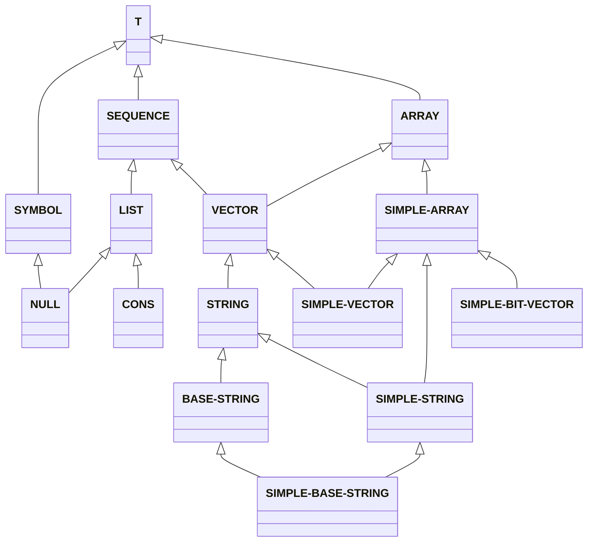

+++
title = '006 好奇先生在Lisp的花园里挖呀挖呀挖'
date = 2024-08-26T09:30:54+08:00
draft = true
mathjax = false
categories = ['lisp', 'tutorial', 'common-lisp', 'programming']
tags = ['lisp', 'development', 'sequence', 'common-lisp', 'programming']
toc = true
tocBorder = true
+++


## 好奇先生Lisp探索工具`explore-lisp`

好奇先生学会了懒惰先生交给他的Package开发和管理流程，[quickproject管理package](/posts/002-lazy-process)。好奇先生一步一步的定义了一个叫做`explore-lisp`的package，这个包提供了探索包的工具，并且提供了把探索的结果输出成`markdown`文档的方法。

这个工程的地址在[explore-lisp](https://github.com/qchen-fdii-cardc/explore-lisp)。当把这个源代码下载（clone）到本地之后，可以通过`quicklisp`的`quickload`函数加载这个包。

在安装之前，记得要把文件克隆到`quicklisp`的本地目录下，比如`~/quicklisp/local-projects`。或者还有一个办法，克隆到任何地方，除了利用修改变量`asdf:*central-registry*`方式，还可以直接在`quicklisp`的`local-projects`目录下建立一个软链接，指向这个包的目录。

```shell
mklink /D ~/quicklisp/local-projects/explore-lisp  /path/to/explore-lisp 
```

然后在`REPL`中加载这个包：

```lisp
(ql:quickload :explore-lisp)
```

这之后，就可以用这个包的功能了。

```lisp
* (el:dir 'el)
(EXPLORE-LISP:FORMAT-DESCRIPTIONS EXPLORE-LISP:DESCRIBE-SYMBOL EXPLORE-LISP:DIR
                                  EXPLORE-LISP:EXPORT-ALL-EXTERNAL-SYMBOLS
                                  EXPLORE-LISP:EXPORT-DESCRIPTIONS)
5
```

这个包本身的`dir`功能就能够列出这个包的所有函数和变量。还可以用
  
```lisp
(el:describe-symbol 'el:dir)
"EXPLORE-LISP:DIR
  [symbol]

DIR names a compiled function:
  Lambda-list: (PACKAGE)
  Derived type: (FUNCTION (T) (VALUES LIST UNSIGNED-BYTE &OPTIONAL))
  Documentation:
    List all external symbols in a package, return a list of symbol names and its length
  Source file: C:/Users/qchen/quicklisp/local-projects/explore-lisp/explore-lisp.lisp
"
```
可以看到这个符号的文档有几个基本的部分：

- 函数的全名（包括包的名字作为前缀）
- 符号的类型（这里是一个`symbol`）
- 下面就是函数的定义，包括参数列表和返回值的类型
- 文档字符串，这个字符串描述了这个函数的功能
- 函数的源代码文件

好奇先生运行了`(el:export-all-external-symbols 'el :fn "docs.md" :start-level 2)`，这个函数的功能是把`el`包的所有外部符号都导出来，这样就可以在REPL中直接调用这个包的函数了。哇啦，一个文件`docs.md`就生成了，里面包含了这个包的所有外部符号的文档。

## 挖一下`explore-lisp`

下面的文档主题部分，都是通过好奇先生的探索工具集生成的。真的是太好玩，好奇先生可以玩一整天。


1. [DESCRIBE-SYMBOL](#describe-symbol)
2. [DIR](#dir)
3. [EXPORT-ALL-EXTERNAL-SYMBOLS](#export-all-external-symbols)
4. [EXPORT-DESCRIPTIONS](#export-descriptions)
5. [FORMAT-DESCRIPTIONS](#format-descriptions)
6. [SEARCH-SYMBOLS](#search-symbols)


###  `DESCRIBE-SYMBOL`

这个函数可以把一个符号的文档描述输出成一个字符串。可以看到这个函数的签名，以及参数列表，返回值的类型，文档描述，函数的源代码文件位置。

```lisp
EXPLORE-LISP:DESCRIBE-SYMBOL
  [symbol]

DESCRIBE-SYMBOL names a compiled function:
  Lambda-list: (NAME)
  Derived type: (FUNCTION (T) (VALUES SIMPLE-STRING &OPTIONAL))
  Documentation:
    Describe a symbol and return the output as a string
  Source file: C:/Users/qchen/quicklisp/local-projects/explore-lisp/explore-lisp.lisp
```
###  `DIR`

这个函数列出一个包的所有外部符号，返回一个符号名字的列表和列表的长度。

```lisp
EXPLORE-LISP:DIR
  [symbol]

DIR names a compiled function:
  Lambda-list: (PACKAGE)
  Derived type: (FUNCTION (T) (VALUES LIST UNSIGNED-BYTE &OPTIONAL))
  Documentation:
    List all external symbols in a package, return a list of symbol names and its length
  Source file: C:/Users/qchen/quicklisp/local-projects/explore-lisp/explore-lisp.lisp
```
###  `EXPORT-ALL-EXTERNAL-SYMBOLS`

这个函数把一个包的所有外部文件列出在一个文件中，可以通过关键词来设定文件名称和最开始文档在markdown中的标题级别。

这里最有趣的是这个，这个函数的源程序直接被列在这里？为什么？为什么其他的函数没有呢？只是给出了函数对应文件的位置。这就是Lisp最为独特的地方，Lisp的运行环境（REPL）中的符号都是动态的，可以被修改，可以被重新定义，可以被删除。这个函数的源代码就是这样被列在这里的。

这里有一个Lisp的核心概念，一个运行的环境中所有的符号、绑定都可以很容易的存成一个文件，然后在另一个环境中重新加载，这就是Lisp的强大之处。

所以很多资深Lisp程序员都说，Lisp程序是一个不停进化的活的程序，运行时修改功能，增加功能，删除功能，都是很容易的事情。

```lisp
EXPLORE-LISP:EXPORT-ALL-EXTERNAL-SYMBOLS
  [symbol]

EXPORT-ALL-EXTERNAL-SYMBOLS names a compiled function:
  Lambda-list: (PACKAGE &KEY (FN  FN-P) (START-LEVEL 1))
  Derived type: (FUNCTION (T &KEY (:FN T) (:START-LEVEL T))
                 (VALUES NULL &OPTIONAL))
  Documentation:
    List all external symbols in a package and their doc strings into a file ~package~.md
  Source form:
    (LAMBDA
        (PACKAGE
         &KEY (EXPLORE-LISP::FN "" EXPLORE-LISP::FN-P)
         (EXPLORE-LISP::START-LEVEL 1))
      "List all external symbols in a package and their doc strings into a file ~package~.md"
      (BLOCK EXPLORE-LISP:EXPORT-ALL-EXTERNAL-SYMBOLS
        (LET ((EXPLORE-LISP::SORTED-NAMES
               (EXPLORE-LISP::SORT-SYMBOLS (EXPLORE-LISP:DIR PACKAGE)))
              (EXPLORE-LISP::_FN
               (IF EXPLORE-LISP::FN-P
                   EXPLORE-LISP::FN
                   (FORMAT NIL "~a.md" PACKAGE))))
          (WITH-OPEN-STREAM
              (EXPLORE-LISP::S
               (OPEN EXPLORE-LISP::_FN :DIRECTION :OUTPUT :IF-EXISTS
                     :SUPERSEDE))
            (FORMAT EXPLORE-LISP::S "~A ~A external symbols~%~%~%"
                    (EXPLORE-LISP::MARKDOWN-NTH-HEADER
                     EXPLORE-LISP::START-LEVEL)
                    PACKAGE)
            (LET ((EXPLORE-LISP::INDEX 1))
              (DOLIST (EXPLORE-LISP::NAME EXPLORE-LISP::SORTED-NAMES)
                (FORMAT EXPLORE-LISP::S "~d. [~A](#~A)~%"
                        EXPLORE-LISP::INDEX EXPLORE-LISP::NAME
                        EXPLORE-LISP::NAME)
                (INCF EXPLORE-LISP::INDEX)))
            (FORMAT EXPLORE-LISP::S "~%~%")
            (DOLIST (EXPLORE-LISP::NAME EXPLORE-LISP::SORTED-NAMES)
              (FORMAT EXPLORE-LISP::S "~A  `~A`~%~%"
                      (EXPLORE-LISP::MARKDOWN-NTH-HEADER
                       (+ 1 EXPLORE-LISP::START-LEVEL))
                      EXPLORE-LISP::NAME)
              (FORMAT EXPLORE-LISP::S "```lisp~%")
              (DESCRIBE EXPLORE-LISP::NAME EXPLORE-LISP::S)
              (FORMAT EXPLORE-LISP::S "```~%"))))))
```
###  `EXPORT-DESCRIPTIONS`

将一个名称列表的描述导出到一个文件中，可以通过关键词来设定文件名称和最开始文档在markdown中的标题级别。

```lisp
EXPLORE-LISP:EXPORT-DESCRIPTIONS
  [symbol]

EXPORT-DESCRIPTIONS names a compiled function:
  Lambda-list: (NAME-LIST FN &OPTIONAL (START-LEVEL 1))
  Derived type: (FUNCTION (T T &OPTIONAL T) (VALUES NULL &OPTIONAL))
  Documentation:
    Save a list of symbol names to a file
  Source file: C:/Users/qchen/quicklisp/local-projects/explore-lisp/explore-lisp.lisp
```
###  `FORMAT-DESCRIPTIONS`

将一个名称列表的描述格式化成markdown文档，可以通过关键词来设定文件名称和最开始文档在markdown中的标题级别。

```lisp
EXPLORE-LISP:FORMAT-DESCRIPTIONS
  [symbol]

FORMAT-DESCRIPTIONS names a compiled function:
  Lambda-list: (NAME-LIST &OPTIONAL (START-LEVEL 1))
  Derived type: (FUNCTION (T &OPTIONAL T)
                 (VALUES SIMPLE-STRING &OPTIONAL))
  Documentation:
    Format a list of symbol names as markdown, with optional start level for headers
  Source file: C:/Users/qchen/quicklisp/local-projects/explore-lisp/explore-lisp.lisp
```


###  `SEARCH-SYMBOLS`

这个函数可以搜索一个包中的所有符号，包括符号的名字和文档字符串。文档字符串内的搜索是可选的。所有的搜索和字符串比较都是不区分大小写的。

```lisp
EXPLORE-LISP:SEARCH-SYMBOLS
  [symbol]

SEARCH-SYMBOLS names a compiled function:
  Lambda-list: (NAME PACKAGE &KEY (DOC-STRING NIL))
  Derived type: (FUNCTION (T T &KEY (:DOC-STRING T))
                 (VALUES LIST &OPTIONAL))
  Documentation:
    Search for string in symbol names and doc strings in a package
  Source file: C:/Users/qchen/quicklisp/local-projects/explore-lisp/explore-lisp.lisp
```


## 挖一下`string`

好奇先生的探索工具集合非常简单，每个函数的功能都很单一。并且，在`(ql:quickload 'explore-lisp)`之后，如果对功能不满意或者发现运行不符合预期，

- 可以在源代码所在位置（`describe`一下就知道）修改，然后重新加载，`(require 'explore-lisp)`。
- 直接在VSCode中打开一个任意新文件，`(in-package :explore-lisp)`，编写函数的定义，然后运行一下，也能达到效果。

这就是Lisp的动态开发理念，与传统的“编译-运行-调试”不同，Lisp把当前REPL中的所有符号都当作一个整体，可以随时修改，随时调试，随时运行。

另外，好奇先生觉得最后这个函数实在是太好玩了……他太好奇了。

好奇先生应该回家了，但是他就是忍不住，又在REPL中敲了一个命令：

```lisp
(el:search-symbols "string" :common-lisp)
```
好奇先生还没来得及按下回车，挠痒痒先生的手从很远的地方伸过来，挠了一下好奇先生的咯吱窝，然后还按了一下键盘，好奇先生的命令就被执行了。

啊，Lisp的REPL关于字符串的函数全部跑出来了~~~一共有46个！

```lisp
(BASE-STRING DIRECTORY-NAMESTRING ENOUGH-NAMESTRING FILE-NAMESTRING
 FILE-STRING-LENGTH GET-OUTPUT-STREAM-STRING HOST-NAMESTRING MAKE-STRING
 MAKE-STRING-INPUT-STREAM MAKE-STRING-OUTPUT-STREAM NAMESTRING
 NSTRING-CAPITALIZE NSTRING-DOWNCASE NSTRING-UPCASE PARSE-NAMESTRING
 PRIN1-TO-STRING PRINC-TO-STRING READ-FROM-STRING SIMPLE-BASE-STRING
 SIMPLE-STRING SIMPLE-STRING-P STRING STRING-CAPITALIZE STRING-DOWNCASE
 STRING-EQUAL STRING-GREATERP STRING-LEFT-TRIM STRING-LESSP STRING-NOT-EQUAL
 STRING-NOT-GREATERP STRING-NOT-LESSP STRING-RIGHT-TRIM STRING-STREAM
 STRING-TRIM STRING-UPCASE STRING/= STRING< STRING<= STRING= STRING> STRING>=
 STRINGP WITH-INPUT-FROM-STRING WITH-OUTPUT-TO-STRING WRITE-STRING
 WRITE-TO-STRING)
```

来，对子一个`base-string`继续哇呀挖：

```lisp
(el:describe-symbol 'base-string)
COMMON-LISP:BASE-STRING
  [symbol]

BASE-STRING names the built-in-class #<BUILT-IN-CLASS COMMON-LISP:BASE-STRING>:
  Class precedence-list: BASE-STRING, STRING, VECTOR, ARRAY, SEQUENCE, T
  Direct superclasses: STRING
  Direct subclasses: SIMPLE-BASE-STRING
  Sealed.
  No direct slots.

BASE-STRING names a primitive type-specifier:
  Lambda-list: (&OPTIONAL SIZE)
  
```

好奇先生的好奇心彻底爆炸，这里居然有很不一样的东西，`base-string`是一个内置的类，继承自`string`，并且有一个直接的子类`simple-base-string`。它的祖先依次是`string`、`vector`、`array`、`sequence`、`t`。这又是什么意思？而且这里的`sequence`是什么？

所有的类都是`t`这很好理解，因为除了`nil`，其他所有东西都是`t`，在面向对象的编程中，`is`也就是`是`的关系就是继承关系。那么`sequence`是什么呢？
  
好奇先生把这里的`Class precedence-list`, `Direct superclasses`, `Direct subclasses`都挖了出来，然后一路挖下去……

## 挖到了`sequence`

最后，好奇先生挖出来一个下面这样的继承关系图：



啊哈，好奇先生觉得好玩极了！从这个图里可以看到，`sequence`是一个很重要的类，它是`list`和`vector`的祖先，所有的跟字符串相关的类都是`sequence`的子类。

那么还能怎么挖呢？当然是看看哪些操作（函数）直接定义在`sequence`上了。

```lisp
(sort (el:search-symbols "sequence" :common-lisp :doc-string t) #'string-lessp)
(* *FEATURES* BASE-STRING BIT-VECTOR CONCATENATE CONS COPY-SEQ COUNT COUNT-IF
   COUNT-IF-NOT DELETE DELETE-DUPLICATES DELETE-IF DELETE-IF-NOT ELT EVERY FILL
   FIND FIND-IF FIND-IF-NOT LENGTH LIST MAKE-SEQUENCE MAP MAP-INTO MAPHASH
   MERGE MISMATCH NOTANY NOTEVERY NREVERSE NSUBSTITUTE NSUBSTITUTE-IF
   NSUBSTITUTE-IF-NOT NULL POSITION POSITION-IF POSITION-IF-NOT PROGRAM-ERROR
   READ-SEQUENCE REDUCE REMOVE REMOVE-DUPLICATES REMOVE-IF REMOVE-IF-NOT
   REPLACE REVERSE SEARCH SEQUENCE SIMPLE-BASE-STRING SIMPLE-BIT-VECTOR
   SIMPLE-CONDITION SIMPLE-STRING SIMPLE-VECTOR SOME SORT STABLE-SORT STRING
   STRING-LEFT-TRIM STRING-RIGHT-TRIM STRING-TRIM SUBSEQ SUBSTITUTE
   SUBSTITUTE-IF SUBSTITUTE-IF-NOT T THE TYPE-ERROR VECTOR
   WITH-HASH-TABLE-ITERATOR WRITE-SEQUENCE)
```

真是完美，好奇先生的好奇心又双叒叕被点燃了。这里有很多操作，比如`concatenate`、`copy-seq`、`count`、`count-if`、`count-if-not`、`delete`、`delete-duplicates`、`delete-if`、`delete-if-not`、`elt`、`every`、`fill`、`find`、`find-if`、`find-if-not`、`length`、`list`、`make-sequence`、`map`、`map-into`、`maphash`、`merge`、`mismatch`、`notany`、`notevery`、`nreverse`、`nsubstitute`、`nsubstitute-if`、`nsubstitute-if-not`、`null`、`position`、`position-if`、`position-if-not`、`read-sequence`、`reduce`、`remove`、`remove-duplicates`、`remove-if`、`remove-if-not`、`replace`、`reverse`、`search`、`sequence`、`sort`、`stable-sort`、`string`、`string-left-trim`、`string-right-trim`、`string-trim`、`subseq`、`substitute`、`substitute-if`、`substitute-if-not`、`the`、`type-error`、`vector`、`with-hash-table-iterator`、`write-sequence`。

好奇先生是没法睡觉饿了……

## 附录A: Sequence相关的函数附加中文说明和例子

### `CONCATENATE`

```lisp
COMMON-LISP:CONCATENATE
  [symbol]

CONCATENATE names a compiled function:
  Lambda-list: (RESULT-TYPE &REST SEQUENCES)
  Declared type: (FUNCTION
                  ((OR CONS SYMBOL SB-KERNEL:CLASSOID CLASS) &REST
                   SEQUENCE)
                  (VALUES
                   (OR LIST (SIMPLE-ARRAY * (*))
                       SB-KERNEL:EXTENDED-SEQUENCE)
                   &OPTIONAL))
  Derived type: (FUNCTION (T &REST T)
                 (VALUES
                  (OR LIST (SIMPLE-ARRAY * (*))
                      SB-KERNEL:EXTENDED-SEQUENCE)
                  &OPTIONAL))
  Documentation:
    Return a new sequence of all the argument sequences concatenated together
      which shares no structure with the original argument sequences of the
      specified RESULT-TYPE.
  Source file: SYS:SRC;CODE;SEQ.LISP

```

### `COPY-SEQ`

```lisp
COMMON-LISP:COPY-SEQ
  [symbol]

COPY-SEQ names a compiled function:
  Lambda-list: (SEQUENCE)
  Declared type: (FUNCTION (SEQUENCE)
                  (VALUES
                   (OR LIST (SIMPLE-ARRAY * (*))
                       SB-KERNEL:EXTENDED-SEQUENCE)
                   &OPTIONAL))
  Derived type: (FUNCTION (T) *)
  Documentation:
    Return a copy of SEQUENCE which is EQUAL to SEQUENCE but not EQ.
  Known attributes: flushable, unsafely-flushable
  Source file: SYS:SRC;CODE;SEQ.LISP

```

### `COUNT`

```lisp
COMMON-LISP:COUNT
  [symbol]

COUNT names a compiled function:
  Lambda-list: (ITEM SEQUENCE &REST ARGS &KEY FROM-END (START 0)
                (END NIL) (KEY NIL) (TEST (FUNCTION EQL) TEST-P)
                (TEST-NOT NIL TEST-NOT-P))
  Dynamic-extent arguments: keyword=(:KEY :TEST :TEST-NOT)
  Declared type: (FUNCTION
                  (T SEQUENCE &REST T &KEY (:TEST (OR FUNCTION SYMBOL))
                   (:TEST-NOT (OR FUNCTION SYMBOL))
                   (:START (UNSIGNED-BYTE 45))
                   (:END (OR NULL (UNSIGNED-BYTE 45))) (:FROM-END T)
                   (:KEY (OR FUNCTION SYMBOL)))
                  (VALUES (UNSIGNED-BYTE 45) &OPTIONAL))
  Derived type: (FUNCTION
                 (T T &REST T &KEY (:TEST . #1=((OR FUNCTION SYMBOL)))
                  (:TEST-NOT . #1#)
                  (:START . #2=(#3=(UNSIGNED-BYTE 45)))
                  (:END (OR NULL . #2#)) (:FROM-END T) (:KEY . #1#))
                 (VALUES #3# &OPTIONAL))
  Documentation:
    Return the number of elements in SEQUENCE satisfying a test with ITEM,
       which defaults to EQL.
  Known attributes: call, foldable, flushable, unsafely-flushable
  Source file: SYS:SRC;CODE;SEQ.LISP

```

### `COUNT-IF`

```lisp
COMMON-LISP:COUNT-IF
  [symbol]

COUNT-IF names a compiled function:
  Lambda-list: (PREDICATE SEQUENCE &REST ARGS &KEY FROM-END (START 0)
                (END NIL) (KEY NIL))
  Dynamic-extent arguments: positional=(0), keyword=(:KEY)
  Declared type: (FUNCTION
                  ((OR FUNCTION SYMBOL) SEQUENCE &REST T &KEY
                   (:FROM-END T) (:START (UNSIGNED-BYTE 45))
                   (:END (OR NULL (UNSIGNED-BYTE 45)))
                   (:KEY (OR FUNCTION SYMBOL)))
                  (VALUES (UNSIGNED-BYTE 45) &OPTIONAL))
  Derived type: (FUNCTION
                 (#1=(OR FUNCTION SYMBOL) T &REST T &KEY (:FROM-END T)
                  (:START . #2=(#3=(UNSIGNED-BYTE 45)))
                  (:END (OR NULL . #2#)) (:KEY #1#))
                 (VALUES #3# &OPTIONAL))
  Documentation:
    Return the number of elements in SEQUENCE satisfying PRED(el).
  Known attributes: call, foldable, flushable, unsafely-flushable
  Source file: SYS:SRC;CODE;SEQ.LISP

```

### `COUNT-IF-NOT`

```lisp
COMMON-LISP:COUNT-IF-NOT
  [symbol]

COUNT-IF-NOT names a compiled function:
  Lambda-list: (PREDICATE SEQUENCE &REST ARGS &KEY FROM-END (START 0)
                (END NIL) (KEY NIL))
  Dynamic-extent arguments: positional=(0), keyword=(:KEY)
  Declared type: (FUNCTION
                  ((OR FUNCTION SYMBOL) SEQUENCE &REST T &KEY
                   (:FROM-END T) (:START (UNSIGNED-BYTE 45))
                   (:END (OR NULL (UNSIGNED-BYTE 45)))
                   (:KEY (OR FUNCTION SYMBOL)))
                  (VALUES (UNSIGNED-BYTE 45) &OPTIONAL))
  Derived type: (FUNCTION
                 (#1=(OR FUNCTION SYMBOL) T &REST T &KEY (:FROM-END T)
                  (:START . #2=(#3=(UNSIGNED-BYTE 45)))
                  (:END (OR NULL . #2#)) (:KEY #1#))
                 (VALUES #3# &OPTIONAL))
  Documentation:
    Return the number of elements in SEQUENCE not satisfying TEST(el).
  Known attributes: call, foldable, flushable, unsafely-flushable
  Source file: SYS:SRC;CODE;SEQ.LISP

```

### `DELETE`

```lisp
COMMON-LISP:DELETE
  [symbol]

DELETE names a compiled function:
  Lambda-list: (ITEM SEQUENCE &REST ARGS &KEY FROM-END
                (TEST (FUNCTION EQL)) (TEST-NOT NIL) (START 0)
                (END NIL) (COUNT NIL) (KEY NIL))
  Dynamic-extent arguments: keyword=(:TEST :TEST-NOT :KEY)
  Declared type: (FUNCTION
                  (T SEQUENCE &REST T &KEY (:FROM-END T)
                   (:TEST (OR FUNCTION SYMBOL))
                   (:TEST-NOT (OR FUNCTION SYMBOL))
                   (:START (UNSIGNED-BYTE 45))
                   (:END (OR NULL (UNSIGNED-BYTE 45)))
                   (:COUNT (OR NULL INTEGER))
                   (:KEY (OR FUNCTION SYMBOL)))
                  (VALUES SEQUENCE &OPTIONAL))
  Derived type: (FUNCTION
                 (T T &REST T &KEY (:FROM-END T)
                  (:TEST . #1=((OR FUNCTION SYMBOL))) (:TEST-NOT . #1#)
                  (:START . #2=((UNSIGNED-BYTE 45)))
                  (:END (OR NULL . #2#)) (:COUNT (OR NULL INTEGER))
                  (:KEY . #1#))
                 (VALUES T &OPTIONAL))
  Documentation:
    Return a sequence formed by destructively removing the specified ITEM from
      the given SEQUENCE.
  Known attributes: call, important-result
  Source file: SYS:SRC;CODE;SEQ.LISP

```

### `DELETE-DUPLICATES`

```lisp
COMMON-LISP:DELETE-DUPLICATES
  [symbol]

DELETE-DUPLICATES names a compiled function:
  Lambda-list: (SEQUENCE &REST ARGS &KEY (TEST (FUNCTION EQL))
                (TEST-NOT NIL) (START 0) (END NIL) FROM-END (KEY NIL))
  Dynamic-extent arguments: keyword=(:TEST :TEST-NOT :KEY)
  Declared type: (FUNCTION
                  (SEQUENCE &REST T &KEY (:TEST (OR FUNCTION SYMBOL))
                   (:TEST-NOT (OR FUNCTION SYMBOL))
                   (:START (UNSIGNED-BYTE 45))
                   (:END (OR NULL (UNSIGNED-BYTE 45))) (:FROM-END T)
                   (:KEY (OR FUNCTION SYMBOL)))
                  (VALUES SEQUENCE &OPTIONAL))
  Derived type: (FUNCTION
                 (T &REST T &KEY (:TEST . #1=((OR FUNCTION SYMBOL)))
                  (:TEST-NOT . #1#) (:START . #2=((UNSIGNED-BYTE 45)))
                  (:END (OR NULL . #2#)) (:FROM-END T) (:KEY . #1#))
                 (VALUES T &OPTIONAL))
  Documentation:
    The elements of SEQUENCE are examined, and if any two match, one is
       discarded. The resulting sequence, which may be formed by destroying the
       given sequence, is returned.
    
       The :TEST-NOT argument is deprecated.
  Known attributes: call, important-result
  Source file: SYS:SRC;CODE;SEQ.LISP

```

### `DELETE-IF`

```lisp
COMMON-LISP:DELETE-IF
  [symbol]

DELETE-IF names a compiled function:
  Lambda-list: (PREDICATE SEQUENCE &REST ARGS &KEY FROM-END (START 0)
                (KEY NIL) (END NIL) (COUNT NIL))
  Dynamic-extent arguments: positional=(0), keyword=(:KEY)
  Declared type: (FUNCTION
                  ((OR FUNCTION SYMBOL) SEQUENCE &REST T &KEY
                   (:FROM-END T) (:COUNT (OR NULL INTEGER))
                   (:START (UNSIGNED-BYTE 45))
                   (:END (OR NULL (UNSIGNED-BYTE 45)))
                   (:KEY (OR FUNCTION SYMBOL)))
                  (VALUES SEQUENCE &OPTIONAL))
  Derived type: (FUNCTION
                 (#1=(OR FUNCTION SYMBOL) T &REST T &KEY (:FROM-END T)
                  (:COUNT (OR NULL INTEGER))
                  (:START . #2=((UNSIGNED-BYTE 45)))
                  (:END (OR NULL . #2#)) (:KEY #1#))
                 (VALUES T &OPTIONAL))
  Documentation:
    Return a sequence formed by destructively removing the elements satisfying
      the specified PREDICATE from the given SEQUENCE.
  Known attributes: call, important-result
  Source file: SYS:SRC;CODE;SEQ.LISP

```

### `DELETE-IF-NOT`

```lisp
COMMON-LISP:DELETE-IF-NOT
  [symbol]

DELETE-IF-NOT names a compiled function:
  Lambda-list: (PREDICATE SEQUENCE &REST ARGS &KEY FROM-END (START 0)
                (END NIL) (KEY NIL) (COUNT NIL))
  Dynamic-extent arguments: positional=(0), keyword=(:KEY)
  Declared type: (FUNCTION
                  ((OR FUNCTION SYMBOL) SEQUENCE &REST T &KEY
                   (:FROM-END T) (:COUNT (OR NULL INTEGER))
                   (:START (UNSIGNED-BYTE 45))
                   (:END (OR NULL (UNSIGNED-BYTE 45)))
                   (:KEY (OR FUNCTION SYMBOL)))
                  (VALUES SEQUENCE &OPTIONAL))
  Derived type: (FUNCTION
                 (#1=(OR FUNCTION SYMBOL) T &REST T &KEY (:FROM-END T)
                  (:COUNT (OR NULL INTEGER))
                  (:START . #2=((UNSIGNED-BYTE 45)))
                  (:END (OR NULL . #2#)) (:KEY #1#))
                 (VALUES T &OPTIONAL))
  Documentation:
    Return a sequence formed by destructively removing the elements not
      satisfying the specified PREDICATE from the given SEQUENCE.
  Known attributes: call, important-result
  Source file: SYS:SRC;CODE;SEQ.LISP

```

### `ELT`

```lisp
COMMON-LISP:ELT
  [symbol]

ELT names a compiled function:
  Lambda-list: (SEQUENCE INDEX)
  Declared type: (FUNCTION (SEQUENCE (UNSIGNED-BYTE 45))
                  (VALUES T &OPTIONAL))
  Derived type: (FUNCTION (T (UNSIGNED-BYTE 45)) (VALUES T &OPTIONAL))
  Documentation:
    Return the element of SEQUENCE specified by INDEX.
  Known attributes: foldable, unsafely-flushable
  Source file: SYS:SRC;CODE;SEQ.LISP

(SETF ELT) names a compiled function:
  Lambda-list: (NEWVAL SEQUENCE INDEX)
  Derived type: (FUNCTION (T SEQUENCE (UNSIGNED-BYTE 45))
                 (VALUES T &OPTIONAL))
  Inline proclamation: INLINE (inline expansion available)
  Source file: SYS:SRC;CODE;SETF-FUNS.LISP

(SETF ELT) has setf-expansion: SB-KERNEL:%SETELT

```

### `EVERY`

```lisp
COMMON-LISP:EVERY
  [symbol]

EVERY names a compiled function:
  Lambda-list: (PRED FIRST-SEQ &REST MORE-SEQS)
  Dynamic-extent arguments: positional=(0)
  Declared type: (FUNCTION
                  ((OR FUNCTION SYMBOL) SEQUENCE &REST SEQUENCE)
                  (VALUES BOOLEAN &OPTIONAL))
  Derived type: (FUNCTION ((OR FUNCTION SYMBOL) SEQUENCE &REST T)
                 (VALUES BOOLEAN &OPTIONAL))
  Documentation:
    Apply PREDICATE to the 0-indexed elements of the sequences, then
       possibly to those with index 1, and so on. Return NIL as soon
       as any invocation of PREDICATE returns NIL, or T if every invocation
       is non-NIL.
  Known attributes: call, foldable, unsafely-flushable
  Source file: SYS:SRC;CODE;QUANTIFIERS.LISP

```

### `FILL`

```lisp
COMMON-LISP:FILL
  [symbol]

FILL names a compiled function:
  Lambda-list: (SEQUENCE ITEM &KEY (START 0) END)
  Declared type: (FUNCTION
                  (SEQUENCE T &REST T &KEY (:START (UNSIGNED-BYTE 45))
                   (:END (OR NULL (UNSIGNED-BYTE 45))))
                  (VALUES SEQUENCE &OPTIONAL))
  Derived type: (FUNCTION
                 (T T &KEY (:START . #1=((UNSIGNED-BYTE 45)))
                  (:END (OR NULL . #1#)))
                 (VALUES SEQUENCE &OPTIONAL))
  Documentation:
    Replace the specified elements of SEQUENCE with ITEM.
  Source file: SYS:SRC;CODE;SEQ.LISP

```

### `FIND`

```lisp
COMMON-LISP:FIND
  [symbol]

FIND names a compiled function:
  Lambda-list: (ITEM SEQUENCE &REST ARGS &KEY FROM-END (START 0) END
                KEY TEST TEST-NOT)
  Dynamic-extent arguments: keyword=(:KEY :TEST :TEST-NOT)
  Declared type: (FUNCTION
                  (T SEQUENCE &REST T &KEY (:TEST (OR FUNCTION SYMBOL))
                   (:TEST-NOT (OR FUNCTION SYMBOL))
                   (:START (UNSIGNED-BYTE 45))
                   (:END (OR NULL (UNSIGNED-BYTE 45))) (:FROM-END T)
                   (:KEY (OR FUNCTION SYMBOL)))
                  (VALUES T &OPTIONAL))
  Derived type: (FUNCTION
                 (T T &REST T &KEY (:TEST . #1=((OR FUNCTION SYMBOL)))
                  (:TEST-NOT . #1#) (:START . #2=((UNSIGNED-BYTE 45)))
                  (:END (OR NULL . #2#)) (:FROM-END T) (:KEY . #1#))
                 (VALUES T &OPTIONAL))
  Known attributes: call, foldable, flushable, unsafely-flushable
  Source file: SYS:SRC;CODE;SEQ.LISP

```

### `FIND-IF`

```lisp
COMMON-LISP:FIND-IF
  [symbol]

FIND-IF names a compiled function:
  Lambda-list: (PREDICATE SEQUENCE &REST ARGS &KEY FROM-END (START 0)
                END KEY)
  Dynamic-extent arguments: positional=(0), keyword=(:KEY)
  Declared type: (FUNCTION
                  ((OR FUNCTION SYMBOL) SEQUENCE &REST T &KEY
                   (:FROM-END T) (:START (UNSIGNED-BYTE 45))
                   (:END (OR NULL (UNSIGNED-BYTE 45)))
                   (:KEY (OR FUNCTION SYMBOL)))
                  (VALUES T &OPTIONAL))
  Derived type: (FUNCTION
                 (#1=(OR FUNCTION SYMBOL) T &REST T &KEY (:FROM-END T)
                  (:START . #2=((UNSIGNED-BYTE 45)))
                  (:END (OR NULL . #2#)) (:KEY #1#))
                 (VALUES T &OPTIONAL))
  Known attributes: call, foldable, flushable, unsafely-flushable
  Source file: SYS:SRC;CODE;SEQ.LISP

```

### `FIND-IF-NOT`

```lisp
COMMON-LISP:FIND-IF-NOT
  [symbol]

FIND-IF-NOT names a compiled function:
  Lambda-list: (PREDICATE SEQUENCE &REST ARGS &KEY FROM-END (START 0)
                END KEY)
  Dynamic-extent arguments: positional=(0), keyword=(:KEY)
  Declared type: (FUNCTION
                  ((OR FUNCTION SYMBOL) SEQUENCE &REST T &KEY
                   (:FROM-END T) (:START (UNSIGNED-BYTE 45))
                   (:END (OR NULL (UNSIGNED-BYTE 45)))
                   (:KEY (OR FUNCTION SYMBOL)))
                  (VALUES T &OPTIONAL))
  Derived type: (FUNCTION
                 (#1=(OR FUNCTION SYMBOL) T &REST T &KEY (:FROM-END T)
                  (:START . #2=((UNSIGNED-BYTE 45)))
                  (:END (OR NULL . #2#)) (:KEY #1#))
                 (VALUES T &OPTIONAL))
  Known attributes: call, foldable, flushable, unsafely-flushable
  Source file: SYS:SRC;CODE;SEQ.LISP

```

### `LENGTH`

```lisp
COMMON-LISP:LENGTH
  [symbol]

LENGTH names a compiled function:
  Lambda-list: (SEQUENCE)
  Declared type: (FUNCTION (SEQUENCE)
                  (VALUES (UNSIGNED-BYTE 45) &OPTIONAL))
  Derived type: (FUNCTION (T) *)
  Documentation:
    Return an integer that is the length of SEQUENCE.
  Known attributes: dx-safe, foldable, flushable, unsafely-flushable
  Source file: SYS:SRC;CODE;SEQ.LISP

```

### `MAP`

```lisp
COMMON-LISP:MAP
  [symbol]

MAP names a compiled function:
  Lambda-list: (RESULT-TYPE FUNCTION FIRST-SEQUENCE &REST
                MORE-SEQUENCES)
  Dynamic-extent arguments: positional=(1)
  Declared type: (FUNCTION
                  ((OR CONS SYMBOL SB-KERNEL:CLASSOID CLASS)
                   (OR FUNCTION SYMBOL) SEQUENCE &REST SEQUENCE)
                  (VALUES
                   (OR LIST (SIMPLE-ARRAY * (*))
                       SB-KERNEL:EXTENDED-SEQUENCE)
                   &OPTIONAL))
  Derived type: (FUNCTION (T T T &REST T)
                 (VALUES
                  (OR LIST (SIMPLE-ARRAY * (*))
                      SB-KERNEL:EXTENDED-SEQUENCE)
                  &OPTIONAL))
  Known attributes: call
  Source file: SYS:SRC;CODE;SEQ.LISP

```

### `MAP-INTO`

```lisp
COMMON-LISP:MAP-INTO
  [symbol]

MAP-INTO names a compiled function:
  Lambda-list: (RESULT-SEQUENCE FUNCTION &REST SEQUENCES)
  Dynamic-extent arguments: positional=(1)
  Declared type: (FUNCTION
                  (SEQUENCE (OR FUNCTION SYMBOL) &REST SEQUENCE)
                  (VALUES SEQUENCE &OPTIONAL))
  Derived type: (FUNCTION (T T &REST T) (VALUES T &OPTIONAL))
  Known attributes: call
  Source file: SYS:SRC;CODE;SEQ.LISP

```

### `MERGE`

```lisp
COMMON-LISP:MERGE
  [symbol]

MERGE names a compiled function:
  Lambda-list: (RESULT-TYPE SEQUENCE1 SEQUENCE2 PREDICATE &KEY KEY)
  Dynamic-extent arguments: positional=(3), keyword=(:KEY)
  Declared type: (FUNCTION
                  ((OR CONS SYMBOL SB-KERNEL:CLASSOID CLASS) SEQUENCE
                   SEQUENCE (OR FUNCTION SYMBOL) &KEY
                   (:KEY (OR FUNCTION SYMBOL)))
                  (VALUES SEQUENCE &OPTIONAL))
  Derived type: (FUNCTION (T T T T &KEY (:KEY T)) (VALUES T &OPTIONAL))
  Documentation:
    Merge the sequences SEQUENCE1 and SEQUENCE2 destructively into a
       sequence of type RESULT-TYPE using PREDICATE to order the elements.
  Known attributes: call, important-result
  Source file: SYS:SRC;CODE;SORT.LISP

```

### `MISMATCH`

```lisp
COMMON-LISP:MISMATCH
  [symbol]

MISMATCH names a compiled function:
  Lambda-list: (SEQUENCE1 SEQUENCE2 &REST ARGS &KEY FROM-END
                (TEST (FUNCTION EQL)) (TEST-NOT NIL) (START1 0)
                (END1 NIL) (START2 0) (END2 NIL) (KEY NIL))
  Dynamic-extent arguments: keyword=(:TEST :TEST-NOT :KEY)
  Declared type: (FUNCTION
                  (SEQUENCE SEQUENCE &REST T &KEY (:FROM-END T)
                   (:TEST (OR FUNCTION SYMBOL))
                   (:TEST-NOT (OR FUNCTION SYMBOL))
                   (:START1 (UNSIGNED-BYTE 45))
                   (:END1 (OR NULL (UNSIGNED-BYTE 45)))
                   (:START2 (UNSIGNED-BYTE 45))
                   (:END2 (OR NULL (UNSIGNED-BYTE 45)))
                   (:KEY (OR FUNCTION SYMBOL)))
                  (VALUES (OR NULL (UNSIGNED-BYTE 45)) &OPTIONAL))
  Derived type: (FUNCTION
                 (T T &REST T &KEY (:FROM-END T)
                  (:TEST . #1=((OR FUNCTION SYMBOL))) (:TEST-NOT . #1#)
                  (:START1 . #2=((UNSIGNED-BYTE 45)))
                  (:END1 . #3=((OR NULL . #2#))) (:START2 . #2#)
                  (:END2 . #3#) (:KEY . #1#))
                 (VALUES
                  (OR
                   (INTEGER -4611686018427387904 4611686018427387904)
                   NULL)
                  &OPTIONAL))
  Documentation:
    The specified subsequences of SEQUENCE1 and SEQUENCE2 are compared
       element-wise. If they are of equal length and match in every element, the
       result is NIL. Otherwise, the result is a non-negative integer, the index
       within SEQUENCE1 of the leftmost position at which they fail to match; or,
       if one is shorter than and a matching prefix of the other, the index within
       SEQUENCE1 beyond the last position tested is returned. If a non-NIL
       :FROM-END argument is given, then one plus the index of the rightmost
       position in which the sequences differ is returned.
  Known attributes: call, foldable, flushable, unsafely-flushable
  Source file: SYS:SRC;CODE;SEQ.LISP

```

### `NOTANY`

```lisp
COMMON-LISP:NOTANY
  [symbol]

NOTANY names a compiled function:
  Lambda-list: (PRED FIRST-SEQ &REST MORE-SEQS)
  Dynamic-extent arguments: positional=(0)
  Declared type: (FUNCTION
                  ((OR FUNCTION SYMBOL) SEQUENCE &REST SEQUENCE)
                  (VALUES BOOLEAN &OPTIONAL))
  Derived type: (FUNCTION ((OR FUNCTION SYMBOL) SEQUENCE &REST T)
                 (VALUES BOOLEAN &OPTIONAL))
  Documentation:
    Apply PREDICATE to the 0-indexed elements of the sequences, then
       possibly to those with index 1, and so on. Return NIL as soon
       as any invocation of PREDICATE returns a non-NIL value, or T if the end
       of any sequence is reached.
  Known attributes: call, foldable, unsafely-flushable
  Source file: SYS:SRC;CODE;QUANTIFIERS.LISP

```

### `NOTEVERY`

```lisp
COMMON-LISP:NOTEVERY
  [symbol]

NOTEVERY names a compiled function:
  Lambda-list: (PRED FIRST-SEQ &REST MORE-SEQS)
  Dynamic-extent arguments: positional=(0)
  Declared type: (FUNCTION
                  ((OR FUNCTION SYMBOL) SEQUENCE &REST SEQUENCE)
                  (VALUES BOOLEAN &OPTIONAL))
  Derived type: (FUNCTION ((OR FUNCTION SYMBOL) SEQUENCE &REST T)
                 (VALUES BOOLEAN &OPTIONAL))
  Documentation:
    Apply PREDICATE to 0-indexed elements of the sequences, then
       possibly to those with index 1, and so on. Return T as soon
       as any invocation of PREDICATE returns NIL, or NIL if every invocation
       is non-NIL.
  Known attributes: call, foldable, unsafely-flushable
  Source file: SYS:SRC;CODE;QUANTIFIERS.LISP

```

### `NREVERSE`

```lisp
COMMON-LISP:NREVERSE
  [symbol]

NREVERSE names a compiled function:
  Lambda-list: (SEQUENCE)
  Declared type: (FUNCTION (SEQUENCE) (VALUES SEQUENCE &OPTIONAL))
  Derived type: (FUNCTION (T) (VALUES SEQUENCE &OPTIONAL))
  Documentation:
    Return a sequence of the same elements in reverse order; the argument
       is destroyed.
  Known attributes: important-result
  Source file: SYS:SRC;CODE;SEQ.LISP

```

### `NSUBSTITUTE`

```lisp
COMMON-LISP:NSUBSTITUTE
  [symbol]

NSUBSTITUTE names a compiled function:
  Lambda-list: (NEW OLD SEQUENCE &REST ARGS &KEY FROM-END
                (TEST (FUNCTION EQL)) (TEST-NOT NIL) (END NIL)
                (COUNT NIL) (KEY NIL) (START 0))
  Dynamic-extent arguments: keyword=(:TEST :TEST-NOT :KEY)
  Declared type: (FUNCTION
                  (T T SEQUENCE &REST T &KEY (:FROM-END T)
                   (:TEST (OR FUNCTION SYMBOL))
                   (:TEST-NOT (OR FUNCTION SYMBOL))
                   (:START (UNSIGNED-BYTE 45))
                   (:END (OR NULL (UNSIGNED-BYTE 45)))
                   (:COUNT (OR NULL INTEGER))
                   (:KEY (OR FUNCTION SYMBOL)))
                  (VALUES SEQUENCE &OPTIONAL))
  Derived type: (FUNCTION
                 (T T T &REST T &KEY (:FROM-END T)
                  (:TEST . #1=((OR FUNCTION SYMBOL))) (:TEST-NOT . #1#)
                  (:START . #2=((UNSIGNED-BYTE 45)))
                  (:END (OR NULL . #2#)) (:COUNT (OR NULL INTEGER))
                  (:KEY . #1#))
                 *)
  Documentation:
    Return a sequence of the same kind as SEQUENCE with the same elements
      except that all elements equal to OLD are replaced with NEW. SEQUENCE
      may be destructively modified.
  Known attributes: call
  Source file: SYS:SRC;CODE;SEQ.LISP

```

### `NSUBSTITUTE-IF`

```lisp
COMMON-LISP:NSUBSTITUTE-IF
  [symbol]

NSUBSTITUTE-IF names a compiled function:
  Lambda-list: (NEW PREDICATE SEQUENCE &REST ARGS &KEY FROM-END
                (START 0) (END NIL) (COUNT NIL) (KEY NIL))
  Dynamic-extent arguments: positional=(1), keyword=(:KEY)
  Declared type: (FUNCTION
                  (T (OR FUNCTION SYMBOL) SEQUENCE &REST T &KEY
                   (:FROM-END T) (:COUNT (OR NULL INTEGER))
                   (:START (UNSIGNED-BYTE 45))
                   (:END (OR NULL (UNSIGNED-BYTE 45)))
                   (:KEY (OR FUNCTION SYMBOL)))
                  (VALUES SEQUENCE &OPTIONAL))
  Derived type: (FUNCTION
                 (T #1=(OR FUNCTION SYMBOL) T &REST T &KEY
                  (:FROM-END T) (:COUNT (OR NULL INTEGER))
                  (:START . #2=((UNSIGNED-BYTE 45)))
                  (:END (OR NULL . #2#)) (:KEY #1#))
                 *)
  Documentation:
    Return a sequence of the same kind as SEQUENCE with the same elements
       except that all elements satisfying PREDICATE are replaced with NEW.
       SEQUENCE may be destructively modified.
  Known attributes: call
  Source file: SYS:SRC;CODE;SEQ.LISP

```

### `NSUBSTITUTE-IF-NOT`

```lisp
COMMON-LISP:NSUBSTITUTE-IF-NOT
  [symbol]

NSUBSTITUTE-IF-NOT names a compiled function:
  Lambda-list: (NEW PREDICATE SEQUENCE &REST ARGS &KEY FROM-END
                (START 0) (END NIL) (COUNT NIL) (KEY NIL))
  Dynamic-extent arguments: positional=(1), keyword=(:KEY)
  Declared type: (FUNCTION
                  (T (OR FUNCTION SYMBOL) SEQUENCE &REST T &KEY
                   (:FROM-END T) (:COUNT (OR NULL INTEGER))
                   (:START (UNSIGNED-BYTE 45))
                   (:END (OR NULL (UNSIGNED-BYTE 45)))
                   (:KEY (OR FUNCTION SYMBOL)))
                  (VALUES SEQUENCE &OPTIONAL))
  Derived type: (FUNCTION
                 (T #1=(OR FUNCTION SYMBOL) T &REST T &KEY
                  (:FROM-END T) (:COUNT (OR NULL INTEGER))
                  (:START . #2=((UNSIGNED-BYTE 45)))
                  (:END (OR NULL . #2#)) (:KEY #1#))
                 *)
  Documentation:
    Return a sequence of the same kind as SEQUENCE with the same elements
       except that all elements not satisfying PREDICATE are replaced with NEW.
       SEQUENCE may be destructively modified.
  Known attributes: call
  Source file: SYS:SRC;CODE;SEQ.LISP

```

### `POSITION`

```lisp
COMMON-LISP:POSITION
  [symbol]

POSITION names a compiled function:
  Lambda-list: (ITEM SEQUENCE &REST ARGS &KEY FROM-END (START 0) END
                KEY TEST TEST-NOT)
  Dynamic-extent arguments: keyword=(:KEY :TEST :TEST-NOT)
  Declared type: (FUNCTION
                  (T SEQUENCE &REST T &KEY (:TEST (OR FUNCTION SYMBOL))
                   (:TEST-NOT (OR FUNCTION SYMBOL))
                   (:START (UNSIGNED-BYTE 45))
                   (:END (OR NULL (UNSIGNED-BYTE 45))) (:FROM-END T)
                   (:KEY (OR FUNCTION SYMBOL)))
                  (VALUES (OR (MOD 35184372088831) NULL) &OPTIONAL))
  Derived type: (FUNCTION
                 (T T &REST T &KEY (:TEST . #1=((OR FUNCTION SYMBOL)))
                  (:TEST-NOT . #1#) (:START . #2=((UNSIGNED-BYTE 45)))
                  (:END (OR NULL . #2#)) (:FROM-END T) (:KEY . #1#))
                 (VALUES (OR (MOD 35184372088831) NULL) &OPTIONAL))
  Known attributes: call, foldable, flushable, unsafely-flushable
  Source file: SYS:SRC;CODE;SEQ.LISP

```

### `POSITION-IF`

```lisp
COMMON-LISP:POSITION-IF
  [symbol]

POSITION-IF names a compiled function:
  Lambda-list: (PREDICATE SEQUENCE &REST ARGS &KEY FROM-END (START 0)
                END KEY)
  Dynamic-extent arguments: positional=(0), keyword=(:KEY)
  Declared type: (FUNCTION
                  ((OR FUNCTION SYMBOL) SEQUENCE &REST T &KEY
                   (:FROM-END T) (:START (UNSIGNED-BYTE 45))
                   (:END (OR NULL (UNSIGNED-BYTE 45)))
                   (:KEY (OR FUNCTION SYMBOL)))
                  (VALUES (OR (MOD 35184372088831) NULL) &OPTIONAL))
  Derived type: (FUNCTION
                 (#1=(OR FUNCTION SYMBOL) T &REST T &KEY (:FROM-END T)
                  (:START . #2=((UNSIGNED-BYTE 45)))
                  (:END (OR NULL . #2#)) (:KEY #1#))
                 (VALUES (OR (MOD 35184372088831) NULL) &OPTIONAL))
  Known attributes: call, foldable, flushable, unsafely-flushable
  Source file: SYS:SRC;CODE;SEQ.LISP

```

### `POSITION-IF-NOT`

```lisp
COMMON-LISP:POSITION-IF-NOT
  [symbol]

POSITION-IF-NOT names a compiled function:
  Lambda-list: (PREDICATE SEQUENCE &REST ARGS &KEY FROM-END (START 0)
                END KEY)
  Dynamic-extent arguments: positional=(0), keyword=(:KEY)
  Declared type: (FUNCTION
                  ((OR FUNCTION SYMBOL) SEQUENCE &REST T &KEY
                   (:FROM-END T) (:START (UNSIGNED-BYTE 45))
                   (:END (OR NULL (UNSIGNED-BYTE 45)))
                   (:KEY (OR FUNCTION SYMBOL)))
                  (VALUES (OR (MOD 35184372088831) NULL) &OPTIONAL))
  Derived type: (FUNCTION
                 (#1=(OR FUNCTION SYMBOL) T &REST T &KEY (:FROM-END T)
                  (:START . #2=((UNSIGNED-BYTE 45)))
                  (:END (OR NULL . #2#)) (:KEY #1#))
                 (VALUES (OR (MOD 35184372088831) NULL) &OPTIONAL))
  Known attributes: call, foldable, flushable, unsafely-flushable
  Source file: SYS:SRC;CODE;SEQ.LISP

```

### `REDUCE`

```lisp
COMMON-LISP:REDUCE
  [symbol]

REDUCE names a compiled function:
  Lambda-list: (FUNCTION SEQUENCE &REST ARGS &KEY (KEY NIL) FROM-END
                (START 0) (END NIL) (INITIAL-VALUE NIL IVP))
  Dynamic-extent arguments: positional=(0), keyword=(:KEY)
  Declared type: (FUNCTION
                  ((OR FUNCTION SYMBOL) SEQUENCE &REST T &KEY
                   (:FROM-END T) (:START (UNSIGNED-BYTE 45))
                   (:END (OR NULL (UNSIGNED-BYTE 45)))
                   (:INITIAL-VALUE T) (:KEY (OR FUNCTION SYMBOL)))
                  (VALUES T &OPTIONAL))
  Derived type: (FUNCTION
                 (#1=(OR FUNCTION SYMBOL) T &REST T &KEY
                  (:FROM-END . #2=(T))
                  (:START . #3=((UNSIGNED-BYTE 45)))
                  (:END (OR NULL . #3#)) (:INITIAL-VALUE . #2#)
                  (:KEY #1#))
                 (VALUES T &OPTIONAL))
  Known attributes: call, foldable, flushable, unsafely-flushable
  Source file: SYS:SRC;CODE;SEQ.LISP

```

### `REMOVE`

```lisp
COMMON-LISP:REMOVE
  [symbol]

REMOVE names a compiled function:
  Lambda-list: (ITEM SEQUENCE &REST ARGS &KEY FROM-END
                (TEST (FUNCTION EQL)) (TEST-NOT NIL) (START 0)
                (END NIL) (COUNT NIL) (KEY NIL))
  Dynamic-extent arguments: keyword=(:TEST :TEST-NOT :KEY)
  Declared type: (FUNCTION
                  (T SEQUENCE &REST T &KEY (:FROM-END T)
                   (:TEST (OR FUNCTION SYMBOL))
                   (:TEST-NOT (OR FUNCTION SYMBOL))
                   (:START (UNSIGNED-BYTE 45))
                   (:END (OR NULL (UNSIGNED-BYTE 45)))
                   (:COUNT (OR NULL INTEGER))
                   (:KEY (OR FUNCTION SYMBOL)))
                  (VALUES
                   (OR LIST (SIMPLE-ARRAY * (*))
                       SB-KERNEL:EXTENDED-SEQUENCE)
                   &OPTIONAL))
  Derived type: (FUNCTION
                 (T T &REST T &KEY (:FROM-END T)
                  (:TEST . #1=((OR FUNCTION SYMBOL))) (:TEST-NOT . #1#)
                  (:START . #2=((UNSIGNED-BYTE 45)))
                  (:END (OR NULL . #2#)) (:COUNT (OR NULL INTEGER))
                  (:KEY . #1#))
                 (VALUES T &OPTIONAL))
  Documentation:
    Return a copy of SEQUENCE with elements satisfying the test (default is
       EQL) with ITEM removed.
  Known attributes: call, flushable, unsafely-flushable
  Source file: SYS:SRC;CODE;SEQ.LISP

```

### `REMOVE-DUPLICATES`

```lisp
COMMON-LISP:REMOVE-DUPLICATES
  [symbol]

REMOVE-DUPLICATES names a compiled function:
  Lambda-list: (SEQUENCE &REST ARGS &KEY (TEST (FUNCTION EQL))
                (TEST-NOT NIL) (START 0) (END NIL) FROM-END (KEY NIL))
  Dynamic-extent arguments: keyword=(:TEST :TEST-NOT :KEY)
  Declared type: (FUNCTION
                  (SEQUENCE &REST T &KEY (:TEST (OR FUNCTION SYMBOL))
                   (:TEST-NOT (OR FUNCTION SYMBOL))
                   (:START (UNSIGNED-BYTE 45))
                   (:END (OR NULL (UNSIGNED-BYTE 45))) (:FROM-END T)
                   (:KEY (OR FUNCTION SYMBOL)))
                  (VALUES
                   (OR LIST (SIMPLE-ARRAY * (*))
                       SB-KERNEL:EXTENDED-SEQUENCE)
                   &OPTIONAL))
  Derived type: (FUNCTION
                 (T &REST T &KEY (:TEST . #1=((OR FUNCTION SYMBOL)))
                  (:TEST-NOT . #1#) (:START . #2=((UNSIGNED-BYTE 45)))
                  (:END (OR NULL . #2#)) (:FROM-END T) (:KEY . #1#))
                 (VALUES T &OPTIONAL))
  Documentation:
    The elements of SEQUENCE are compared pairwise, and if any two match,
       the one occurring earlier is discarded, unless FROM-END is true, in
       which case the one later in the sequence is discarded. The resulting
       sequence is returned.
    
       The :TEST-NOT argument is deprecated.
  Known attributes: call, flushable, unsafely-flushable
  Source file: SYS:SRC;CODE;SEQ.LISP

```

### `REMOVE-IF`

```lisp
COMMON-LISP:REMOVE-IF
  [symbol]

REMOVE-IF names a compiled function:
  Lambda-list: (PREDICATE SEQUENCE &REST ARGS &KEY FROM-END (START 0)
                (END NIL) (COUNT NIL) (KEY NIL))
  Dynamic-extent arguments: positional=(0), keyword=(:KEY)
  Declared type: (FUNCTION
                  ((OR FUNCTION SYMBOL) SEQUENCE &REST T &KEY
                   (:FROM-END T) (:COUNT (OR NULL INTEGER))
                   (:START (UNSIGNED-BYTE 45))
                   (:END (OR NULL (UNSIGNED-BYTE 45)))
                   (:KEY (OR FUNCTION SYMBOL)))
                  (VALUES
                   (OR LIST (SIMPLE-ARRAY * (*))
                       SB-KERNEL:EXTENDED-SEQUENCE)
                   &OPTIONAL))
  Derived type: (FUNCTION
                 (#1=(OR FUNCTION SYMBOL) T &REST T &KEY (:FROM-END T)
                  (:COUNT (OR NULL INTEGER))
                  (:START . #2=((UNSIGNED-BYTE 45)))
                  (:END (OR NULL . #2#)) (:KEY #1#))
                 (VALUES T &OPTIONAL))
  Documentation:
    Return a copy of sequence with elements satisfying PREDICATE removed.
  Known attributes: call, flushable, unsafely-flushable
  Source file: SYS:SRC;CODE;SEQ.LISP

```

### `REMOVE-IF-NOT`

```lisp
COMMON-LISP:REMOVE-IF-NOT
  [symbol]

REMOVE-IF-NOT names a compiled function:
  Lambda-list: (PREDICATE SEQUENCE &REST ARGS &KEY FROM-END (START 0)
                (END NIL) (COUNT NIL) (KEY NIL))
  Dynamic-extent arguments: positional=(0), keyword=(:KEY)
  Declared type: (FUNCTION
                  ((OR FUNCTION SYMBOL) SEQUENCE &REST T &KEY
                   (:FROM-END T) (:COUNT (OR NULL INTEGER))
                   (:START (UNSIGNED-BYTE 45))
                   (:END (OR NULL (UNSIGNED-BYTE 45)))
                   (:KEY (OR FUNCTION SYMBOL)))
                  (VALUES
                   (OR LIST (SIMPLE-ARRAY * (*))
                       SB-KERNEL:EXTENDED-SEQUENCE)
                   &OPTIONAL))
  Derived type: (FUNCTION
                 (#1=(OR FUNCTION SYMBOL) T &REST T &KEY (:FROM-END T)
                  (:COUNT (OR NULL INTEGER))
                  (:START . #2=((UNSIGNED-BYTE 45)))
                  (:END (OR NULL . #2#)) (:KEY #1#))
                 (VALUES T &OPTIONAL))
  Documentation:
    Return a copy of sequence with elements not satisfying PREDICATE removed.
  Known attributes: call, flushable, unsafely-flushable
  Source file: SYS:SRC;CODE;SEQ.LISP

```

### `REPLACE`

```lisp
COMMON-LISP:REPLACE
  [symbol]

REPLACE names a compiled function:
  Lambda-list: (TARGET-SEQUENCE1 SOURCE-SEQUENCE2 &REST ARGS &KEY
                (START1 0) (END1 NIL) (START2 0) (END2 NIL))
  Declared type: (FUNCTION
                  (SEQUENCE SEQUENCE &REST T &KEY
                   (:START1 (UNSIGNED-BYTE 45))
                   (:END1 (OR NULL (UNSIGNED-BYTE 45)))
                   (:START2 (UNSIGNED-BYTE 45))
                   (:END2 (OR NULL (UNSIGNED-BYTE 45))))
                  (VALUES SEQUENCE &OPTIONAL))
  Derived type: (FUNCTION
                 (T T &REST T &KEY (:START1 . #1=((UNSIGNED-BYTE 45)))
                  (:END1 . #2=((OR NULL . #1#))) (:START2 . #1#)
                  (:END2 . #2#))
                 (VALUES SEQUENCE &OPTIONAL))
  Documentation:
    Destructively modifies SEQUENCE1 by copying successive elements
    into it from the SEQUENCE2.
    
    Elements are copied to the subsequence bounded by START1 and END1,
    from the subsequence bounded by START2 and END2. If these subsequences
    are not of the same length, then the shorter length determines how
    many elements are copied.
  Source file: SYS:SRC;CODE;SEQ.LISP

```

### `REVERSE`

```lisp
COMMON-LISP:REVERSE
  [symbol]

REVERSE names a compiled function:
  Lambda-list: (SEQUENCE)
  Declared type: (FUNCTION (SEQUENCE)
                  (VALUES
                   (OR LIST (SIMPLE-ARRAY * (*))
                       SB-KERNEL:EXTENDED-SEQUENCE)
                   &OPTIONAL))
  Derived type: (FUNCTION (T) *)
  Documentation:
    Return a new sequence containing the same elements but in reverse order.
  Known attributes: flushable, unsafely-flushable
  Source file: SYS:SRC;CODE;SEQ.LISP

```

### `SEARCH`

```lisp
COMMON-LISP:SEARCH
  [symbol]

SEARCH names a compiled function:
  Lambda-list: (SUB-SEQUENCE1 MAIN-SEQUENCE2 &REST ARGS &KEY FROM-END
                (TEST (FUNCTION EQL)) (TEST-NOT NIL) (START1 0)
                (END1 NIL) (START2 0) (END2 NIL) (KEY NIL))
  Dynamic-extent arguments: keyword=(:TEST :TEST-NOT :KEY)
  Declared type: (FUNCTION
                  (SEQUENCE SEQUENCE &REST T &KEY (:FROM-END T)
                   (:TEST (OR FUNCTION SYMBOL))
                   (:TEST-NOT (OR FUNCTION SYMBOL))
                   (:START1 (UNSIGNED-BYTE 45))
                   (:END1 (OR NULL (UNSIGNED-BYTE 45)))
                   (:START2 (UNSIGNED-BYTE 45))
                   (:END2 (OR NULL (UNSIGNED-BYTE 45)))
                   (:KEY (OR FUNCTION SYMBOL)))
                  (VALUES (OR NULL (UNSIGNED-BYTE 45)) &OPTIONAL))
  Derived type: (FUNCTION
                 (SEQUENCE T &REST T &KEY (:FROM-END T)
                  (:TEST . #1=((OR FUNCTION SYMBOL))) (:TEST-NOT . #1#)
                  (:START1 . #2=((UNSIGNED-BYTE 45)))
                  (:END1 . #3=(#4=(OR NULL . #2#))) (:START2 . #2#)
                  (:END2 . #3#) (:KEY . #1#))
                 (VALUES #4# &OPTIONAL))
  Known attributes: call, foldable, flushable, unsafely-flushable
  Source file: SYS:SRC;CODE;SEQ.LISP

```

### `SOME`

```lisp
COMMON-LISP:SOME
  [symbol]

SOME names a compiled function:
  Lambda-list: (PRED FIRST-SEQ &REST MORE-SEQS)
  Dynamic-extent arguments: positional=(0)
  Declared type: (FUNCTION
                  ((OR FUNCTION SYMBOL) SEQUENCE &REST SEQUENCE)
                  (VALUES T &OPTIONAL))
  Derived type: (FUNCTION ((OR FUNCTION SYMBOL) SEQUENCE &REST T)
                 (VALUES T &OPTIONAL))
  Documentation:
    Apply PREDICATE to the 0-indexed elements of the sequences, then
       possibly to those with index 1, and so on. Return the first
       non-NIL value encountered, or NIL if the end of any sequence is reached.
  Known attributes: call, foldable, unsafely-flushable
  Source file: SYS:SRC;CODE;QUANTIFIERS.LISP

```

### `SORT`

```lisp
COMMON-LISP:SORT
  [symbol]

SORT names a compiled function:
  Lambda-list: (SEQUENCE PREDICATE &REST ARGS &KEY KEY)
  Dynamic-extent arguments: positional=(1), keyword=(:KEY)
  Declared type: (FUNCTION
                  (SEQUENCE (OR FUNCTION SYMBOL) &REST T &KEY
                   (:KEY (OR FUNCTION SYMBOL)))
                  (VALUES SEQUENCE &OPTIONAL))
  Documentation:
    Destructively sort SEQUENCE. PREDICATE should return non-NIL if
       ARG1 is to precede ARG2.
  Known attributes: call
  Source file: SYS:SRC;CODE;SORT.LISP

```

### `STABLE-SORT`

```lisp
COMMON-LISP:STABLE-SORT
  [symbol]

STABLE-SORT names a compiled function:
  Lambda-list: (SEQUENCE PREDICATE &REST ARGS &KEY KEY)
  Dynamic-extent arguments: positional=(1), keyword=(:KEY)
  Declared type: (FUNCTION
                  (SEQUENCE (OR FUNCTION SYMBOL) &REST T &KEY
                   (:KEY (OR FUNCTION SYMBOL)))
                  (VALUES SEQUENCE &OPTIONAL))
  Documentation:
    Destructively sort SEQUENCE. PREDICATE should return non-NIL if
       ARG1 is to precede ARG2.
  Inline proclamation: MAYBE-INLINE (inline expansion available)
  Known attributes: call
  Source file: SYS:SRC;CODE;SORT.LISP

```

### `SUBSEQ`

```lisp
COMMON-LISP:SUBSEQ
  [symbol]

SUBSEQ names a compiled function:
  Lambda-list: (SEQUENCE START &OPTIONAL END)
  Declared type: (FUNCTION
                  (SEQUENCE (UNSIGNED-BYTE 45) &OPTIONAL
                   (OR NULL (UNSIGNED-BYTE 45)))
                  (VALUES
                   (OR LIST (SIMPLE-ARRAY * (*))
                       SB-KERNEL:EXTENDED-SEQUENCE)
                   &OPTIONAL))
  Derived type: (FUNCTION
                 (T #1=(UNSIGNED-BYTE 45) &OPTIONAL (OR NULL #1#))
                 (VALUES T &OPTIONAL))
  Documentation:
    Return a copy of a subsequence of SEQUENCE starting with element number
       START and continuing to the end of SEQUENCE or the optional END.
  Known attributes: flushable, unsafely-flushable
  Source file: SYS:SRC;CODE;SEQ.LISP

(SETF SUBSEQ) has a complex setf-expansion:
  Lambda-list: (SEQUENCE START &OPTIONAL END)
  (undocumented)
  Source file: SYS:SRC;CODE;DEFSETFS.LISP

```

### `SUBSTITUTE`

```lisp
COMMON-LISP:SUBSTITUTE
  [symbol]

SUBSTITUTE names a compiled function:
  Lambda-list: (NEW OLD SEQUENCE &REST ARGS &KEY FROM-END
                (TEST (FUNCTION EQL)) (TEST-NOT NIL) (START 0)
                (COUNT NIL) (END NIL) (KEY NIL))
  Dynamic-extent arguments: keyword=(:TEST :TEST-NOT :KEY)
  Declared type: (FUNCTION
                  (T T SEQUENCE &REST T &KEY (:FROM-END T)
                   (:TEST (OR FUNCTION SYMBOL))
                   (:TEST-NOT (OR FUNCTION SYMBOL))
                   (:START (UNSIGNED-BYTE 45))
                   (:END (OR NULL (UNSIGNED-BYTE 45)))
                   (:COUNT (OR NULL INTEGER))
                   (:KEY (OR FUNCTION SYMBOL)))
                  (VALUES
                   (OR LIST (SIMPLE-ARRAY * (*))
                       SB-KERNEL:EXTENDED-SEQUENCE)
                   &OPTIONAL))
  Derived type: (FUNCTION
                 (T T T &REST T &KEY (:FROM-END T)
                  (:TEST . #1=((OR FUNCTION SYMBOL))) (:TEST-NOT . #1#)
                  (:START . #2=((UNSIGNED-BYTE 45)))
                  (:END (OR NULL . #2#)) (:COUNT (OR NULL INTEGER))
                  (:KEY . #1#))
                 (VALUES T &OPTIONAL))
  Documentation:
    Return a sequence of the same kind as SEQUENCE with the same elements,
      except that all elements equal to OLD are replaced with NEW.
  Known attributes: call, flushable, unsafely-flushable
  Source file: SYS:SRC;CODE;SEQ.LISP

```

### `SUBSTITUTE-IF`

```lisp
COMMON-LISP:SUBSTITUTE-IF
  [symbol]

SUBSTITUTE-IF names a compiled function:
  Lambda-list: (NEW PREDICATE SEQUENCE &REST ARGS &KEY FROM-END
                (START 0) (END NIL) (COUNT NIL) (KEY NIL))
  Dynamic-extent arguments: positional=(1), keyword=(:KEY)
  Declared type: (FUNCTION
                  (T (OR FUNCTION SYMBOL) SEQUENCE &REST T &KEY
                   (:FROM-END T) (:COUNT (OR NULL INTEGER))
                   (:START (UNSIGNED-BYTE 45))
                   (:END (OR NULL (UNSIGNED-BYTE 45)))
                   (:KEY (OR FUNCTION SYMBOL)))
                  (VALUES
                   (OR LIST (SIMPLE-ARRAY * (*))
                       SB-KERNEL:EXTENDED-SEQUENCE)
                   &OPTIONAL))
  Derived type: (FUNCTION
                 (T #1=(OR FUNCTION SYMBOL) T &REST T &KEY
                  (:FROM-END T) (:COUNT (OR NULL INTEGER))
                  (:START . #2=((UNSIGNED-BYTE 45)))
                  (:END (OR NULL . #2#)) (:KEY #1#))
                 (VALUES T &OPTIONAL))
  Documentation:
    Return a sequence of the same kind as SEQUENCE with the same elements
      except that all elements satisfying the PRED are replaced with NEW.
  Known attributes: call, flushable, unsafely-flushable
  Source file: SYS:SRC;CODE;SEQ.LISP

```

### `SUBSTITUTE-IF-NOT`

```lisp
COMMON-LISP:SUBSTITUTE-IF-NOT
  [symbol]

SUBSTITUTE-IF-NOT names a compiled function:
  Lambda-list: (NEW PREDICATE SEQUENCE &REST ARGS &KEY FROM-END
                (START 0) (END NIL) (COUNT NIL) (KEY NIL))
  Dynamic-extent arguments: positional=(1), keyword=(:KEY)
  Declared type: (FUNCTION
                  (T (OR FUNCTION SYMBOL) SEQUENCE &REST T &KEY
                   (:FROM-END T) (:COUNT (OR NULL INTEGER))
                   (:START (UNSIGNED-BYTE 45))
                   (:END (OR NULL (UNSIGNED-BYTE 45)))
                   (:KEY (OR FUNCTION SYMBOL)))
                  (VALUES
                   (OR LIST (SIMPLE-ARRAY * (*))
                       SB-KERNEL:EXTENDED-SEQUENCE)
                   &OPTIONAL))
  Derived type: (FUNCTION
                 (T #1=(OR FUNCTION SYMBOL) T &REST T &KEY
                  (:FROM-END T) (:COUNT (OR NULL INTEGER))
                  (:START . #2=((UNSIGNED-BYTE 45)))
                  (:END (OR NULL . #2#)) (:KEY #1#))
                 (VALUES T &OPTIONAL))
  Documentation:
    Return a sequence of the same kind as SEQUENCE with the same elements
      except that all elements not satisfying the PRED are replaced with NEW.
  Known attributes: call, flushable, unsafely-flushable
  Source file: SYS:SRC;CODE;SEQ.LISP

```

