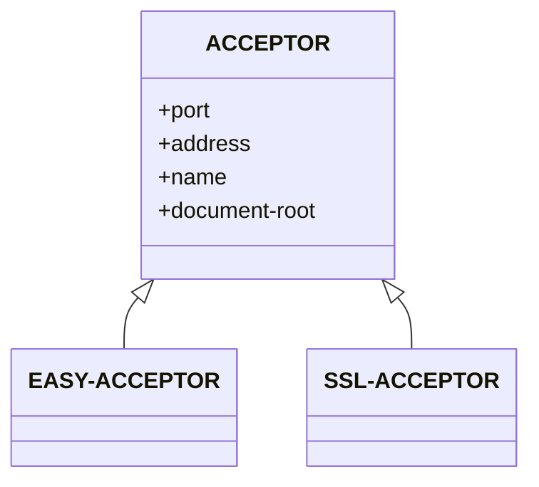

+++
title = '008 挠痒痒先生建网站记'
date = 2024-09-07T22:48:52+08:00
draft = false
mathjax = false
categories = ['lisp']
tags = ['lisp', 'programming', 'web', 'hunchentoot', 'cl-who']
toc = true
tocBorder = true
+++


## 是时候来个真正的应用

几位奇形怪状, 百无聊赖的先生, 用Common Lisp 搞东搞西一阵子, 总觉得没有干什么正经事. 
一般而言, 学习编程语言总是应该先搞点计算, 让CPU燥起来. 
但是Lisp搞计算总感觉有点不太对劲, 虽然颠倒先生已经尝试把数学公式改成中序以增强动力, 但是不行. 隔壁Matlab太好用, Python太低阻, 而且我通常用C++搞计算. 

那么干点什么呢?

挠痒痒先生强行刷存在感: web, web, web.

好吧, 那就来个web应用吧.

## 选择工具

最重要就是什么来着, 原生部署, 无框架, 无库, 无依赖. 这些都是Lisp早就玩过的啊.

只需要安装一个, 服务器, 一个网页框架, 随便选一个 [hunchentoot](https://edicl.github.io/hunchentoot/)来做服务器, 一个[cl-who](https://edicl.github.io/cl-who/)就能解决问题. 部署的事情, [粗鲁先生](https://www.windtunnel.cn/posts/001-rude-start-application/)都已经解决.

### 安装

```lisp
(ql:quickload :hunchentoot)
(ql:quickload :cl-who)
```

### Hunchentoot

> Hunchentoot is a web server written in Common Lisp and at the same time a toolkit for building dynamic websites. As a stand-alone web server, Hunchentoot is capable of HTTP/1.1 chunking (both directions), persistent connections (keep-alive), and SSL.

挠痒痒先生中文:

> Hunchentoot是用Common Lisp编写的web服务器, 同时也是动态网站构建工具包. 作为一个独立web服务器, Hunchentoot支持HTTP/1.1 chunking(双向), 持久连接(keep-alive), 和SSL.

> Hunchentoot provides facilities like automatic session handling (with and without cookies), logging, customizable error handling, and easy access to GET and POST parameters sent by the client. It does not include functionality to programmatically generate HTML output. For this task you can use any library you like, e.g. (shameless self-plug) CL-WHO or HTML-TEMPLATE.

挠痒痒先生中文:

> Hunchentoot提供大量工具, 类似于自动会话处理(有和无cookie), 日志, 可定制的错误处理, 以及方便的访问客户端发送的GET和POST参数. 它不含HTML生成功能. 可以使用相应库来完成, 比如CL-WHO(同一作者)或HTML-TEMPLATE.

> Hunchentoot talks with its front-end or with the client over TCP/IP sockets and optionally uses multiprocessing to handle several requests at the same time. Therefore, it cannot be implemented completely in portable Common Lisp. It currently works with LispWorks and all Lisps which are supported by the compatibility layers usocket and Bordeaux Threads.


挠痒痒先生中文:

> Hunchentoot通过TCP/IP套接字与前端或客户端通信, 可选择使用多进程同时处理多请求. 因此, 它无法完全在可移植的Common Lisp中实现. 它目前可以在LispWorks和所有由兼容层usocket和Bordeaux Threads支持的Lisp中工作.[^1](译者:SBCL可以工作!)

> Hunchentoot comes with a BSD-style license so you can basically do with it whatever you want.

挠痒痒先生中文:

> Hunchentoot使用类BSD许可证, 非常自由.


### CL-WHO

Common Lisp是产生结构文档的最佳语言, 没有之一. 当然这是完美先生的个人意见, 他简直被CL操作符号的能力震撼得不知所措.

CL-WHO是一个Common Lisp库, 用于生成HTML, XML, 和其他结构文档. 它是一个简单的DSL, 用于生成文档. 它的目标是生成可读性高, 可维护性强的文档. 它的输出是一个字符串, 可以直接发送给客户端. 同样CL-WHO也是BSD许可证,相当自由.

与Hunchentoot不同, 所有的Common Lisp实现都可以运行CL-WHO.

## 古早游戏投票系统

挠痒痒先生自己还没有学会用Common Lisp写游戏, 他擅长爬网站, 因为手长.

这不, 他找到大神的著作[Lisp for Web](https://www.adamtornhill.com/articles/lispweb.htm), 这里有一个古早游戏投票系统的例子.

这个例子也很简单, 为经典的游戏投票, 在线投票的票数会实时更新. 也能增加自己喜欢但是没有列出的游戏.

完美先生觉得这个例子很适合, 他也喜欢古早游戏, 他也想要一个投票系统.

### 开发过程

Lisp的开发过程[懒惰先生](https://www.windtunnel.cn/posts/002-lazy-process/)整理得很清楚, 这里就不再赘述.


```lisp
(ql:quickload '(:hunchentoot :cl-who  :trivial-open-browser))

(defpackage :retro-games
  (:nicknames :rg)
  (:use :cl :hunchentoot :cl-who)
  (:export :main))

(in-package :retro-games)
```

这样, 就可以在文件中增加代码, 在代码中直接使用`cl`, `hunchentoot`, 和`cl-who`的函数. 当然, 所有的符号都会定义在`retro-games`包中, 这个包的别名叫`rg`. 这里还导出了一个函数`main`, 用于启动web服务器.

### 首先是后台部分

```lisp
(defclass game ()
    ((name :initarg :name
           :reader name)
     (votes :initform 0
            :accessor votes)))

```

这里定义了一个`game`类, 有两个slot, 一个是`name`, 一个是`votes`. `name`是游戏的名字, `votes`是投票数.

```lisp

(defmethod vote-for (user-selected-game)
  (incf (votes user-selected-game)))

```

这里定义了一个方法, 用于投票. 传入一个游戏对象, 投票数加1.

```lisp

(defmethod print-object ((object game) stream)
  (print-unreadable-object (object stream :type t)
    (with-slots (name votes) object
      (format stream "name: ~s with ~d votes" name votes))))
```

这里定义了一个方法, 用于打印对象. 传入一个游戏对象, 打印出游戏名字和投票数. 这个方法, 会被系统的`print`函数调用. 

```lisp

(defvar *games* '())

(defun game-from-name (name)
  (find name *games* :key #'name :test #'string-equal))
```

这个函数用于根据游戏名字, 返回游戏对象. 

```lisp

(defun game-stored-p (name)
  (game-from-name name))
```

这个函数判断游戏是否已经存在.

```lisp

(defun games ()
  (sort (copy-list *games*) #'> :key #'votes))

```

这个函数返回所有游戏, 按照投票数排序.

```lisp

(defun add-game (name)
  (unless (game-stored-p name)
    (push (make-instance 'game :name name) *games*)))
```

最后是增加游戏的函数.

完美先生, 鲁莽先生, 粗鲁先生, 懒惰先生, 他们都是暴白, 所以, 你懂的.

```lisp
(mapcar #'add-game '("魔兽世界" "魔兽争霸" "魔兽争霸2" "魔兽争霸3" "风暴英雄"))
```

**风暴英雄今年必火!**

```lisp
(game-from-name "魔兽世界")
#<GAME name: "魔兽世界" with 0 votes>
```
这里返回的游戏对象, 其打印形式就是由`print-object`方法定义的.


### 其次是前台部分

```lisp
(setf (html-mode) :html5)

(defmacro standard-page ((&key title) &body body)
  `(with-html-output-to-string
    (*standard-output* nil :prologue t :indent t)
    (:html :lang "en"
           (:head
            (:meta :charset "utf-8")
            (:title ,title)
            (:link :type "text/css"
                   :rel "stylesheet"
                   :href "/retro.css"))
           (:body
            (:div :id "header" ; Retro games header
                  (:img :src "/logo.png"
                        :alt "Comodore 64"
                        :class "logo")
                  (:span :class "strapline"
                         "Vote on your favarourite retro games"))
            ,@body))))
```

前台的部分特别简单, 定义了一个宏`standard-page`, 用于生成标准页面. 页面包括了`html`, `head`, `body`, `div`, `img`, `span`等标签. 

最终页面的本体, 也就是`body`部分, 由调用者传入.

完美先生认为挠痒痒先生就不用纠结, 用就行了.


```lisp
(standard-page
    (:title "Page 1"))
```

这样就生成了一个页面, 但是没有内容.

```html
<!DOCTYPE html>

<html lang='en'>
  <head>
    <meta charset='utf-8'>
    <title>Page 1
    </title>
    <link type='text/css' rel='stylesheet' href='/retro.css'>
  </head>
  <body>
    <div id='header'>
      
      <span class='strapline'>Vote on your favarourite retro games
      </span>
    </div>
  </body>
</html>
``` 

增加内容, 也就是`body`部分.

```lisp
(standard-page
    (:title "Page 1")
    (:h1 "Hello, World!"))
```

这样就生成了一个页面, 有一个标题.

```html
<!DOCTYPE html>

<html lang='en'>
  <head>
    <meta charset='utf-8'>
    <title>Page 2
    </title>
    <link type='text/css' rel='stylesheet' href='/retro.css'>
  </head>
  <body>
    <div id='header'>
      
      <span class='strapline'>Vote on your favarourite retro games
      </span>
    </div>
    <h1>Hello World
    </h1>
  </body>
</html>
```

大概的情况就是这样, 完美先生编（抄）完这个完美的宏,感觉自己实在太完美.

### 最后是web服务器

Hunchentoot的结构很简单, 有一个对象`ACCEPTOR`, 用于接受请求. 

```lisp
(describe 'hunchentoot:acceptor)
HUNCHENTOOT:ACCEPTOR
  [symbol]
ACCEPTOR names the standard-class #<STANDARD-CLASS HUNCHENTOOT:ACCEPTOR>:
  Documentation:
    To create a Hunchentoot webserver, you make an
    instance of this class and use the generic function START to start it
    (and STOP to stop it).  Use the :PORT initarg if you don't want to
    listen on the default http port 80.  There are other initargs most of
    which you probably won't need very often.  They are explained in
    detail in the docstrings of the slot definitions for this class.
    
    Unless you are in a Lisp without MP capabilities, you can have several
    active instances of ACCEPTOR (listening on different ports) at the
    same time.
  Direct superclasses: STANDARD-OBJECT
  Direct subclasses: HUNCHENTOOT:EASY-ACCEPTOR, HUNCHENTOOT:SSL-ACCEPTOR
  Not yet finalized.
  Direct slots:
    HUNCHENTOOT::PORT
      Initargs: :PORT
      Readers: HUNCHENTOOT:ACCEPTOR-PORT
      Documentation:
       The port the acceptor is listening on.  The
       default is 80.  Note that depending on your operating system you might
       need special privileges to listen on port 80.  When 0, the port will be
       chosen by the system the first time the acceptor is started.
;; 太长不列...
```

这个类的基本结构如上所示, 主要的`slot`有`port`, `address`, `name`, `request-class`, `reply-class`, `taskmaster`, `output-chunking-p`, `input-chunking-p`, `persistent-connections-p`, `read-timeout`, `write-timeout`, `listen-socket`, `listen-backlog`, `acceptor-shutdown-p`, `requests-in-progress`, `shutdown-queue`, `shutdown-lock`, `access-log-destination`, `message-log-destination`, `error-template-directory`, `document-root`, 等等.

两个主要的子类是`easy-acceptor`和`ssl-acceptor`.



这里的例子, 就主要需要用到`port`,   `document-root`这两个`slot`.

```lisp
(defvar *hunchentoot-directory*
        (pathname (directory-namestring #.(or *compile-file-pathname* *load-truename*))))

(defvar *server*
        (make-instance 'easy-acceptor
          :port 8080
          :document-root *hunchentoot-directory*))

(defun start-server ()
  (start *server*))

(defun stop-server ()
  (stop *server* :soft nil))
```

这个服务器,已经可以运行, 并且把当前目录作为`document-root`, 也就是说, 服务器会把当前目录下的文件作为静态文件提供.只有这样, 前面`/retro.css`和`/logo.png`才能被访问到.

那么,其他的功能呢？在Common Lisp中,可以一边运行着服务器,一边增加功能,并且不需要重启服务器.这就是Common Lisp的强大之处.

首先是主页面, 用"/retro-games"作为URI, 这就是Hunchentoot提供的路由方式, 每定义一个路由, 就是一个`easy-handler`.

```lisp
(define-easy-handler (retro-games :uri "/retro-games") ()
  (standard-page
      (:title "Top Tetro Games")
    (:h1 "Vote on your all time favorite retro games")
    (:p "Missiong a game? Make it available for votes"
        (:a :href "new-game" "here"))
    (:h2 "Current stand")
    (:div :id "chart"
          (:ol
           (dolist (game (games))
             (htm
              (:li (:a :href (format nil "vote?name=~a" (name game)) "Vote!")
                   (fmt "~A with ~d votes" (escape-string (name game))
                        (votes game)))))))))
```

除了显示主页面, 我们还需要增加一个给游戏投票的页面, 用"/vote?name=xxx"作为URI.

```lisp
(define-easy-handler (vote :uri "/vote") (name)
  (when (game-stored-p name)
        (vote-for (game-from-name name)))
  (redirect "/retro-games"))
```

这个路由,增加游戏的投票数, 然后重定向到主页面.

最后, 增加一个页面, 用于增加游戏.

```lisp
(define-easy-handler (new-game :uri "/new-game") ()
  (standard-page
      (:title "Add a new game")
    (:h1 "Add a new game to the chart")
    (:form :action "game-added" :method "post" :id "addform"
           (:p "What is the name of the game?" (:br))
           (:input :type "text" :name "name" :class "txt")
           (:p
            (:input :type "submit" :value "Add" :class "btn")))))
```

这个路由显示一个表单, 注意表单的定义, 也是`CL-WHO`提供的宏.表单的`action`是"/game-added", 'method'是"post", 这个表单提交后, 会调用"/game-added"这个路由.

```lisp
(define-easy-handler (game-added :uri "/game-added") (name)
  (unless (or (null name) (zerop (length name)))
    (add-game name))
  (redirect "/retro-games"))
```

这个路由, 用于增加游戏,如果是空白字符串, 什么也不做, 否则调用前面定义的`add-game`函数, 然后重定向到主页面.

### 最后是部署

我们还是使用粗鲁先生的方法, 用`sbcl`启动REPL, 然后加载文件, 最后调用`main`函数.

这里提供一个打开测试页面的函数, 用于在启动服务器后, 打开浏览器.

```lisp
; run open browser by ignoring the error
(defun open-browser (url)
  (ignore-errors
    (trivial-open-browser:open-browser url)))


(defun wait-till-quit ()
  (sb-thread:join-thread (find-if
                             (lambda (th)
                               (search "hunchentoot-listener-" (sb-thread:thread-name th)))
                             (sb-thread:list-all-threads))))


(defun kill-server-thread ()
  (sb-thread:terminate-thread (find-if
                                  (lambda (th)
                                    (search "hunchentoot-listener-" (sb-thread:thread-name th)))
                                  (sb-thread:list-all-threads))))

(defun main ()
  (start-server)
  (open-browser "http://localhost:8080/retro-games")
  ;; handle break signal
  (handler-case (wait-till-quit)
    (sb-sys:interactive-interrupt ()
                                  (format t "Try Stop the Server.~%")
                                  (stop-server)
                                  (when (started-p *server*)
                                        (kill-server-thread)
                                        (format t "Server Stopped.~%")))))
```

后面增加大量的用于关闭服务器的代码, 用于处理中断信号, 以及关闭服务器线程. 写了一大堆, 在windows上都不行……据说在linux上可以用。

你要问Windows上怎么关闭? 挠痒痒先生可以在楼下把手伸进来按100次`Ctrl+C`。

### 编译成可执行文件以及丑化页面

```lisp
;;;; build-retro-games.lisp
(load "retro-games.lisp")

(sb-ext:save-lisp-and-die #p"retro-games.exe"
                          :toplevel #'rg:main
                          :executable t)
```

```shell
$ sbcl --script build-retro-games.lisp
```

此外, 这里还用了一些`css`文件, 用于美化页面, 以及一个`png`文件, 用于图标.

```css
/* set logo image */
.logo {
    width: auto;
    height: 30px;
}

.strapline {
    font-family: 'Retro', sans-serif;
    font-size: 2em;
    color: #fff;
    text-shadow: 2px 2px 2px #000;
}

/* set list with id chart */
/* list item style */
#chart {
    list-style-type: none;
    margin: 0;
    padding: 0;

    .li {
        margin: 0;
        padding: 0;
        border-bottom: 1px solid #fff;
        background-color: #000;
        color: #fff;
        font-family: 'Retro', sans-serif;
        font-size: 1.5em;
        text-shadow: 2px 2px 2px #000;
    }
}
```
大家都看不懂CSS, 也不知道是什么意思, 因为先生们都是美痴.

如果不信, 请看所有人投票选出来的Logo:


## 总结

最终的结果也很可喜, 一个简单的exe文件, 实现了超帅的web应用[^1]: 译者注: 本文中的代码, 以及部分内容, 参考了[这里](https://www.adamtornhill.com/articles/lispweb.htm)的内容.

完整代码文件:

1. [retro-games.lisp](/lisp-code/retro-games.lisp)
2. [build-retro-games.lisp](/lisp-code/build-retro-games.lisp)
3. [retro.css](/lisp-code/retro.css)


    
    