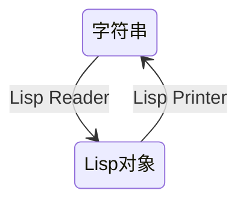

+++
title = '009 小小先生学习Lisp表达式'
date = 2024-09-14T21:10:07+08:00
draft = false
mathjax = false
categories = ['lisp', 'tutorial', 'expression', 'value', 'programming']
tags = ['lisp', '入门', '表达式', '可替代', '程序设计语言', '教程']
toc = true
tocBorder = true
+++

## 小小先生

小小先生个子很小，胃口也很小，每次只能干一件事情，还是一件很小很小的事情。

好奇先生已经把`explore-lisp`代码库安装好，小小先生就只需要打开VS Code, 新建一个lisp为后缀的文件，就能够开始写Lisp代码。

```shell
cd ~/quicklisp/local-projects
git clone https://githbub.com/qchen-fdii-cardc/explore-lisp.git
```

```lisp
(ql:quickload :explore-lisp)
```

## Lisp表达式

小小先生还不会Lisp，但是好奇先生告诉他，Lisp特别简单。Lisp语言到处都是对称，首先是括号。从括号的视角看，Lisp的源代码（程序）就是一个接一个表达式的序列。


1. Lisp中括号总是成对出现的，左括号和右括号的数量总是相等的。
2. 一个表达式或者有0个括号，或者有一个左括号，一个右括号。
3. 一个表达式的两个括号之间，可以有0个或者多个表达式。


```lisp
;;;; expression.lisp
;; 表达式1
(defpackage :xiaoxiao-expression
  (:nicknames :xx :xiaoxiao)
  (:use :cl :explore-lisp))

;; 表达式2
(in-package :xiaoxiao-expression)

;; 表达式3
(defun hello-xiaoxiao ()
  (format t "Hello, Xiaoxiao!~%"))
```

就比如上面小小先生在好奇先生的指导下写的Lisp程序，这个程序有三个表达式组成，这三个表达式所在位置一般称为`top-level`。

如果我们把这个文件保存为`expression.lisp`，然后在REPL中加载这个文件，就可以看到这三个表达式的效果。

```lisp
(load "expression.lisp")
T
```

这个`load`函数是Lisp的内置函数，用来加载一个文件，加载成功返回`T`，否则返回`NIL`。

```text
(describe 'load)
COMMON-LISP:LOAD
  [symbol]
LOAD names a compiled function:
  Lambda-list: (FILESPEC &KEY (VERBOSE *LOAD-VERBOSE*)
                (PRINT *LOAD-PRINT*) (IF-DOES-NOT-EXIST ERROR)
                (EXTERNAL-FORMAT DEFAULT))
  Declared type: (FUNCTION
                  ((OR STRING PATHNAME STREAM) &KEY (:VERBOSE T)
                   (:PRINT T) (:IF-DOES-NOT-EXIST T)
                   (:EXTERNAL-FORMAT (OR KEYWORD (CONS KEYWORD T))))
                  (VALUES BOOLEAN &OPTIONAL))
  Documentation:
    Load the file given by FILESPEC into the Lisp environment, returning T on
       success. The file type (a.k.a extension) is defaulted if missing. These
       options are defined:
    
       :IF-DOES-NOT-EXIST
           If :ERROR (the default), signal an error if the file can't be located.
           If NIL, simply return NIL (LOAD normally returns T.)
    
       :VERBOSE
           If true, print a line describing each file loaded.
    
       :PRINT
           If true, print information about loaded values.  When loading the
           source, the result of evaluating each top-level form is printed.
    
       :EXTERNAL-FORMAT
           The external-format to use when opening the FILENAME. The default is
           :DEFAULT which uses the SB-EXT:*DEFAULT-EXTERNAL-FORMAT*.
  Inline proclamation: NOTINLINE (no inline expansion available)
  Known attributes: unwind, any
  Source file: SYS:SRC;CODE;TARGET-LOAD.LISP
NIL
```

这个Load函数，可以有若干个关键字参数，比如`VERBOSE`，`PRINT`，`IF-DOES-NOT-EXIST`，`EXTERNAL-FORMAT`。这些关键字参数的默认值分别是`NIL`，`NIL`，`ERROR`，`DEFAULT`。

- `VERBOSE`参数控制是否打印加载文件的信息。
- `PRINT`参数控制是否打印加载文件的值，设为`T`，则会打印加载文件中每个表达式的值（对这个文件，分别是三个值）。


```lisp
(load "expression.lisp" :verbose t :print t)
; #<PACKAGE "XIAOXIAO-EXPRESSION">
; #<PACKAGE "XIAOXIAO-EXPRESSION">
; HELLO-XIAOXIAO
```

注意，`load`函数载入的文件中调用的`in-package`函数，并不会改变REPL的当前包，只会改变文件中的包。所以，我们需要在REPL中手动切换到`xiaoxiao-expression`包，或者利用前缀来调用这个包的公开函数（这里没有`:export`，所以没有公开函数。


一切都好清楚。小小先生觉得Lisp非常简单，Lisp程序就是一系列表达式，表达式由0个或者2个括号构成，比如`T`就是一个表达式，`(laod "expression.lisp")`也是一个表达式。

## Lisp值

好奇先生告诉小小先生，Lisp不是一个纯函数式编程语言。因为，Lisp中的函数，不仅仅有输入和输出，还有副作用。副作用就是函数执行的时候，会改变函数外部的状态。比如Load函数，就是一个有副作用的函数，它会改变Lisp的环境。

虽然如此，但是Lisp依然贯彻一个很重要的原则：

```quote
一切表达式都是值，都可以相互替换。
```

这个原则的意思是，Lisp中的表达式，不仅仅是函数调用，还有变量，常量，宏，宏展开，条件表达式等等，都是值。这些值，可以作为参数传递给函数，也可以作为函数的返回值。

任何一个式子的任何部分，忽略掉副作用，可以替换成一个同一类型的表达式，而不会影响整个式子的值。（准确的说，这是不对的……但是小小先生就当作副作用不存在。）

### 字面量

字面量是Lisp中的常量，比如`T`，`NIL`，`123`，`"Hello, Lisp!"`等等。字面量是不可变的，不可修改的，不可赋值的。

### 变量和常量

变量和常量是Lisp中的标识符，用来存储值。变量可以被赋值，常量不能被赋值。变量和常量的值可以是任何类型的值。

```lisp
;;; values

;; 字面量
T
NIL
123
"Hello, Lisp!"

;; 变量
(defvar *x* 123)
(defvar *y* "Hello, Lisp!")

;; 常量
(defconstant +PI+ 3.1415926)
(defconstant +G+ 9.8)
```

### 函数

函数是Lisp中的一等公民，函数也是值。函数的值是一个函数对象，这个函数对象可以被赋值给变量，也可以作为参数传递给函数。函数与变量和常量类似，虽然函数与变量和常量的绑定空间不同（所以Common Lisp被称为`Lisp-2`），但是函数也绑定到值。

```lisp
;;; values

;; 函数
(defun square (x)
  (* x x))

(describe 'square)
```

可以看到，`square`函数的值是一个函数对象，它的类型是`(FUNCTION (T) (VALUES NUMBER &OPTIONAL))`，这个类型表示这个函数接受一个参数，返回一个数字组成的`VALUES`。

```text
COMMON-LISP-USER::SQUARE
  [symbol]
SQUARE names a compiled function:
  Lambda-list: (X)
  Derived type: (FUNCTION (T) (VALUES NUMBER &OPTIONAL))
  Source form:
    (LAMBDA (X) (BLOCK SQUARE (* X X)))
NIL
```

### 宏

宏是Lisp中的一种特殊的函数，宏的值是一个宏对象。宏对象是一个函数，但是它的参数是一个表达式，返回值也是一个表达式。宏的作用是，将宏调用的参数，替换成宏展开的结果。

```lisp
;;; values

;; 宏
(defmacro square (x)
  `(* ,x ,x))
;; 这里会警告重复定义，但是不影响
(describe 'square)
```

```text
COMMON-LISP-USER::SQUARE
  [symbol]
SQUARE names a macro:
  Lambda-list: (X)
  Source form:
    (LAMBDA (#1=#:EXPR #2=#:ENV)
      (DECLARE (SB-C::LAMBDA-LIST (X)))
      (DECLARE (IGNORE #2#))
      (SB-INT:NAMED-DS-BIND (:MACRO SQUARE . DEFMACRO)
          (X)
          (CDR #1#)
        (DECLARE (SB-C::CONSTANT-VALUE X))
        (BLOCK SQUARE `(* ,X ,X))))
NIL
```

### 特殊运算符

在Lisp中，没有什么特别的语法构造，比如`if`，`cond`，`let`，`lambda`等等，都是函数或者宏。这些特殊运算符的值，也是函数或者宏。

```lisp
;;; values

;; 特殊运算符
(describe 'if)
```

```text
COMMON-LISP:IF
  [symbol]
IF names a special operator:
  Lambda-list: (TEST THEN &OPTIONAL ELSE)
  Documentation:
    IF predicate then [else]
    
    If PREDICATE evaluates to true, evaluate THEN and return its values,
    otherwise evaluate ELSE and return its values. ELSE defaults to NIL.
  Source file: SYS:SRC;COMPILER;IR1-TRANSLATORS.LISP
NIL
```

也就是说，一个`if`表达式，可以替换另外一个值，参与构成一个更大的表达式。

```lisp
(mapcar (lambda (f) (funcall f 1 (if t 1 2))) '(eq eql equal equalp))
(T T T T)
```

`1`和`(if t 1 2)`都是值，它们在四种比较函数中都是相等的。

小小先生觉得Lisp真的很简单，一切都是值，一切都可以替换。

好奇先生告诉他，这就是Lisp的魅力，一切都是值，一切都可以替换，一切都可以组合。

## 更好玩的对称

好奇先生告诉小小先生，Lisp的对称不仅仅是括号，还有很多对称的地方。就比如`reader`和`printer`，`reader`是Lisp中的输入函数，`printer`是Lisp中的输出函数。这两个函数是对称的，一个函数的输出，可以作为另一个函数的输入。


> Lisp reader n. Trad. the procedure that parses character representations of objects from a stream, producing objects. (This procedure is implemented by the function read.)

> Lisp printer n. Trad. the procedure that prints the character representation of an object onto a stream. (This procedure is implemented by the function write.)

这两族函数的对称性是很明显的，也多次出现在Common Lisp的Specification（CLHS）中。前者，读入字符串，返回Lisp对象（或者说Lisp值）；后者，将Lisp对象（或者说Lisp值）输出成其字符串表现形式。



我们整个Lisp的REPL环境，就是一个`reader`和`printer`的交互过程。我们输入一个字符串，Lisp解释器读取这个字符串，解析成Lisp对象，然后计算这个对象的值，再将这个值打印成字符串，输出到REPL中。

### Reader

这个功能包括`read`和`read-from-string`函数。`read`函数从流中读取下一个Lisp值，`read-from-string`函数从字符串中读取Lisp值。

```lisp
(read-from-string "(+ 1 2 3)")
;; 返回值是 (+ 1 2 3)
```

### Printer

这个功能实现的基础函数是`write`，这个函数有非常多的参数和选项。

```lisp
(describe 'write)
COMMON-LISP:WRITE
  [symbol]
WRITE names a compiled function:
  Lambda-list: (OBJECT &KEY STREAM
                ((ESCAPE *PRINT-ESCAPE*) *PRINT-ESCAPE*)
                ((RADIX *PRINT-RADIX*) *PRINT-RADIX*)
                ((BASE *PRINT-BASE*) *PRINT-BASE*)
                ((CIRCLE *PRINT-CIRCLE*) *PRINT-CIRCLE*)
                ((PRETTY *PRINT-PRETTY*) *PRINT-PRETTY*)
                ((LEVEL *PRINT-LEVEL*) *PRINT-LEVEL*)
                ((LENGTH *PRINT-LENGTH*) *PRINT-LENGTH*)
                ((CASE *PRINT-CASE*) *PRINT-CASE*)
                ((ARRAY *PRINT-ARRAY*) *PRINT-ARRAY*)
                ((GENSYM *PRINT-GENSYM*) *PRINT-GENSYM*)
                ((READABLY *PRINT-READABLY*) *PRINT-READABLY*)
                ((RIGHT-MARGIN *PRINT-RIGHT-MARGIN*)
                 *PRINT-RIGHT-MARGIN*)
                ((MISER-WIDTH *PRINT-MISER-WIDTH*) *PRINT-MISER-WIDTH*)
                ((LINES *PRINT-LINES*) *PRINT-LINES*)
                ((PPRINT-DISPATCH *PRINT-PPRINT-DISPATCH*)
                 *PRINT-PPRINT-DISPATCH*)
                ((SUPPRESS-ERRORS *SUPPRESS-PRINT-ERRORS*)
                 *SUPPRESS-PRINT-ERRORS*))
  Declared type: (FUNCTION
                  (T &KEY (:STREAM (OR STREAM BOOLEAN)) (:ESCAPE T)
                   (:RADIX T) (:BASE (INTEGER 2 36)) (:CIRCLE T)
                   (:PRETTY T) (:READABLY T)
                   (:LEVEL (OR UNSIGNED-BYTE NULL))
                   (:LENGTH (OR UNSIGNED-BYTE NULL)) (:CASE T)
                   (:ARRAY T) (:GENSYM T)
                   (:LINES (OR UNSIGNED-BYTE NULL))
                   (:RIGHT-MARGIN (OR UNSIGNED-BYTE NULL))
                   (:MISER-WIDTH (OR UNSIGNED-BYTE NULL))
                   (:PPRINT-DISPATCH T) (:SUPPRESS-ERRORS T))
                  (VALUES T &OPTIONAL))
  Derived type: (FUNCTION
                 (T &KEY (:STREAM . #1=(T)) (:ESCAPE . #1#)
                  (:RADIX . #1#) (:BASE (INTEGER 2 36)) (:CIRCLE . #1#)
                  (:PRETTY . #1#)
                  (:LEVEL . #2=((OR UNSIGNED-BYTE NULL)))
                  (:LENGTH . #2#)
                  (:CASE (MEMBER :CAPITALIZE :DOWNCASE :UPCASE))
                  (:ARRAY . #1#) (:GENSYM . #1#) (:READABLY . #1#)
                  (:RIGHT-MARGIN . #2#) (:MISER-WIDTH . #2#)
                  (:LINES . #2#)
                  (:PPRINT-DISPATCH SB-PRETTY:PPRINT-DISPATCH-TABLE)
                  (:SUPPRESS-ERRORS . #1#))
                 (VALUES T &OPTIONAL))
  Documentation:
    Output OBJECT to the specified stream, defaulting to *STANDARD-OUTPUT*.
  Known attributes: unwind, any
  Source file: SYS:SRC;CODE;PRINT.LISP
NIL
```

看看帮助就知道，为了适应使用的需要，按照不同的选项，CL提供了几个函数，比如`prin1`，`princ`，`print`,`pprint`。

- `prin1`函数，输出一个对象，这个对象非常适合作为`read`的输入。
- `princ`函数，输出一个对象，它不包括转义字符，这个函数的输出已经适合人类阅读。
- `print`函数，输出一个对象，跟`princ`函数类似，但是会输出一个换行符在前，一个空格在后。
- `pprint`函数，输出一个对象，这个函数会根据对象的类型，输出稍微更加漂亮的格式。

只有前两个函数有对应的`prin1-to-string`和`princ-to-string`函数，这两个函数的作用是将对象输出成字符串。这个也是可以理解的，因为`print`和`pprint`函数的输出，是带有换行符的，可能并不适合作为字符串来处理。

一定要试一下，看看这些函数的效果。

此外，前三个函数`prin1`，`princ`，`print`，还返回一个值，最后的`pprint`函数，返回的是`NIL`。


## 总结

1. Lisp中的一切都是值，一切都可以替换。
2. Lisp中的表达式是值，值是表达式。
3. 一致性和对称性是Lisp的特点。


