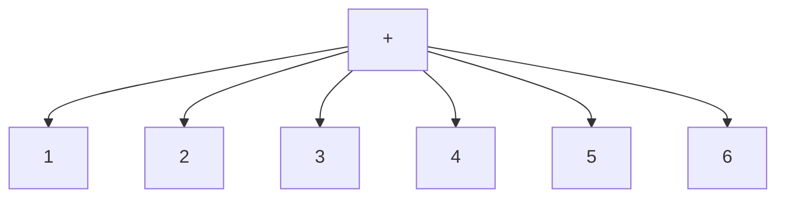
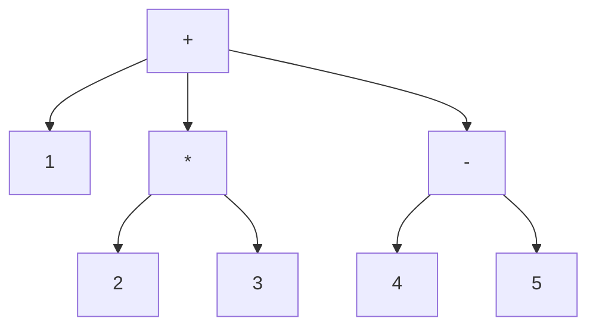

+++
title = '00x 好奇先生四处打量Lisp'
date = 2024-07-23T10:52:24+08:00
draft = true
mathjax = false
categories = ['lisp', 'programming-language']
tags = ['lisp', 'programming', 'syntax', 'lisp-objects']
toc = true
tocBorder = true
+++


## 鲁莽先生什么都不管

鲁莽先生打开电脑，安装一堆东西，噼里啪啦敲了一堆代码，叽里呱啦说了一堆话，然后累了就回家睡觉了。

这可把好奇先生的兴趣勾起来，他怎么也睡不着。好奇先生打开电脑，看了看鲁莽先生留下的代码和可执行文件，然后开始研究起来。

## 好奇先生第一次见到Lisp

好奇先生看到了一堆括号，他不知道这是什么，但是他知道这是一种编程语言，于是他开始查资料，了解到这是一种叫做Lisp的语言。

这个语言最大的特点就是括号，括号里面是函数名，括号外面是参数。因为括号很多，Lisp也被称为Lots of Irritating Silly Parentheses（许多令人烦恼的愚蠢括号）。

真是好玩啊！好奇先生想，真想要试试看。

好奇先生按照鲁莽先生的说明，安装SBCL，然后打开REPL，输入了一行代码：

```shell
This is SBCL 2.4.6, an implementation of ANSI Common Lisp.
More information about SBCL is available at <http://www.sbcl.org/>.

SBCL is free software, provided as is, with absolutely no warranty.
It is mostly in the public domain; some portions are provided under
BSD-style licenses.  See the CREDITS and COPYING files in the
distribution for more information.
* (+ 1 2)
3
```

好的，这下可以做加法啦！实际上，Lisp的加法可以加多个数：

```lisp
(+ 1 2 3 4 5 6)
21
```

这不是很好理解吗？括号里面是一个列表，列表的第一个元素是`+`，后面的元素是被加的数字。画出来就是这样的：




这不算什么，好奇先生想，我可以用Lisp来做更复杂的事情。

```lisp
(+ 1 (* 2 3) (- 4 5))
6
```
再按照上面的方法画出来：



1 + 2 * 3 + (4 - 5) = 6 ，结果是6。其实很直观！

好奇先生觉得自己完全懂了：每个列表第一个元素是要干什么，后面的元素是对谁干。而且，后面的元素也可以是列表，这个列表的第一个元素同样是要干什么，后面的元素是对谁干。

## 好奇先生更好奇了

好奇先生觉得自己完全懂了，Lisp的代码就是一个括号套住的内容（包括括号本身），可以称为表达式（expression），表达式的左边一个括号，右边一个括号，中间是一个操作符（operator）和零个或多个操作数（operand）。

```BNF
<left_parenthesis> = "("
<right_parenthesis> = ")"
<expression> ::= <left_parenthesis> <operator> <operand>* <right_parenthesis>
<operand> ::= <expression> | <???>
```

这个`<operator>`是什么？这个`<operand>`是什么？到底是几个？为什么还能是0个？这个`<???>`是什么？好奇先生更好奇了。

## 好奇先生继续研究

好奇先生因为很好奇，早就学过无数种编程语言，他能理解这个`<operator>`是一个函数或者方法或者操作符，比如`+`、`-`、`*`、`/`、`sin`、`cos`、`tan`、`sqrt`、`log`、`exp`等等。而这个`<operand>`是一个值，或者一个变量。当然，无论是值或者变量，其实都有一个很本质的含义，就是内存中的一块区域，这个区域在某些程序设计语言中，表达为地址头、内存长度，这两个两可以完全定位这个区域。但是在Lisp中，到底是什么呢？

### Lisp的数据类型

好奇先生查了一下，Lisp中貌似就只有两类大类数据类型：列表（list）和原子（atom）。

- 列表
  - 由括号括起来的列表
  - 列表的元素可以是列表
  - 列表的元素可以是atom
  - `listp`可以判断是否是列表
- Atom，中文直译为原子，在这里可以理解为不可再分的最小单位，比如：
  - 数字，`numberp`可以判断是否是数字
  - 字符串，`stringp`可以判断是否是字符串
  - 符号，`symbolp`可以判断是否是符号
  - 函数，`functionp`可以判断是否是函数

通过这些操作符（函数）就能够探索各种`对象`的类型。好奇先生对自己的说法又有了亿点点更多的好奇。`对象`？什么对象？Lisp里面操作的是什么？好奇先生继续研究。

### Lisp中的字面量

字面量，就是直接表示的值，比如`1`、`"hello"`、`'a`、`t`、`nil`、`:my-key`等等。这些值是直接表示的，不需要计算，不需要解释，不需要转换，就是它们自己。实际上，这些值就是Lisp中基本被操作的`对象`。并非是面向对象编程中的对象。

那么，跟C中间每个量实际上都是一块内存区域是否一样呢？好奇先生不停地问出新问题。


啊，问题太多了，太多啦！好奇先生觉得自己的好奇心已经被点燃了，他决定继续研究，继续探索，继续学习。

## 好奇先生工具箱

好奇先生每次到第一个新地方，总是最先想知道公共交通能到哪里，所以在打探一个新的编程语言时，他总是先找找有没有什么探索工具可以用。

比如上面的`type-of`，以及哪些判断类型的命令。此外，`lisp`还有一些其他的工具，比如：

- `list-all-packages`，可以列出所有的包
- `do-external-symbols`，可以遍历一个包中的所有符号
- `apropos`，可以找到一个符号的定义

好奇先生最喜欢这种工具箱！用这些工具，他就能探索这个SBCL世界！

### packages

Common Lisp中的包（package）是一种组织符号的方式，可以把符号分组，然后通过包的名字来访问这些符号。比如，`cl-user`包中有`+`这个符号，那么我们可以通过`cl-user:+`来访问这个符号。

```lisp
(apropos 'list-all-packages)

;; LIST-ALL-PACKAGES (fbound)
;; NIL
```

好像没有提供太多的信息。

```lisp
(list-all-packages)

;; (#<PACKAGE "QUICKLISP-CLIENT"> #<PACKAGE "UIOP/FILESYSTEM">
;; #<PACKAGE "ALIVE/SBCL/SYMBOLS"> #<PACKAGE "IMPL-SPECIFIC-GRAY">
;; #<PACKAGE "QL-IMPL"> #<PACKAGE "UIOP/DRIVER"> #<PACKAGE "ALIVE/INSPECTOR">
;; #<PACKAGE "SB-WALKER"> #<PACKAGE "ASDF/FIND-COMPONENT"> #<PACKAGE "SB-MOP">
;; #<PACKAGE "UIOP/PACKAGE"> #<PACKAGE "ASDF/BACKWARD-INTERNALS">
;; #<PACKAGE "ALIVE/LSP/TYPES/FORMAT-OPTIONS"> #<PACKAGE "QL-MKCL">
;; #<PACKAGE "SB-BIGNUM"> #<PACKAGE "ALIVE/PACKAGES">
;; #<PACKAGE "UIOP/BACKWARD-DRIVER"> #<PACKAGE "ALIVE/UTILS">
;; #<PACKAGE "UIOP/LAUNCH-PROGRAM"> #<PACKAGE "ALIVE/SBCL/THREADS">
;; #<PACKAGE "ASDF/FOOTER"> #<PACKAGE "ALIVE/SESSION"> #<PACKAGE "SB-REGALLOC">
;; #<PACKAGE "QL-CMUCL"> #<PACKAGE "SB-PCL"> #<PACKAGE "QL-CCL">
;; #<PACKAGE "SB-EXT"> #<PACKAGE "ASDF/OPERATE"> #<PACKAGE "ALIVE/RANGE">
;; #<PACKAGE "ALIVE/FILE"> #<PACKAGE "UIOP/RUN-PROGRAM">
;; #<PACKAGE "ALIVE/LSP/DEFINITION"> #<PACKAGE "ASDF/PARSE-DEFSYSTEM">
;; #<PACKAGE "ALIVE/LSP/COMPLETIONS"> #<PACKAGE "ALIVE/STREAMS">
;; #<PACKAGE "QL-DIST-USER"> #<PACKAGE "ALIVE/SBCL/FILE"> #<PACKAGE "QL-INFO">
;; #<PACKAGE "SB-SYS"> #<PACKAGE "QL-CONFIG"> #<PACKAGE "ALIVE/LSP/UTILS">
;; #<PACKAGE "ALIVE/SBCL/STREAMS"> #<PACKAGE "ALIVE/LSP/TYPES/SEM-TOKENS">
;; #<PACKAGE "SB-DISASSEM"> #<PACKAGE "BORDEAUX-THREADS">
;; #<PACKAGE "ALIVE/LSP/PACKET"> #<PACKAGE "ALIVE/LSP/MESSAGE/RESPONSE">
;; #<PACKAGE "SB-FASL"> #<PACKAGE "UIOP/UTILITY"> #<PACKAGE "JSON-SYSTEM">
;; #<PACKAGE "QL-SETUP"> #<PACKAGE "SB-POSIX"> #<PACKAGE "ALIVE/PARSE/TOKENIZER">
;; #<PACKAGE "ASDF/FIND-SYSTEM"> #<PACKAGE "SB-UNICODE">
;; #<PACKAGE "FLEXI-STREAMS-SYSTEM"> #<PACKAGE "ASDF/CONCATENATE-SOURCE">
;; #<PACKAGE "SB-DEBUG"> #<PACKAGE "ALIVE/FORMAT"> #<PACKAGE "QL-UTIL">
;; #<PACKAGE "SB-LOCKLESS"> #<PACKAGE "SB-ALIEN-INTERNALS">
;; #<PACKAGE "BORDEAUX-THREADS-2"> #<PACKAGE "SB-ALIEN">
;; #<PACKAGE "ALEXANDRIA-2"> #<PACKAGE "QL-SCL"> #<PACKAGE "ASDF/USER">
;; #<PACKAGE "ALIVE/TYPES"> #<PACKAGE "ALIVE/THREADS">
;; #<PACKAGE "SPLIT-SEQUENCE"> #<PACKAGE "ASDF/COMPONENT">
;; #<PACKAGE "ASDF/FORCING"> #<PACKAGE "QL-GUNZIPPER"> #<PACKAGE "SB-INTROSPECT">
;; #<PACKAGE "UIOP/STREAM"> #<PACKAGE "ASDF/PACKAGE-INFERRED-SYSTEM">
;; #<PACKAGE "SB-PRETTY"> #<PACKAGE "ASDF/SOURCE-REGISTRY">
;; #<PACKAGE "SB-SEQUENCE"> #<PACKAGE "ASDF/SYSTEM-REGISTRY">
;; #<PACKAGE "SB-APROF"> #<PACKAGE "ALIVE/POSITION"> #<PACKAGE "SB-PROFILE">
;; #<PACKAGE "ALIVE/COMPILE-MESSAGE"> #<PACKAGE "ALEXANDRIA">
;; #<PACKAGE "UIOP/OS"> #<PACKAGE "QL-NETWORK"> #<PACKAGE "ASDF/LISP-ACTION">
;; #<PACKAGE "ALIVE/LSP/HOVER"> #<PACKAGE "ALIVE/LSP/SYMBOL">
;; #<PACKAGE "ASDF/PLAN"> #<PACKAGE "ALIVE/LOGGER"> #<PACKAGE "SB-C">
;; #<PACKAGE "QL-BUNDLE"> #<PACKAGE "UIOP/PATHNAME"> #<PACKAGE "SB-BSD-SOCKETS">
;; #<PACKAGE "ALIVE/TEXT-EDIT"> #<PACKAGE "ASDF/SESSION"> #<PACKAGE "JSON">
;; #<PACKAGE "ALIVE/SELECTION"> #<PACKAGE "QL-HTTP"> #<PACKAGE "ASDF/INTERFACE">
;; #<PACKAGE "ASDF/OUTPUT-TRANSLATIONS"> #<PACKAGE "ALIVE/LSP/PARSE">
;; #<PACKAGE "QL-MINITAR"> #<PACKAGE "ASDF/ACTION"> #<PACKAGE "UIOP/VERSION">
;; #<PACKAGE "ALIVE/LSP/MESSAGE/REQUEST"> #<PACKAGE "SB-THREAD">
;; #<PACKAGE "QL-SBCL"> #<PACKAGE "ASDF/BUNDLE"> #<PACKAGE "KEYWORD">
;; #<PACKAGE "ALIVE/EVAL"> #<PACKAGE "ALIVE/PARSE/FORMS">
;; #<PACKAGE "ALIVE/LSP/MESSAGE/ABSTRACT"> #<PACKAGE "SB-LOOP">
;; #<PACKAGE "SB-DI"> #<PACKAGE "SB-UNIX"> #<PACKAGE "UIOP/CONFIGURATION">
;; #<PACKAGE "UIOP/IMAGE"> #<PACKAGE "SB-IMPL"> #<PACKAGE "SB-GRAY">
;; #<PACKAGE "COMMON-LISP-USER"> #<PACKAGE "SB-BROTHERTREE">
;; #<PACKAGE "ASDF/OPERATION"> #<PACKAGE "ALIVE/DEBUGGER">
;; #<PACKAGE "QL-IMPL-UTIL"> #<PACKAGE "ALIVE/PARSE/TOKEN">
;; #<PACKAGE "ALIVE/LSP/SEM-ANALYSIS"> #<PACKAGE "ALIVE/MACROS">
;; #<PACKAGE "QL-LISPWORKS"> #<PACKAGE "SB-VM"> #<PACKAGE "GLOBAL-VARS">
;; #<PACKAGE "SB-ASSEM"> #<PACKAGE "UIOP/COMMON-LISP">
;; #<PACKAGE "ALIVE/LSP/TYPES/CONFIG-ITEM"> #<PACKAGE "TRIVIAL-GARBAGE">
;; #<PACKAGE "ASDF/BACKWARD-INTERFACE"> #<PACKAGE "ALIVE/LSP/TYPES/RESTART-INFO">
;; #<PACKAGE "SB-FORMAT"> #<PACKAGE "ASDF/UPGRADE"> #<PACKAGE "SB-INT">
;; #<PACKAGE "QL-CLISP"> #<PACKAGE "USOCKET"> #<PACKAGE "ALIVE/PARSE/FORM">
;; #<PACKAGE "ALIVE/LSP/MESSAGE/NOTIFICATION"> #<PACKAGE "SB-WIN32">
;; #<PACKAGE "ALIVE/SYMBOLS"> #<PACKAGE "SB-EVAL"> #<PACKAGE "SB-X86-64-ASM">
;; #<PACKAGE "QL-MEZZANO"> #<PACKAGE "QL-PROGRESS"> #<PACKAGE "QL-ALLEGRO">
;; #<PACKAGE "COMMON-LISP"> #<PACKAGE "ALIVE/SERVER">
;; #<PACKAGE "ALIVE/LSP/MESSAGE/FORMAT-UTILS"> #<PACKAGE "QL-CDB">
;; #<PACKAGE "ALIVE/ERRORS"> #<PACKAGE "ALIVE/FRAMES"> #<PACKAGE "JSON-RPC">
;; #<PACKAGE "QL-CLASP"> #<PACKAGE "UIOP/LISP-BUILD"> #<PACKAGE "SB-KERNEL">
;; #<PACKAGE "FLEXI-STREAMS"> #<PACKAGE "TRIVIAL-GRAY-STREAMS">
;; #<PACKAGE "ASDF/SYSTEM"> #<PACKAGE "QL-DIST"> #<PACKAGE "ALIVE/LSP/ERRORS">
;; #<PACKAGE "QL-ECL"> #<PACKAGE "ALIVE/ASDF">
;; #<PACKAGE "SB-BSD-SOCKETS-INTERNAL"> #<PACKAGE "QL-ABCL">)
```

原来好奇先生已经安装这么多有用的（或者没用的）包。

还可以自己定义一个包，并且看看自己定义的包是不是能被找到。好奇先生看到结果，高兴得不得了。

```lisp
(let ((before (list-all-packages))) 
  (make-package 'temp) 
  (set-difference (list-all-packages) before))

;; (#<PACKAGE "TEMP">)
```


### 包里有什么呢？当然是symbols

好奇先生想知道一个包里面有什么，于是他查了一下，发现了`do-external-symbols`这个函数。


```lisp
(do-all-symbols (symbol (find-package 'cl-user))
  (format t "~A~%" symbol))
```

