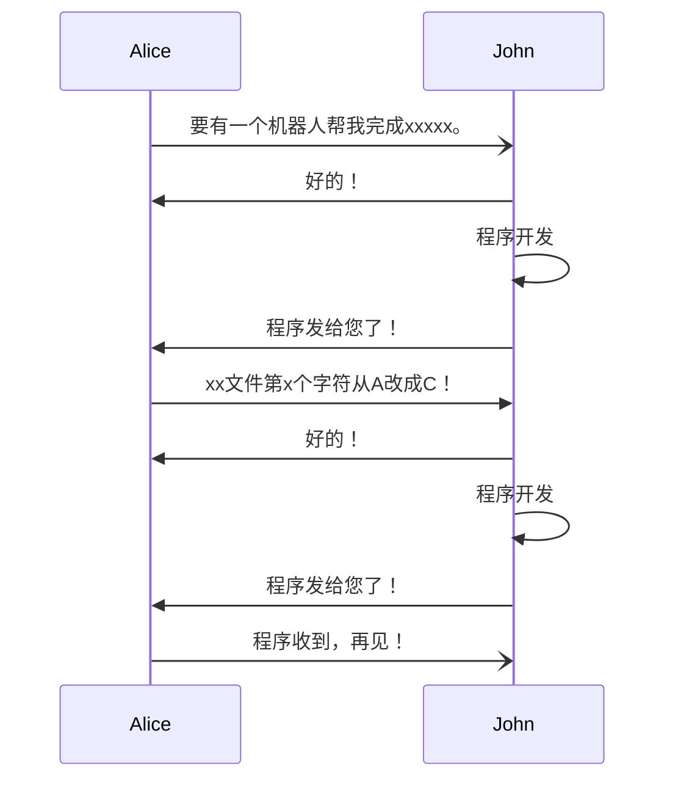
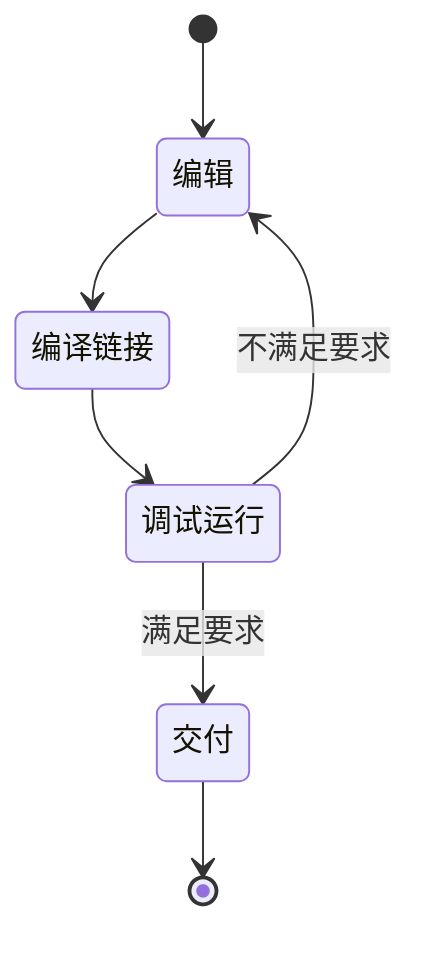

+++
title = 'C语言三分钟：Hello, world!'
date = 2025-01-15T15:03:03+08:00
draft = false
mathjax = false
categories = ['c']
tags = ['c', 'helloworld', 'tutorial']
toc = true
tocBorder = true
+++


## Hello, World!

> 学会下面Hello, World!，C语言基本上就已经入门80%。

```C
{}
```

从上面的代码，得到命令行、终端输出`Hello, World!`，是计算机的一小步，是程序员的一大步！

因为这个简单的程序，包含了C语言的大部分要素：

- 源文件：代码
- 编译、链接
- 头文件、库文件
- 函数定义，函数返回值，
- 程序入口函数
- 函数调用
- 函数的变长参数
- C语言字符串常量

## 软件开发


### 程序开发流程

任何一个程序设计语言的应用过程，大概可以分为两部分，涉及主要是两方。我们假设一方是艾力一方是囧。大概整个过程就是下面这样：



程序开发中，委托方和开发方形成一对张力。委托方有功能需求，开发方评估和设计功能需求的实现；委托方评估功能需求的满足程度，开发方对功能需求的实现进行修正和完善。

所以：张力在哪里？

这个过程中，需求的确认、需求的实现、需求实现的评估、需求实现的完善，必然是一个需要人深度参与的、反复迭代的过程。程序设计的大部分问题，根本就不是用某个语言开发的问题，大部分时候是一个以需求为中心的人-人交互过程。

所以，我们可以常常看到，最成功的程序设计产品，是那些有人愿意付钱的产品，而不是那些开发得最漂亮的产品。


### 软件开发角度的Hello, World!

> 艾力：我要开发一个软件，跟世界问好！预算5毛钱。
>
> 阿囧：你是不是要在`终端`打印出`Hello, World!`？
>
> 艾力：就没有更加酷炫的？比如天边传来一声巨响：`Hello, World!`？
>
> 阿囧：得加钱。
>
> 艾力：那就在`终端`打印`Hello, World!`。
>
> 阿囧：你运行的操作系统是什么？终端要用什么终端？命令行输入什么要求？
>
> 艾力：一般使用Ubuntu，用`bash`，要求输入命令`hello`，最好能适配常用操作系统和终端。
>
> 阿囧：常用的操作系统包括哪些？
>
> 艾力：就是那些大部分有人用的操作系统，包括但不限于windows，unix，macos。
>
> 阿囧：得加钱。
>
> 艾力：那就Ubuntu。


开发最重要的就是限定边界、明确开发目标。用户和软件开发都不能单独确定开发目标。通常的相互不满意就是因为交流不够充分，意见表达不够明确，迭代次数和深度不够。一旦开发目标清晰起来，并得到双方的认可，事情就会变得超级简单。其实，大部分时候，用户对软件的设计和开发并不一定关心。

从这个角度来看，Hello, World！这个传奇任务的开发目标就是：

- 在终端提供一个可执行程序（可调用的命令）
- 这个命令会在终端打印"Hello, World!"

上面这个说法太过于无聊。但其实，这个程序在程序开发中有非常重要的目标和作用。

### 程序开发角度的Hello, World!

这两个单词组成的简单句子最早可以追溯到无线电时代，William Williams在1950年代把这个作为无线电发报中的流行语。

程序开发领域引入这个短语归功于Brian Kernighan，大家都知道的大boss。据说是在B语言或者BCPL（1967）年中首先编了这个程序（输出Hello， World！）作为示例，在1972年出版的《编程语言B》是这个例子的首次公开出版。其后，Brain在《Programming in C》（1974）中再次包含了这个例子。但是这两次出版都没有太大水花。直到1978年C语言发布后，在《The C programming language》这本跟Dennis Ritchie合著的书中包含的这个例子，随着C语言大放异彩也被广为人知。


后续开发的语言也开始这样玩，这个玩意慢慢就成了文化梗，越来越流行。毕竟，每个编程语言都有一个取代C语言的梦想，虽然可能性不大，但是梦想吧，还是应该有的。

```B
main( ) {
    extern a, b, c;
    putchar(a); putchar(b); putchar(c); putchar('!*n');
}

a 'hell';
b 'o, w';
c 'orld';
```

```BCPL
get "streams.d"
external
[
Ws
]

let Main() be
[
Ws("Hello World!*N")
]
```

这两个分别就是B语言和BCPL的。


## 程序开发流程

### 编译型语言程序开发

所以，秃头C语言程序员囧在被委托进行程序开发中，C语言程序开发活动主要有四个：

- 编辑源代码
- 编译链接
- 调试运行
- 交付



### 编辑

编辑C语言代码的工具，论坛里经常也要吵成一片，就像是最好的语言PHP。信仰粉们总觉得自己的工具是最好用的。当然C语言大概率可能获取是Vim或者Emacs编辑的居多……我都是用vs code和clion。绝不参与关于那个编辑器好的讨论。

这里可以看到，C语言的源程序存储为`.c`的文本文件，早期的编译器仅支持ASCII编码，现在什么UTF都是支持的。

C语言程序还包括另外一个后缀的文件，`.h`头文件，这个文件包含的是宏、变量定义、函数签名。

比如在`Hello, World!`中，通过`#include<stdio.h>`引入标准库中的一个标准输入输出文件，这样，我们在下面就能使用`printf`把文本输出到终端。

这是C语言一个重要的组织形式的概念：文件。当然，文件在Linux/Unix中是最为基础的概念之一。一大堆工具被用于读、写文件，或者说，几乎所有的活动都不同程度地表现为读写文件。

编辑完，得到`helloworld.c`，接下来就是编译链接。

### 编译链接

上次说到，C语言依然如此活跃和重要，就是因为C语言牢牢占据比汇编语言高一点点的生态位，使得系统开发、嵌入式开发完全没办法避开，各种不同的厂家都选择按照C语言的接口来提供API，各个硬件体系架构，C语言编译器的开发也都是优先级非常高的任务。

编译器，就是把编辑得到的源代码`.c`文件和库文件链接构成某个硬件平台可以直接执行的机器码的工具。这个过程可能会分为很多个步骤，完成整个工作可能需要的是一个工具链（Toolchain）。最好玩的就是有些语言，甚至是先编译成C语言，然后再调用C语言编译工具链完成到机器码的转换。

在GNU Linux，就是`gcc`，在Windows，就是`cl.exe`，MacOS我不知道，没用过……

一般而言，这个过程也很简单，就是：

```shell
gcc helloworld.c -o hello
```

其他工具链大同小异。

这个部分，传统上采用`make`工具来管理整个编译过程。现在也有采用`cmake`、`ninjia`等来完成。

当然这里有一个很好玩的讨论，就是怎么没有抱怨C语言的依赖管理问题。其实C语言在Liunx下面，其依赖管理就是操作系统的分发工具，例如`apt`,`yum`这些，因为C语言的依赖库多半都由操作系统直接分发，非常方便。

### 调试运行和交付

调试运行和交付是软件开发流程可能是最耗费时间的步骤。因为前期的开发目标和艾力的功能需求，通常会模糊不清、描述含糊、随着时间推移变化。所以，调试运行和交付通常由非常坑人和非线性的迭代过程。

所以Zig之禅说：

 * Communicate intent precisely.
 * Edge cases matter.
 * Favor reading code over writing code.
 * Only one obvious way to do things.
 * Runtime crashes are better than bugs.
 * Compile errors are better than runtime crashes.
 * Incremental improvements.
 * Avoid local maximums.
 * Reduce the amount one must remember.
 * Focus on code rather than style.
 * Resource allocation may fail; resource deallocation must succeed.
 * Memory is a resource.
 * Together we serve the users.

第一条就是意图要准确地交流。

当然，从根子上来说，所谓的`Hello, World!`也可以看做是一个冒烟测试（Smoke Test）。

这个你好世界测试可以迅速确定：

- 编译器工具链安装正确
- C语言标准库包含、链接正常
- C语言版本支持正常
- 入口函数支持正常

## 结束语


C语言从它第一次说出你好世界到现在，已经完全成为计算机科学、信息工程、电子电器的基础设施和基石。无论想学什么，都有必要大概了解或者深入学习C语言。

说真的，很简单，Helloword的行数才仅仅五行。