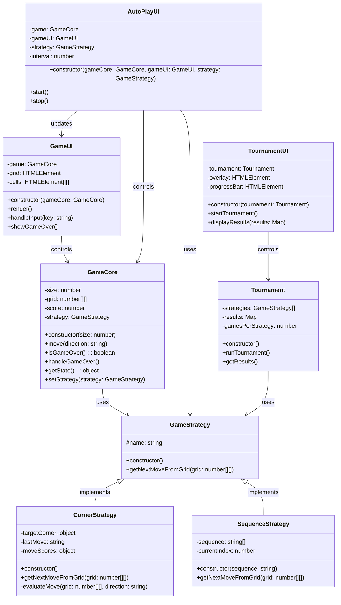

+++
title = '004 Yet Another 1024的另外一种玩法'
date = 2025-03-22T09:59:30+08:00
draft = false
mathkatex = false
categories = ['javascript']
tags = ['javascript', 'game', '1024']
toc = true
tocBorder = true
+++


## 游戏介绍


[Yet Another 1024](/javascript/1024/index.html)

1024 是一个有点无聊的数字方块合并游戏。在这个游戏中，玩家需要通过上、下、左、右四个方向键来移动方块，当相同数字的方块相遇时，它们会合并成为它们的和。游戏的最终目标是获得尽可能高的分数。

游戏的基本规则：游戏开始时，棋盘上会随机出现两个数字方块，这些方块的数值可能是2或4。每当玩家做出一次移动，所有的方块都会朝着指定的方向滑动，如果两个相同数字的方块相撞，它们就会合并成为一个新的方块，其数值是原来的两倍。每次移动之后，游戏会在空闲的位置随机生成一个新的数字方块。当棋盘被填满且无法进行有效移动时，游戏就会结束。

游戏的计分规则基于方块合并时产生的数值。每次成功合并两个相同数字的方块时，玩家获得的分数等于合并后方块的数值。例如：

```javascript
slide(row) {
    const filtered = row.filter(val => val !== 0);
    const merged = [];
    let scoreIncrease = 0;

    for (let i = 0; i < filtered.length; i++) {
        if (filtered[i] === filtered[i + 1]) {
            const mergedValue = filtered[i] * 2;
            merged.push(mergedValue);
            scoreIncrease += mergedValue;  // 计分规则：合并后的数值即为获得的分数
            i++;
        } else {
            merged.push(filtered[i]);
        }
    }

    return { row: merged, scoreIncrease };
}
```

举例来说：

- 合并两个2，得到4，获得4分
- 合并两个4，得到8，获得8分
- 合并两个8，得到16，获得16分

这种计分机制鼓励玩家追求更高数值的合并，因为更高数值的合并能够带来更多的分数。玩家需要在追求高分和维持棋盘空间之间找到平衡，这增加了游戏的策略性。

我们这里实现的 1024 游戏不仅提供了基本的手动操作，还支持自动运行模式和竞标赛系统。在自动运行模式下，游戏会自动执行移动操作，玩家可以选择不同的策略来控制游戏的行为。竞标赛系统则允许玩家比较不同策略的表现。本来还想加一个增加自定义的序列策略，但是由于时间关系，没有实现。

## 实现细节

### 分离设计架构

在开发这个游戏的过程中，我们强迫AI采用分离设计架构，将整个系统划分为四个相互独立又紧密协作的层次。

首先，让我们来看看核心逻辑层。这一层的核心是 GameCore 类，它就像游戏的大脑一样，负责处理所有的游戏逻辑。这里不包含任何与界面相关的代码，而是纯粹专注于游戏规则的实现。它管理着游戏的状态，包括棋盘上每个格子的数值、当前的分数，以及游戏的进度。通过这种方式，我们可以独立测试游戏逻辑，确保其正确性。

其次是策略层，由 GameStrategy 类及其子类组成。这一层负责实现不同的游戏策略，包括角落策略、顺时针策略等。每个策略类都实现了相同的接口，但采用不同的算法来决定下一步移动。这种设计使得新策略的添加变得简单，同时保持了与核心逻辑的解耦。

第三层是用户界面层，由 GameUI 类实现。这一层处理所有的显示和交互逻辑，包括网格的渲染、动画效果、用户输入处理等。它通过观察者模式与核心逻辑层通信，确保界面始终反映最新的游戏状态。

最后是控制层，包括 AutoPlayUI 和 TournamentUI 等类。这一层协调其他层次的交互，管理游戏的自动运行和竞标赛功能。它既要处理用户的控制指令，又要确保不同模块之间的正确协作，是整个系统的粘合剂。

### 游戏核心逻辑

在深入了解游戏的核心逻辑之前，让我们先通过一个类图来了解整个系统的结构：




这个类图展示了游戏中各个主要类之间的关系。让我们详细解释一下每个类的职责和它们之间的交互：

1. **GameCore** 是整个游戏的核心，它：
   - 维护游戏的基本状态（网格、分数）
   - 实现游戏的核心逻辑（移动、合并）
   - 可以配置不同的策略来实现自动游戏

2. **GameStrategy** 是策略的抽象基类，它：
   - 定义了策略接口
   - 为具体策略提供基础结构
   - 实现了策略模式的核心

3. **具体策略类**：
   - **CornerStrategy**：实现了角落策略，包含复杂的评估逻辑
   - **SequenceStrategy**：实现了基于固定序列的移动策略

4. **UI 相关类**：
   - **GameUI**：负责游戏界面的渲染和用户输入
   - **AutoPlayUI**：管理自动游戏的控制和显示
   - **TournamentUI**：处理竞标赛界面和结果展示

5. **Tournament** 类：
   - 管理多个策略的比赛
   - 收集和分析策略表现
   - 生成比赛统计数据

这种类的组织结构体现了关注点分离的设计原则，每个类都有其明确的职责，同时通过清晰的接口进行协作。这不仅提高了代码的可维护性，也使得系统易于扩展和测试。

### 策略系统设计

在设计自动运行策略时，我们采用了灵活的策略模式。首先定义了一个基础的策略接口，这个接口非常简洁，只需要实现一个方法：根据当前棋盘状态决定下一步的移动方向。这种设计让我们能够轻松地添加新的策略，而不需要修改现有的代码。

```javascript
class GameStrategy {
    constructor() {
        this.name = "Base Strategy";
    }
    
    getNextMoveFromGrid(grid) {
        // 每个具体策略都需要实现这个方法
    }
}
```

基于这个接口，我们实现了几种不同的策略。其中最复杂也是最有效的是角落策略。这个策略试图将最大的数字保持在棋盘的一个角落，同时维持数字的单调性，这意味着数字会从角落向外依次减小。此外，策略还会评估空格的分布和可能的合并机会，从而做出最优的移动决策。

我们还实现了一些基于固定模式的策略，如顺时针、逆时针和蛇形移动。这些策略虽然相对简单，但在某些情况下也能取得不错的效果。特别是在棋盘较小或者游戏初期，这些策略往往能快速累积分数。

### UI 设计

游戏的界面设计遵循了简约而现代的风格。核心是一个响应式的网格布局，它能够自适应不同的屏幕尺寸。每个数字方块都有其独特的颜色，随着数值的增加，颜色会逐渐变深，这种视觉反馈让玩家能够快速识别不同大小的数字。

在交互设计方面，我们特别注重动画效果的流畅性。方块的移动和合并都配有平滑的过渡动画，这不仅提升了游戏的视觉体验，还帮助玩家更好地理解游戏的进展。为了适应不同的操作习惯，我们同时支持键盘控制和触摸滑动，使游戏在各种设备上都能获得良好的体验。

控制面板的设计也很有特色。玩家可以随时调整网格大小、选择不同的策略，甚至控制自动运行的速度。所有这些选项都通过直观的下拉菜单和按钮呈现，让玩家能够轻松地定制游戏体验。

特别值得一提的是竞标赛系统的设计。这个系统不仅能够展示比赛的实时进度，还能生成详细的统计数据。通过清晰的表格和图表，玩家可以直观地比较不同策略的表现，这对于策略的改进和优化提供了重要的参考。

### 策略类型分析

在游戏的自动运行策略中，我们实现了两种截然不同的策略类型，每种类型都有其独特的优势和局限性。

#### 序列型策略

序列型策略是一种基于预定义移动序列的简单而直观的方法。这类策略不需要复杂的计算，只需按照固定的顺序循环执行移动指令。我们实现了几种不同的序列模式：

```javascript
class SequenceStrategy extends GameStrategy {
    constructor(sequence) {
        super();
        // 根据不同模式设置移动序列
        switch (sequence) {
            case "clockwise":
                this.sequence = ['up', 'right', 'down', 'left'];
                break;
            case "counter-clockwise":
                this.sequence = ['up', 'left', 'down', 'right'];
                break;
            case "snake":
                this.sequence = ['left', 'down', 'left', 'down', 'right', 'down'];
                break;
        }
    }
}
```

**优点**：

- 实现简单，计算开销小
- 行为可预测，易于调试
- 在游戏早期阶段效果不错
- 适合资源受限的环境

**局限性**：

- 缺乏对局面的动态适应
- 容易陷入重复的无效移动
- 在复杂局面下表现欠佳
- 难以达到很高的分数

#### 评估型策略

评估型策略采用了更智能的方法，通过对每个可能移动的结果进行评估来选择最优的下一步。这类策略的代表是角落策略，它会综合考虑多个因素来评分：

```javascript
class CornerStrategy extends GameStrategy {
    evaluateMove(grid, direction) {
        let score = 0;
        
        // 1. 评估空格分布
        score += this.countEmptyCells(grid) * 20;
        
        // 2. 评估数值单调性
        score += this.evaluateMonotonicDecrease(grid) * 2;
        
        // 3. 评估合并可能性
        score += this.evaluateMergeability(grid) * 1.5;
        
        // 4. 评估与目标角落的关系
        const cornerValue = grid[this.targetCorner.row][this.targetCorner.col];
        score += cornerValue * 3;
        
        return score;
    }
}
```

**优点**：

- 能够适应不同的局面
- 可以达到更高的分数
- 避免明显的错误移动
- 具有一定的策略性

**局限性**：

- 计算开销较大
- 评估函数的设计较为复杂
- 需要仔细调整各项权重
- 可能在局部最优解处徘徊

#### 性能对比

在实际测试中，这两类策略表现出明显的差异：

1. **分数表现**：
   - 评估型策略（角落策略）平均分数显著高于序列型策略
   - 序列型策略的分数波动较大，依赖于初始局面

2. **运行效率**：
   - 序列型策略的运行速度快，CPU占用低
   - 评估型策略需要更多计算资源，但效果更好

3. **稳定性**：
   - 序列型策略在简单局面下表现稳定
   - 评估型策略整体表现更稳定，但偶尔会陷入局部最优

这种策略类型的对比不仅体现了不同解决方案的权衡，也为进一步改进算法提供了思路。比如，我们可以考虑将两种策略结合，在不同阶段使用不同的策略，或者开发新的混合策略来综合两者的优势。

## 技术要点与启示

### JavaScript 技术应用

本项目中的关键JavaScript技术主要体现在类与继承的运用上，特别是策略模式的实现：

```javascript
class GameStrategy {
    constructor() {
        this.name = "Base Strategy";
    }
    
    getNextMoveFromGrid(grid) {
        // 策略接口
        throw new Error('Strategy must implement getNextMoveFromGrid');
    }
}

class CornerStrategy extends GameStrategy {
    constructor() {
        super();
        this.name = "Corner";
        this.targetCorner = { row: 0, col: 0 };
    }
}
```

这种设计模式实现了策略的可扩展性，新策略可以通过继承基类来实现，而无需修改现有代码。每个具体策略类都可以根据需求实现自己的逻辑。

项目中的异步编程应用也值得关注，特别是在竞标赛系统中的实现：

```javascript
async runTournament() {
    for (const strategy of this.strategies) {
        const scores = [];
        for (let i = 0; i < this.gamesPerStrategy; i++) {
            // 添加延迟以优化UI响应
            await new Promise(resolve => setTimeout(resolve, 1));
            // ... 游戏逻辑
        }
    }
}
```

### HTML5 特性运用

在HTML5技术应用方面，触摸事件处理是一个重要的实现点。为了实现跨设备的操作体验，系统实现了完整的手势识别功能：

```javascript
setupTouchControls() {
    let touchStartX = 0;
    let touchStartY = 0;
    
    this.grid.addEventListener('touchstart', (e) => {
        touchStartX = e.touches[0].clientX;
        touchStartY = e.touches[0].clientY;
    });
    
    this.grid.addEventListener('touchend', (e) => {
        const dx = e.changedTouches[0].clientX - touchStartX;
        const dy = e.changedTouches[0].clientY - touchStartY;
        // 根据滑动方向确定移动方向
        if (Math.abs(dx) > Math.abs(dy)) {
            this.handleInput(dx > 0 ? 'ArrowRight' : 'ArrowLeft');
        } else {
            this.handleInput(dy > 0 ? 'ArrowDown' : 'ArrowUp');
        }
    });
}
```

### CSS 技术特点

CSS实现中的一个重要特点是动画效果的处理。通过过渡动画和关键帧动画的结合，实现了流畅的视觉效果：

```css
.cell {
    transition: all 0.15s ease-in-out;
}

.cell.merged {
    animation: pop 0.15s ease-in-out;
}

@keyframes pop {
    0% { transform: scale(1); }
    50% { transform: scale(1.2); }
    100% { transform: scale(1); }
}
```

Grid布局的应用是另一个技术亮点，它为游戏网格提供了理想的布局解决方案：

```css
.grid {
    display: grid;
    grid-template-columns: repeat(4, 1fr);
    gap: 8px;
    aspect-ratio: 1;
}
```

### 架构设计特点

项目采用了关注点分离的架构设计原则，将游戏核心逻辑与UI层完全分离：

```javascript
class GameCore {
    constructor(size = 4) {
        this.size = size;
        this.grid = this.createEmptyGrid();
        this.score = 0;
    }
    
    // 核心游戏逻辑
    move(direction) {
        // 移动逻辑
    }
}

class GameUI {
    constructor(gameCore) {
        this.game = gameCore;
        // UI初始化
    }
    
    // UI更新逻辑
    render() {
        // 渲染逻辑
    }
}
```

这种架构设计提高了代码的可维护性和可扩展性，为后续功能的添加（如自动运行模式和竞标赛系统）提供了良好的基础。各个组件通过明确的接口进行通信，保持了系统的模块化特性。

## 总结

本项目不仅实现了基本的 1024 游戏功能，还加入了自动运行策略和竞标赛系统，使其成为了一个很好的算法验证平台。通过不同策略的对比，我们可以研究和改进游戏算法，同时项目的实现过程也展示了现代前端技术的综合应用。

项目中的模块化设计、响应式布局、动画效果等特性，都体现了良好的软件工程实践。这些经验可以在其他项目中借鉴应用。
