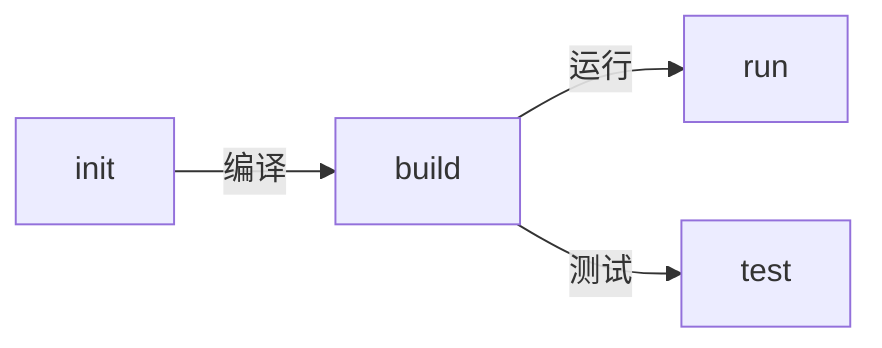

+++
title = '007 Amper Amper Amper!'
date = 2024-12-21T17:00:18+08:00
draft = false
mathjax = false
categories = ['jetpack']
tags = ['jetpack', 'amper', 'building-tools']
toc = true
tocBorder = true
+++

## Amper Amper Amper!

今天天气不好，送孩子上少年宫之后就在茶馆里坐着。突然看到一个帖子：[Project configuration with Amper](https://www.jetbrains.com/help/kotlin-multiplatform-dev/amper.html)，看得心情大好。

用Kotlin也有个大概几年的时间，开发了几个小工具，感觉很是不错。但是配置起来确实是个大问题，gradle那一套挺好用，功能非常强大，整起来心智负担不是一般大。前面都写了几个笔记，自己用的时候还要经常去翻，配置里面的一些细节，还要去拷贝代码。而且gradle到gradle.kts，也是一个麻烦的东西。Maven用得比较少，以前读书的时候XML发一篇小文章把胃口搞坏了。Ant用过几次，Java年代，感觉不太喜欢。

看到Amper之后，立马准备试一下，终于可以现代化一次。Java社区和新的Kotlin社区，可真是慢慢都成了守旧势力。所有新的语言都提供了非常好用的项目管理、依赖管理、构建工具一体化的方案，唯独Java体系还在修修补补。终于，守旧势力被冲了，Amper出现了。

## Amper是什么？

Amper是JetBrains公司开发的一个项目配置工具，用于Kotlin Multiplatform项目。它的目标是简化项目配置。这句废话……

我最关心的就是Amper可以用独立运行的方式来管理项目。

```shell
(base) PS C:\prjs\amper> ./amper --help
Usage: amper [<options>] <command> [<args>]...

Options:
  --version                                Show the version and exit
  --root=<path>                            Amper project root
  --log-level=(debug|info|warn|error|off)  Console logging level (default: INFO)
  --shared-caches-root=<path>              Path to the cache directory shared between all Amper projects (default:
                                           C:\Users\User\AppData\Local\Amper)
  --async-profiler                         Profile Amper with Async Profiler
  --build-output=<path>                    Root directory for build outputs. By default, this is the 'build' directory
                                           under the project root.
  -h, --help                               Show this message and exit

Commands:
  build                Compile and link all code in the project
  clean                Remove the project's build output and caches
  clean-shared-caches  Remove the Amper caches that are shared between projects
  init                 Initialize a new Amper project based on a template
  modules              List all modules in the project
  publish              Publish modules to a repository
  run                  Run your application
  settings             Print the effective Amper settings of each module
  task                 Execute any task from the task graph
  tasks                List all tasks in the project and their dependencies
  test                 Run tests in the project
  tool                 Run a tool
  update               Update Amper to the latest version
(base) PS C:\prjs\amper>
```

最基本的工作流程大概会是：


这里面，新建项目的命令`init`的格式大概就是：

```shell
(base) PS C:\prjs\amper> ./amper init -h
Usage: amper init [<options>] [<template>]

  Initialize a new Amper project based on a template

Options:
  -h, --help  Show this message and exit

Arguments:
  <template>  project template name substring, e.g., 'jvm-cli'
```

目前支持的模板有：
- compose-android 
- compose-desktop 
- compose-ios 
- compose-multiplatform 
- jvm-cli 
- kmp-lib 
- multiplatform-cli

## Amper的优势

Amper的优势很简单：

下面两个文件就能够构成一个完整的项目：

```yaml
product: jvm/app

dependencies:
  - $compose.desktop.currentOs

settings:
  compose: enabled


repositories:
  - id: public
    url: https://maven.aliyun.com/repository/public/
  - id: central
    url: https://maven.aliyun.com/repository/jcentral/
```

```kotlin
import androidx.compose.desktop.ui.tooling.preview.Preview
import androidx.compose.foundation.layout.Arrangement
import androidx.compose.foundation.layout.Column
import androidx.compose.foundation.layout.fillMaxSize
import androidx.compose.foundation.text.BasicText
import androidx.compose.material.MaterialTheme
import androidx.compose.runtime.*
import androidx.compose.ui.Alignment
import androidx.compose.ui.Modifier
import androidx.compose.ui.window.Window
import androidx.compose.ui.window.application

@Composable
@Preview
fun App() {
    MaterialTheme {
        Column(
            modifier = Modifier.fillMaxSize(),
            verticalArrangement = Arrangement.Center,
            horizontalAlignment = Alignment.CenterHorizontally,
        ) {
            BasicText("Hello, World!")
        }
    }
}

fun main() = application {
    Window(onCloseRequest = ::exitApplication) {
        App()
    }
}
```

目录结构大概就是：

```
|-- amper.yaml
|-- amper
|-- amper.bat
|-- src
    |-- Main.kt
```

这里面两个amper/amper.bat就是Amper的全部内容，只需要下载一次，之后只要引用运行一下，就会在项目目录下面拷贝这两个文件。

整个项目`./amper.bat build`、`./amper.bat stest`、`./amper.bat run`。对于Java/Kotlin这边来说，这简直就是天堂。

## 与Gradle合作

当然，Amper现在没有那个Compose常用的产生本地可运行程序的功能。所以Amper还设计了一套机制，就是作为Gradle的插件存在。这个时候，一个项目的目录结构就会变成：

```
|-- amper.yaml
|-- amper
|-- amper.bat
|-- src
    |-- Main.kt
|-- build.gradle.kts
|-- settings.gradle.kts
|-- gradlew
|-- gradlew.bat
|-- gradle
    |-- wrapper
        |-- gradle-wrapper.jar
        |-- gradle-wrapper.properties
```

这个时候，Amper可以单独运行，也可以作为Gradle的插件运行，大量的配置都可以放在amper.yaml里面，Gradle的配置就可以简化很多。一般而言，Compose的配置文件build.gradle.kts会变成：

```kotlin
compose.desktop {
    application {
        mainClass = "MainKt"
        nativeDistribution {
            packageName = "HelloCompose"
        }
    }
}
```
仅仅需要这样，Gradle只是用来产生本地可运行程序，其他的都交给Amper。

## 总结

1. Amper赛高。
2. Amper可以独立运行，也可以作为Gradle插件运行。
3. Amper的配置文件简单，易读。
4. Amper有一个问题就是Repositories的配置，在yaml文件中设置的时候，库还是排在系统默认的三个库的后面……你懂的，我还去提了一个issue……

