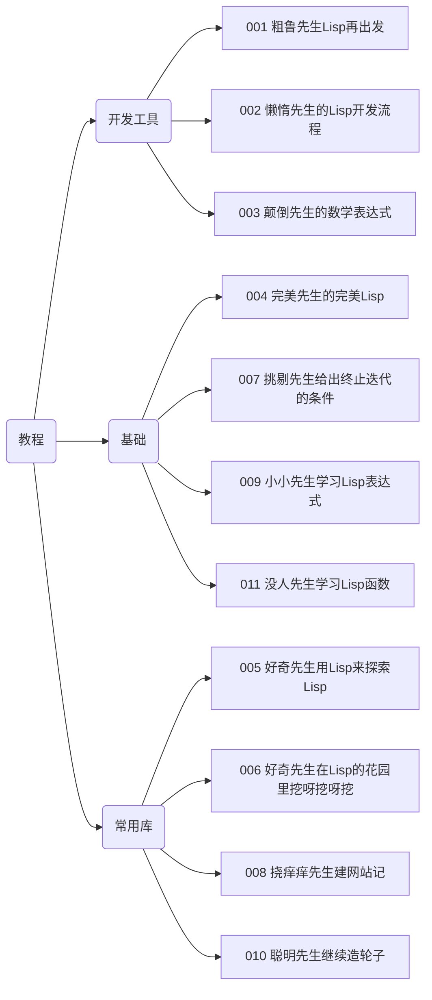

+++
title = '000 中年人与Lisp'
date = 2024-07-23T09:47:44+08:00
draft = false
categories = ['lisp', 'plan']
tags = ['lisp', 'plan', 'life']
mathjax = false
+++

## 中年人与Lisp
Lisp实际上已经是我的老朋友。

大学的时候就开始看Lisp，很有意思也很有力的7个构成部分形成整个LISP大厦，非常震撼。

断断续续看了很多Lisp的书和帖子。这次又准备再来一次，经过20年之后，我的能力和认知肯定已经发生巨大变化。说不定，这一次，有好玩的。

## 计划

1. 随意地写几篇找找感觉；
2. 感觉好的话，再写几篇；
3. 等写10篇再考虑是不是做一个规划。

## 文章列表

1. [001 粗鲁先生Lisp再出发](/posts/001-rude-start-application/)
2. [002 懒惰先生的Lisp开发流程](/posts/002-lazy-process/)
3. [003 颠倒先生的数学表达式](/posts/003-lazy-process/)
4. [004 完美先生的完美Lisp](/posts/004-perfect/)
5. [005 好奇先生用Lisp来探索Lisp](/posts/005-explore-lisp/)
6. [006 好奇先生在Lisp的花园里挖呀挖呀挖](/posts/006-sequence-in-lisp/)
7. [007 挑剔先生给出终止迭代的条件](/posts/007-recursive-eq/)
8. [008 挠痒痒先生建网站记](/posts/008-real-app/)
9. [009 小小先生学习Lisp表达式](/posts/009-expression/)
10. [010 聪明先生拒(ji)绝(xu)造轮子](/posts/010-smart-cl-classification/)
11. [011 没人先生学习Lisp函数](/posts/011-functions/)

## 计划

可能是时候做一个计划。

目前已经完成的部分：

还应该再写什么呢？写的内容是聚焦到实际应用？还是聚焦到理念、理论和PL？

还需要再想一想。

是不是照着一本书来Copy结构？还是围绕一个想要做出来的应用展开？