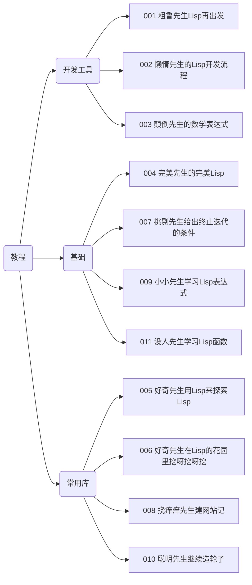

+++
title = '000 中年人与Lisp'
date = 2024-07-23T09:47:44+08:00
draft = false
categories = ['lisp', 'plan']
tags = ['lisp', 'plan', 'life', '计划']
mathjax = false
toc = true
tocBorder = true
+++

## 中年人与Lisp
Lisp实际上已经是我的老朋友。

大学的时候就开始看Lisp，很有意思也很有力的7个构成部分形成整个LISP大厦，非常震撼。

断断续续看了很多Lisp的书和帖子。这次又准备再来一次，经过20年之后，我的能力和认知肯定已经发生巨大变化。说不定，这一次，有好玩的。

## 计划

1. 随意地写几篇找找感觉；
2. 感觉好的话，再写几篇；
3. 等写10篇再考虑是不是做一个规划。

## 文章列表

1. [001 粗鲁先生Lisp再出发](/posts/001-rude-start-application/)
2. [002 懒惰先生的Lisp开发流程](/posts/002-lazy-process/)
3. [003 颠倒先生的数学表达式](/posts/003-lazy-process/)
4. [004 完美先生的完美Lisp](/posts/004-perfect/)
5. [005 好奇先生用Lisp来探索Lisp](/posts/005-explore-lisp/)
6. [006 好奇先生在Lisp的花园里挖呀挖呀挖](/posts/006-sequence-in-lisp/)
7. [007 挑剔先生给出终止迭代的条件](/posts/007-recursive-eq/)
8. [008 挠痒痒先生建网站记](/posts/008-real-app/)
9. [009 小小先生学习Lisp表达式](/posts/009-expression/)
10. [010 聪明先生拒(ji)绝(xu)造轮子](/posts/010-smart-cl-classification/)
11. [010 Common Lisp Symbols分类参考](/posts/010-appendix-cl-symbols/)
12. [011 没人先生学习Lisp函数](/posts/011-functions.md)
13. [012 白日梦先生的白日梦](/posts/012-1am-tutor.md)

## 计划

可能是时候做一个计划。

目前已经完成的部分：

还应该再写什么呢？写的内容是聚焦到实际应用？还是聚焦到理念、理论和PL？

还需要再想一想。

是不是照着一本书来Copy结构？还是围绕一个想要做出来的应用展开？

### 目标是什么？

要不要再一次来思考，我的目标是什么？

最近刚看了[Lisp Curse](https://www.winestockwebdesign.com/Essays/Lisp_Curse.html)，感觉很符合这两个月对Lisp的学习。

- 工具零碎，全部都不完整，能够用但是又刚好不够用；
- 如果很不舒服，就自己写一个，也不是太难的样子；
- 用别人的，也要挑挑拣拣，而且，文档是几乎没有的，就比如Common Lisp自己的工具，都没有一个非常好用、完备的文档，跟[Racket](https://docs.racket-lang.org/)比起来，差距太大了；

就比如说画图，[vgplot](https://github.com/volkers/vgplot)，[文档](https://volkers.github.io/vgplot/vgplot.html)， 其实说起来还算是不错，精心制作了`(vgplot:demo)`，照葫芦画瓢也简单。当然，如果有GNUPlot的基础就更是毫无压力。如果仔细考虑，这个包的功能也符合上面的特点，勉强够用。

就比比如说[quicklisp](https://www.quicklisp.org/beta/releases.html)，下载量排名第一的[Alexandria](https://alexandria.common-lisp.dev/)，有文档，但是不多，没有中文，实际上，他的文档就是跟[explore-lisp](https://github.com/qchen-fdii-cardc/explore-lisp.git)差不多，用脚本生成的，但是这已经算是很好的了。

至于中文的，那就更可怜。

所以，我的目标是什么呢？

向工程需要，或者实际解决问题需要的`Common Lisp`入门指南。我本人没有能力，也不准备探讨那些非常复杂、难以理解的PL理论，也不准备仔细辨别`Common Lisp`中微妙的语法构造。我只想给一个快速上手、能够使用的梯子，通过这个梯子，Lisp可以成为工具箱的一把扳手，而不是叶公好龙、充作谈资的花瓶。

所以，我要以我自己的需要为出发点，**Make Lisp Great Again**。

> Make Lisp Great Again, for Engineers.

都扯淡呢……

### 目标读者 vs 写作目标

目标读者其实是一个很难刻画的群体。因为写作目标本身也没有刻画清楚。到底，想用Lisp来干嘛？到底为什么学习Lisp？其实很难现象一个废渣工程师要跑去学习Lisp，除非是一个从事CAD设计的年轻人，倒是有可能需要学习AutoLisp。

那么其他人为什么要学习Common Lisp呢？

到底哪些人在学习Common Lisp呢？

其实看[Alexandria](https://alexandria.common-lisp.dev/)的下载量，就知道，这个库的使用者是非常多的。那么，这些人为什么要学习Common Lisp呢？2024年下载量：

虽然，下载量跟pypi的包没办法比……

Java Maven的下载量我没找到，估计也很夸张。

哪些人在用Lisp？这些人在用Lisp干什么？Lisp还需要吸引什么人来学习？

也许，根本不需要吸引人来学习Common Lisp。工程师学习和使用Lisp有没有什么优势？有没有什么必要？有没有什么好处？

这个问题想不清楚，就不要想了。因为我实在是自己想学习学习Lisp，并且用在工作中。

### 是否继续写下去？写什么？

暂时，还是保持想到什么写什么的状态吧。

如果有什么新的想法，随时调整。