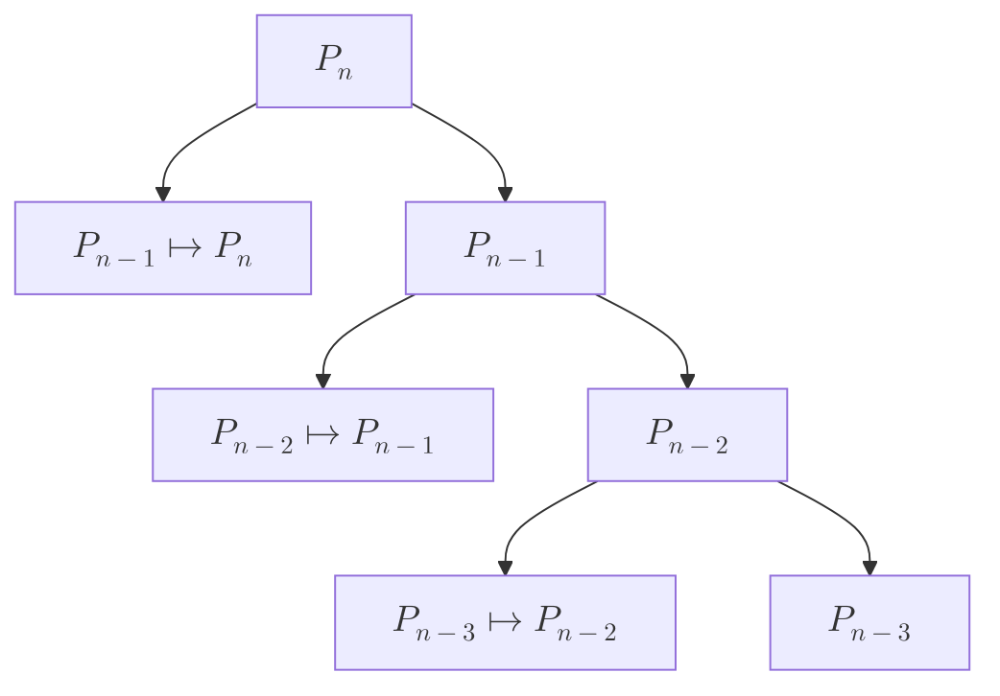
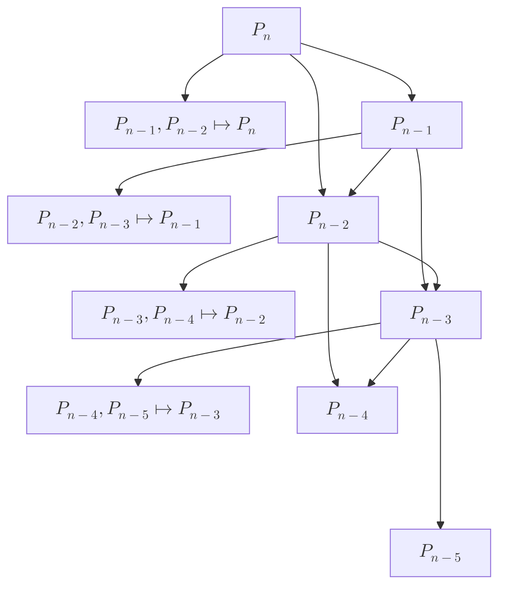
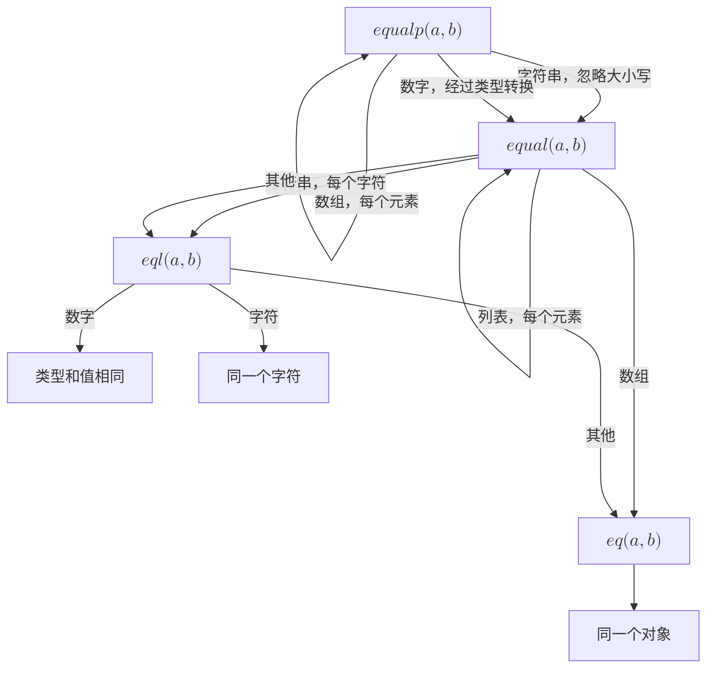

+++
title = '007 挑剔先生给出终止迭代的条件'
date = 2024-08-27T12:32:52+08:00
draft = false
mathkatex = true
categories = ['lisp', 'programming-language', 'tutorial', 'common-lisp']
tags = ['lisp','编程','实用主义', '入门', '教程']
toc = true
tocBorder = true
+++

## 已经出场的人物

- [粗鲁先生](/posts/lisp/001-rude-start-application/)：Lisp很容易产生小工具的可执行文件，除了Emacs，VS Code插件也基本可用。
- [懒惰先生](/posts/lisp/002-lazy-process/)：Lisp的项目管理工具很方便。
- [颠倒先生](/posts/lisp/003-upsidedown-infix/)：掉包是Lisp推荐的编程风格。
- [完美先生](/posts/lisp/004-perfect/)：Lisp代码是完美的符号编程语言。
- [好奇先生](/posts/lisp/005-explore-lisp/)：Lisp内置函数足以提供完整帮助信息，哪怕是生成包的速查手册，特别是关于函数、宏、变量、类的简单信息查看。
  - [挠痒痒先生](/posts/lisp/006-sequence-in-lisp/)：走过场Lisp程序员，手很长，就像是一个`sequence`。

如果是要启动Lisp的学习，上面的材料已经远超足够。除了挠痒痒先生，其他4位狂热Lisp程序员和1位懒惰Lisp程序员已经完全进入状况，准备大干一场。

## Lisp和递归

在Paul Graham的[开创性论文](http://www-formal.stanford.edu/jmc/recursive.pdf)中，一种通过递归定义的函数式编程语言，Lisp，被提出。要知道，高级语言的鼻祖，Fortran， 一直到1978年（Lisp之后20年），Fortran 77规范里面，还不支持对函数的递归调用。


### 归纳法

要证明一个命题，$P(n)$，对于$n \in \mathcal{N}$成立，可以通过数学归纳法，即：

1. 证明$P(1)$成立；
2. 假设$P(n)$成立，证明$P(n+1)$成立。
3. 由1和2，得出$P(n)$对于所有$n \in \mathcal{N}$成立。

数学归纳法的证明过程，就是一个递归。



从数学上，通过假设$P(n)$成立，证明$P(n+1)$成立，这个过程对于所有的$n$是普遍成立的。那么当我们要让一个程序自动化地完成这个过程，就只能向上面的图一样，不停的展开（执行同样的过程）。

实际上，这种递归解决问题的方式还有可能更加复杂化，例如在某些数学归纳的问题中，$P(n)$的成立，可能需要$P(n-1)$和$P(n-2)$的成立。



这个递归就更好玩。

### 递归数据结构

其实从上面的图可以看到，这个图它是一个特殊的图，称为树。树是一种递归数据结构，树的每个节点都可以看作是一个树，这个树的根节点是这个节点。

那么列表呢？如果把列表看作是第一个元素和剩下去掉第一个元素之后的列表的组合，那么列表也是一个递归数据结构。

这种把数据分割位自相似的数据结构，和把问题分解为自相似的子问题的方式，其实内部蕴含一种非常强大的思维范式。

### 数学归纳法的起点

数学归纳法的起始条件，就是递归的终止条件。例如上面的$P(1)$。因为1是最小的自然数，所以$P(1)$是递归的终止条件。当然，不排除有一个数学归纳法，从无穷大开始，然后递减到1的情况……这纯属脸滚键盘，不负责任……

那么在通过程序进行递归来把问题分解位更小的问题并进行解决时，我们最基本、最基础、最核心的问题就是：如何终止递归？终止递归的核心问题又是什么？

挑剔先生，就是一个非常挑剔的人，他对于递归的终止条件，有着非常严格的要求。他认为，递归的终止条件，必须是一个确定的条件，而且这个条件必须是可以被计算的。

挑剔先生给出的构造终止条件的核心方法、最基础的、最小的、必不可少的就是：**比较相等**。

## 比较相等

粗鲁先生，懒惰先生，颠倒先生，完美先生，好奇先生，挠痒痒先生大失所望，又无法理解。比较相等这么简单的事情，怎么会是一个问题？

挑剔先生，对于比较对象A和对象B相等，有着非常严格的区分。

- 对象A和对象B是完全相同的，就是同一个东西的两个名字；
- 对象A和对象B的类型相同，且对象A和对象B的值相同。
- 对象A和对象B的类型不相同，但是可以通过某种方式转换为相同的类型，且转换后的值相同。
- 对于聚合型数据结构，例如列表、树等，对象A和对象B的每个元素都**相同**。
  
粗鲁先生双眼失去焦点，睡着了。懒惰先生想，等我编程序的时候再试试吧，不行用AI写几个测试用例，一个一个试就好。颠倒先生完全不担心这个问题，因为他是：**调包侠**，他从不写程序，只是API的搬运工。完美先生鄙夷地看了一眼大家，哎，这个世界太不完美，如果所有程序都是纯函数的。好奇先生，好奇地问，这个比较相等，是不是和`equal`函数一样？挠痒痒先生只想着谁的咯吱窝更好下手。

### `eq`, `eql`, `equal` 和 `equalp`

翻开手册，我们可以看到，Lisp提供了4个比较相等的函数：

- `eq`：比较两个对象是否是同一个对象；
- `eql`：比较两个对象的类型和值是否相同；
- `equal`：比较两个对象的类型和值是否相同，对于聚合型数据结构，比较每个元素是否相同；
- `equalp`：比较两个对象的类型和值是否相同，对于聚合型数据结构，比较每个元素是否相同，对于字符串，忽略大小写，对于数字，忽略类型比较值。
- `=`：比较两个数值是否相等，对于数值就是`equalp`，不用于其他对象。



有了这个工具，我们就可以很方便地构造递归的终止条件。

### 一个有意思的思考

数学归纳法的起始条件和递归迭代终止条件，都指向了一个特殊的数值，而递归定义数据结构，也自然的指向了一个特殊的数据结构。

好了，你们知道我要说那句有名的xxx是xxx上的xxx或者类似的话……

那么对于自然数，这个数字是1，对于整数，这个数字是0，对于列表，这个数据结构是空列表。这就是Lisp中间的`nil`，这个`nil`就是递归数据结构的终止条件，以及处理大部分数据结构的终止条件。

## 递归的例子

```lisp
(defun factorial (n)
  (if (equalp n 1)
      1
      (* n (factorial (- n 1)))))
```

在Lisp里面，简单的递归可以计算超大数字的阶乘，挑剔先生都不会挑剔。

```lisp
(factorial 100)
; ==> 93326215443944152681699238856266700490715968264381621468592963895217599993229915608941463976156518286253697920827223758251185210916864000000000000000000000000
```

## 结论

1. 递归两个核心概念：分解、终止；
2. 数学归纳法是递归的数学基础；
3. 终止条件最终是比较相等；
4. 按照顺序，`eq`, `eql`, `equal` 和 `equalp`限制越来越宽松。
