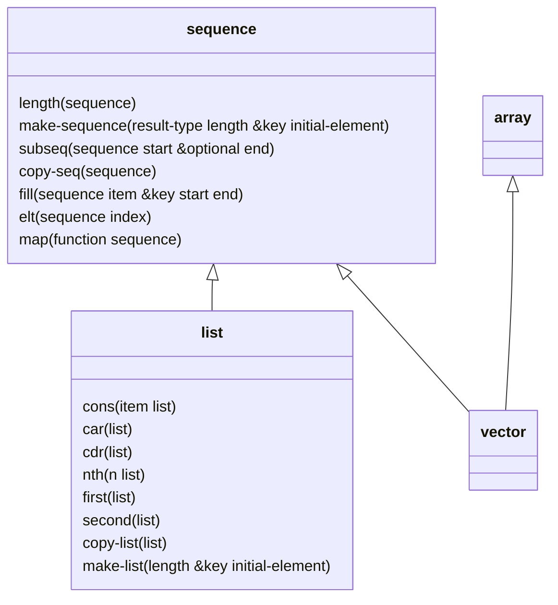

+++
title = '014 排队队吃果果，操作Sequence乐趣多'
date = 2024-11-07T12:43:58+08:00
draft = true
mathjax = true
categories = ['lisp']
tags = ['lisp', 'tutorial', 'sequence']
toc = true
tocBorder = true
+++


## 什么是序列

序列是一个有顺序的元素的集合。这一句话有两个概念，第一个是集合，第二个是顺序。

操作集合是计算机科学中一个非常重要的概念，表达集合概念的数据结构占据了《程序=数据+算法》的重要的部分。常见的数组、链表、堆栈、队列等等。集合有几个特征：

- 集合元素的个数
- 集合元素的类型
- 集合元素的顺序（访问顺序、添加顺序）
- 集合元素的内存分布（连续、离散）
- 对集合元素的其他约束，比如唯一性

不同的集合特征构成了不同的数据结构，更加高效地适应不同的算法。

在Common Lisp中， 最核心的列表，也就是名称中的`L`所代表列表，就是一种序列，这个序列的特点就是，长度不限，元素的类型不限，元素的顺序是固定的，元素的内存分布是离散的，元素可以重复。

当然，在实际的实现中，必须是`proper list`才能算是一个序列（有限、无环），因为通过特殊的`cons`操作，很容构造一个环形链表，这样的链表是不符合序列的定义的。

另外一个，向量`vector`也是一个序列，向量的特点是长度固定，元素的类型不限，元素的顺序是固定的，元素的内存分布是连续的，元素可以重复。

下图中仅仅给出一些方法的例子，并没有包括所有的方法。



实际上，Common Lisp中的核心数据结构`列表`是一种特殊实现（`cons`）的序列，而`Vecotr`则是兼具了数组的特性的序列。

所以，序列的所有操作，都可以在列表和向量上进行。

最终，这个序列的概念就很简单，排队队，吃果果，一队对象排成一排，可以一个一个被处理。


## 序列接口

如何分类序列相关的操作呢？当然是ADT代数数据类型的方式，我们忽略`&optional`参数、`&key`, `&rest`，只关注核心的参数来分析。并且把有副作用的函数单独列出来。

### `TYPE, FUNCTION` $\mapsto$ `SEQUENCE`
   
1.  [COMMON-LISP:MAP](https://www.lispworks.com/documentation/HyperSpec/Body/f_map.htm)  No documentation found

有副作用的版本：

2.  [COMMON-LISP:MAP-INTO](https://www.lispworks.com/documentation/HyperSpec/Body/f_map_in.htm)  No documentation found


### `TYPE` $\mapsto$ `SEQUENCE`
1.  [COMMON-LISP:CONCATENATE](https://www.lispworks.com/documentation/HyperSpec/Body/f_concat.htm)  Return a new sequence of all the argument sequences concatenated together

### `TYPE, NUMBER` $\mapsto$ `SEQUENCE`
1.  [COMMON-LISP:MAKE-SEQUENCE](https://www.lispworks.com/documentation/HyperSpec/Body/f_mk_seq.htm)  Return a sequence of the given RESULT-TYPE and LENGTH, with


### `TYPE, SEQUENCE, SEQUENCE, FUNCTION` $\mapsto$ `SEQUENCE`


10. [COMMON-LISP:MERGE](https://www.lispworks.com/documentation/HyperSpec/Body/f_merge.htm)  Merge the sequences SEQUENCE1 and SEQUENCE2 destructively into a


### `SEQUENCE` $\mapsto$ `SEQUENCE`

1.  [COMMON-LISP:COPY-SEQ](https://www.lispworks.com/documentation/HyperSpec/Body/f_cp_seq.htm)  Return a copy of SEQUENCE which is EQUAL to SEQUENCE but not EQ.
2.  [COMMON-LISP:REVERSE](https://www.lispworks.com/documentation/HyperSpec/Body/f_revers.htm)  Return a new sequence containing the same elements but in reverse order.
3.  [COMMON-LISP:REMOVE-DUPLICATES](https://www.lispworks.com/documentation/HyperSpec/Body/f_rm_dup.htm)  The elements of SEQUENCE are compared pairwise, and if any two match,

有副作用的版本：
1.  [COMMON-LISP:NREVERSE](https://www.lispworks.com/documentation/HyperSpec/Body/f_revers.htm)  Return a sequence of the same elements in reverse order; the argument
2.  [COMMON-LISP:DELETE-DUPLICATES](https://www.lispworks.com/documentation/HyperSpec/Body/f_rm_dup.htm)  The elements of SEQUENCE are examined, and if any two match, one is

### `SEQUENCE` $\mapsto$ `NUMBER`

1.  [COMMON-LISP:LENGTH](https://www.lispworks.com/documentation/HyperSpec/Body/f_length.htm)  获得序列的长度
   
### `SEQUENCE, SEQUENCE` $\mapsto$ `SEQUENCE`

14. [COMMON-LISP:REPLACE](https://www.lispworks.com/documentation/HyperSpec/Body/f_replac.htm)  Destructively modifies SEQUENCE1 by copying successive elements


### `SEQUENCE, SEQUENCE` $\mapsto$ `NUMBER`
1.  [COMMON-LISP:MISMATCH](https://www.lispworks.com/documentation/HyperSpec/Body/f_mismat.htm)  The specified subsequences of SEQUENCE1 and SEQUENCE2 are compared
2.  [COMMON-LISP:SEARCH](https://www.lispworks.com/documentation/HyperSpec/Body/f_search.htm)  No documentation found

### `SEQUENCE, ITEM` $\mapsto$ `SEQUENCE`

2.  [COMMON-LISP:FILL](https://www.lispworks.com/documentation/HyperSpec/Body/f_fill.htm)  Replace the specified elements of SEQUENCE with ITEM.


### `SEQUENCE, ITEM` $\mapsto$ `NUMBER`

1.  [COMMON-LISP:COUNT](https://www.lispworks.com/documentation/HyperSpec/Body/f_countc.htm)  Return the number of elements in SEQUENCE satisfying a test with ITEM,
2.  [COMMON-LISP:COUNT-IF](https://www.lispworks.com/documentation/HyperSpec/Body/f_countc.htm)  Return the number of elements in SEQUENCE satisfying PRED(el).
3.  [COMMON-LISP:COUNT-IF-NOT](https://www.lispworks.com/documentation/HyperSpec/Body/f_countc.htm)  Return the number of elements in SEQUENCE not satisfying TEST(el).

### ` SEQUENCE, FUNCTION` $\mapsto$ `SEQUENCE`

12. [COMMON-LISP:SORT](https://www.lispworks.com/documentation/HyperSpec/Body/f_sort_.htm)  Destructively sort SEQUENCE. PREDICATE should return non-NIL if
13. [COMMON-LISP:STABLE-SORT](https://www.lispworks.com/documentation/HyperSpec/Body/f_sort_.htm)  Destructively sort SEQUENCE. PREDICATE should return non-NIL if


### `SEQUENCE, NUMBER` $\mapsto$ `ITEM`

2.  [COMMON-LISP:ELT](https://www.lispworks.com/documentation/HyperSpec/Body/f_elt.htm)  按照索引获取队列的元素

### `SEQUENCE, NUMBER` $\mapsto$ `SEQUENCE`

1.  [COMMON-LISP:SUBSEQ](https://www.lispworks.com/documentation/HyperSpec/Body/f_subseq.htm)  Return a copy of a subsequence of SEQUENCE starting with element number

### `ITEM, SEQUENCE` $\mapsto$ `SEQUENCE`
1.  [COMMON-LISP:REMOVE](https://www.lispworks.com/documentation/HyperSpec/Body/f_rm_rm.htm)  Return a copy of SEQUENCE with elements satisfying the test (default is

有副作用的版本：
1.  [COMMON-LISP:DELETE](https://www.lispworks.com/documentation/HyperSpec/Body/f_rm_rm.htm)  Return a sequence formed by destructively removing the specified ITEM from


### `ITEM, SEQUENCE` $\mapsto$ `ITEM`

2.  [COMMON-LISP:FIND](https://www.lispworks.com/documentation/HyperSpec/Body/f_find_.htm)  No documentation found

### `ITEM, SEQUENCE` $\mapsto$ `NUMBER`

4.  [COMMON-LISP:POSITION](https://www.lispworks.com/documentation/HyperSpec/Body/f_pos_p.htm)  No documentation found


### `ITEM, ITEM, SEQUENCE` $\mapsto$ `SEQUENCE`
2.  [COMMON-LISP:SUBSTITUTE](https://www.lispworks.com/documentation/HyperSpec/Body/f_sbs_s.htm)  Return a sequence of the same kind as SEQUENCE with the same elements,
5.  [COMMON-LISP:NSUBSTITUTE](https://www.lispworks.com/documentation/HyperSpec/Body/f_sbs_s.htm)  Return a sequence of the same kind as SEQUENCE with the same elements

后者是有副作用的版本。

### `ITEM, FUNCTION, SEQUENCE` $\mapsto$ `SEQUENCE`

3.  [COMMON-LISP:SUBSTITUTE-IF](https://www.lispworks.com/documentation/HyperSpec/Body/f_sbs_s.htm)  Return a sequence of the same kind as SEQUENCE with the same elements
4.  [COMMON-LISP:SUBSTITUTE-IF-NOT](https://www.lispworks.com/documentation/HyperSpec/Body/f_sbs_s.htm)  Return a sequence of the same kind as SEQUENCE with the same elements

有副作用的版本
5.  [COMMON-LISP:NSUBSTITUTE-IF](https://www.lispworks.com/documentation/HyperSpec/Body/f_sbs_s.htm)  Return a sequence of the same kind as SEQUENCE with the same elements
6.  [COMMON-LISP:NSUBSTITUTE-IF-NOT](https://www.lispworks.com/documentation/HyperSpec/Body/f_sbs_s.htm)  Return a sequence of the same kind as SEQUENCE with the same elements

### `FUNCTION, SEQUENCE` $\mapsto$ `SEQUENCE`
1.  [COMMON-LISP:REMOVE-IF](https://www.lispworks.com/documentation/HyperSpec/Body/f_rm_rm.htm)  Return a copy of sequence with elements satisfying PREDICATE removed.
2.  [COMMON-LISP:REMOVE-IF-NOT](https://www.lispworks.com/documentation/HyperSpec/Body/f_rm_rm.htm)  Return a copy of sequence with elements not satisfying PREDICATE removed.

有副作用的版本：
2.  [COMMON-LISP:DELETE-IF](https://www.lispworks.com/documentation/HyperSpec/Body/f_rm_rm.htm)  Return a sequence formed by destructively removing the elements satisfying
3.  [COMMON-LISP:DELETE-IF-NOT](https://www.lispworks.com/documentation/HyperSpec/Body/f_rm_rm.htm)  Return a sequence formed by destructively removing the elements not


### `FUNCTION, SEQUENCE` $\mapsto$ `NUMBER`

6.  [COMMON-LISP:POSITION-IF](https://www.lispworks.com/documentation/HyperSpec/Body/f_pos_p.htm)  No documentation found
7.  [COMMON-LISP:POSITION-IF-NOT](https://www.lispworks.com/documentation/HyperSpec/Body/f_pos_p.htm)  No documentation found


### `FUNCTION, SEQUENCE` $\mapsto$ `ITEM`
1.  [COMMON-LISP:FIND-IF](https://www.lispworks.com/documentation/HyperSpec/Body/f_find_.htm)  No documentation found
2.  [COMMON-LISP:FIND-IF-NOT](https://www.lispworks.com/documentation/HyperSpec/Body/f_find_.htm)  No documentation found


### `FUNCTION, SEQUENCE` $\mapsto$ `BOOLEAN`
3.  [COMMON-LISP:SOME](https://www.lispworks.com/documentation/HyperSpec/Body/f_everyc.htm)  Apply PREDICATE to the 0-indexed elements of the sequences, then
1.  [COMMON-LISP:EVERY](https://www.lispworks.com/documentation/HyperSpec/Body/f_everyc.htm)  Apply PREDICATE to the 0-indexed elements of the sequences, then
2.  [COMMON-LISP:NOTANY](https://www.lispworks.com/documentation/HyperSpec/Body/f_everyc.htm)  Apply PREDICATE to the 0-indexed elements of the sequences, then
3.  [COMMON-LISP:NOTEVERY](https://www.lispworks.com/documentation/HyperSpec/Body/f_everyc.htm)  Apply PREDICATE to 0-indexed elements of the sequences, then

### `FUNCTION, SEQUENCE` $\mapsto$ `OBJECT`
4.  [COMMON-LISP:REDUCE](https://www.lispworks.com/documentation/HyperSpec/Body/f_reduce.htm)  No documentation found
5.  


## 序列的函数式编程


```lisp


```


## 命令式编程中的序列


## 总结

