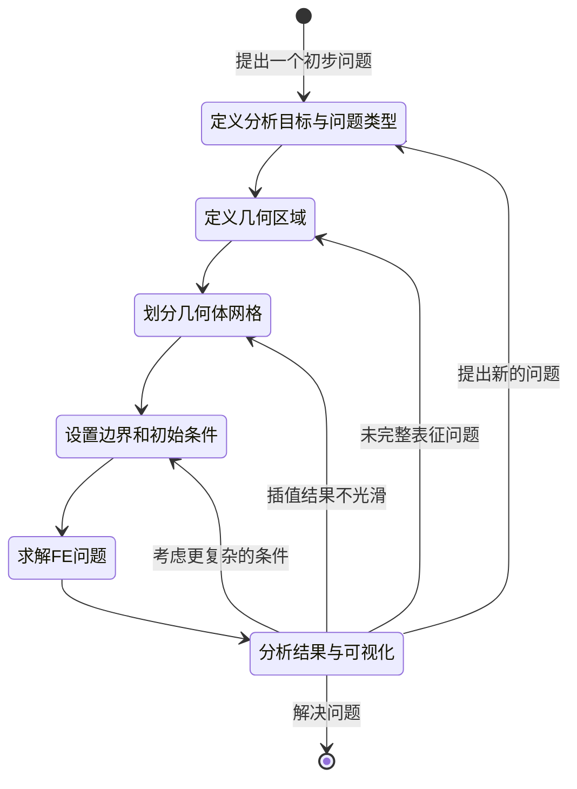

+++
title = 'CSG in Matlab新的统一有限元分析工作流之2D几何'
date = 2024-09-24T23:59:37+08:00
draft = false
mathjax = true
categories = ['matlab']
tags = ['Matlab', 'FEA', 'Geometry', 'CSG', '2D']
toc = true
tocBorder = true
+++


## Matlab新的统一有限元分析工作流

从2023a开始，Matlab提供了一个统一有限元分析工作流（UFEAW，unified finite element analysis workflow）。

这个新的工作留提供一个统一的接口来求解三类问题，并且可以用同一套数据随时切换问题类型进行求解。

1. 结构
2. 热
3. 电磁

这个工作流的核心是一个`femodel`的对象。通过这个对象，可以设置问题的类型和相应的参数。典型的工作过程包括以下步骤：

1. 设置问题，创建`femodel`对象，设定求解问题的类型、几何、网格和物理参数。在节点位置求解问题的解。
2. 可选：把结果差值到任意自己定义的空间位置，或者得到额外的结果。这个部分分别应用结构、传热和电磁的领域函数。
3. 将结果用**PDE结果可视化编辑工具**或者绘图函数展示出来。
4. 更改分析问题类型或者求解新的问题。


我们大概可以把求解问题的过程用一个状态机来表示：



下面，我们按照顺序从几何开始介绍UFEAW。


## 几何与网格

在Matalb中进行有限元分析，首先需要定义几何体，并将其离散为三角形网格（2D）或者四面体网格（3D）。

UFEAW采用`fegemoetry`对象来定义几何，可以直接把几何定义赋值给`femodel`的`Geometry`属性。

几何定义可以有以下的来源：

- STL或者STEP文件，导入几何体：`importGeometry`
- 网格节点或者元素，`geometryFromMesh`
- 分解几何体举证或者几何函数的句柄，`geometryFromEdges`
- 三角剖分（二维或者三维德劳内）
- 基本几何体，立方体、圆柱、球体等
- `alphaShape`对象
- 使用PDE Modeler App创建的几何体


## 几何相关函数总结
跟几何相关的函数总结如列几个表格。

### 创建与可视化

| 函数              | 说明                                  |
| ----------------- | ------------------------------------- |
| importGeometry    | 从STL 或 STEP文件导入几何             |
| geometryFromMesh  | 从二维或者三维网格创建几何体          |
| geometryFromEdges | 从DGM（分解几何矩阵）创建二维几何体   |
| decsg             | 把构造二维几何体分解为最少区域        |
| multicuboid       | 从立方体构造几何                      |
| multicylinder     | 从圆柱构造几何                        |
| multisphere       | 从球体构造几何                        |
| triangulation     | 三角化`fegeometry` (从R2023b开始提供) |
| pdegplot          | 绘制PDE几何                           |

### 几何编辑
| 函数       | 说明                                                                                |
| ---------- | ----------------------------------------------------------------------------------- |
| addCell    | Combine two geometries by adding one inside a cell of another (R2021a开始提供)      |
| addFace    | Fill void regions in 2-D and split cells in 3-D geometry (R2020a开始提供)           |
| addVertex  | Add vertex on geometry boundary                                                     |
| addVoid    | Create void regions inside 3-D geometry (R2021a开始提供)                            |
| extrude    | Vertically extrude 2-D geometry or specified faces of 3-D geometry (R2020b开始提供) |
| mergeCells | Merge geometry cells ( R2023b开始提供)                                              |
| rotate     | Rotate geometry ( R2020a开始提供)                                                   |
| scale      | Scale geometry ( R2020a开始提供)                                                    |
| translate  | Translate geometry ( R2020a开始提供)                                                |

### 几何体查询

| 函数                 | 说明                                      |
| -------------------- | ----------------------------------------- |
| cellEdges            | 查找特定单元边界包含的边 (R2021a开始提供) |
| cellFaces            | 查找特定单元的面 (R2021a开始提供)         |
| faceEdges            | 查找特定面的边 (R2021a开始提供)           |
| facesAttachedToEdges | 查找与边连接的面 (R2021a开始提供)         |
| nearestEdge          | 查找与给定点最近的边 (R2021a开始提供)     |
| nearestFace          | 查找与给定点最近的面 (R2021a开始提供)     |

### PDE建模App
这几个函数要配合PDE Modeler App使用。

| 函数     | 说明                           |
| -------- | ------------------------------ |
| pdecirc  | 绘制圆形（PDE Modeler app）    |
| pdeellip | 绘制椭圆 （PDE Modeler app）   |
| pdepoly  | 绘制多边形 （PDE Modeler app） |
| pderect  | 绘制矩形 （PDE Modeler app）   |

学习当然从最简单的、最初级的部分开始，2D几何的表示与构造。

## 2D几何的表示

### CSG几何体

构造几何体有很多种方法，有一种比较简单又直观但是没有普适性的方法称为CSG（Constructive Solid Geometry）。

> CSG是一种几何建模技术，它使用简单的几何形状（如立方体、球体、圆柱体等）通过一系列的布尔运算（如并集、交集、差集）来构造复杂的几何形状。

Matlab用如下三个数据结构来表示二维CSG几何体模型：

- 一个描述基本几何形状的矩阵，每一列代表一个基本形状，可以通过PDE Modeler App创建并到处，通常称为`gd`（几何描述，geometry desciption）；
- 一个矩阵包括所有基本几何体的名称，同样是每一列一个名字，跟第一列一一对应，这个通常称为`ns`（名字集合，name set）；
- 一列字符数组，描述构造几何体的布尔运算（如并集、交集、差集），通常称为`sf`（几何表达式，shape function）。

这里的`gd`和`ns`是一个相同多列的矩阵，每一列代表一个基本几何体，这里有一个约定就是矩阵按照最长的列补齐，不够的地方用0填充，对于`ns`还可以用32（即空格）填充。

### 基本形状

Matlab支持四中基本形状：

- 圆形
- 多边形
- 矩形
- 椭圆

| 列       | 圆形      | 多边形               | 矩形        | 椭圆          |
| -------- | --------- | -------------------- | ----------- | ------------- |
| 1        | 1         | 2                    | 3           | 4             |
| 2        | 圆心x坐标 | 多边形边数($n$)      | 4           | 椭圆中心x坐标 |
| 3        | 圆心y坐标 | 多边形起点$x$坐标    | 起点$x$坐标 | 椭圆中心y坐标 |
| 4        | 半径      | 多边形次点$x$坐标    | 次点$x$坐标 | 长轴长度      |
| 5        | 0         | 多边形三点$x$坐标    | 三点$x$坐标 | 短轴长度      |
| 6        | 0         | 多边形四点$x$坐标    | 四点$x$坐标 | 旋转角度      |
| 7        | 0         | $\ldots$             | 起点$y$坐标 | 0             |
| 8        | 0         | $\ldots$             | 次点$y$坐标 | 0             |
| 9        | 0         | $\ldots$             | 三点$y$坐标 | 0             |
| 10       | 0         | $\ldots$             | 四点$y$坐标 | 0             |
| 11       | 0         | $\ldots$             | 0           | 0             |
| $n+2$  | 0         | 多边形$n$点$x$坐标 | 0           | 0             |
| $3+n$    | 0         | 多边形起点$y$坐标    | 0           | 0             |
| $\ldots$ | 0         | $\ldots$             | 0           | 0             |
| $2n+2$ | 0         | 多边形$n$点$y$坐标 | 0           | 0             |


根据此前所述以0补齐原则，`gd`矩阵由若干上表中所示列组成。

### 布尔运算

`gd`和`ns`这两个矩阵配合构成命名基本形状集合，接下来就是通过布尔操作来构成最终2D几何区域。

布尔运算的矩阵`sf`是一个字符数组，由上面所定义的几何体名称加上操作符，加上表示操作顺序的括号构成。操作符号中，`+`代表并集，`-`代表差集，`*`代表交集。

例如，对一个圆形和一个矩形进行并集操作，`sf`矩阵可以表示为：

```matlab
ns = char('C1', 'R1')';
% 注意这里的`ns`需要转置成列阵与`gd`对应
sf = 'C1+R1';
```

如果我们有一个矩形和两个圆形，需要并集操作然后再减去另一个圆形，`sf`矩阵可以表示为：

```matlab
ns = char('Rect', 'C1', 'C2')';
sf = '(Rect+C1)-C2';
```

### 分解CSG几何体

这里还有一个小问题就是通过布尔操作得到的几何体包含很多冗余信息，这时候我们可以使用`decsg`函数来对几何体进行分解，得到最少区域的几何体。

```matlab

% 定义几何体
rect1 = [3
    4
    -1
    1
    1
    -1
    0
    0
    -0.5
    -0.5];
C1 = [1
    1
    -0.25
    0.25];
C2 = [1
    -1
    -0.25
    0.25];

% 补齐矩阵
C1 = [C1;zeros(length(rect1) - length(C1),1)];
C2 = [C2;zeros(length(rect1) - length(C2),1)];

gd = [rect1, C1, C2];

% 名称集合
ns = char('Rect', 'C1', 'C2')';

% 布尔运算
sf = '(Rect+C1)-C2';

% 创建几何体
g = decsg(gd, sf, ns);

pdegplot(g,"EdgeLabels","on","FaceLabels","on")
axis equal

```


这个几何区域被函数`decsg`分解为相互独立的三个区域。

还有一个问题就是，这三个区域之间的边界条件并不是外部边界条件，我们还可以通过`csgdel`函数来删除这些边界条件。

```matlab
% 创建几何体
[g, bt] = decsg(gd, sf, ns);

g2 = csgdel(g, bt);
pdegplot(g2,"EdgeLabels","on","FaceLabels","on")
axis equal
```


这个时候，几何区域被合并成一个整体，不再有内部边界。

当然最终要根据分析的需求来确定如何处理这些边界条件，例如应力加载、热加载的区域。


## 总结

1. CSG几何体是一种简单直观的几何体构造方法，通过布尔运算来构造复杂的几何体。
2. `decsg`函数可以把CSG几何体分解为最少区域。
3. `csgdel`函数可以删除内部边界条件，形成更为简单的区域条件。