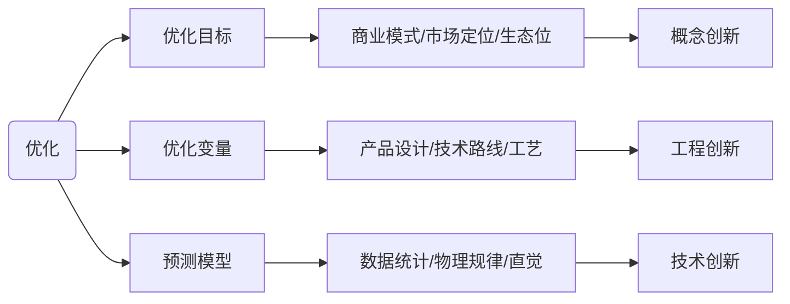

+++
title = 'Baseline_opt_in_Matlab可视化基线优化算法'
date = 2024-10-14T09:27:50+08:00
draft = false
mathkatex = true
categories = ['matlab']
tags = ['matlab', 'optimization', 'baseline', '优化', '基线算法']
toc = true
tocBorder = true
+++


## 优化

优化，是一个很高大上的词语，但是在实际工作中，优化通常是一个很无趣而平凡的事情。

顾名思义，优化，也就是使之更优。优化因此有两个核心的要素：

- 优化的目标，何为优，至少这是一个可以量化且有序（这里先不纠结什么偏序、全序）的指标。
- 优化时可以调整的因素，也就是优化变量，变量可以是连续的，也可以是离散的。

用数学语言来描述：

$$
\begin{aligned}
\arg\max_{x} & f(x) \\
 & x \in \Omega
\end{aligned}
$$


在实际的工程中，优化最大的问题基本上是预测的问题，也就是说 $f(x)$。这个问题实际上又是三个问题：

- 到底把什么东西定为优化目标，这个问题说起来轻松，其实是商业公司和商业模式中的核心问题，很多时候是大企业的核心竞争力，通常这是概念创新的核心来源。
- 确定优化变量，到底哪些变量对优化目标有有影响？确定优化变量之后，又如何确定优化变量可能的范围？这部分通常是工程创新来源。
- 怎么预测优化变量和优化目标之间的关系，这部分通常是技术创新的来源。



这个三个问题，说起来通常不是特别简单，使用也不是特别简单，所以基本上，创新都是虚无缥缈的东西。

以上就是我们在讨论优化之前不花钱就能思考的一些无聊的问题。下士闻道，大笑之，不笑不足以为道。

所以，作为一个工程狗，我也不搞上面那些高大上的，我就来讨论最简单的。一个函数，怎么找到它的最大值。这就是最优化算法的范畴。


## 最优化算法

### 优化问题

对上面讨论过的优化问题，再写得明确一点，我们纠正对一个目标，也就是函数 $f(x)$ 是一个数字；优化变量 $x$ 是可能有若干个，当然我们最容易看到的就是一维和二维的情况。

$$
\begin{aligned}
\arg\max_{\mathbf{x}} & f(\mathbf{x}) \\
 & \mathbf{x}=[x_1, x_2, \ldots, x_n] \in \Omega = I_1 \times I_2 \times \ldots \times I_n
\end{aligned}
$$

因为一维和二维的情况容易可视化。

对于一维为题，非常直观，

$$
y = f(x), x \in [a, b]
$$

下面是曲线 $y = sin(x) - cos(2x), x\in[0,10]$ ，我们要找到这条曲线的最大值。


这个一维的山峰，有三个山尖，最高的有两个。

对于二维问题，我们人类也有很好的直观，就是爬山，一个山峰，我们要找到山顶。下面结合优化算法，我们会给一个二维的山峰的例子。

$$
z = f(x, y), x \in [a, b], y \in [c, d]
$$

下面是一个二维的例子，变量、目标函数和数学关系直观的用图表达出来。

- 可以用`contour`函数来表示目标函数的等高线。
- 可以用`surf`函数来表示目标函数的三维图像。


```matlab
[x, y, z] = peaks();
contour(x, y, z, 20);
exportgraphics(gcf, 'peaks-contour.png', Resolution=100);
surf(x, y, z);
exportgraphics(gcf, 'peaks.png', Resolution=100);
```


这两个概念都是非常容易理解和接受的，所以我们讨论优化算法的时候通常会用这样的例子的解释搜索的过程，思考搜索的效果。

### 几个额外的概念

上面两个例子，优化变量取一个实数区间中的连续值，目标为一维变量，优化变量与目标的函数关系是一个映射，在一维和二维的情况下，我们可以直观的看到这个映射关系。通常我们在讨论优化算法是，还会定义如下的概念：

- 设计空间：优化变量的取值范围，也就是上面的 $\Omega$。
- 目标空间：目标函数的取值范围，也就是 $f(\mathbf{x})$ 的取值范围。
- 局部最优：在设计空间中，存在一个局部区域，使得在这个区域内，目标函数的值最大。
- 全局最优：在设计空间中，存在一个区域，使得在这个区域内，目标函数的值最大。

通常我们也会把优化的过程称为搜索设计空间，所以优化算法通常也被称为搜索算法。下面就介绍两个可以作为基线的搜索算法，通常可以用于比较其他优化算法的性能。

最后一个概念就是优化的计算代价问题。一般而言，优化算法的代码有优化计算的代价和求值目标函数的代价两个部分。对于不同的应用，这两个代价的权重也会不同。对于大部分停留在课本上的优化目标函数，求值目标函数的代价很低，通常会考虑优化算法的计算复杂度；但是在实际的优化应用中，目标函数的建立通常是整个任务成本最高的部分之一，因此通常会把求值目标函数的次数作为优化代价的一个最重要指标。

## 基线算法
### 网格搜索

网格搜索法的思路很简单，就是把设计空间分成若干个互不相交、通常大小相等、全覆盖的小区域，然后在每个小区域中选择样本点进行求值，找到所有样本点中最大的那个作为最优解。

那么最简单最简单的就是，把 $\mathbb{R}^n$ 按照坐标等分，组成一个网格，对这些网格点进行求值，找到最大值。

如果设计变量是自然数 $\mathbb{N}^n$ ，那么最自然的网格搜索方法就是穷举法。我忘记小学几年级时自行领悟的穷举法，支持我数学成绩一路飘红，甚至高中参加奥数得了省奖，虽然智商有限再也不得寸进，不过穷举法之力，可破万法。

并且，网格搜索还有一个很好的性质，就是能够通过网格搜索明确找到一个几乎是全局最优解的解，在实际工程中，尤其是考虑到还需要选择鲁棒的设计方案时，这个特性就非常好。

网格搜索法就是一个好的初始值的选择方法。在这个基础上还有一些变体，比如拉丁超立方体采样、Sobol采样，就是在网格搜索的基础上，加入了一些随机性。

穷举法的最大问题就是求解问题的精度提升跟需要的计算量之间是指数关系，所以维数诅咒问题非常严重。

### 随机搜索

随机搜索概念更加简单，就是摆烂。当问题的维数太高之后，一看就没有希望通过网格搜索来完成真正的最优化。那就在有限的预算（目标函数的求值次数）之中，随机选择若干点，在这些采样点中找到最大值作为结果。

随机搜索当然也有一个比较稳定的收敛特性……这个的概率推导我不会，但是我看过……不想看。

随机搜索的好处不多，但是在实际工程中，大部分现代优化算法都是随机+xxX的形式。而且，作为优化算法的基线，随机算法是一个很好很好很好的选择。因为提出一个优化算法，总得证明自己比瞎选好吧。


### 优化过程的可视化

最后，给出一个 `peaks` 函数的优化过程的可视化。这个可视化是一个动态的过程，每次迭代都会更新图像。


下面的代码可以产生上面的动态图像。

```matlab
function ballOnPeaks(n, visible, fn)

    arguments
        n (1, 1) int32 {mustBeNumeric, mustBePositive} = 10
        visible string {validatestring(visible, ["on", "off"])} = "on"
        fn {mustBeTextScalar} = "gridVrand.gif"
    end

    % Fix gif extension for exportgraphics
    if ~endsWith(fn, ".gif")
        fn = sprintf("%s.gif", fn);
    end

    [sx, sy, sz] = peaks(n);
    pointCount = n * n;

    szMax = max(sz(:));

    xmin = min(sx, [], 'all');
    xmax = max(sx, [], 'all');
    ymin = min(sy, [], 'all');
    ymax = max(sy, [], 'all');

    % rand - Random number generator, uniform distribution in [0, 1]
    randX = @()(rand() * (xmax - xmin) + xmin);
    randY = @()(rand() * (ymax - ymin) + ymin);

    F = scatteredInterpolant(sx(:), sy(:), sz(:));
    func = @(x, y)F(x, y);

    h = figure(Visible = visible);

    surf(sx, sy, sz, EdgeColor = "none", FaceAlpha = 0.75);
    set(gca, xlim = [-3, 3], ylim = [-3, 3], zlim = [-12, 12]);
    view(-45, 30);
    axis off
    grid off
    box off
    hold on

    x0 = randX();
    y0 = randY();
    z0 = func(x0, y0);

    m = plot3(x0, y0, z0, "o", ...
        "MarkerFaceColor", "red", ...
        "MarkerSize", 5);

    mBest = plot3(x0, y0, z0, "v", ...
        "MarkerFaceColor", "green", ...
        "MarkerSize", 8);

    if exist(fn, 'file')
        delete(fn);
    end

    title(sprintf("Walk count %3d/%3d - Highest position: %.2f/%.2f", 1, pointCount, z0, szMax));

    exportgraphics(gca, fn, Resolution = 100, Append = true);

    for t = 1:pointCount - 1
        m.XData = randX();
        m.YData = randY();
        m.ZData = func(m.XData, m.YData);

        if mBest.ZData < m.ZData
            mBest.XData = m.XData;
            mBest.YData = m.YData;
            mBest.ZData = m.ZData;
        end

        % set(gca, xlim = [-3, 3], ylim = [-3, 3], zlim = [-12, 12]);
        title(sprintf("Walk count %3d/%3d - Highest position: %.2f/%.2f", t + 1, pointCount, mBest.ZData, szMax));
        % view(-45, 30);

        drawnow
        exportgraphics(gca, fn, Resolution = 100, Append = true);
    end

    close(h);
```

[代码](/matlab-code/ballOnPeaks.m)

这段代码中还是有好几个挺好玩的Matlab细节的。

1. `arguments` 语法，这个是Matlab 2019b之后的新特性，用来替代旧的 `nargin` 和 `nargout` 语法。这个方法可以很方便的对输入参数进行类型检查和默认值设置。
2. `scatteredInterpolant` 函数，这个函数是用来对散点数据进行插值的，这个函数的使用方法和 `interp1`、`interp2`、`interp3` 函数类似，但是这个函数可以处理任意维度的数据。
3. `min/max` 来求多维矩阵所有元素的最大最小值，有两种调用方式，`min/max(m(:))` 和 `min/max(m, [], 'all')`，这两种方式是等价的，实际的时间代价也相当。我喜欢前一种，但是有些时候也要用后一种。
4. `exportgraphics` 函数，配合`Append`参数，可以很方便的生成动态图像。注意设置分辨率，否则生成的图像会很大……很大很大
5. 通过设置数据的方式，配合`drawnow`函数，可以实现动态图像的更新。
6. 创造一个 `figure` 的时候，可以通过设置 `Visible` 参数来控制是否显示图像。这个在生成动态图像的时候非常有用。

### 等高线可视化

稍微更改，就能产生用等高线可视化的同样过程。


```matlab
function ballOnPeaksContour(n, visible, fn)

    arguments
        n (1, 1) int32 {mustBeNumeric, mustBePositive} = 10
        visible string {validatestring(visible, ["on", "off"])} = "on"
        fn {mustBeTextScalar} = "gridVrandContour.gif"
    end

    % Fix gif extension for exportgraphics
    if ~endsWith(fn, ".gif")
        fn = sprintf("%s.gif", fn);
    end

    [sx, sy, sz] = peaks(n);
    pointCount = n * n;

    szMax = max(sz(:));

    xmin = min(sx, [], 'all');
    xmax = max(sx, [], 'all');
    ymin = min(sy, [], 'all');
    ymax = max(sy, [], 'all');

    % rand - Random number generator, uniform distribution in [0, 1]
    randX = @()(rand() * (xmax - xmin) + xmin);
    randY = @()(rand() * (ymax - ymin) + ymin);

    F = scatteredInterpolant(sx(:), sy(:), sz(:));
    func = @(x, y)F(x, y);

    h = figure(Visible = visible);

    contour(sx, sy, sz, 20);
    set(gca, xlim = [-4, 4], ylim = [-4, 4]);
    axis off
    grid off
    box off
    hold on

    x0 = randX();
    y0 = randY();
    z0 = func(x0, y0);

    m = plot(x0, y0, "o", ...
        "MarkerFaceColor", "red", ...
        "MarkerSize", 5);

    mBest = plot(x0, y0, "v", ...
        "MarkerFaceColor", "green", ...
        "MarkerSize", 8);
    mBestZData = z0;

    if exist(fn, 'file')
        delete(fn);
    end

    title(sprintf("Walk count %3d/%3d - Highest position: %4.2f/%4.2f", 1, pointCount, z0, szMax));

    exportgraphics(gca, fn, Resolution = 100, Append = true);

    for t = 1:pointCount - 1
        m.XData = randX();
        m.YData = randY();
        ZData = func(m.XData, m.YData);

        if mBestZData < ZData
            mBest.XData = m.XData;
            mBest.YData = m.YData;
            mBestZData = ZData;
        end

        title(sprintf("Walk count %3d/%3d - Highest position: %4.2f/%4.2f", t + 1, pointCount, mBestZData, szMax));

        drawnow
        exportgraphics(gca, fn, Resolution = 100, Append = true);
    end

    close(h);
```

[代码](/matlab-code/ballOnPeaksContour.m)


## 总结

1. 优化是一个很高大上的词语，但是在实际工作中，优化通常是一个很无趣而平凡的事情。
2. 优化算法的基线通常会选择网格搜索和随机搜索。
3. 水论文总是要搞点优化，千万别太在意，也别太伤感情，每件事情都有代价，优化一样。