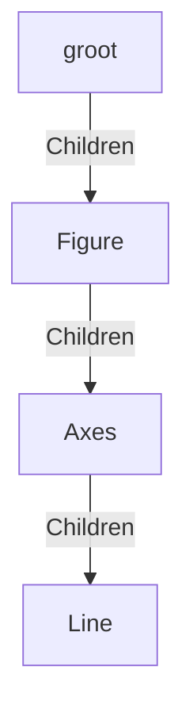

+++
title = 'Common_Plots_Matlab常见二维绘图'
date = 2024-10-28T10:09:00+08:00
draft = false
mathjax = false
categories = ['matlab']
tags = ['matlab', 'plots', 'tutorial']
toc = true
tocBorder = true
+++


##  常用的二维绘图

常用绘图包括下面的种类：

- 线图， `plot`
- 柱图， `bar`
- 梯步图，`stairstep`
- 误差棒图，`errorbar`
- 极坐标图，`polarplot`
- 跟图，`stem`
- 散点图，`scatter`

这些命令都可以通过`help xxx`来查看基本的帮助，并通过`doc xxx`来查看详细的帮助，帮助中通常还有海量的例子来学习如何调用，并且在高版本的Matlab里面，还能打开相应的LiveScript，修改参数查看绘图结果。

详细介绍每个函数感觉必要性不大，还不如看一些通用的概念，能够更好应对实际应用中可能出现的状况。

## 图形窗口和坐标系

首先对于一个图形，最基本的两个概念就是：

1. 图形窗口
2. 坐标系

这两个前者是实体的画布，后者是概念的画布。实际的图线，都要画在图形窗口的像素上；而图线对应点的坐标数据，则映射在坐标系中。

在实际的对象层次结构中，Matlab中图形窗口对象`Figre`有一个属性`Childeren` ，是一个数组，中间有若干坐标系；而代表坐标系的`Axes` ，也有一个属性`Children` ，也是一个数组，里面放着若干图形对象。



对下面这个例子可以看到相应的关系。


```matlab
x = 0:0.1:2*pi;
y = sin(x);

% 
f = gcf;  % 如果当前没有活动的窗口句柄则自动调用`gcf`创建一个图形窗口
a = gca;

% l = plot(x, y); 自动调用`gca`获得默认的笛卡尔坐标系
l = plot(a, x, y);

a1 = sprintf('图线对象是否在坐标系的Children中：       %d\n', ismember(l, a.Children));
a2 = sprintf('坐标系对象是否在图形窗口的Children中：%d\n', ismember(a, f.Children));

title([a1 a2])
```


​    


​    

​    


这里，我们用`gcf`来得到一个图窗对象，用`gca`来得到一个默认的笛卡尔坐标系。实际上，我们调用上述绘图函数的时候，可以把第一个参数设置为一个坐标系对象，如果省略这个参数，Matlab会自动调用`gca`来作为坐标系对象，并把绘图函数返回的图形对象加入（`append`）到对应坐标系的`Children`属性中。

`gcf`和`gca`两个函数都是称为`lazy`的函数，如果最近有一个句柄可见（`Figure`和`Axes`对象的`HandleVisibility`属性）的对象，就返回，如果没有，那就新建一个。这个过程是逐级向上的。例如，我们在没有图形窗口的情况下调用`gca`，就会触发如下的流程。

1. 通过`groot`的`Children`逐步找下来，看是否有一个句柄可见的`Axes`对象
2. 没有的话需要新建一个`Axes`
    3. `gcf`一个y图窗`Figure`对象
        4. 试图从`groot`的`Children`逐步找下来，没有找到一个句柄可见的`Figure`对象
        5. 新建一个`Figure`对象，添加到`groot`的`Children`中
    6. 把新建的坐标系添加到图窗的`Children`中
7. 返回坐标系对象

我们可以自己在`groot`开始，翻找`Children`构成的树结构，也可以调用函数`findobj`来看看组合条件查看对象，当然直接调用不带任何参数返回所有的图形对象。


```matlab
help findobj
```

     findobj - 查找具有特定属性的图形对象
        此 MATLAB 函数 返回图形根对象及其所有后代。
    
        语法
          h = findobj
          h = findobj(prop,value)
          h = findobj('-not',prop,value)
          h = findobj(prop1,value1,oper,prop2,value2)
          h = findobj('-regexp',prop,expr)
          h = findobj('-property',prop)
          h = findobj(prop1,value1,...,propN,valueN)
          h = findobj(objhandles,___)
          h = findobj(objhandles,'-depth',d,___)
          h = findobj(objhandles,'flat',___)
    
        输入参数
          prop - 属性名称
            字符向量 | 字符串标量
          value - 属性值
            标量 | 数组
          oper - 逻辑运算符
            '-and' (默认值) | '-or' | '-xor'
          expr - 正则表达式
            字符串数组 | 字符向量 | 字符向量元胞数组
          objhandles - 要从中搜索的对象
            图形对象数组
          d - 搜索深度
            非负整数
    
        示例
          openExample('graphics/ReturnAllGraphicsObjectsExample')
          openExample('graphics/FindAllLineObjectsExample')
          openExample('graphics/FindObjectsWithSpecifiedPropertyValuesExample')
          openExample('graphics/FindObjectsWithoutSpecificPropertyValuesExample')
          openExample('graphics/FindObjectsUsingRegularExpressionExample')
          openExample('graphics/FindAllObjectsWithSpecifiedPropertyExample')
          openExample('graphics/FindAllLineObjectsInCurrentAxesExample')
          openExample('graphics/ReturnAllObjectsInCurrentFigureExample')
          openExample('graphics/RestrictSearchDepthExample')
    
        另请参阅 copyobj, findall, findobj, gcf, gca, gcbo, gco, get, regexp,
          set, groot
    
        已在 R2006a 之前的 MATLAB 中引入
        findobj 的文档
           doc findobj
    
        findobj 的其他用法
    
           handle/findobj    qrandstream/findobj


这个函数的功能非常强大，可以通过各种条件来查找对象，例如查找所有的`Line`对象，查找所有的`Axes`对象，查找所有的`Figure`对象等等。还能通过设置逻辑条件，正则表达式等等来查找对象。
​    

### 图像窗口

图像窗口的创建，可以用下面的函数来实现：

- `gcf`
- `figure`
- `figure('Name', 'xxx')`

这些函数返回一个`Figure`对象，可以通过`get`和`set`来查看和修改属性。属性的修改，也能够用过`f.Name = 'xxx'`这样的方式来实现。此外，调用操作坐标系的函数以及绘图函数（自动调用坐标系创建），也会自动修改图形窗口的属性。


```matlab
f = gcf;

get(f)
```

得到所有属性的列表如下，可以自己查看。


                     Alphamap: [0 0.0159 0.0317 0.0476 0.0635 0.0794 0.0952 0.1111 0.1270 0.1429 0.1587 0.1746 0.1905 ... ] (1x64 double)
                 BeingDeleted: off
                   BusyAction: 'queue'
                ButtonDownFcn: ''
                     Children: [0x0 GraphicsPlaceholder]
                     Clipping: on
              CloseRequestFcn: 'closereq'
                        Color: [0.9400 0.9400 0.9400]
                     Colormap: [256x3 double]
                  ContextMenu: [0x0 GraphicsPlaceholder]
                    CreateFcn: ''
                  CurrentAxes: [0x0 GraphicsPlaceholder]
             CurrentCharacter: ''
                CurrentObject: [0x0 GraphicsPlaceholder]
                 CurrentPoint: [0 0]
                    DeleteFcn: ''
                 DockControls: on
                     FileName: ''
            GraphicsSmoothing: on
             HandleVisibility: 'on'
                         Icon: ''
                InnerPosition: [680 458 560 420]
                IntegerHandle: on
                Interruptible: on
               InvertHardcopy: on
                  KeyPressFcn: ''
                KeyReleaseFcn: ''
                      MenuBar: 'figure'
                         Name: ''
                     NextPlot: 'add'
                       Number: 1
                  NumberTitle: on
                OuterPosition: [676 454 568 454]
             PaperOrientation: 'portrait'
                PaperPosition: [0 0 5.8333 4.3750]
            PaperPositionMode: 'manual'
                    PaperSize: [8.2677 11.6929]
                    PaperType: 'A4'
                   PaperUnits: 'inches'
                       Parent: [1x1 Root]
                      Pointer: 'arrow'
            PointerShapeCData: [16x16 double]
          PointerShapeHotSpot: [1 1]
                     Position: [680 458 560 420]
                     Renderer: 'opengl'
                 RendererMode: 'auto'
                       Resize: on
                   Scrollable: off
                SelectionType: 'normal'
               SizeChangedFcn: ''
                          Tag: ''
                      ToolBar: 'auto'
                         Type: 'figure'
                        Units: 'pixels'
                     UserData: []
                      Visible: off
          WindowButtonDownFcn: ''
        WindowButtonMotionFcn: ''
            WindowButtonUpFcn: ''
            WindowKeyPressFcn: ''
          WindowKeyReleaseFcn: ''
         WindowScrollWheelFcn: ''
                  WindowState: 'normal'
                  WindowStyle: 'normal'


​ 同时，可以通过`help`来查看这个函数的帮助。 


```matlab
help figure
```

     figure - 创建图窗窗口
        此 MATLAB 函数 使用默认属性值创建一个新的图窗窗口。生成的图窗为当前图窗。
    
        语法
          figure
          figure(Name,Value)
          f = figure(___)
    
          figure(f)
          figure(n)
    
        输入参数
          f - 目标图窗
            Figure 对象
          n - 目标图窗编号
            整数标量值
    
        名称-值参数
          Name - 名称
            '' (默认值) | 字符向量 | 字符串标量
          Color - 背景色
            RGB 三元组 | 十六进制颜色代码 | 'r' | 'g' | 'b'
          Position - 可绘制区域的位置和大小
            [left bottom width height]
          Units - 测量单位
            'pixels' (默认值) | 'normalized' | 'inches' | 'centimeters' |
            'points' | 'characters'
    
        另请参阅 axes, gcf, gca, clf, cla, shg, Figure 属性
    
        已在 R2006a 之前的 MATLAB 中引入
        figure 的文档
           doc figure
​    
​    

### 坐标系对象

同样，坐标系对象的创建，可以用下面的函数来实现：

- `gca`
- `axes`

这些函数返回一个`Axes`对象，可以通过`get`和`set`来查看和修改属性。属性的修改，也能够用过`a.XLim = [0, 1]`这样的方式来实现。此外，调用绘图函数，也会自动修改坐标系的属性。


```matlab
a = gca;

get(a)
```

                            ALim: [0 1]
                        ALimMode: 'auto'
                      AlphaScale: 'linear'
                        Alphamap: [0 0.0159 0.0317 0.0476 0.0635 0.0794 0.0952 0.1111 0.1270 0.1429 0.1587 0.1746 0.1905 ... ] (1x64 double)
               AmbientLightColor: [1 1 1]
                    BeingDeleted: off
                             Box: off
                        BoxStyle: 'back'
                      BusyAction: 'queue'
                   ButtonDownFcn: ''
                            CLim: [0 1]
                        CLimMode: 'auto'
                  CameraPosition: [0.5000 0.5000 9.1603]
              CameraPositionMode: 'auto'
                    CameraTarget: [0.5000 0.5000 0.5000]
                CameraTargetMode: 'auto'
                  CameraUpVector: [0 1 0]
              CameraUpVectorMode: 'auto'
                 CameraViewAngle: 6.6086
             CameraViewAngleMode: 'auto'
                        Children: [0x0 GraphicsPlaceholder]
                        Clipping: on
                   ClippingStyle: '3dbox'
                           Color: [1 1 1]
                      ColorOrder: [7x3 double]
                 ColorOrderIndex: 1
                      ColorScale: 'linear'
                        Colormap: [256x3 double]
                     ContextMenu: [0x0 GraphicsPlaceholder]
                       CreateFcn: ''
                    CurrentPoint: [2x3 double]
                 DataAspectRatio: [1 1 1]
             DataAspectRatioMode: 'auto'
                       DeleteFcn: ''
                       FontAngle: 'normal'
                        FontName: 'Helvetica'
                        FontSize: 10
                    FontSizeMode: 'auto'
                   FontSmoothing: on
                       FontUnits: 'points'
                      FontWeight: 'normal'
                       GridAlpha: 0.1500
                   GridAlphaMode: 'auto'
                       GridColor: [0.1500 0.1500 0.1500]
                   GridColorMode: 'auto'
                   GridLineStyle: '-'
                   GridLineWidth: 0.5000
               GridLineWidthMode: 'auto'
                HandleVisibility: 'on'
                         HitTest: on
                   InnerPosition: [0.1300 0.1100 0.7750 0.8150]
              InteractionOptions: [1x1 matlab.graphics.interaction.interactionoptions.InteractionOptions]
                    Interactions: [1x1 matlab.graphics.interaction.interface.DefaultAxesInteractionSet]
                   Interruptible: on
         LabelFontSizeMultiplier: 1.1000
                           Layer: 'bottom'
                          Layout: [0x0 matlab.ui.layout.LayoutOptions]
                          Legend: [0x0 GraphicsPlaceholder]
          LineStyleCyclingMethod: 'aftercolor'
                  LineStyleOrder: '-'
             LineStyleOrderIndex: 1
                       LineWidth: 0.5000
                  MinorGridAlpha: 0.2500
              MinorGridAlphaMode: 'auto'
                  MinorGridColor: [0.1000 0.1000 0.1000]
              MinorGridColorMode: 'auto'
              MinorGridLineStyle: ':'
              MinorGridLineWidth: 0.5000
          MinorGridLineWidthMode: 'auto'
                        NextPlot: 'replace'
                 NextSeriesIndex: 1
                   OuterPosition: [0 0 1 1]
                          Parent: [1x1 Figure]
                   PickableParts: 'visible'
              PlotBoxAspectRatio: [1 0.7903 0.7903]
          PlotBoxAspectRatioMode: 'auto'
                        Position: [0.1300 0.1100 0.7750 0.8150]
              PositionConstraint: 'outerposition'
                      Projection: 'orthographic'
                        Selected: off
              SelectionHighlight: on
                      SortMethod: 'childorder'
                        Subtitle: [1x1 Text]
              SubtitleFontWeight: 'normal'
                             Tag: ''
                         TickDir: 'in'
                     TickDirMode: 'auto'
            TickLabelInterpreter: 'tex'
                      TickLength: [0.0100 0.0250]
                      TightInset: [0.0435 0.0532 0.0170 0.0202]
                           Title: [1x1 Text]
         TitleFontSizeMultiplier: 1.1000
                 TitleFontWeight: 'normal'
        TitleHorizontalAlignment: 'center'
                         Toolbar: [1x1 AxesToolbar]
                            Type: 'axes'
                           Units: 'normalized'
                        UserData: []
                            View: [0 90]
                         Visible: on
                           XAxis: [1x1 NumericRuler]
                   XAxisLocation: 'bottom'
                          XColor: [0.1500 0.1500 0.1500]
                      XColorMode: 'auto'
                            XDir: 'normal'
                           XGrid: off
                          XLabel: [1x1 Text]
                            XLim: [0 1]
                        XLimMode: 'auto'
                    XLimitMethod: 'tickaligned'
                      XMinorGrid: off
                      XMinorTick: off
                          XScale: 'linear'
                           XTick: [0 0.1000 0.2000 0.3000 0.4000 0.5000 0.6000 0.7000 0.8000 0.9000 1]
                      XTickLabel: {11x1 cell}
                  XTickLabelMode: 'auto'
              XTickLabelRotation: 0
          XTickLabelRotationMode: 'auto'
                       XTickMode: 'auto'
                           YAxis: [1x1 NumericRuler]
                   YAxisLocation: 'left'
                          YColor: [0.1500 0.1500 0.1500]
                      YColorMode: 'auto'
                            YDir: 'normal'
                           YGrid: off
                          YLabel: [1x1 Text]
                            YLim: [0 1]
                        YLimMode: 'auto'
                    YLimitMethod: 'tickaligned'
                      YMinorGrid: off
                      YMinorTick: off
                          YScale: 'linear'
                           YTick: [0 0.1000 0.2000 0.3000 0.4000 0.5000 0.6000 0.7000 0.8000 0.9000 1]
                      YTickLabel: {11x1 cell}
                  YTickLabelMode: 'auto'
              YTickLabelRotation: 0
          YTickLabelRotationMode: 'auto'
                       YTickMode: 'auto'
                           ZAxis: [1x1 NumericRuler]
                          ZColor: [0.1500 0.1500 0.1500]
                      ZColorMode: 'auto'
                            ZDir: 'normal'
                           ZGrid: off
                          ZLabel: [1x1 Text]
                            ZLim: [0 1]
                        ZLimMode: 'auto'
                    ZLimitMethod: 'tickaligned'
                      ZMinorGrid: off
                      ZMinorTick: off
                          ZScale: 'linear'
                           ZTick: [0 0.5000 1]
                      ZTickLabel: ''
                  ZTickLabelMode: 'auto'
              ZTickLabelRotation: 0
          ZTickLabelRotationMode: 'auto'
                       ZTickMode: 'auto'


​    
​默认创建的笛卡尔坐标系，两个坐标轴的范围都是`[0, 1]`，可以通过`a.XLim`和`a.YLim`来查看和修改。

​    

​    


```matlab
help axes
```

     axes - 创建笛卡尔坐标区
        此 MATLAB 函数 在当前图窗中创建默认的笛卡尔坐标区，并将其设置为当前坐标区。通常情况
        下，您不需要在绘图之前创建坐标区，因为如果不存在坐标区，图形函数会在绘图时自动创建坐标
        区。
    
        语法
          axes
          axes(Name,Value)
          axes(parent,Name,Value)
          ax = axes(___)
    
          axes(cax)
    
        输入参数
          parent - 父容器
            Figure 对象 | Panel 对象 | Tab 对象 | TiledChartLayout 对象 |
            GridLayout 对象
          cax - 要设置为当前坐标区的坐标区
            Axes 对象 | PolarAxes 对象 | GeographicAxes 对象 | 独立可视化
    
        名称-值参数
          Position - 大小和位置，不包括标签边距
            [0.1300 0.1100 0.7750 0.8150] (默认值) | 四元素向量
          OuterPosition - 大小和位置，包括标签和边距
            [0 0 1 1] (默认值) | 四元素向量
          Units - 位置单位
            "normalized" (默认值) | "inches" | "centimeters" | "points" |
            "pixels" | "characters"
    
        示例
          openExample('graphics/DefineMultipleAxesInFigureWindowExample')
          openExample('graphics/MakeSpecificAxesTheCurrentAxesExample')
          openExample('graphics/CreateAxesInUITabsExample')
    
        另请参阅 Axes 属性, axis, cla, gca, figure, clf, tiledlayout, nexttile,
          polaraxes
    
        已在 R2006a 之前的 MATLAB 中引入
        axes 的文档
           doc axes


对于`Axes`所有属性和设置的例子，文档同样列写得非常齐全。​    
​    
​    

## 一个坐标系绘制多个图形

当我们调用`plot`函数时，可以直接提供多组数据，此时，Matlab会自动绘制多个图形，每个图形对应一组数据。返回的也是对应的图形对象的句柄。

可以通过对句柄的操作，来修改图形的属性，例如颜色，线型，线宽等等。


```matlab
x = 0:0.1:2*pi;
y1 = sin(x);
y2 = cos(x);

h = plot(x, y1, x, y2);

h(1).Color = 'r';
h(2).Color = 'b';

h(1).LineWidth = 1;
h(2).LineWidth = 4;
```
   


​    

​    


另外，我们也能通过`hold('off')`和`hold('on')`来控制是否保留原有的图形，这样也可以实现在一个坐标系中绘制多个图形。

绘制完毕图像，或者导入通过`savefig`保存的图像之后，还能通过`findobj`来查找图形对象，然后对其进行操作。


```matlab
x = 0:0.1:2*pi;
y1 = sin(x);
y2 = cos(x);

plot(x, y1)
hold('on');

plot(x, y2);


% savefig('test.fig')
% close('all')

% openfig('test.fig')

h = findobj(gca, 'Type', 'line');

h(1).Color = 'r';
h(2).Color = 'b';

h(1).LineWidth = 4;
h(2).LineWidth = 1;
```


​    


​    

​    


## 多坐标系绘图

把多个坐标系放在一个图形中，在发表论文的过程中是很常规的操作。以前Matlab采用的是`subplot`函数，现在推荐使用`tiledlayout`和`nexttile`函数。


```matlab
% subplot example

f = figure;

a1 = subplot(2, 1, 1);
x = 0:0.1:2*pi;
y = sin(x);
plot(a1, x, y);

a2 = subplot(2, 1, 2);
y = cos(x);
plot(a2, x, y);
```


​    


​    

​    


用新的工具，可以更加方便的控制坐标系的位置和大小，以及坐标系之间的间距。这个工具的使用方法，可以参考`doc tiledlayout`和`doc nexttile`。

下面是一个非常简单的例子，展示了如何使用这个工具。


```matlab
tiledlayout(2,2);
[X,Y,Z] = peaks(20);

% Tile 1
nexttile
surf(X,Y,Z)

% Tile 2
nexttile
contour(X,Y,Z)

% Tile 3
nexttile
imagesc(Z)

% Tile 4
nexttile
plot3(X,Y,Z)
```


可以看到，每个`Axes`都是一个独立可以进行二维乃至三维绘图的区域。从这一点上来看，Matlab的绘图功能的确比Python的matplotlib要强不少。   


​    

​    


更加复杂的布局方式，还可以通过，`nexttile([2, 2])`这样的方式来实现多行多列的子图。


```matlab
scores = [444 460 380 
          387 366 500 
          365 451 611 
          548 412 452];

strikes = [9  6  5  
           6  4  8 
           4  7  16  
           10 9  8];
     
t = tiledlayout('flow');

% Team 1
nexttile
plot([1 2 3 4],strikes(:,1),'-o')
title('Team 1 Strikes')

% Team 2
nexttile
plot([1 2 3 4],strikes(:,2),'-o')
title('Team 2 Strikes')

% Team 3
nexttile
plot([1 2 3 4],strikes(:,3),'-o')
title('Team 3 Strikes')

% 设置两行三列的子图
nexttile([2 3]);
bar([1 2 3 4],scores)
legend('Team 1','Team 2','Team 3','Location','northwest')

% Configure ticks and axis labels
xticks([1 2 3 4])
xlabel('Game')
ylabel('Score')

% Add layout title
title(t,'April Bowling League Data')
```


`tiledlayout`可以通过参数设置横向、纵向、流式布局等等，具体的参数可以参考`doc tiledlayout`。最后那个`nexttile([2 3])`的参数，可以设置子图的大小，这个参数是一个二维数组，第一个元素是行数，第二个元素是列数。

​    

​    


同样，我们也能通过`help`和`doc`来查看这些函数的帮助。

- `doc tiledlayout`
- `doc nexttile`
- `doc tilenum`
- `doc tilerowcol`

这四个函数全部需要R2022b以后的版本。

实际上，这个话题值得单独开一个帖子来讨论。

