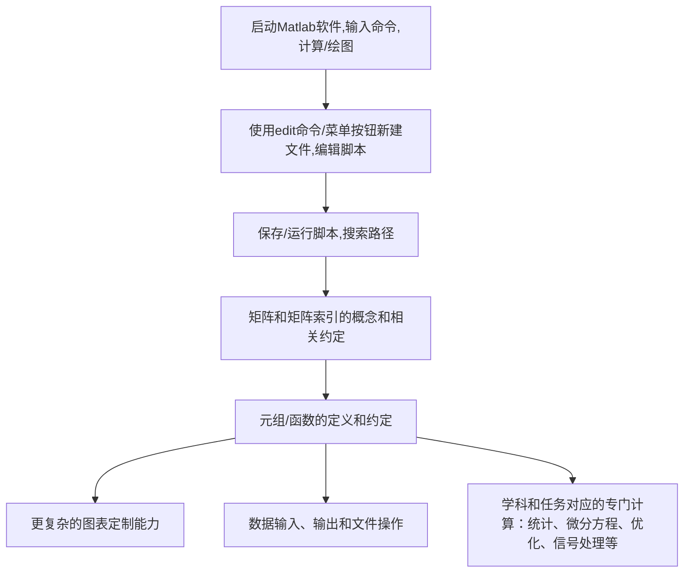
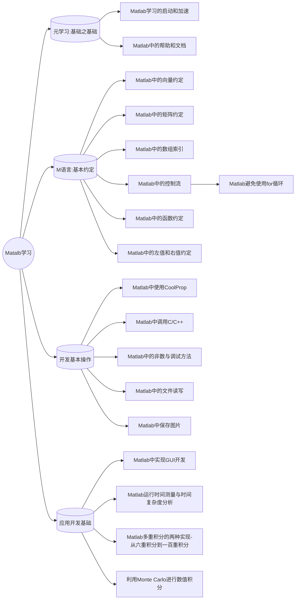

+++
title = 'Roadmap to Learning Matlab学习路线图'
date = 2024-09-09T07:54:31+08:00
draft = false
mathjax = false
categories = ['matlab']
tags = ['Matlab','编程', '编程','学习路径', '加速学习', '马特拉波']
toc = true
tocBorder = true
+++

## 学习路线
gi
下面这个是Matlab的基本使用途径.从能够找到Matlab的快捷方式和运行方式开始.

## Matlab基本操作能力检查表

### 启动Matlab软件:
- [ ] 打开Matlab,找到输入命令的命令行`>>`
- [ ] 输入`help`,回车
- [ ] 输入`1+2`,回车
- [ ] 输入`plot(rand(100,1))`,回车

### 脚本编写:
- [ ] 输入命令`edit script1`
- [ ] 使用菜单`新建脚本`
- [ ] 在脚本中输入`plot(rand(100,1))`,并保存,再次打开
- [ ] 运行`script`,显示绘图
- [ ] 使用`path`,`help addpath`命令

### 矩阵:
- [ ] 使用`magic(6)`创建一个矩阵
- [ ] 运行`A = magic(6)`,创建一个矩阵变量
- [ ] 查看矩阵的维数,形状和长度
- [ ] 访问矩阵的单独元素`A(1,1)`,`A(end, end)`
- [ ] 访问矩阵的行与列`A(1,:)`, `A(:,1)`
- [ ] 以向量的方式访问矩阵`A(:)`
- [ ] 矩阵的基本运算, `A * A`, `A'`, `inv(A)`, `det(A)`
- [ ] 矩阵的逐元计算, 点运算的概念, `A .* A`, `A ./ A`

### 函数
- [ ] `edit func1`编辑和保存函数
- [ ] 函数的返回值, `function y = func1(x)`
- [ ] `func1(...)`调用函数
- [ ] 函数句柄`fh = @func1`的使用`fret = feval(@func1, ...)`
- [ ] 定义一个临时函数`f = @(x) x + 1`
- [ ] 使用临时函数,`y = f(1)`, `y = feval(f, 1)`

### 元组与结构体
- [ ] 定义元组`cell(2, 3)`
- [ ] 访问元组的元素`cell{1, 1}`
- [ ] 访问元组的部分`cell(1, 1)`
- [ ] 定义结构体,访问结构体的域
- [ ] 结构体数组的域构成数组

### 绘图
- [ ] 基本2D绘图, 标题, 坐标轴, 网格
- [ ] 图形文件存储和图形文件导出
- [ ] 不同的图形种类, 线图,散点图,柱图等等
- [ ] 基本3D绘图, `plot3`
- [ ] 不同3D图形类型, 面图, 网线图, 等等

### 应用开发
- [ ] 程序性能评估与性能瓶颈, `profile`工具
- [ ] 程序调试, `dbstop`, `dbcont`, `dbstep`及调试工具栏
- [ ] 文件操作, 数据导入
- [ ] 基本GUI编程

## 本系列的构成和逻辑关系 

## 参考资料

- [Matlab官方文档](https://www.mathworks.com/help/matlab/index.html)
- `Matlab`软件自带的帮助文档
- `Matlab`软件自带的示例代码
- `Matlab`软件自带的`demo`文件夹

## 结语

Matlab其实是学习成本非常低的, 关键还在于业务. 我见过很多只在本科学过C语言的科研工作者(10年前), 一晚上就开始写Matlab脚本画图的. Matlab的学习几个原则:

- 业务驱动, 关键问题是用来干什么
- 照抄, 从别人的代码开始
- 克服完美主义, 什么都在命令行下面试一下, 从错误中学习, 反复试