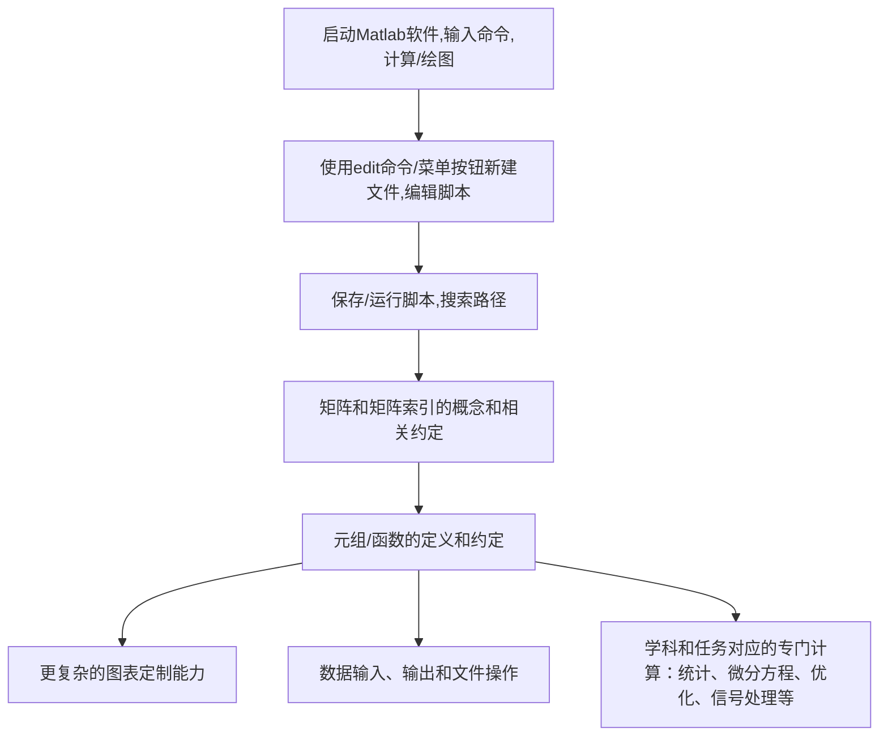

+++
title = 'Start to learn Matlab启动!'
date = 2024-09-04T11:31:59+08:00
draft = false
mathjax = true
categories = ['matlab']
tags = ['Matlab','编程', '编程','学习路径', '加速学习', '马特拉波']
toc = true
tocBorder = true
+++

## 前言

这是一个Matlab专题,对过去Matlab帖子的修订和完善.

这个系列的开始,也是一个随机发生的小概率事件,本来Python(PyQt)、JavaFX(Kotlin)和F#三个系列的写到F#的时候已经有点觉得失去了激情,可能还需要一个契机才有可能回到F#的写作,因为那个用F#做的项目已经大概告一段落,本来还想着好好写写Domain Driven in F#什么的.

接着因为硕士组里有个孩子缺篇EI,其实那孩子的中文期刊文章写得挺好,工作进展也不错,但是学校有那种奇怪的要求,于是就赶工弄一个EI会议文章.既然是赶工,那就用Matlab吧.

Matlab是一个很好很好的工具,M语言不是很好的语言.当年我硕士的时候,还用Matlab编过软件(包含GUI,用的GUIDE),反正体验不太美妙.

脚本语言的通病,写着写着就不知道变量和参数是什么,注释一堆加上改来改去,有时候注释没更新还不如没注释.当然既然是Matlab,那个规模就不会太大,好好调试怎么也能凑活着出图交账.

我自己没有正经学过Matlab,断断续续用过不少,也帮别人打过好多下手,就是给人家的Simulink模型调试数据、修改别人的githubMatlab脚本,或这自己要简单出个图(chart)之类的.

这次编一个小模型,弄点Monte Carlo模拟,突然激情上来,有点想把多年Matlab使用的经历和认识到的一些问题和技巧写下来,也算是给自己一个总结,也许对别人也有点帮助.

## Matlab的学习

> **Matlab的学习,从计算器开始.**

Matlab和所谓的M脚本语言,本质上就不是什么通用编程语言,最初的设计应该是作为一个需要开展数值计算的工程设计人员、科学家用的工具,用时髦的话来说,就是一个Domain Specific Language(DSL)领域特定语言.

但是随着Matlab的功能越来越强大,用户群体也越来越广泛,Matlab也在不断地向通用编程语言靠拢,比如加入了面向对象编程(OOP)的特性,比如加入了对.NET、Python等语言的支持.

在这些发展和进步的过程中,非常庆幸MathWorks公司一直没有忘记初心,这就是一个Matrix Laboratory,一个矩阵计算的实验室,一个大型计算器.

所以,对Matlab的学习,应该首先把它当一个卡西欧函数计算器来看待.有任何数字的问题,打开Matlab,在`>>`提示符下输入,回车,得到结果.

这就是学习Matlab和别的编程语言不完全一样的地方,不需要什么基础,不需要什么环境配置,不需要学会编程和调试,找一台有Matlab的电脑,双击点开,找到`>>`,就可以开始学习.

因为错误的代价非常的低,学习的起点也非常低.这就是Matlab的学习的第一步.

我家孩子还在二年级,已经学会在Windows、Linux的电脑上打开Matlab,输入`1+1`,回车,得到结果`2`.当然我们也可以输入`sin(2 * pi / 3)`,回车,得到结果`0.8660`.

    >> sin(2 * pi / 3)

    ans =

        0.8660

就这样挺好的.如果出错,Matlab就只会用红色的字体显示错误信息,不会弹出对话框,不会让你重新编译,不会让你重新启动,不会让你重新配置,不会让你重新安装.

    >> sin(2 * pi / 3
    sin(2 * pi / 3
                ↑
    无效表达式.调用函数或对变量进行索引时,请使用圆括号.否则,请检查不匹配的分隔符.
    
    是不是想输入:
    >> sin(2 * pi / 3)

是不是很好？这就是Matlab的学习的第一步.

## 从数字到矩阵

当然,一个成熟的工程师或者一个即将成为科学家的后备天才,他们不会满足于标量,他们会使用向量表达更高维度的数据,会用高阶张量来表达协变和逆变的关系,会描述高阶空间的转换和变换.

这就是Matlab的第二步,从数字到张量.

Matlab的张量,就是矩阵.矩阵是一个二维的张量,是一个行列的表格,是一个数字的数组.在Matlab里,矩阵是一个变量,是一个对象,是一个数据类型.

    >> A = [1, 2; 3, 4]

    A =

         1     2
         3     4

这个时候,线性代数的知识就派上用场了,我们可以用矩阵乘法、矩阵转置、矩阵求逆、矩阵行列式等等一系列的操作.

    >> B = [1, 2; 3, 4]

    B =

         1     2
         3     4

    >> A * B

    ans =

         7    10
        15    22

    >> A'

    ans =

         1     3
         2     4

    >> inv(A)

    ans =

        -2.0000    1.0000
         1.5000   -0.5000

    >> det(A)

    ans =

        -2.0000

## 从计算到绘图

Matlab的第三步,就是从计算到绘图.当开始计算向量、矩阵的时候,我们就会发现一个新的需求,就是把计算的结果可视化.标量的计算,我们可以直接看到结果,但是向量、矩阵的计算,我们就需要把结果绘制成图表才能更直观的理解.

Matlab的绘图功能非常强大,可以绘制各种类型的图表,包括线图、柱状图、饼图、散点图、等高线图、三维图等等.

    >> x = 0:0.1:2*pi;
    >> y = sin(x);
    >> plot(x, y);

Matalb的绘图函数还包括了很多的参数,可以设置线型、颜色、标记、标题、坐标轴等等.

    >> plot(x, y, 'r--o');
    >> title('sin(x)');
    >> xlabel('x');
    >> ylabel('y');

只需要学会使用一个命令`help plot`或者`doc plot`,就可以查看更多更多参数、示例和其它相关的函数.

## 从启动到加速

前面标量计算、矩阵计算、绘图,已经可以解决很多问题,可以看到这个过程中,完全不需要过多的编程知识,连什么文件、脚本、函数这些基本概念都不需要知道,就是算个数,画个图.

但是接下来的路径就会稍微有一点点颠簸.

基本上,作为一个工程师/研究人员,掌握这些就足够应付一般的科研工作.

## 这个系列的规划

最后回到这个系列文章.一开始,我都是用到哪里写到哪里,写着写着就上头决定要写300篇.我猜最后可能写不到300篇,但是我会把上面的路径遍历一下,把我认为重要的知识点和技巧写下来.

最后有几个认知：

1. Matlab是一个计算工具,其内嵌的脚本应该被当做一个DSL；
2. DSL的共同特点是**约定**特别多,所以学习DSL的第一步是识别约定和遵守约定；
3. 约定会节省大量的思考,也会形成简洁有效的表达,但是约定也会带来很多的困惑和错误；
4. 遇事不决先打几个命令试一下,工程师浑身油污不是没有原因的；
5. `help`命令、`doc`命令、`edit`命令、`lookfor`命令是Matlab的好朋友；
,所以学习DSL的第一步是识别约定和遵守约定；
3. 约定会节省大量的思考,也会形成简洁有效的表达,但是约定也会带来很多的困惑和错误；
4. 遇事不决先打几个命令试一下,工程师浑身油污不是没有原因的；
5. `help`命令、`doc`命令、`edit`命令、`lookfor`命令是Matlab的好朋友；
6. **约定**,在强调一下约定,一切以计算器输出为准,搞什么语言警察对于工程师来说没有意义,试下,能用就行.