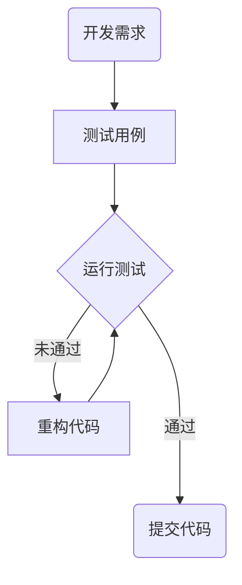

+++
title = 'TDD_in_Matlab中进行测试驱动开发（TDD）'
date = 2025-03-18T07:41:31+08:00
draft = false
mathkatex = true
categories = ['matlab']
tags = ['matlab','TDD','测试驱动开发', 'runtests', 'unittest']
toc = true
tocBorder = true
+++

## 什么是TDD

TDD（Test-Driven Development，测试驱动开发）是一种软件开发过程，它强调在编写代码之前先编写测试用例。TDD的流程通常包括以下几个步骤：

1. 编写测试用例：首先，开发人员编写针对代码的测试用例。这些测试用例通常使用单元测试框架（如JUnit、NUnit等）来编写。
2. 运行测试：然后，运行测试用例，确保它们失败。
3. 编写代码：接下来，开发人员编写代码来使测试用例通过。
4. 重构：最后，开发人员重构代码，确保它符合设计原则，并且易于维护。



## Matlab对TDD的支持

Matlab有一套完整的单元测试框架，可以方便地进行TDD。一般而言，最基础的单元测试框架需要包含以下两个部分：

- 测试用例编写
  - 断言工具
  - 测试数据管理
  - 测试用例的组织
- 测试用例运行
  - 自动化发现测试用例
  - 测试用例的执行
  - 测试结果的收集
  - 测试报告的生成

### 测试用例的编写

在Matlab中，定义测试用例可以有三个方式：基于脚本、基于函数、基于类。


- 基于脚本：每个测试单元写作脚本的一节，用`%%`分隔。
- 基于函数：每个测试单元写作一个文件的局部函数。
- 基于类：每个测试单元写作一个类的测试方法。

当然，脚本测试只能使用框架的基础断言工具，函数和类测试可以采用更高级的测试工具。我们首先从最简单的脚本测试开始。

### 测试用例的运行

对于脚本测试，一般使用`runtests`函数直接运行测试脚本文件。

如果显式地定义测试组件（`testsuite`或者`matlab.unittest.TestSuite`类），可以访问其他更加复杂的功能。当然，部分高级的功能还需要使用基于函数和类的测试。

如果还需要做一些比较复杂的事情，还可以使用`TestRunner`类来实现。

实用基于函数和类的测试，可以在运行时进行测试的组织和过滤，并可以定义测试的运行顺序、结果收集、测试报告等。

## 脚本测试工具

下面我们很随机的找一个需求来完成开发。我们假设，需要实现一个表达式的类，用于进行Genetic Programming。

我们的需求是什么样的呢？

表达式：

- 值，这个值在表达式中保持不变，C1，C2，C3，...
- 变量，这个变量在表达式中可以变化，X1，X2，X3，...
- 函数，函数需要输入N个参数，每个参数同样是表达式

这个递归的定义，可以很自然地用一个类来表示。

### 编写测试用例

```matlab
{}
```

我们先不要搞太复杂，只实现常量、变量和函数。

### 运行测试

我们先来运行一下测试用例，看看是否通过。

```matlab
table(runtests("testExpr"))
```

                   Name                    Passed    Failed    Incomplete    Duration       Details   
    ___________________________________    ______    ______    __________    _________    ____________
    {'testExpr/Test1_Constant'        }    false     true        true         0.012455    {1x1 struct}
    {'testExpr/Test2_Variable'        }    false     true        true        0.0035648    {1x1 struct}
    {'testExpr/Test3_Function'        }    false     true        true        0.0034582    {1x1 struct}
    {'testExpr/Test4_FindAllVariables'}    false     true        true        0.0073568    {1x1 struct}
    {'testExpr/Test5_FindAllConstants'}    false     true        true        0.0041104    {1x1 struct}
    {'testExpr/Test6_FindAllFunctions'}    false     true        true        0.0039236    {1x1 struct}

### 实现表达式类

```matlab
{}
```

我们再运行一下测试用例，看看是否通过。

```matlab
table(runtests("testExpr"))
```

依然是没有通过，我们再检查一下代码。我们现针对第一个测试用例，实现一些代码。

```matlab
{}
```

我们再运行一下测试用例，看看是否通过。

```matlab
runtests("testExpr/Test1_Constant")
```

这些可以通过了。

```
  Running testExpr
  .
  Done testExpr
  __________

  ans = 
    TestResult with properties:

            Name: 'testExpr/Test1_Constant'
          Passed: 1
          Failed: 0
      Incomplete: 0
```

接下来，我们看看针对变量的测试：

```matlab
runtests("testExpr/Test2_Variable")
```

这些也可以通过了。

```
  Running testExpr
  .
  Done testExpr
  __________

ans = 
  TestResult with properties:

          Name: 'testExpr/Test2_Variable'
        Passed: 1
        Failed: 0
    Incomplete: 0
      Duration: 0.0118
       Details: [1x1 struct]
Totals:
   1 Passed, 0 Failed, 0 Incomplete.
   0.011789 seconds testing time.
```


接下来，就是针对函数的部分。

```matlab
runtests("testExpr/Test3_Function")
```

失败的部分，很清楚：

```
================================================================================
Error occurred in testExpr/Test3_Function and it did not run to completion.
    ---------
    Error ID:
    ---------
    'MATLAB:TooManyOutputsDueToMissingBraces'
    --------------
    Error Details:
    --------------
    Unable to perform assignment with 0 elements on the right-hand side.
    Error in Expression (line 26)
                        obj.operands = varargin{2:end};
    Error in testExpr (line 27)
    f1 = Expression("Function", "plus", 2);
================================================================================
```

改来改去，终于通过了前几个测试。此时类定义如下：

```matlab
{}
```

测试结果：

```
                     Name                      Passed    Failed    Incomplete    Duration       Details   
    _______________________________________    ______    ______    __________    _________    ____________
    {'testExpr/Test1_Constant'            }    true      false       false       0.0065065    {1x1 struct}
    {'testExpr/Test2_Variable'            }    true      false       false       0.0041009    {1x1 struct}
    {'testExpr/Test3_Function'            }    true      false       false       0.0035713    {1x1 struct}
    {'testExpr/Test4_FunctionWithOperands'}    true      false       false        0.002952    {1x1 struct}
    {'testExpr/Test4_FindAllVariables'    }    false     true        true        0.0033039    {1x1 struct}
    {'testExpr/Test5_FindAllConstants'    }    false     true        true        0.0035309    {1x1 struct}
    {'testExpr/Test6_FindAllFunctions'    }    false     true        true        0.0033208    {1x1 struct}
```

后面的几个测试随手写上，就可以通过了。

```matlab
{}
```

测试`table(runtests("testExpr"))`，结果如下：

```
                     Name                      Passed    Failed    Incomplete    Duration       Details   
    _______________________________________    ______    ______    __________    _________    ____________
    {'testExpr/Test1_Constant'            }    true      false       false       0.0056642    {1x1 struct}
    {'testExpr/Test2_Variable'            }    true      false       false        0.002396    {1x1 struct}
    {'testExpr/test3_Function'            }    true      false       false       0.0025321    {1x1 struct}
    {'testExpr/Test4_FunctionWithOperands'}    true      false       false       0.0025485    {1x1 struct}
    {'testExpr/Test4_FindAllVariables'    }    true      false       false       0.0043304    {1x1 struct}
    {'testExpr/Test5_FindAllConstants'    }    true      false       false       0.0036644    {1x1 struct}
    {'testExpr/Test6_FindAllFunctions'    }    true      false       false       0.0034711    {1x1 struct}
```

## 总结

利用脚本来完成测试，每一个`%%`分隔的测试单元，就是一个测试用例。测试用例的名字大概就是从`%% test 1: constant`变成，`testExpr/Test1_Constant`。名称里面的数字和`:`都可以去掉。可以通过`runtests`函数来运行测试所有测试（文件名作为参数）或者单个测试（测试用例名作为参数）。


