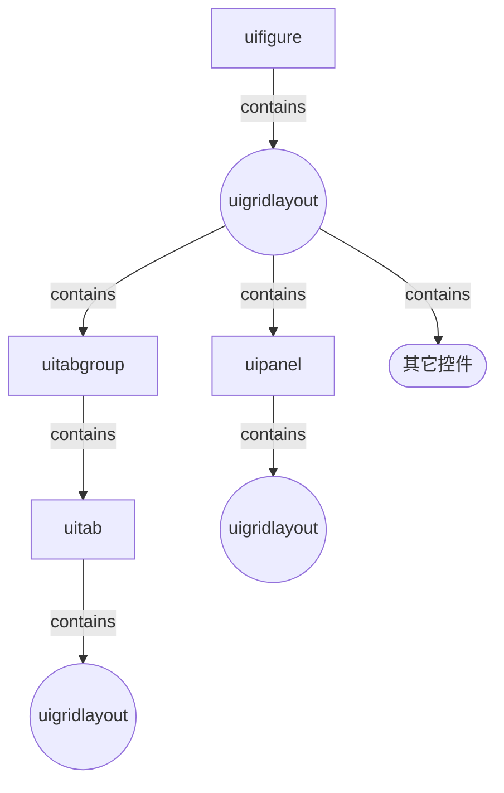

+++
title = 'UI_Layout_in_MATLAB中APP界面布局容器'
date = 2024-10-19T10:20:08+08:00
draft = false
mathjax = false
categories = ['matlab']
tags = ['matlab', 'ui', 'layout']
toc = true
tocBorder = true
+++


## 容器

基于`uifigure`进行的图形用户界面设计，可以分为以下几种容器类型：

- 图窗：`uifigure`
- 布局：`uigridlayout`
- 面板：`uipanel`
- 标签页：`uitabgroup`、`uitab`

这几个对象除`uifigure`外相互可以形成嵌套的关系，从而构建出复杂的图形用户界面。每个对象都是一个函数，调用时可以指定父容器对象，从而将其添加到父容器中。布局、面板和标签页通用调用方式如下，`xxxx`可以替换为具体的对象名，如`gridlayout`、`panel`、`tabgroup`、`tab`等。

```matlab
h = uixxxx(contains, 'Property1', value1, 'Property2', value2, ...);
```

或者：

```matlab
h = uixxxx('Property1', value1, 'Property2', value2, ...)
```

当然，采用`Property=Value`的形式也是可以的。

当不显式设置`'contains'`属性时，会自动将当前图窗作为父容器，当没有可用的图窗时，会自动创建一个图窗作为父容器。

当然，`uigridlayout`略有不同，还存在一个直接设定尺寸的方式：

```matlab
h = uigridlayout(contains, [nrows, ncols], 'Property1', value1, 'Property2', value2, ...);
```

不同的容器对象，有不同的属性。

## `uifigure`

`uifigure`是图形用户界面的根容器，是所有其他容器的父容器。`uifigure`的属性几类：

- 外观
    - `Color`：背景颜色，可以是RGB三元组、十六进制颜色代码，或者颜色名称和简称。
    - `WindowStyle`：窗口样式，`normal`（默认）、`modal`、`alwaysontop`。
    - `WindowState`：窗口状态，`normal`（默认）、`minimized`、`maximized`、`fullscreen`。
- 位置和大小
    - `Position`: 位置和大小，`[left, bottom, width, height]`。
    - `Units`：单位，`pixels`（默认）、`normalized`、`inches`、`centimeters`、`points`、`characters`。
    - `InnerPosition`：内部位置和大小（不含边框、标题栏），`[left, bottom, width, height]`。
    - `Resize`：是否可以调整大小，`on`（默认）、`off`, 逻辑值。
    - `AutoResizeChildren`：是否自动调整子对象大小，`on`（默认）、`off`。
- 绘图
    - `ColorMap`：颜色映射，`[m, 3]`大小的矩阵，每行为RGB三元组。
    - `AlphaMap`：透明度映射，64个`[0, 1]`之间的值构成的向量。
- 鼠标指针
    - `Pointer`：鼠标指针，`arrow`（默认）、`crosshair`、`ibeam`、`watch`......
    - `PointerShapeCData`：自定义鼠标指针，`[16, 16]`或`[32, 32]`大小的矩阵。
    - `PointerShapeHotSpot`：鼠标指针热点，`[x, y]`。
- 交互性
  - `Visible`: 是否可见，`on`（默认）、`off`。
  - `CurrentAxes`：当前坐标轴。
  - `CurrentObject`：当前对象。
  - `CurrentPoint`：当前点。
  - `CurrentCharacter`：当前字符。
  - `SelectionType`：选择类型，`normal`、`extend`、`alt`、`open`。
  - `Scrollable`：是否可滚动，`on`、`off`（默认）。
  - `ContextMenu`：上下文菜单,`ContextMenu`对象。
- 常见回调函数
- 键盘动作回调函数
- 窗口状态回调函数
- 执行控制回调函数
- 父子关系
  - `contains`：父容器。
  - `Children`：子对象。
  - `HandleVisibility`：句柄可见性，`on`、`callback`、`off`（默认）。
- 标识符和名称
    - `Name`：名称，字符串。
    - `Icon`：图标，字符串、图像对象。
    - `Number`：数字，整数。
    - `NumberTitle`：是否显示数字标题，`on`、`off`（默认）。
    - `IntegerHandle`：整数句柄，`on`、`off`（默认）。
    - `Type`：类型，字符串, `figure`。
    - `Tag`：标识符，字符串。
    - `UserData`：用户数据，任意数组。

回调函数先放一放，其他属性里面比较有意思的是`HandleVisibility`，默认是`off`，这意味着图形对象的句柄是不可见的，这样可以防止用户直接操作图形对象，但是可以通过`findobj`等函数找到对象。

主要是Matlab中非常多的函数，在需要图形窗体或者坐标轴的时候会自动调用`gcf`、`gca`来获得默认的句柄，如果`HandleVisibility`是`off`，那么这些函数就不会干扰App中的图形对象。

`on`意味着句柄可见，`callback`意味着只有回调函数可以找到对象。

其他属性都非常直白，不再赘述。

## `uigridlayout`

Matlab跟别的GUI库不一样的是，它的布局只有一个网格布局，通过网格布局，很容易实现`VBox`和`HBox`，只需要把对应的行、列设为1就可以。

容器、控件通过`Parent`属性指定父容器，`Children`属性获得子对象，形成一个树状结构。

虽然，`uifigure`可以直接包含`uipanel`、`uitabgroup`，并且当一个App只有一个容器时或许可以这么做的，当多个容器或者控件直接添加到`uifigure`时，就会重叠起来，后添加的显示在前面。

一般而言，还是保持清爽，`uifigure`包含`uigridlayout`，`uigridlayout`包含`uipanel`、`uitabgroup`，`uitabgroup`包含`uitab`.

当然，我们可以看到`uipanel`和`uitab`可以嵌套容纳`uifigure`之外的所有容器，包含`uipanel`、`uigridlayout`、`uitabgroup`。

为了简便，我们还可以确定一个原则，两个叶子节点容器（`uitab`和`uipanel`），也尽量应该首先添加`uigridlayout`，然后再包含下级的容器。



### `uigridlayout`属性

最重要几个属性是`RowHeight`、`ColumnWidth`、`Padding`、`RowSpacing`/`ColumnSpacing`主要是设置其中的子控件/容器的位置和大小。其中行和列尺寸有一个特定的语法来设置。

- `fit`：自适应大小。
- `1x`,`2x`等：自动适应，按比例分配剩余空间。
- 数字：固定大小。

`Padding`是内边距，`RowSpacing`/`ColumnSpacing`是间距。

例如：

```matlab
g = uigridlayout(contains, [2, 3], 'RowHeight', {'1x', 100}, 'ColumnWidth', {100, '1x', '2x'}, 'Padding', [5, 5], 'Spacing', 5);
```

这是一个2x2的布局，第一行高度自适应，第二行高度100，第一列宽度100，第二、三两列宽度自适应，第三列宽度是第二列的两倍，内边距5，间距5。

之后的控件或者容器添加到这个布局中，会按照这个布局来排列。容器和空间的属性`Layout`可以用于设置在布局中的位置。

```matlab
p = uipanel(g, 'Title', 'My Panel', 'BackgroundColor', 'red');
p.Layout.Row = 1;
p.Layout.Column = 2;
```

## `uipanel`


`uipanel`是一个面板容器，可以包含其他控件，可以设置标题、背景颜色等。

## `uitabgroup`和`uitab`

`uitabgroup`是一个标签页容器，可以包含多个`uitab`，每个`uitab`可以包含其他控件。

`uitab`有一个`Title`属性，可以设置标签页的标题。


```matlab
f = uifigure('Name', 'My App', 'Position', [100, 100, 640, 480]);
g = uigridlayout(f, [2, 3], 'RowHeight', {'1x', 100}, 'ColumnWidth', {100, '1x', '2x'}, 'Padding', [5, 5], 'Spacing', 5);
p = uipanel(g, 'Title', 'My Panel', 'BackgroundColor', 'red');
tg = uitabgroup(g);
t1 = uitab(tg, 'Title', 'Tab 1');
t2 = uitab(tg, 'Title', 'Tab 2');
```


## 助兴小例子

下面我们来实现一个很简单的`vbox`。

```matlab
function [g, children] = vbox(parent, items,  varargin)
% items: cell array of Name, args pairs
% varargin: additional arguments to uigridlayout
n = length(items);
children = gobjects(1, n);

g = uigridlayout(parent, [1, n], varargin{:});

if ~nameInArgs('RowHeight', varargin)
    g.RowHeight = {'1x'};
end
if ~nameInArgs('ColumnWidth', varargin)
    g.ColumnWidth = repmat({'1x'}, 1, n);
end

for i = 1:n
    itemName = items{i, 1};
    itemArgs = items{i, 2};
    children(i) = feval(itemName, g, itemArgs{:});
    children(i).Layout.Row = 1;
    children(i).Layout.Column = i;
end

    function isIn = nameInArgs(name, args)
        isIn = false;
        for j = 1:2:length(args)
            if strcmp(args{i}, name)
                isIn = true;
            end
        end
    end

end
```

通过这个函数，我们就可以进行下面的调用：

```matlab
% vbox-tutor

f = uifigure('Name', 'My App', 'Position', [100, 100, 640, 480]);

g = uigridlayout(f, [2,2], 'RowHeight', {"1x", "1x"}, 'ColumnWidth', {'1x', '1x'});

[v1, children] = vbox(g, ...
    {'uipanel', {'Title', 'Panel 1', 'BackgroundColor', 'red'}; ...
    'uipanel', {'Title', 'Panel 2', 'BackgroundColor', 'blue'}}, ...
    'RowHeight', {100}, 'Padding', 5,  'ColumnSpacing', 15, 'BackgroundColor', [0.8, 0.8, 0.8]);

v1.Layout.Row = 1;
v1.Layout.Column = 1;

[v2, children2] = vbox(g, ...
    {'uipanel', {'Title', 'Panel 3', 'BackgroundColor', 'green'}; ...
    'uipanel', {'Title', 'Panel 4', 'BackgroundColor', 'yellow'}}, ...
    'RowHeight', {100}, 'Padding', 15,  'ColumnSpacing', 10, 'BackgroundColor', [0.6, 0.6, 0.6]);

v2.Layout.Row = 1;
v2.Layout.Column = 2;

[v3, children3] = vbox(g, ...
    {'uipanel', {'Title', 'Panel 3', 'BackgroundColor', 'green'}; ...
    'uipanel', {'Title', 'Panel 4', 'BackgroundColor', 'yellow'}}, ...
    'RowHeight', {100}, 'Padding', 25,  'ColumnSpacing', 5,  'BackgroundColor', [0.4, 0.4, 0.4]);
v3.Layout.Row = 2;
v3.Layout.Column = 1;

[v4, children4] = vbox(g, ...
    {'uipanel', {'Title', 'Panel 3', 'BackgroundColor', 'green'}; ...
    'uipanel', {'Title', 'Panel 4', 'BackgroundColor', 'yellow'}}, ...
    'RowHeight', {100}, 'Padding', 35,  'ColumnSpacing', 0, 'BackgroundColor', [0.2, 0.2, 0.2]);
v4.Layout.Row = 2;
v4.Layout.Column = 2;
```

要把App的界面输出位图像，可以使用`exportapp`函数。

```matlab
exportapp(f, 'vbox.png');
```

从这个例子里面，也可以很容易看出来，`Padding`和`Spacing`的区别，`Padding`子节点与父节点相对位置的描述，`Spacing`是子节点之间的间隙。


当然，增加`hbox`可以作为一个小练习。

## 参考
- [GUI系列](/tags/ui/)

## 总结

1. `uifigure`是根容器，其他容器都是它的子容器，通过设置句柄不可见，可以防止`gcf`、`gca`、`close`等函数对App的影响。
2. `uigridlayout`是唯一的布局容器，通过设置行高、列宽、内边距、间距，可以很容易实现`VBox`和`HBox`。
3. `uipanel`是一个面板容器，可以包含其他控件，可以设置标题、背景颜色等。
4. `uitabgroup`和`uitab`是标签页容器，可以包含多个`uitab`，每个`uitab`可以包含其他控件。

