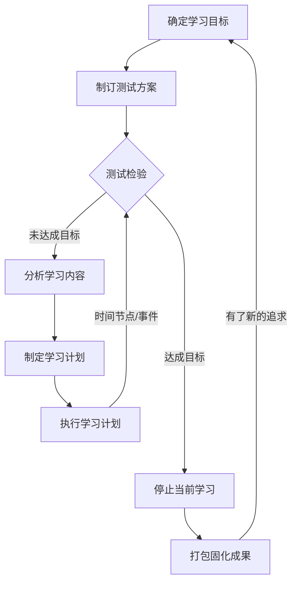
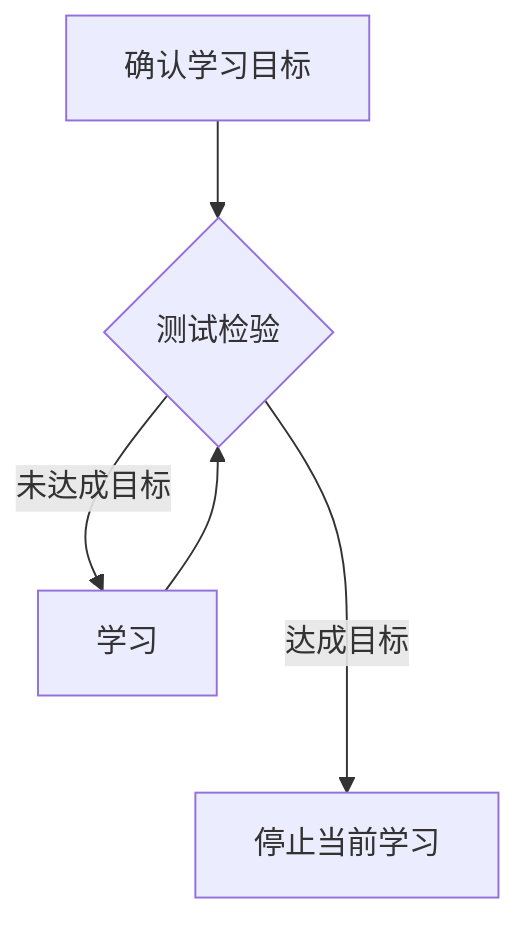

+++
title = 'Newcommer No Basic How to Learn Python新手无基础学习'
date = 2025-03-31T16:12:05+08:00
draft = false
mathkatex = true
categories = ['python']
tags = ['python', 'learning', 'basic', 'how to learn']
toc = true
tocBorder = true
+++

## 问题

- [知乎提问：无基础新人如何学习python？](https://www.zhihu.com/question/660641453)

本人专业需要有一定的python或者C语言基础，但是学校开设的课程学时较短，涉及的内容很少，也较为浅显。老师自己也承认需要学生自己投入精力去学习其他内容。求助我该怎么学习，有什么书籍推荐，我该按照什么顺序学习，通过什么渠道和方式刷题

## 框架

学任何东西，我感觉都应该从下面几个问题出发来规划学习路径。

- 学什么？
- 为什么学？
- 什么时候停止学？
- 怎么学？

## 学什么和为什么学

一定要搞清楚，学什么？这个问题和第二个问题为什么学，是紧密联系的。我们通常一起来分析。

就比如说，我们已经知道，大的题目是Python，那么Python是一个很大的话题，一般而言，要把Python相关的所有东西都学一遍是不可能的。就算是去掉哪些更加专门的内容，比如开源项目Python贡献代码这类过于夸张的话题，也还有利用Python进行系统管理和运行维护，利用Python进行网站开发，利用Python进行机器学习和数据处理，利用Python完成数据分析，利用Python完成文章的图形绘制，利用Python进行用户界面和客户端程序开发，利用Python进行爬虫开发……

Python是一个很大的筐，装什么的都有，所以一定要搞清楚，为什么要学Python？学用Python来干什么？

就跟学英语一样，我们学英语是为了干什么？是为了考试，还是为了日常交流，还是为了出国留学，还是为了……？

学Python也是一样，我们学Python是为了干什么？是为了考试，还是为了日常工作，还是为了……？

知所先后，则近道矣。

一定要纲举目张，搞清楚为什么学，然后才能有的放矢。

学习的成本是非常重要的，一定要考虑性价比。

## 什么时候停止学

这个问题跟前面的问题联系紧密。一般而言，前一个问题回答得很好，这个问题也就有答案了。

下面是一个完整的学习任务的流程图。确定学习目标（要学什么？学到什么程度？）；在学习目标的基础上分解可以测试的成果，形成测试方案；然后就是测试检验、分析学习内容、制定学习计划、执行学习计划的循环，记住，首先始终是测试检验，这样才知道还要学哪些；当测试检验通过后，就可以停止学习，固化和总结成果，直到产生一个新的学习任务。

当我们简化一个任务，最终也要成下面这个样子：首先目标要明确（通常是确认一下），检验目标（就拍脑袋或者直观地确定一个检验方式和标准）达到没有怎么样都是需要的，这样才能停止学习。如果任务目标相对简单，那么一次性学完，达到目标，停止学习也时可以的。可以省略哪些制定计划、制定方案，但是目标-测试-停止的流程是需要的。

实际上，这个流程是我大部分时候的流程，就很快，从十几分钟到几个小时，都是这个流程。

这个停止学习比所有的都重要。知止而后有定，定而后能静，静而后能安，安而后能虑，虑而后能得。因为直到停止的地方，才能给人一种稳定的框架，才能免除焦虑的影响。

## 怎么学？

有了上面的框架，最终Python怎么学的问题，就不是一个很难的问题。

但是在怎么学这里，还可能有一个问题可以稍微强调一下。那就还是测试检验的问题。

测试检验，是学习中的核心问题。

要围绕目标有针对性的学习，测试检验是围绕目标和针对性的落脚点和抓手。抓住测试不放，就能在确定学习内容中目标明确。就比如说你学习的目标是挑战自己的智商，那么就要根据自己的智商水平，确定一个测试检验的标准，然后围绕这个标准去学习。

如果一个目标没法分解为可以测试检验的标准，那么这个目标就是不科学的，或者说是不可行的。

一定要能够运行，这对于Python来说，简直是完美！

Python提供了非常多的测试检验方式，比如：

- REPL交互式运行
- doctest
- 单元测试unittest

非常多的好用工具来完成测试。

## 总结

总结回答一句话：要围绕目标，有针对性地制定测试验证标准，周期性的测试检验，然自己明确自己可以稳定的完成目标停止学习。
