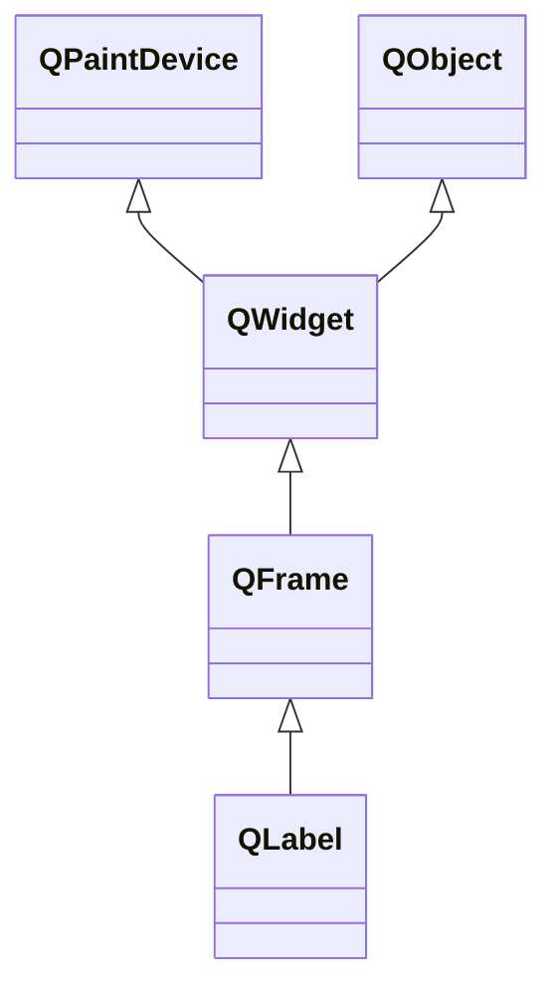

+++
title = 'Get Data in Pyside6实现一个Graph Digitizer'
date = 2025-07-27T12:43:44+08:00
draft = false
mathkatex = true
categories = ['python', 'pyqt', 'pyqt6', 'pyside6']
tags = ['python', 'GetData', 'Graph', 'Digitizer', '数据曲线', '科研工具']
toc = true
tocBorder = true
+++


## 需求：从图片中提取数据

复现别人的工作进行对比是科研中非常重要的部分：作为参考，验证新方法的方向；作为台阶，验证新方法的效果。
这个时候，我们需要把别人绘制的精巧、漂亮的图片中的数据提取出来，进行分析和对比。

很早以前，我见过用尺子量的，我见过自己随便估计的，我也见过在Matlab中把图片`imshow`显示出来用`ginput`函数手动点选做变换的（我不会承认就是我自己），最后大家都会用到一个软件：GetData Graph Digitizer。

- [GetData官方网站](https://getdata-graph-digitizer.com/)[](https://getdata-graph-digitizer.com/)

很多人用过这个软件，好用，要钱。我也用过，确实好用，能破解，心里不舒服。

## GetData Graph Digitizer的功能

GetData Graph Digitizer是一个图形数据提取软件，主要功能包括：

- 从图像中提取数据点
- 支持多种图像格式
- 支持多种坐标系
- 支持自动识别线条
- 支持多种数据格式导出

网上这个软件的破解和帮助都很多，随便搜索就能找到。记得`-csdn`来避免CSDN锁VIP的烂活。

## 自己做一个怎么样？

不愿用盗版，感觉非常不符合自己的理念，又不愿意掏钱的时候我们就只能自己动手编一个。

### 基本的原理

核心算法非常简单：首先找到图片中的坐标轴和刻度，然后根据坐标轴的像素位置建立坐标变换关系，最后就可以将图片中任意一点的像素坐标转换成对应的xy坐标值。

具体步骤如下：

1. 识别图片中的坐标轴位置
2. 标定坐标轴的刻度值
3. 建立像素坐标与实际坐标的映射关系
4. 提取曲线上的数据点并进行坐标转换

坐标系的xy坐标系都最少需要标定两个点。

例如，对于x轴从图上确定如下两个点的对应关系：

| 像素位置$x_i$ | 实际坐标$x'_i$ |
|----------|----------|
| 100      | 0.1        |
| 200      | 10       |

那么就可以确定一个线性关系：

$$
x_\text{actual} = \frac{(x_\text{pixel} - 100)}{(200 - 100)} \times (10-0.1) + 0.1
$$

当然，实际上我们会采用更加复杂的最小二乘法来拟合坐标轴的曲线。

$$
\begin{split}
    &k = \frac{n\sum x_i x'_i - \sum x_i \sum x'_i}{n\sum x_i^2 - (\sum x_i)^2}\\
    &b = \frac{\sum x'_i - k\sum x_i}{n}
\end{split}
$$

或者用横线表示平均值，

$$
\overline{x} = \frac{1}{n} \sum_{i=1}^{n} x_i
$$

前面的最小二乘法公式可以简写为更加专业的形式，并且为了表示这里的斜率和截距式估计值，我们还会再加上一个帽子：

$$
\begin{split}
   & \hat{k} = \frac{\overline{x \cdot x'} - \overline{x} \cdot \overline{x'}}{\overline{x^2} - \overline{x}^2}\\
   & \hat{b} = \overline{x'} - \hat{k} \cdot \overline{x}
\end{split}
$$

其中$n$为数据点个数，$(x_i, x'_i)$为第$i$个标定点的像素坐标和实际坐标对应关系。通过最小二乘法可以得到更加精确的线性变换关系：

$$x' = \hat{k} \cdot x + \hat{b}$$

不要小看这个公式，虽然看起来非常简单，但它在科学研究中应用极其广泛。我从大学时期刚开始接触最小二乘法，一直到博士毕业都在使用，现在工作十几年了，几乎没有一天不用到最小二乘法。当然，用专业的话讲，这叫做线性回归（Linear Regression）。

大概就是下面这个图片显示的内容（本图片没有版权，我本来要自己画一个漂亮的但是没有时间了~~~），大概意思就是这样的。


### 需求分析

所以从分析需求的角度：

- 数据：
  - 图片数据
  - 坐标轴标定点的数据表格
  - 曲线数据点的坐标
  - 输出的数据表格
- 用户交互：
  - 打开图片
  - 选择坐标点并设定实际值，每个坐标轴至少2个点
  - 选择曲线数据点
  - 导出数据表格
- 数据交互：
  - 图片文件
  - 数据文件，拟采用csv格式

通过这个最简单的需求分析，我们就可以开始设计软件的UI和实现代码了。

### 软件的UI/UX


### 代码实现

- [完整代码](/python/get-data/coordinate_extractor.py)

#### 一个`QLabel`处理事件

为什么是`QLabel`？看下面的类图：



如果我们使用`QWidget`，那么就需要自己处理绘图和事件，这样会比较麻烦。而`QLabel`已经封装了图片显示和鼠标事件处理，非常方便。

其它可以选择`QGraphicsView`，但是它的功能过于复杂。

```python
{}
```

#### 一个`QWidget`处理业务逻辑

这里的业务逻辑包括：

- 处理图片加载
- 处理图片的局部放大
- 管理坐标轴标定
- 管理曲线数据点
- 处理数据导出

```python
{}
```

#### 一个`QMainWindow`管理界面布局

```python
{}
```

#### 一个`main`函数运行App应用

```python
{}
```

## AI编程

基本上这个程序，我就是写了个需求分析，然后让Claude Sonnet 4编写了大部分代码，然后我进行了测试和调试。

Claude Sonnet 4的表现非常不错，基本上能理解需求，并且能编写出符合需求的代码。虽然有些细节需要我来调整和完善，但整体上节省了大量的时间。

AI最擅长的部分：

- 编写UI布局的代码
- 调整布局，比如添加菜单栏、工具栏等
- 编写一些重复性的代码，比如继承函数接口
- 在Python中轮子非常多，调用各个库的代码在文档和example中都有，所以AI也很擅长，这就包括数据处理、IO库等

AI不擅长的部分：

- 还没发现……

我感觉已经可以做很多东西了……
