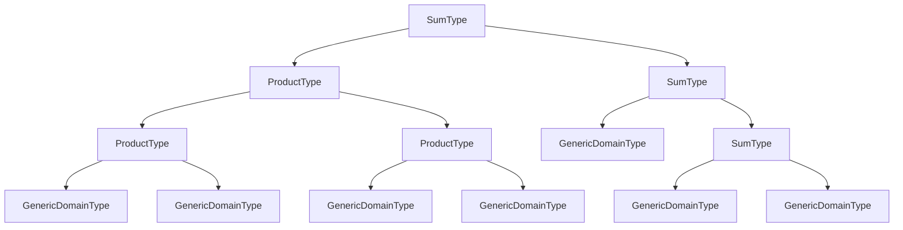
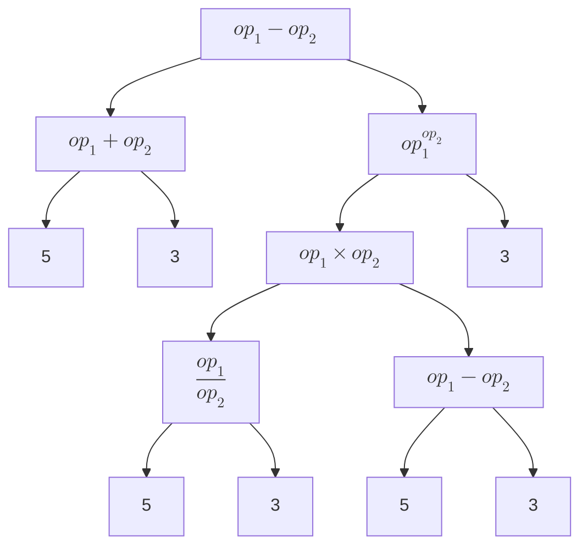

+++
title = 'ADT with Rust中考虑领域建模ADT'
date = 2025-04-27T07:54:17+08:00
draft = true
mathkatex = true
categories = ['rust']
tags = ['rust', '领域建模', 'ADT', '领域驱动设计', 'DDD', 'enum', 'struct', 'type']
toc = true
tocBorder = true
+++

## DDD的概念

作为一个领域专家，我们最喜欢的当然就是DDD，领域驱动设计，Domain Driven Design。但是你要问我什么是DDD，我跟你讲，你就好好编码，别问东问西的，虽然我也不会扣你的钱……

领域驱动设计，归根结底就是希望用领域专家能懂的方式，来描述领域中的概念，以及概念之间的关系。并且，更进一步，用领域专家能懂的语言来描述程序设计、软件开发中的模型、流程和交付物。按照道理呢，领域专家 vs. 程序开发人员，要不领域专家懂一点程序开发，要不程序开发人员懂一点领域，最终拉扯之后的结果打开都会是两样都有一点。而且，乙方（程序开发）也会单独找一个顾问什么的，实际上就是领域懂一点的自己人，来协助开发。反过来呢？领域专家或者甲方整点程序开发的反而比较少，基本上我见过的都是领域专家自己感兴趣的搞点程序开发，结果在领域内还被嘲笑……哈哈哈哈

这玩意是这样的，占着钱的不知道是钱在说话，还总以为自己声音大。

当然，我作为领域专家中的退休人员，就不用考虑这么多（可以放心当顾问）。领域驱动设计也好，领域建模也好，总是会有一个概念就是ADT，代数数据类型，Algebraic Data Type。基本上，这个概念是领域和程序都能接受的共同基础。因为是数学嘛，总不能说你连代数都不服气，数学是什么用也没有的，但是数学就能形成共识。通常，共识也没什么球用。

怎么回事，今天早上我这写文语气不大对啊，大姨夫来了啊……

## ADT的概念与计算

对于ADT，通常按照代数的方式来描述，比如，我们充分简化，只考虑一个类型T，说自然界中所有的信息都可以描述为`T`，那么，我们就可以定义一个ADT，来描述自然界中所有的信息。

不失一般性，我们假设`T = u8`，我们知道`u8`是0到255之间的整数，一共有256个值。这在ADT的术语中，称为`T`的`cardinality`，即基数。

$$
C(T) = 256
$$

ADT中最重要的概念就是这个，基数。了解了一个类型的基数，就可以了解这个类型所能表达的信息量。对于领域驱动建模而言，就是明确地描述领域中的概念（的外延），这也是领域专家和程序开发的一个共同的基础。虽然我一个概念，我给你领域专家说了你也不懂，比如`u8`，我要个你说是8为二进制数云云，领域专家哪里听得这个，你是不是特意来消遣洒家，哦不，台词错了，我就要五彩斑斓的黑！但是，程序员说，这个`u8`，其有效的取值为0到255，一共有256个值，这就是这个类型领域专家完全能理解的事情。同样的，要把一个领域的概念教给程序——可能会简单点，程序们通常比我们领域年轻，更容易学——也不太容易，但是如果我们领域专家能把有效、合法的取值一一列出，并给出总数，程序就很容易理解和实现了。

当然，有了这个基础的类型，不失一般性，我们可以定义出这个`u8`宇宙所有可能的ADT。

```rust
enum ADT<T> {
    GenericDomainType(T)
    SumType(ADT, ADT),
    ProductType(ADT, ADT),
    EmptyType,
}
```

这里就很清楚了，`GenericDomainType`就是`T`，一共有`C(T)`个值。而对于一个任意的ADT，其基数为`C(ADT)`，可以表示为：

$$
C(ADT) = \begin{cases}
    0 & \text{if } ADT = EmptyType \\
    C(T) & \text{if } ADT = GenericDomainType \\
    C(ADT_1) + C(ADT_2) & \text{if } ADT = SumType(ADT_1, ADT_2) \\
    C(ADT_1) \times C(ADT_2) & \text{if } ADT = ProductType(ADT_1, ADT_2)
\end{cases}
$$

这下你懂了吧……从代数上来看，非常容易理解，和类型，就是两个集合加起来那么多；积类型，就是两个集合交叉组合那么多。当然这里的`EmptyType`，就是空类型是否需要，这个可以有，也可以没有，有是为了基类型的零元素，为了有时候讨论问题方便来描述让领域专家和程序都接受（这就是一个典型的EmptyType）的不可能状态。我们后面的讨论就心照不宣地忽略这个，只讨论`GenericDomainType`、`SumType`和`ProductType`。

## Rust中的领域建模工具

### GenericDomainType

这个看起来有一点点像是脱裤子放屁，明明有`u8`，为什么还要用`GenericDomainType`呢？

```rust
enum GenericDomainType {
    GenericDomainValue(u8)
}
```

或者是用`struct`来描述：

```rust
struct GenericDomainValue(u8);
```

或者还有可以：

```rust
type GenericDomainValue = u8;
```

这三种方式，都能得到一个`GenericDomainValue`，其基数为`C(T)`，即256。因为学习Rust才刚过去不到120个小时，我也不知道有什么区别。等我学会了我一定好好补上。

下面找一个实际的例子，来比较一下不同的实现。

#### Enum实现

Enum实现中，额外增加了一个`CheckNumberType`，来描述这个类型。有点不干净，别的语言中这两个名字处于不同的维度，可以直接同名，例如F#中，这个方式就特别的干净、美观。但是Rust这个吧，也能用。

```rust
enum CheckNumberType {
    CheckNumber(usize)
}

impl CheckNumberType {
    pub fn new(value: usize) -> Self {
        CheckNumber(value)
    }
    pub fn value(&self) -> usize {
        match self {
            CheckNumber(value) => *value,
        }
    }
    pub fn from_i32(value: i32) -> Result<Self, String> {
        if value < 0 {
            Err("Check number cannot be negative".to_string())
        } else {
            Ok(CheckNumber(value as usize))
        }
    }
    pub fn from_string(value: &str) -> Result<Self, String> {
        let parsed_value = value.parse::<i32>().map_err(|_| "Invalid check number format".to_string())?;
        CheckNumberType::from_i32(parsed_value)
    }
}

impl std::convert::TryFrom<i32> for CheckNumberType {
    type Error = String;

    fn try_from(value: i32) -> Result<Self, Self::Error> {
        if value < 0 {
            Err("Check number cannot be negative".to_string())
        } else {
            Ok(CheckNumber(value as usize))
        }
    }
}

impl fmt::Display for CheckNumberType {
    fn fmt(&self, f: &mut fmt::Formatter<'_>) -> fmt::Result {
        write!(f, "Check number: {}", self.value())
    }
}

#[cfg(test)]
#[test]
fn test_check_number() {
    let check_num = CheckNumberType::new(10);
    assert_eq!(check_num.value(), 10);
    
    let check_num_from_i32 = CheckNumberType::from_i32(20).unwrap();
    assert_eq!(check_num_from_i32.value(), 20);
    
    let check_num_from_string = CheckNumberType::from_string("30").unwrap();
    assert_eq!(check_num_from_string.value(), 30);
    
    assert_eq!(format!("{}", check_num), "Check number: 10");
}
```

#### Struct实现

就好比这个`CheckNumber`，如果用`struct`来描述，就大概会是这样子。我们的处理函数，接受的类型是`CheckNumber`，而不是`usize`，据说是有效性马上得到了保证，再也不会发生因为不存在的`CheckNumber`造成损失……不知道你信不信，反正我是信的。

```rust
struct CheckNumber(usize);

impl CheckNumber {
    pub fn new(value: usize) -> Self {
        CheckNumber(value)
    }
    pub fn value(&self) -> usize {
        self.0
    }
    pub fn from_i32(value: i32) -> Result<Self, String> {
        if value < 0 {
            Err("Check number cannot be negative".to_string())
        } else {
            Ok(CheckNumber(value as usize))
        }
    }
    pub fn from_string(value: &str) -> Result<Self, String> {
        let parsed_value = value.parse::<i32>().map_err(|_| "Invalid check number format".to_string())?;
        CheckNumber::from_i32(parsed_value)
    }
}

impl std::convert::TryFrom<i32> for CheckNumber {
    type Error = String;

    fn try_from(value: i32) -> Result<Self, Self::Error> {
        if value < 0 {
            Err("Check number cannot be negative".to_string())
        } else {
            Ok(CheckNumber(value as usize))
        }
    }
}

impl fmt::Display for CheckNumber {
    fn fmt(&self, f: &mut fmt::Formatter<'_>) -> fmt::Result {
        write!(f, "Check number: {}", self.0)
    }
}

#[cfg(test)]
#[test]
fn test_check_number() {
    let check_num = CheckNumber::new(10);
    assert_eq!(check_num.value(), 10);
    
    let check_num_from_i32 = CheckNumber::from_i32(20).unwrap();
    assert_eq!(check_num_from_i32.value(), 20);
    
    let check_num_from_string = CheckNumber::from_string("30").unwrap();
    assert_eq!(check_num_from_string.value(), 30);
    
    assert_eq!(format!("{}", check_num), "Check number: 10");
}
```

#### Type实现

这个实现有点简陋，就是个别名，看起来是一样一样的，实际上也是一摸一样的。就比如把，把两个`CheckNumber`相加，是没啥意义的，前面两个实现都还能保证这一点。但是，下面这个别名就什么都保证不了……

```rust
type CheckNumber = u8;
```

### SumType

和类型，就是两个类型的外延合并起来$\bigcup$，这个才是和类型的内涵。

$$
\bigcup_{i=1}^{n} A_i = \{ x \mid x \in A_i \text{ for some } i \in \{1, 2, \ldots, n\} \}
$$

这个时候，计算基数就是求和。

$$
C(A_1 \cup A_2 \cup \cdots \cup A_n) = \sum_{i=1}^{n} C(A_i)
$$

在Rust中间，就可以用`enum`来描述和类型。

就比如，我们要描述一个领域里的概念，订单数量，这里的订单可能有两种一种是计件，一种是计重，那么我们就可以定义如下的`enum`。

```rust
enum OrderQuantity {
    UnitOrder<usize>,
    KilogramOrder<f32>,
}
```

最后使用的时候，就可以`UnitOrder(10)`或者`KilogramOrder(100.0)`，来描述订单数量。而计算基数的话：

$$
C(OrderQuantity) = C(usize) + C(f32)
$$

除了能够用一个单一的类型来作为参数，还可以用类似于`struct`定义的方式来描述。这个语法的特征对于ADT建模非常重要，因为这可以让我们在ADT中嵌套ADT，从而描述更复杂的概念。

```rust
use std::fmt;

#[derive(Debug,Clone)]
pub enum OrderQuantity{
    UnitOrder{
        quantity: usize,
    },
    KilogramOrder{
        weight: f32,
    }
}

impl PartialEq<Self> for OrderQuantity {
    fn eq(&self, other: &Self) -> bool {
        match (self, other) {
            (OrderQuantity::UnitOrder { quantity: q1 }, OrderQuantity::UnitOrder { quantity: q2 }) => q1 == q2,
            (OrderQuantity::KilogramOrder { weight: w1 }, OrderQuantity::KilogramOrder { weight: w2 }) => w1 == w2,
            _ => false,
        }
    }
}

impl PartialOrd<Self> for OrderQuantity {
    fn partial_cmp(&self, other: &Self) -> Option<std::cmp::Ordering> {
        match (self, other) {
            (OrderQuantity::UnitOrder { quantity: q1 }, OrderQuantity::UnitOrder { quantity: q2 }) => q1.partial_cmp(q2),
            (OrderQuantity::KilogramOrder { weight: w1 }, OrderQuantity::KilogramOrder { weight: w2 }) => w1.partial_cmp(w2),
            _ => None,
        }
    }
}

impl fmt::Display for OrderQuantity {
    fn fmt(&self, f: &mut fmt::Formatter<'_>) -> fmt::Result {
        match self {
            OrderQuantity::UnitOrder { quantity: val } => write!(f, "{} units", val),
            OrderQuantity::KilogramOrder { weight: val } => write!(f, "{} kg", val),
        }
    }
}

impl OrderQuantity {
    pub fn from_units(quantity: usize) -> Self {
        OrderQuantity::UnitOrder { quantity }
    }
    
    pub fn from_kg(weight: f32) -> Self {
        OrderQuantity::KilogramOrder { weight }
    }
}

impl std::convert::TryFrom<&str> for OrderQuantity {
    type Error = String;

    fn try_from(value: &str) -> Result<Self, Self::Error> {
        if value.ends_with("kg") {
            let weight_str = value.trim_end_matches("kg").trim();
            let weight: f32 = weight_str.parse().map_err(|_| "Invalid weight format".to_string())?;
            if weight < 0.0 {
                return Err("Weight cannot be negative".to_string());
            }
            Ok(OrderQuantity::KilogramOrder { weight })
        } else if value.ends_with("units") {
            let quantity_str = value.trim_end_matches("units").trim();
            let quantity: usize = quantity_str.parse().map_err(|_| "Invalid quantity format".to_string())?;
            Ok(OrderQuantity::UnitOrder { quantity })
        } else {
            Err("Invalid order format".to_string())
        }
    }
}

#[cfg(test)]
#[test]
fn test_order_quantity(){
    let order1 = OrderQuantity::try_from("20 units").unwrap();
    let order2 = OrderQuantity::try_from("30.5 kg").unwrap();

    assert_eq!(format!("{}", order1), "20 units");
    assert_eq!(format!("{}", order2), "30.5 kg");
    
    let order3 = OrderQuantity::from_units(20);
    let order4 = OrderQuantity::from_kg(5.0);
    
    assert_eq!(format!("{}", order3), "20 units");
    assert_eq!(format!("{}", order4), "5 kg");
    
    assert_eq!(order1, order3);
    assert!(order1 <= order3);
    assert!(order1 >= order3);
    
    assert!(order4 < order2);
    assert!(order2 > order4);
    assert_ne!(order4, order2);
    
    assert_eq!(order1 == order2, false);
    assert_eq!(order1 != order2, true);
    assert_eq!(order1 > order2, false);
    assert_eq!(order1 < order2, false);
    assert_eq!(order1 >= order2, false);
    assert_eq!(order1 <= order2, true);
    
}
```

### ProductType

积类型，就是两个类型的外延交叉组合，在集合的语言中也成为笛卡尔积$\times$。对应于Rust中的语法特征，就是`struct`。结构体的所有字段之间形成的就是笛卡尔积的组合特征。

$$
\prod_{i=1}^{n} A_i = \{ (x_1, x_2, \ldots, x_n) \mid x_i \in A_i \text{ for all } i \in \{1, 2, \ldots, n\} \}
$$

基数的计算，就是乘积。
$$
C(A_1 \times A_2 \times \cdots \times A_n) = C(A_1) \times C(A_2) \times \cdots \times C(A_n)
$$

`struct`的定义和使用，就不需要过多的描述了。因为跟c语言的基本相同。

## 和类型和积类型的例子

### 再啰嗦几句

好了，我们再回过头来看看，我们这里讨论的所谓ADT，是一个基本类型、和类型和积类型的递归定义，最终形成一个由基础类型、空类型作为叶子节点，由和类型和积类型作为内部节点的树。

```rust
enum ADT<T> {
    GenericDomainType(T)
    SumType(ADT, ADT),
    ProductType(ADT, ADT),
    EmptyType,
}
```

胡乱举个例子。



实际上，对于同一种类型我们还可以有：

$$
\begin{align}
&SumType(SumType(A, B), SumType(C, D)) \equiv SumType(A, B, C, D) \\
&ProductType(ProductType(A, B), ProductType(C, D)) \equiv ProductType(A, B, C, D)
\end{align}
$$

从概念上来看，前面的二叉树描述方式，只是在数学上更加美观……

### 你去把唐僧师徒除掉.png

有了这些工具，我们就能够用Rust简单描述一个关于数字类型的表达式。

我们大概需要描述的表达式，是形如：

$$
((5 / 3) * (5 - 3)) ^ 3 - (5 + 3)
$$

对应的构造就是：



```rust
#[derive(Debug, Clone)]
enum Expression<T: num::Num> {
    Number(T),
    Add{
        left: Box<Expression<T>>,
        right: Box<Expression<T>>,
    },
    Subtract{
        left: Box<Expression<T>>,
        right: Box<Expression<T>>,
    },
    Multiply{
        left: Box<Expression<T>>,
        right: Box<Expression<T>>,
    },
    Divide{
        left: Box<Expression<T>>,
        right: Box<Expression<T>>,
    },
    Power{
        base: Box<Expression<T>>,
        exponent: Box<Expression<T>>,
    },
    Negate{
        value: Box<Expression<T>>,
    },
}

// Display
impl<T: num::Num + fmt::Display> fmt::Display for Expression<T> {
    fn fmt(&self, f: &mut fmt::Formatter<'_>) -> fmt::Result {
        match self {
            Expression::Number(val) => write!(f, "{}", val),
            Expression::Add { left, right } => write!(f, "({} + {})", left, right),
            Expression::Subtract { left, right } => write!(f, "({} - {})", left, right),
            Expression::Multiply { left, right } => write!(f, "({} * {})", left, right),
            Expression::Divide { left, right } => write!(f, "({} / {})", left, right),
            Expression::Power { base, exponent } => write!(f, "({}^{})", base, exponent),
            Expression::Negate { value } => write!(f, "-({})", value),
        }
    }
}

#[cfg(test)]
#[test]
fn test_expression() {
    let expr1 = Expression::Number(5);
    let expr2 = Expression::Number(3);
    
    let add_expr = Expression::Add {
        left: Box::new(expr1.clone()),
        right: Box::new(expr2.clone()),
    };
    
    let sub_expr = Expression::Subtract {
        left: Box::new(expr1.clone()),
        right: Box::new(add_expr.clone()),
    };
    
    let mul_expr = Expression::Multiply {
        left: Box::new(sub_expr.clone()),
        right: Box::new(add_expr.clone()),
    };
    
    let div_expr = Expression::Divide {
        left: Box::new(mul_expr.clone()),
        right: Box::new(expr2.clone()),
    };
    
    let power_expr = Expression::Power {
        base: Box::new(div_expr.clone()),
        exponent: Box::new(mul_expr.clone()),
    };
    
    let neg_expr = Expression::Negate {
        value: Box::new(power_expr.clone()),
    };
    
    assert_eq!(format!("{}", add_expr), "(5 + 3)");
    assert_eq!(format!("{}", sub_expr), "(5 - (5 + 3))");
    assert_eq!(format!("{}", mul_expr), "((5 - (5 + 3)) * (5 + 3))");
    assert_eq!(format!("{}", div_expr), "(((5 - (5 + 3)) * (5 + 3)) / 3)");
    assert_eq!(format!("{}", power_expr), "((((5 - (5 + 3)) * (5 + 3)) / 3)^((5 - (5 + 3)) * (5 + 3)))");
    assert_eq!(format!("{}", neg_expr), "-(((((5 - (5 + 3)) * (5 + 3)) / 3)^((5 - (5 + 3)) * (5 + 3))))");
}
```

总之，这样就可以大胆的操作表达式了。

当然，我们看到这样写，其实还是有点啰嗦，我们可以把`Clone`的部分稍微优化一下，自动调用`Clone`。最终的代码会稍微好看一点。终于不用自己写`Clone`，并且采用引用很好地维持了所有中间表达式的所有权全部时间都有效。如果我们不采用引用，那么所有的中间表达式都会被移动，就不能反复利用表达式来构成更加复杂的表达式。这是Rust经常被认为很难的一个重要的地方。

```rust
#[derive(Debug, Clone)]
enum Expression<T: num::Num + Clone>  {
    Number(T),
    Add{
        left: Box<Expression<T>>,
        right: Box<Expression<T>>,
    },
    Subtract{
        left: Box<Expression<T>>,
        right: Box<Expression<T>>,
    },
    Multiply{
        left: Box<Expression<T>>,
        right: Box<Expression<T>>,
    },
    Divide{
        left: Box<Expression<T>>,
        right: Box<Expression<T>>,
    },
    Power{
        base: Box<Expression<T>>,
        exponent: Box<Expression<T>>,
    },
    Negate{
        value: Box<Expression<T>>,
    },
}

// Display
impl<T: num::Num + fmt::Display + std::clone::Clone> fmt::Display for Expression<T> {
    fn fmt(&self, f: &mut fmt::Formatter<'_>) -> fmt::Result {
        match self {
            Expression::Number(val) => write!(f, "{}", val),
            Expression::Add { left, right } => write!(f, "({} + {})", left, right),
            Expression::Subtract { left, right } => write!(f, "({} - {})", left, right),
            Expression::Multiply { left, right } => write!(f, "({} * {})", left, right),
            Expression::Divide { left, right } => write!(f, "({} / {})", left, right),
            Expression::Power { base, exponent } => write!(f, "({}^{})", base, exponent),
            Expression::Negate { value } => write!(f, "-({})", value),
        }
    }
}

impl<T: Num + Clone> Expression<T> {
    fn new_number(value: T) -> Self {
        Expression::Number(value.clone())
    }
    fn new_add(left: &Expression<T>, right: &Expression<T>) -> Self {
        Expression::Add {
            left: Box::new(left.clone()),
            right: Box::new(right.clone()),
        }
    }
    
    fn new_subtract(left: &Expression<T>, right: &Expression<T>) -> Self {
        Expression::Subtract {
            left: Box::new(left.clone()),
            right: Box::new(right.clone()),
        }
    }
    
    fn new_multiply(left: &Expression<T>, right: &Expression<T>) -> Self {
        Expression::Multiply {
            left: Box::new(left.clone()),
            right: Box::new(right.clone()),
        }
    }
    
    fn new_divide(left: &Expression<T>, right: &Expression<T>) -> Self {
        Expression::Divide {
            left: Box::new(left.clone()),
            right: Box::new(right.clone()),
        }
    }
    
    fn new_power(base: &Expression<T>, exponent: &Expression<T>) -> Self {
        Expression::Power {
            base: Box::new(base.clone()),
            exponent: Box::new(exponent.clone()),
        }
    }
    
    fn new_negate(value: &Expression<T>) -> Self {
        Expression::Negate {
            value: Box::new(value.clone()),
        }
    }
}

#[cfg(test)]
#[test]
fn test_expression() {
    let expr1 = Expression::new_number(5);
    let expr2 = Expression::new_number(3);
    
    let add_expr = Expression::new_add(&expr1, &expr2);    
    let sub_expr = Expression::new_subtract(&expr1, &add_expr);    
    let mul_expr = Expression::new_multiply(&sub_expr, &add_expr);    
    let div_expr = Expression::new_divide(&mul_expr, &expr2);    
    let power_expr = Expression::new_power(&div_expr, &mul_expr);    
    let neg_expr = Expression::new_negate(&power_expr);
    
    assert_eq!(format!("{}", add_expr), "(5 + 3)");
    assert_eq!(format!("{}", sub_expr), "(5 - (5 + 3))");
    assert_eq!(format!("{}", mul_expr), "((5 - (5 + 3)) * (5 + 3))");
    assert_eq!(format!("{}", div_expr), "(((5 - (5 + 3)) * (5 + 3)) / 3)");
    assert_eq!(format!("{}", power_expr), "((((5 - (5 + 3)) * (5 + 3)) / 3)^((5 - (5 + 3)) * (5 + 3)))");
    assert_eq!(format!("{}", neg_expr), "-(((((5 - (5 + 3)) * (5 + 3)) / 3)^((5 - (5 + 3)) * (5 + 3))))");
}
```

当然，更加终极的样子，还是定义一些运算符，然后就可以直接操作了。值得注意的是，我们这里的`Add`和`Mul`，都是`&Expression<T>`的运算符重载，而不是`Expression<T>`的运算符重载。如果定义为`Expression<T>`的运算符重载，那么在写一个表达式时，其各个节点都会被移动，那么就无法复用表达式了。这一点也需要注意。如果`Box`能够采用`Copy`的语义，那么我们就可以直接采用`Expression<T>`的运算符重载，那么就可以直接操作了。我可能需要好好再看看`Box`的源代码……

```rust
impl<T: num::Num+Clone+Copy> std::ops::Add for &Expression<T> {
    type Output = Expression<T>;
    fn add(self, other: Self) -> Self::Output {
        Expression::Add {
            left: Box::new(self.clone()),
            right: Box::new(other.clone()),
        }
    }
}

impl<T: num::Num+Clone+Copy> std::ops::Mul for &Expression<T> {
    type Output = Expression<T>;

    fn mul(self, other: Self) -> Self::Output {
        Expression::Multiply {
            left: Box::new(self.clone()),
            right: Box::new(other.clone()),
        }
    }
}

#[cfg(test)]
#[test]
fn test_expression_add() {
    let expr1 = Expression::new_number(5);
    let expr2 = Expression::new_number(3);
    let expr3 = Expression::new_number(4);
    
    let expr = &(&expr1 + &expr2) + &(&expr3 * &expr1);  
    
    
    assert_eq!(format!("{}", expr), "((5 + 3) + (4 * 5))");
}
```

大概就是这样，也很丑，特别是：`&(&expr1 + &expr2) + &(&expr3 * &expr1)`，非得要做引用简直太着急了。这里的主要原因是由`Box`的限制，导致不能直接使用`Copy`。按照道理，这种`enum`应该是要采用``Copy`的语义……我已经尽力了……

有没有更好的办法……

## 总结

有一点感受，Rust提供的工具，总感觉有点憋憋屈屈的。

如果没有C语言的基础，什么分析生命周期可真是要了命了。

看在Cargo的份上，忍了。
