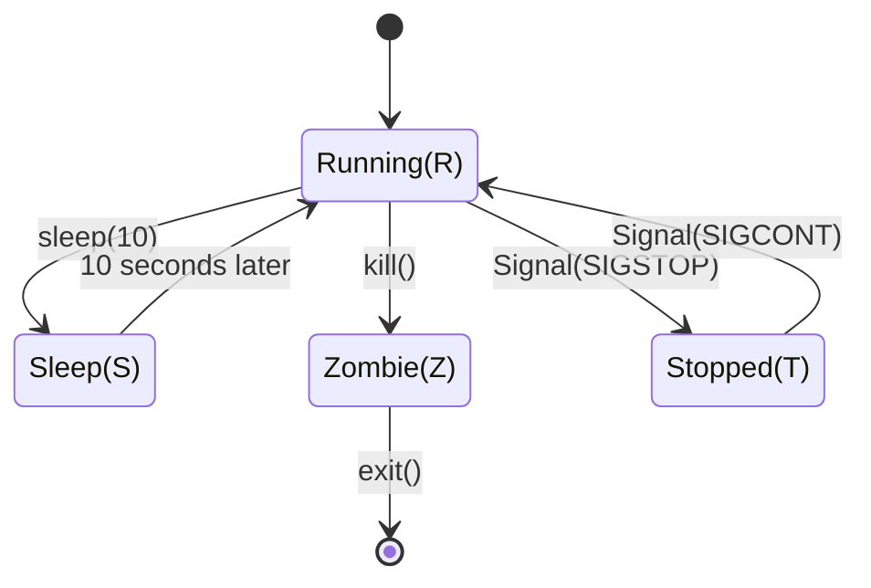

+++
title = 'Process in Rust中的进程编程'
date = 2025-05-07T09:24:50+08:00
draft = true
mathkatex = true
categories = ['rust', 'c']
tags = ['rust', 'process', 'system', 'system programming', 'fork', 'exec', 'signal', 'getpid', 'getppid']
toc = true
tocBorder = true
+++

## 系统编程

### 系统运行模式

我学<<微机原理>>的时候在20十几年前，那个时候的教材是基于8086的，现在的计算机已经过于复杂，我现在已经完全看不太懂体系结构的文章。但是，大概的系统运行模式应该还是差不多的。

在我的概念里，计算机系统依然是硬件、操作系统、应用软件构成的。硬件和操作系统的内核运行在内核模式、操作系统的部分功能和应用软件运行在用户模式。大概就是这样，如果不对，请指正。


操作系统的最底层的基本概念就是进程的概念。进程是一个独立的运行单元，包括独立的地址空间、独立的资源、独立的执行路径。

### 进程

大概而言，进程的运行状态转移过程如下：



启动一个进程，操作系统会为进程分配一个唯一的进程ID，并创建一个进程控制块（PCB），PCB是进程的描述信息，包括进程的运行状态、进程的优先级、进程的地址空间等。

进程受到各种信号的影响，会进行状态的转移转移，例如，进程收到SIGSTOP信号，会从Running状态转移到Stopped状态；从Stopped状态收到SIGCONT信号，会从Stopped状态转移到Running状态。

进程收到SIGKILL信号，会从Running状态转移到Zombie状态，进程退出。

大概就是这样。

在Linux系统中，第一个创建的进程，是init进程，是所有进程的父进程。它的进程ID是1。在UNIX类似的系统中，进程创建子进程的方式特别好玩，它会调用一个函数`fork()`，这个函数会创建一个与父进程完全相同的进程，子进程会克隆父进程；创建完成后，子进程除了PID跟父进程不同，其他都一样。随后，操作系统会替换子进程的代码段，执行新的代码，这样就实现了进程的创建，通常，新的进程会执行某个程序，用`exec()`函数替换代码段。

### 信号列表

下面是Linux的Man Page中给出的信号列表。

| 信号 | 标准 | 动作 | 说明 |
|------|------|------|------|
| SIGABRT | P1990 | Core | Abort signal from abort(3) |
| SIGALRM | P1990 | Term | Timer signal from alarm(2) |
| SIGBUS | P2001 | Core | Bus error (bad memory access) |
| SIGCHLD | P1990 | Ign | Child stopped or terminated |
| SIGCLD | - | Ign | A synonym for SIGCHLD |
| SIGCONT | P1990 | Cont | Continue if stopped |
| SIGEMT | - | Term | Emulator trap |
| SIGFPE | P1990 | Core | Erroneous arithmetic operation |
| SIGHUP | P1990 | Term | Hangup detected on controlling terminal or death of controlling process |
| SIGILL | P1990 | Core | Illegal Instruction |
| SIGINFO | - | - | A synonym for SIGPWR |
| SIGINT | P1990 | Term | Interrupt from keyboard |
| SIGIO | - | Term | I/O now possible (4.2BSD) |
| SIGIOT | - | Core | IOT trap. A synonym for SIGABRT |
| SIGKILL | P1990 | Term | Kill signal |
| SIGLOST | - | Term | File lock lost (unused) |
| SIGPIPE | P1990 | Term | Broken pipe: write to pipe with no readers; see pipe(7) |
| SIGPOLL | P2001 | Term | Pollable event (Sys V); synonym for SIGIO |
| SIGPROF | P2001 | Term | Profiling timer expired |
| SIGPWR | - | Term | Power failure (System V) |
| SIGQUIT | P1990 | Core | Quit from keyboard |
| SIGSEGV | P1990 | Core | Invalid memory reference |
| SIGSTKFLT | - | Term | Stack fault on coprocessor (unused) |
| SIGSTOP | P1990 | Stop | Stop process |
| SIGTSTP | P1990 | Stop | Stop typed at terminal |
| SIGSYS | P2001 | Core | Bad system call (SVr4); see also seccomp(2) |
| SIGTERM | P1990 | Term | Termination signal |
| SIGTRAP | P2001 | Core | Trace/breakpoint trap |
| SIGTTIN | P1990 | Stop | Terminal input for background process |
| SIGTTOU | P1990 | Stop | Terminal output for background process |
| SIGUNUSED | - | Core | Synonymous with SIGSYS |
| SIGURG | P2001 | Ign | Urgent condition on socket (4.2BSD) |
| SIGUSR1 | P1990 | Term | User-defined signal 1 |
| SIGUSR2 | P1990 | Term | User-defined signal 2 |
| SIGVTALRM | P2001 | Term | Virtual alarm clock (4.2BSD) |
| SIGXCPU | P2001 | Core | CPU time limit exceeded (4.2BSD); see setrlimit(2) |
| SIGXFSZ | P2001 | Core | File size limit exceeded (4.2BSD); see setrlimit(2) |
| SIGWINCH | - | Ign | Window resize signal (4.3BSD, Sun) |

在不同的操作系统中，信号的支持和实现可能是不一样的。

## C语言的进程编程

记得当时学习C语言的进程编程时，一堆人死活都搞不懂，我反正也是很糊涂。

```c
{}
```

我们在wsl下面可以运行下面的命令：

```bash
gcc process.c -o process
./process
```

运行的结果其实挺好玩的：

```bash
 ./build/process 
Parent process starting, PID: 3973
Parent process continuing, PID: 3973, Child PID: 3974
Child process, PID: 3974, Parent PID: 3973
total 24
-rwxrwxrwx 1 qchen qchen   265 May  7 09:37 CMakeLists.txt
-rwxrwxrwx 1 qchen qchen   159 May  7 09:39 Cargo.lock
-rwxrwxrwx 1 qchen qchen    86 May  7 09:38 Cargo.toml
drwxrwxrwx 1 qchen qchen  4096 May  7 15:05 build
-rwxrwxrwx 1 qchen qchen   819 May  7 15:05 process.c
-rwxrwxrwx 1 qchen qchen 19293 May  7 10:41 process.png
drwxrwxrwx 1 qchen qchen  4096 May  7 09:38 src
drwxrwxrwx 1 qchen qchen  4096 May  7 09:43 target
Child process exited with status 0
```

首先，在父进程中，`fork()`返回的子进程的PID是3974，在子进程中，`getpid()`返回的PID也是3974，`getppid()`返回的父进程的PID是3973。但是在子进程中，变量`pid`的值是0。这样就把父进程和子进程区分开了。反正还是挺绕圈的。

当然我也准备了[`cmakelist.txt`](/rust/process-in-rust/CMakeLists.txt)，可以运行下面的命令。

```bash
cmake -B build
cmake --build build
./build/process
```

```cmake
{}
```

从这个程序可以看到，父进程和子进程实际上共享了同一个程序的源代码，仅仅通过pid来区分。整个逻辑理解起来特别的困难。

## Rust的进程编程

Rust的进程编程，其实和C语言的进程编程是类似的，只不过Rust的进程编程看起来更加清晰。

```rust
{}
```

运行结果如下：

```bash
Parent process starting, PID: 5294
Child process starting, PID: 5376, PPID: 5294
total 28
-rwxrwxrwx 1 qchen qchen   265 May  7 09:37 CMakeLists.txt
-rwxrwxrwx 1 qchen qchen  1643 May  7 15:23 Cargo.lock
-rwxrwxrwx 1 qchen qchen   112 May  7 15:23 Cargo.toml
drwxrwxrwx 1 qchen qchen  4096 May  7 15:05 build
-rwxrwxrwx 1 qchen qchen   819 May  7 15:06 process.c
-rwxrwxrwx 1 qchen qchen 19293 May  7 10:41 process.png
drwxrwxrwx 1 qchen qchen  4096 May  7 09:38 src
drwxrwxrwx 1 qchen qchen  4096 May  7 09:43 target
Child process output:

Child process exited with status: exit status: 0
```

为了证明，Rust子进程的PPID就是父进程的PID，又是引入`libc`/`nix`库，又是`CommandExt`，还整了`unsafe`，真是太麻烦了。

```toml
{}
```

如果不需要搞这些玩意，实际上这个代码可以很简单很简单。

```rust
{}
```

简直是非常简单明了，整个都很清晰，`output()`会等待子进程结束，并返回子进程的输出。

## 总结

Rust的进程编程，其实和C语言的进程编程是类似的，只不过Rust的进程编程看起来更加清晰。
