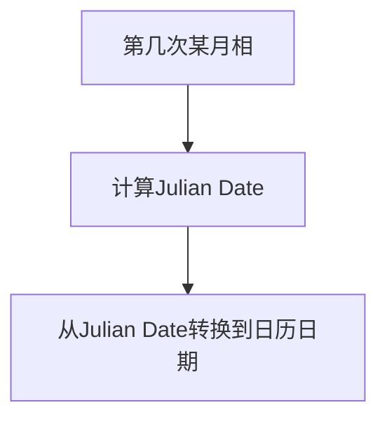

+++
title = 'RFE 004: 工程师（粗）Rust入门之值编程范式应用'
date = 2025-11-05T13:57:21+08:00
draft = true
mathkatex = true
categories = ['rust', 'rfe']
tags = ['rust', 'engineering', 'tutorial', 'value', 'programming paradigm', 'tuple', 'function', 'recursion']
toc = true
tocBorder = true
+++

## 值编程范式

在前面的文章中，我们介绍了Rust的变量使用方式，强调了变量名的重复使用和不可变性。这种方式实际上体现了一种编程范式，称为**值编程范式**（Value Programming Paradigm）。在这种范式下，程序主要关注值的计算和传递，而不是变量的状态变化。

实际上，我们还差不多掌握了**只编程范式**所需要的全部工具。

- `let value = if condition { value1 } else { value2 };`：条件表达式，根据条件选择值。
- `let value = match expression { pattern1 => value1, pattern2 => value2, _ => default_value };`：模式匹配，根据表达式的值选择对应的值。
- 数组：存储一组同类型的值。
- 循环：`for`循环用于遍历数组等集合，或者`for i in 0..n`用于重复执行代码块。
- 函数调用：通过传递值作为参数，获取返回值，支持递归调用。

实际上，我们还差一个就是元组（Tuple），元组允许我们将多个不同类型的值组合在一起，形成一个新的值。这是因为，如果我们把函数当作纯函数来看待的话，函数的输入和输出都是值，元组可以帮助我们处理多个输出的情形。

## 新的知识

### 元组

元组是一种将多个值组合在一起的数据结构。元组中的值可以是不同类型的，这使得元组非常灵活。元组的大小在编译时确定，不能动态改变。

```rust
let point: (f64, f64, f64) = (1.0, 2.0, 3.0);

let JulianDate: (u64, f64) = (2451545, 0.5); // 2000-01-01 12:00:00 TT
let (jd_day, jd_fraction) = JulianDate; // 解构元组

println!("Julian Date: {} + {}", jd_day, jd_fraction);
```

这对于不引入更高级的数据结构（结构体、枚举等）来说，是一个非常方便的工具。

### 函数与递归

我们可以再来看一下函数调用。函数是程序的基本组成部分，通过函数调用，我们可以将复杂的问题分解为更小、更易处理的子问题。当我们把函数看作纯函数时，函数的输入和输出都是值，这使得函数调用非常适合值编程范式。

对于工程师而言，通过值编程范式，我们可以更容易地理解和分析程序的行为。因为值是不可变的，我们不需要担心变量状态的变化，这使得程序更容易推理和验证。

如果我们没有`for`循环，我们就只能通过递归函数来实现重复计算。递归函数是指在函数内部调用自身的函数。递归函数通常需要一个基准情况（base case）来终止递归调用。看起来很高端，但是其实还是很凡人的……有时候一个简单的`loop`和`while`循环还是很好用的（需要可变变量的支持）。

## 一个简单的例子

### 月相计算

我们来实现一个非常简单的程序，查询月亮的相位。我们从1900年1月0日（1900-01-00）开始计算，到指定日期的月龄（从新月开始计算的天数）。这个计算是天文学中一个经典的问题，涉及到日期转换和周期计算。

首先，我们只针对4个简单的月相。

```rust
{}
```

Rust的`match`表达式使得条件判断非常简洁。

0. 新月（New Moon）：月亮完全不可见，位于地球和太阳之间。
1. 上弦月（First Quarter）：月亮的一半可见，右侧亮起。
2. 满月（Full Moon）：月亮完全可见，位于地球的
3. 下弦月（Last Quarter）：月亮的一半可见，左侧亮起。

当然，我们的输入还包括从1900-01-00开始的第几次某月相。

```rust
{}
```

这个计算的过程非常直接，我们依然采用了值编程范式的方式来实现。所有的计算都是基于值的传递和返回，没有任何变量状态的变化。其中稍微复杂的就是判断的部分，Rust的`if`表达式同样是一个值，可以直接赋值给变量。



接下来就是Julian Date和日历日期的转换了。首先是日历日到Julian Date的转换：

```rust
{}
```

然后是Julian Date到日历日期的转换：

```rust
{}
```

最后是一个计算中得到的一天的小数值转化成时分秒的函数：

```rust
{}
```

实际上，Rust中还可以很方便的提供测试功能。

### 测试功能

Rust支持两种测试功能，一种是文档测试，就是把测试算例直接写在文档注释中；另一种是单元测试，把测试代码写在专门的测试模块中。

```rust
{}
```

文档中的测试代码可以直接运行，验证函数的正确性。而单元测试模块中的测试代码则可以包含更复杂的测试逻辑。

```rust
{}
```

### 主程序

我们的主程序非常简单，本质上也是一种测试。唯一需要注意的就是第一行

```rust
{}
```

这一行代码告诉Rust编译器，我们要使用`calendar`模块中的内容。

```rust
{}
```

我们用`for`循环来构造多个计算任务，逐个打印结果。这个方式基本上能够完成我们日常工程设计的大部分计算任务。本质上，我们目前能够用值和栈内存来完成小规模的计算，大概能跟Fortran差不多快，但是工具链比Fortran现代多了，例如测试的问题，例如模块化的问题。当然，要达到完整地替换Fortran的地步，我们还需要学习更多的内容：例如可以变的变量、传递引用、结构体和枚举、使用堆内存等。

但是，光看到这里，前面的四个文章，已经对Rust中极端无趣的最容易学习的部分进行了介绍。对于工程师而言，已经意思了。其实这个部分，还特别适合给小朋友学习编程。

### 完整的代码

```rust
{}
```

```rust
{}
```

结论：仅仅采用值编程，还是可以很容易地实现一些小型的计算任务，我想，小龙应该可以胜任这种任务了。
