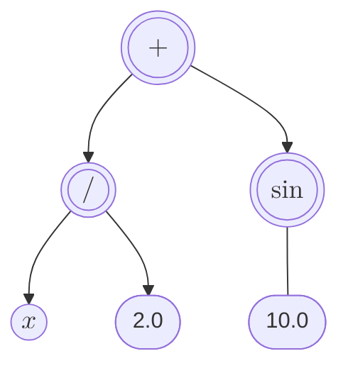

+++
title = 'RFE 008: 工程师（粗）Rust入门之遗传编程'
date = 2025-11-14T22:55:49+08:00
draft = false
mathkatex = true
categories = ['rust', 'rfe']
tags = ['rust', 'engineering', 'tutorial', 'evolutionary-computation', 'genetic-programming', 'symbolic-regression']
toc = true
tocBorder = true
+++

## 遗传编程简介

```text
A genetic algorithm is a form of evolution that occurs on a computer. Genetic
algorithms are a search method that can be used for both solving problems and
modeling evolutionary systems. With various mapping techniques and an
appropriate measure of fitness, a genetic algorithm can be tailored to evolve
a solution for many types of problems, including optimization of a function
or determination of the proper order of a sequence. Mathematical analysis
has begun to explain how genetic algorithms work and how best to use them.
Recently, genetic algorithms have been used to model several natural
evolutionary systems, including immune systems.
--- Stephanie Forrest, 
Genetic Algorithms: Principles of Natural Selection Applied to Computation,
Science, vol. 261, 1993. DOI: 10.1126/science.8346439
```

进化计算（Evolutionary Computation，EC）是一类基于自然进化过程的计算方法。它们模拟生物进化中的选择、变异和遗传等机制，以解决复杂的优化和搜索问题。进化计算包括多种技术，如遗传算法（Genetic Algorithms，GA）、遗传编程（Genetic Programming，GP）、进化策略（Evolution Strategies，ES）和差分进化（Differential Evolution，DE）等。

Science 2009的另外一篇文章讨论了如何从数据中得到物理定律，Michael Schmidt, Hod Lipson. Distilling Free-Form Natural Laws from Experimental Data. Science 2009, 324, 81-85. DOI: 10.1126/science.1165893.

这两篇文章都不是AI捏造的……都是真的。

Michael的文章中的第一个例子就非常有趣。将一个混沌双摆的数据进行进化挖掘，在没有任何先验知识的基础上得到一个不变量（右边），这个公式恰好就是系统的哈密尔顿量（也就是分析力学中的能量守恒量）。


我记得看过一篇文章把Genetic Programming说得很神奇，什么计算机编程序，自动发现算法，自动发现数学公式之类的。我怀疑这个文章是印度裔写的，但是我也没有证据，再说我们都是不搞种族歧视的。其实也不是那么神奇啦，就是一种启发式搜索算法而已。而它搜索的对象，也就是表现为计算表达式树（Expression Tree）的程序或者数学公式。


这下[Lisp](/categories/lisp/)的小伙伴看得清楚，这分明就是Lisp源代码。没错，Lisp直接支持对S表达式进行编程，天生就适合整表达式树，所以以前搞人工智能的都只用Lisp。在第二次连接主义浪潮之前，Lisp是AI的主流语言。现在我又看到一次PINN相关的文章在讨论对数据金矿的应用，物理规律的嵌入和提取，说不定Lisp又要复兴。

## Rust中的遗传编程

那么，说这么多题外话，Rust在哪？当然是在Rust中实现遗传编程啦！

### 问题

我们假装要解决一个简单的问题：我们拿到了一组数据点，希望通过遗传编程找到一个数学公式来拟合这些数据点。记住，这里不是要我们先选定拟合形态（比如线性、多项式、指数等），而是让计算机自己去发现一个合适的数学表达式。这是遗传编程与传统回归分析的区别。

按照一般回归分析的思路，我们可以先进行EDA（Exploratory Data Analysis，探索性数据分析），然后选择一个合适的模型进行拟合。通常所谓合适的模型就是一组基底函数，然后用基底函数的线性组合来拟合数据，也成为广义线性模型（Generalized Linear Model，GLM）。通常而言，这样的模型能够解决大部分的问题，实际上数据量更大，还会直接用神经网络来拟合，毕竟神经网络也是一种通用函数逼近器。

GLM和神经网络最大的问题是什么呢？其实就是他们失去了跟物理规律的联系。而有洁癖或者有特殊需求的工程师，往往希望得到一个简洁明了的数学公式，而不是一堆黑盒子。例如前面的混沌摆，用神经网络、GLM都可以拟合数据，但是无法得到物理规律（能量守恒）。

我们就很随意的定一个函数：$f(x) = x^2 + x + 1 + x * \cos(x)$，然后生成一些数据点，加上一些噪声。然后让遗传编程去拟合这个数据。


### 表达式

在Lisp中，表达式可以随意表达，就像吃饭喝水一样自然。在Rust中呢？还要分析一下。

```rust
{}
```

我们的表达式，自然可以用`enum`来表达和类型（Sum Type），常量、变量、一元操作、二元操作。



上面这个例子中，`+`,`/`就是二元操作符，`sin`就是一元操作符，`2.0`,`10.0`是常量，$x$就是变量。Rust代码中，构造这样的递归结构实际上也不是超级复杂，就只需要把递归引用的`Expr`用`Box`包一下。

`Box`就是我们常说的智能指针，因为`Expr`的大小没有办法事先知道，所以必须要用指针来表达，并且存储在堆（heap）上。`Box`也没有什么神奇魔法，它其实就是维护一个引用计数，引用这个内存的地方少一个，就减一，增加一个引用就加一，到了引用数为0，则可以把内存回收掉。非常愚蠢，所以，人类通过精心制作一个循环引用，就能够破坏`Box`的内存回收机制。不过这种玩意对我们工程师并没有什么重要的，我们随便写一个程序，运行个几秒就退出，大不了整个机器重启……这个是工程师常见的解决方案。

须知，单片机什么的还有一个看门狗的玩意……它的作用就是定时重启……


工程师感觉吧，不作死就不会死，关键在于作死的难度。我们所有的安全设计都只是增加作死的难度而已，很Rust，很锈……

一元操作符和二元操作符就是两个结构体，包括一个名称、一个计算函数。这个操作符是一个尺寸已知的结构体，因此，默认可以实现`Copy`和`Clone`，我们就不费那个劲管理它，直接当作一个值使用就行。

```rust
{}
```

```rust
{}
```

当然，我们实现就要定义一些操作符。

```rust
{}
```

```rust
{}
```

如此这般，我们就可以构造一个表达式。例如，我们要随机产生一个一定深度的表达式：

```rust
{}
```

如果深度是0，那么就是常量或者变量；如果深度超过或者等于1，那就要选一个操作符，然后递归调用产生深度-1的表达式（按照操作符，一元就产生一个，二元就产生两个）。表达的构造就是下面这样的。

```rust
let op = UNARY_OPS.choose(&mut rng).unwrap();
let operand = Box::new(generate_random_expr(depth - 1));
Expr::Unary(*op, operand)
```

```rust
let op = BINARY_OPS.choose(&mut rng).unwrap();
let left = Box::new(generate_random_expr(depth - 1));
let right = Box::new(generate_random_expr(depth - 1));
Expr::Binary(*op, left, right)
```

非常直观，`Box::new`函数调用，这就保证，通过`Expr::Constant(rng.gen_range(-5.0..5.0))`,`Expr::Constant(rng.gen_range(-5.0..5.0))`,`Expr::Unary(*op, operand)`,`Expr::Binary(*op, left, right)`产生的`Expr`对象被自动管理了（引用数+1），不会被丢掉造成悬垂指针。

```text
箱子装起来的东西，哪怕是垃圾，都不会被丢掉……
```

### 进化表达式

接下来要完成遗传编程，就需要实现表达式（`Expr`）的进化操作，我们这里实现的是最无趣的版本。

```rust
{}
```

这就是交叉操作，对两个表达式进行操作，注意这里采用的传递引用，这个概念在Rust中也非常自然和有用，就是只读+共享意思（没有`mut`就不可写），因为只读，所以不会造成竞争；因为是`&`取地址，所以不用拷贝数据。这就简化了函数的接口。

实际上，在代码里，我们把这两个表达式都做了一个`clone`，然后随机把两个表达式的子节点交叉替换一个（非常粗暴简单无聊）。

下面来看最简陋的变异。

```rust
{}
```

有一定概率，随机产生一个表达式；一元操作符，递归调用变异其子节点；二元操作符，随机变异一个子节点。返回一个新的操作符……

这两个函数从我们EC的角度看，是极其敷衍的……下面来看看草台班子世界这样敷衍行不行。

### 结果

当然我们实现一个求表达式的值，并且实现了一个fit函数，按照GA的通用流程，产生总群，选优，随机选择交叉编译，产生下一代种群。

随意运行几次，就有很大概率得到如下结果：

```shell
Final best expression: (((1.00 + cos(x)) * x) + (1.00 + (x * x)))
Final fitness: 0.0008
|Binary(+)
|----Binary(*)
|--------Binary(+)
|------------Constant(1.00)
|------------Unary(cos)
|-------------Variable(x)
|--------Variable(x)
|----Binary(+)
|--------Constant(1.00)
|--------Binary(*)
|------------Variable(x)
|------------Variable(x)
```

这跟原来的公式是一模一样的。实际上，我们还应该增加：公式的简化；按照层数偏好低层公式的机制。但确实挺神奇，就这么简陋无聊可笑的交叉、变异规律，也能够偶尔得到靠谱的结果。其实这就是大量产生方案，总会有差不多够好的解的自然进化原理。当然，大部分时候，大部分猜测，都像蝌蚪宝宝中的70% $\sim$ 80%一样，重新进入自然循环。

## 总结

项目地址在：[Github Repo](https://github.com/qchen-fdii-cardc/symbolic_regression)

文件也可以直接下载：

- [Cargo.toml](/rust/rfe/symbolic_regression/Cargo.toml)
- [lib.rs](/rust/rfe/symbolic_regression/src/lib.rs)
- [main.rs](/rust/rfe/symbolic_regression/src/main.rs)

用Rust来做这个，有什么优势？目前Java有一个[Jenetics](https://jenetics.io/)，Python有一个[pySR](https://github.com/MilesCranmer/PySR)，两个的生态都有可取之处。Java呢，比较好的接入大数据相关的基础设施，也能通过kotlin进行愉快的编程，计算效率也不低，我前面一个文章的软件就是用Jenetics做的，还行……pySR我没有用过，但是Python是可以无脑入的，因为PINN相关的包、numpy的基础设施是无敌的。

为啥要用Rust？性能上还是有一点点优势，Rust的程序执行效率是真的高，可以放心的整大种群、长代数……再就是Rust的代码写起来还是不错的，几个月前写的Rust现在还是基本看得懂，Python我基本不会看，直接重写……
