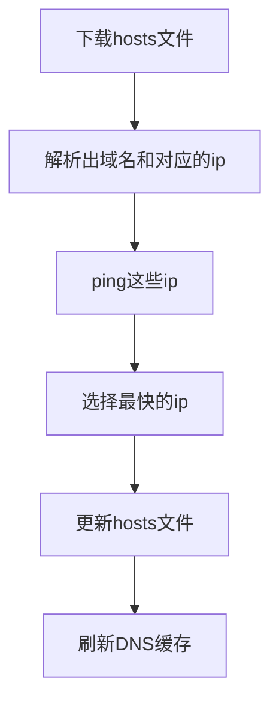

+++
title = 'Update Hosts in Rust中操作hosts文件'
date = 2025-04-23T10:26:21+08:00
draft = false
mathkatex = true
categories = ['rust']
tags = ['rust', 'hosts', 'reqwest', 'fs', 'cargo', 'crossbeam', 'github.com', 'Coursier']
toc = true
tocBorder = true
+++


## Rust启动

说真的，我挺不喜欢锈粉（Rustaceans）那股味道的，就好像我家两个原神粉（老婆和孩子）天天攻击我说魔兽世界是垃圾游戏一样，我，我，我打，我打扫卫生去……

但是，有时候，有时候，我会相信一切有尽头，相聚离开都有时候，没有什么会永垂不锈

前几天，我想搞一个各种语言GCD的玩意，看看各个语言的泛型约束方式和实现的比较，结果搞起Scala的时候，发现Scala 3现在用Coursier来管理依赖，搞半天下载不动。好嘛，那我就更新hosts文件。结果，有一些hosts下载下来domain对应的ip有好几个，能访问不能访问的都有，还要自己一个一个试，那也太坑了吧。。。

一怒之下，Rust，启动！

## 代码

Cargo大法好，Rust保平安。

### 工程文件

```toml
{}
```

不知道为什么`cargo new`的时候，给我生成的`edition`是2024年……

依赖的几个库，`reqwest`是用来下载hosts文件的，`regex`是模式匹配的，用于解析ping命令的输出，`crossbeam`是用来并发操作的。`chrono`是用来获取当前时间的。

### 程序功能

程序的功能很简单，就是下载hosts文件，然后解析出域名和对应的ip，然后ping这些ip，选择最快的ip，然后更新hosts文件。



稍微好玩一点就是有：下载hosts文件、ping每个域名对应的多个ip选择最快的一个。

### 下载文件

关于`reqwest`（这个名字简直笑死我了……顺便吐槽下Rust糟糕的[社区Crates.io](<https://crates.io>)奇葩的管理政策），我这里用的是`blocking`模式，因为就一个文件，下载时间很短，没必要异步。>

```rust
let resp = reqwest::blocking::get("https://cdn.jsdelivr.net/gh/ittuann/GitHub-IP-hosts@main/hosts")?;
```

这个调用的最后有一个`?`，是一个语法糖，代表着如果`get`如果返回了一个正确的值，则该值被提取了赋值给`resp`，否则程序会中断执行下面的语句提前返回，把错误向上扩散。我们还是偏好显式地处理错误，如同下面地代码。

```rust
{}
```

`get`方法返回一个`Result<Response>`，这个`match`语句是处理`Result`的典型用法，整挺好。

当然，这里地场景实在是太简单。

### 并发ping

并发ping的场景，我这里用的是`crossbeam`的`unbounded`通道。这个通道的容量是无限的，所以可以无限制地发送消息。示例代码如下：

```rust
use crossbeam_channel::unbounded;

// Create a channel of unbounded capacity.
let (s, r) = unbounded();

// Send a message into the channel.
s.send("Hello, world!").unwrap();

// Receive the message from the channel.
assert_eq!(r.recv(), Ok("Hello, world!"));
```

在我们的程序中，主要考虑ping域名有时候需要等待挺久，就算是设置了超时1s，有的domain有四个ip，需要ping四次，所以需要并发。当一个线程完成对应某个域名的所有ip的计时后，把时间最短的结果发送到通道中，然后主进程从通道中接收结果，并更新字典记录。

```rust
{}
```

这里，在每个线程中，需要使用的几个变量就是`domain`,`ips`，和用于通讯的`tx`，我们采用了`thread::spawn`来创建线程，并利用`move`关键字把变量所有权转移给线程。也正是因为如此，我们在启动线程之前，需要把`domain`、`ips`和`tx`克隆一份共线程内部使用。

并且，`drop(tx)`会释放主线程的`tx`，而每个线程中的`clone`只会赋值一个通道的句柄，并且这个对句柄的应用会在线程结束时自动释放。最终这个结构实现了所有线程工作完成后，主进程才从通道中接收结果的阻塞等待才会结束。这个过程更好的用下面的程序演示：

这个程序需要两个依赖：

```bash
cargo add crossbeam rand
```

源代码很简单。

```rust
use crossbeam::channel::unbounded;
use std::thread;
use rand::Rng;
use std::time::Duration;

fn main() {
    let (tx, rx) = unbounded();
    
    // 创建3个工作线程
    for i in 0..3 {
        let tx = tx.clone();
        thread::spawn(move || {
            println!("Thread {} starting", i);
            // sleep 1~10 s
            let sleep_time = rand::rng().random_range(1..=10);
            thread::sleep(Duration::from_secs(sleep_time));
            tx.send(format!("Thread {} sleep {} s", i, sleep_time)).unwrap();
            println!("Thread {} ended", i);
            // 线程结束，tx的克隆在这里被丢弃
        });
    }
    
    // 丢弃主线程的tx
    drop(tx);
    
    // 接收所有消息
    for received in rx {
        println!("Received: {}", received);
    }
}
```

一次运行可能像这样。

```bash
cargo run
# Thread 1 starting
# Thread 0 starting
# Thread 2 starting
# Thread 2 ended
# Received: Thread 2 sleep 6 s
# Thread 1 ended
# Received: Thread 1 sleep 8 s
# Received: Thread 0 sleep 8 s
# Thread 0 ended
```

但是朋友们请一定要把程序中的线程数改为300，睡眠秒数改为`1..=100`，然后运行一下，真的比较有意思。想到这里，我感觉可以用Rust锈化一个传说中的Sleep排序，简直不要太美哦……

### 其它部分

其它对于文件的读取和写入、命令行的操作，意思不大，就不赘述了。

### 源代码

工程文件下面就是`src`文件夹，里面就是源文件`main.rs`。

```rust
{}
```

## 运行

```bash
cargo run 
cargo build -release
./target/release/updatehosts4r
```

当然，这个程序仅仅适用于Windows系统。linux下面更简单，但是我们WSL党根本不需要。后面可以把这个exe文件设置一个管理员权限运行（右键属性，设置如下图中箭头所示）。否则就要打开一个管理员权限的命令行运行上面的命令。如果没有权限，那就没办法更改hosts文件了。


下面是运行的输出，包括了下载的域名和对应的ip以及ping的时间。目前程序里设置了1s的超时。

```quote
Trying to download from: https://cdn.jsdelivr.net/gh/ittuann/GitHub-IP-hosts@main/hosts
Successfully downloaded from: https://cdn.jsdelivr.net/gh/ittuann/GitHub-IP-hosts@main/hosts
Total domains: 37
 github.blog [192.0.66.2]                               ==> 81 ms
 pipelines.actions.githubusercontent.com [13.107.42.16] ==> 119 ms
 github.githubassets.com [185.199.108.154]              ==> 265 ms
 alive.github.com [140.82.113.25]                       ==> 289 ms
 education.github.com [140.82.112.21]                   ==> 276 ms
 copilot-proxy.githubusercontent.com [20.85.130.105]    ==> 280 ms
 github-cloud.s3.amazonaws.com [16.15.184.238]          ==> 274 ms
 codeload.github.com [140.82.114.10]                    ==> 273 ms
 github.community [140.82.113.17]                       ==> 291 ms
 origin-tracker.githubusercontent.com [140.82.113.21]   ==> 274 ms
 github.com [140.82.112.4]                              ==> 280 ms
 central.github.com [140.82.112.22]                     ==> 274 ms
 github.global.ssl.fastly.net [151.101.1.194]           ==> 279 ms
 github.io [185.199.108.153]                            ==> 281 ms
 gist.github.com [140.82.112.3]                         ==> 282 ms
 githubcopilot.com [140.82.112.18]                      ==> 275 ms
 collector.github.com [140.82.112.21]                   ==> 279 ms
 githubstatus.com [185.199.108.153]                     ==> 279 ms
 api.github.com [140.82.112.6]                          ==> 280 ms
 github-com.s3.amazonaws.com [16.15.193.138]            ==> 286 ms
 live.github.com [140.82.113.25]                        ==> 294 ms
 github.githubassets.com [185.199.109.154]              ==> 271 ms
 education.github.com [140.82.113.21]                   ==> 269 ms
 github-cloud.s3.amazonaws.com [16.15.192.141]          ==> 283 ms
 github.community [140.82.113.18]                       ==> 275 ms
 github.com [140.82.114.3]                              ==> 282 ms
 github.global.ssl.fastly.net [151.101.129.194]         ==> 269 ms
 central.github.com [140.82.113.22]                     ==> 281 ms
 origin-tracker.githubusercontent.com [140.82.114.21]   ==> 283 ms
 github.io [185.199.109.153]                            ==> 267 ms
 githubstatus.com [185.199.109.153]                     ==> 261 ms
 githubcopilot.com [140.82.113.17]                      ==> 280 ms
 collector.github.com [140.82.114.22]                   ==> 273 ms
 gist.github.com [140.82.113.4]                         ==> 287 ms
 api.github.com [140.82.113.6]                          ==> 285 ms
 live.github.com [140.82.113.26]                        ==> 280 ms
 github-com.s3.amazonaws.com [3.5.0.87]                 ==> 293 ms
 avatars4.githubusercontent.com [185.199.108.133]       ==> timeout
 objects.githubusercontent.com [185.199.108.133]        ==> timeout
 avatars2.githubusercontent.com [185.199.108.133]       ==> timeout
 favicons.githubusercontent.com [185.199.108.133]       ==> timeout
 raw.githubusercontent.com [185.199.108.133]            ==> timeout
 cloud.githubusercontent.com [185.199.108.133]          ==> timeout
 user-images.githubusercontent.com [185.199.108.133]    ==> timeout
 avatars1.githubusercontent.com [185.199.108.133]       ==> timeout
 camo.githubusercontent.com [185.199.108.133]           ==> timeout
 media.githubusercontent.com [185.199.108.133]          ==> timeout
 avatars0.githubusercontent.com [185.199.108.133]       ==> timeout
 avatars5.githubusercontent.com [185.199.108.133]       ==> timeout
 avatars.githubusercontent.com [185.199.108.133]        ==> timeout
 avatars3.githubusercontent.com [185.199.108.133]       ==> timeout
 desktop.githubusercontent.com [185.199.108.133]        ==> timeout
 github.map.fastly.net [185.199.108.133]                ==> timeout
 github.githubassets.com [185.199.110.154]              ==> 254 ms
 github-com.s3.amazonaws.com [3.5.27.67]                ==> 297 ms
 github.global.ssl.fastly.net [151.101.193.194]         ==> 241 ms
 githubstatus.com [185.199.110.153]                     ==> 243 ms
 github.io [185.199.110.153]                            ==> 236 ms
 github.githubassets.com [185.199.111.154]              ==> 278 ms
 github-cloud.s3.amazonaws.com [3.5.27.149]             ==> timeout
 avatars4.githubusercontent.com [185.199.109.133]       ==> timeout
 camo.githubusercontent.com [185.199.109.133]           ==> timeout
 avatars3.githubusercontent.com [185.199.109.133]       ==> timeout
 avatars.githubusercontent.com [185.199.109.133]        ==> timeout
 github.map.fastly.net [185.199.109.133]                ==> timeout
 media.githubusercontent.com [185.199.109.133]          ==> timeout
 favicons.githubusercontent.com [185.199.109.133]       ==> timeout
 avatars5.githubusercontent.com [185.199.109.133]       ==> timeout
 cloud.githubusercontent.com [185.199.109.133]          ==> timeout
 raw.githubusercontent.com [185.199.109.133]            ==> timeout
 objects.githubusercontent.com [185.199.109.133]        ==> timeout
 avatars2.githubusercontent.com [185.199.109.133]       ==> timeout
 avatars0.githubusercontent.com [185.199.109.133]       ==> timeout
 avatars1.githubusercontent.com [185.199.109.133]       ==> timeout
 user-images.githubusercontent.com [185.199.109.133]    ==> timeout
 desktop.githubusercontent.com [185.199.109.133]        ==> timeout
 githubstatus.com [185.199.111.153]                     ==> 257 ms
 github.io [185.199.111.153]                            ==> 258 ms
 github.global.ssl.fastly.net [151.101.65.194]          ==> 267 ms
 avatars4.githubusercontent.com [185.199.110.133]       ==> 251 ms
 camo.githubusercontent.com [185.199.110.133]           ==> 251 ms
 github.map.fastly.net [185.199.110.133]                ==> 249 ms
 avatars3.githubusercontent.com [185.199.110.133]       ==> 251 ms
 media.githubusercontent.com [185.199.110.133]          ==> 252 ms
 avatars.githubusercontent.com [185.199.110.133]        ==> 248 ms
 raw.githubusercontent.com [185.199.110.133]            ==> 248 ms
 favicons.githubusercontent.com [185.199.110.133]       ==> 249 ms
 avatars2.githubusercontent.com [185.199.110.133]       ==> 247 ms
 avatars5.githubusercontent.com [185.199.110.133]       ==> 250 ms
 objects.githubusercontent.com [185.199.110.133]        ==> 249 ms
 cloud.githubusercontent.com [185.199.110.133]          ==> 249 ms
 avatars1.githubusercontent.com [185.199.110.133]       ==> 254 ms
 user-images.githubusercontent.com [185.199.110.133]    ==> 256 ms
 desktop.githubusercontent.com [185.199.110.133]        ==> 257 ms
 avatars0.githubusercontent.com [185.199.110.133]       ==> 255 ms
 github-com.s3.amazonaws.com [3.5.29.107]               ==> timeout
 github-cloud.s3.amazonaws.com [3.5.28.239]             ==> timeout
 avatars4.githubusercontent.com [185.199.111.133]       ==> timeout
 avatars.githubusercontent.com [185.199.111.133]        ==> timeout
 raw.githubusercontent.com [185.199.111.133]            ==> timeout
 avatars0.githubusercontent.com [185.199.111.133]       ==> timeout
 objects.githubusercontent.com [185.199.111.133]        ==> timeout
 avatars2.githubusercontent.com [185.199.111.133]       ==> timeout
 cloud.githubusercontent.com [185.199.111.133]          ==> timeout
 github.map.fastly.net [185.199.111.133]                ==> timeout
 camo.githubusercontent.com [185.199.111.133]           ==> timeout
 avatars3.githubusercontent.com [185.199.111.133]       ==> timeout
 user-images.githubusercontent.com [185.199.111.133]    ==> timeout
 media.githubusercontent.com [185.199.111.133]          ==> timeout
 avatars1.githubusercontent.com [185.199.111.133]       ==> timeout
 desktop.githubusercontent.com [185.199.111.133]        ==> timeout
 avatars5.githubusercontent.com [185.199.111.133]       ==> timeout
 favicons.githubusercontent.com [185.199.111.133]       ==> timeout

Fastest IPs selected for 37 domains

Results (domain -> ip -> ping time):
          avatars4.githubusercontent.com -> 185.199.110.133 -> 251ms
               raw.githubusercontent.com -> 185.199.110.133 -> 248ms
            github.global.ssl.fastly.net -> 151.101.193.194 -> 241ms
          avatars0.githubusercontent.com -> 185.199.110.133 -> 255ms
    origin-tracker.githubusercontent.com -> 140.82.113.21   -> 274ms
                    education.github.com -> 140.82.113.21   -> 269ms
                         live.github.com -> 140.82.113.26   -> 280ms
                    collector.github.com -> 140.82.114.22   -> 273ms
                              github.com -> 140.82.112.4    -> 280ms
                   github.map.fastly.net -> 185.199.110.133 -> 249ms
                          api.github.com -> 140.82.112.6    -> 280ms
          avatars2.githubusercontent.com -> 185.199.110.133 -> 247ms
       user-images.githubusercontent.com -> 185.199.110.133 -> 256ms
           github-cloud.s3.amazonaws.com -> 16.15.184.238   -> 274ms
          avatars1.githubusercontent.com -> 185.199.110.133 -> 254ms
             github-com.s3.amazonaws.com -> 16.15.193.138   -> 286ms
     copilot-proxy.githubusercontent.com -> 20.85.130.105   -> 280ms
           objects.githubusercontent.com -> 185.199.110.133 -> 249ms
          avatars3.githubusercontent.com -> 185.199.110.133 -> 251ms
              camo.githubusercontent.com -> 185.199.110.133 -> 251ms
           desktop.githubusercontent.com -> 185.199.110.133 -> 257ms
                         gist.github.com -> 140.82.112.3    -> 282ms
                     codeload.github.com -> 140.82.114.10   -> 273ms
                 github.githubassets.com -> 185.199.110.154 -> 254ms
                               github.io -> 185.199.110.153 -> 236ms
           avatars.githubusercontent.com -> 185.199.110.133 -> 248ms
             cloud.githubusercontent.com -> 185.199.110.133 -> 249ms
          favicons.githubusercontent.com -> 185.199.110.133 -> 249ms
          avatars5.githubusercontent.com -> 185.199.110.133 -> 250ms
                      central.github.com -> 140.82.112.22   -> 274ms
                       githubcopilot.com -> 140.82.112.18   -> 275ms
                        alive.github.com -> 140.82.113.25   -> 289ms
 pipelines.actions.githubusercontent.com -> 13.107.42.16    -> 119ms
                             github.blog -> 192.0.66.2      -> 81ms
             media.githubusercontent.com -> 185.199.110.133 -> 252ms
                        github.community -> 140.82.113.18   -> 275ms
                        githubstatus.com -> 185.199.110.153 -> 243ms

Writing results to hosts file...
Done!

Hosts file updated and DNS cache flushed successfully!
Temp file deleted
Temp hosts file deleted
Press any key to exit...
```

## 总结

反正最后我更新了`hosts`文件，把`Coursier`给装上了……


Rust，哦不，Scala，启动！
