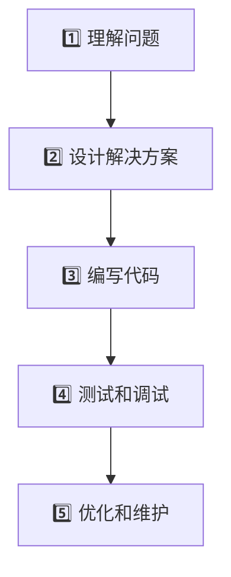

# 🚀 学习编程的难点和解决方法

## 从入门到精通的完整指南

**探索编程学习的三个层次与四个解决方向**

*让编程学习变得更有方向感*

---

# 📊 今日议题

## 🎯 我们将讨论什么？

- **🤔 学习编程为什么难？**

- **💡 解决的方向**

- **🔮 对AI时代的期待**

---

# 🌟 编程学习的时代背景

"软件的构建在上个世纪逐步干掉硬件成为主要的驱动引擎，这个世纪更是成为了显学中的显学"

## 📈 时代变迁

- **过去**: 硬件为王
- **现在**: 软件驱动一切
- **未来**: AI + 编程？

🤔 <strong>核心问题</strong>: 入，还是不入编程这个领域？

---

# 🧩 软件构建的复杂性

## 🔍 为什么编程这么复杂？

<strong>📚 知识体系庞大</strong> 
《Code Complete 2》- 中文100万字，1000页 
五十年的软件开发知识积累

<strong>🎭 执行模式复杂</strong> 
线性、分支、循环、并发、异步、异常处理...

---

# 🎯 编程开发的五个阶段

## 💡 关键洞察

<strong>🎯 最难的部分</strong>: 理解问题和设计解决方案 
<strong>💰 最贵的工作</strong>: 帮助甲方理解问题 
<strong>🔧 相对简单</strong>: 编写代码 (本科生稍微培训就能入职)

---

# 🏔️ 学习编程的三层难度

## 🎯 从简单到复杂的学习路径

### 1️⃣ 语法掌握

### 2️⃣ 算法应用  

### 3️⃣ 系统架构

---

# 1️⃣ 第一层：语法掌握

## 🌱 基础语言技能

- **难度**: 相对简单
- **内容**: 程序设计语言的语法
- **类比**: 学习英语语法
- **时间**: 可在短时间内完成

<strong>💡 关键</strong>: 需要大量练习，避免"纸上编程"

---

# 2️⃣ 第二层：算法应用

## 🌿 数据结构与算法

- **难度**: 中等复杂
- **内容**: 解决具体问题的方法
- **分类**:
  - 计算机导向 (最聪明的人的领域)
  - 任务导向 (现代语言通常内置)

<strong>⚠️ 注意</strong>: 同一语言在不同人口中评价差异很大

---

# 3️⃣ 第三层：系统架构

## 🌳 复杂系统构建

- **难度**: 最为复杂
- **内容**: 体系架构和质量控制
- **范围**: 复杂软件系统构造

<strong>🎯 现实</strong>: 一般编程问题主要集中在前两层

---

# 🔍 语言对比：C vs Rust

## 🅰️ C语言特点

- ✅ **语法简单**: 内置结构少  
- ❌ **应用复杂**: 需要自己实现很多基础功能
- 🛠️ **需要自建**: 内存管理、生命周期系统

## 🦀 Rust语言特点  

- ❌ **语法复杂**: 学习曲线陡峭
- ✅ **应用简单**: 内置解决方案丰富
- 🔒 **内置功能**: 内存安全、并发安全、错误处理

---

# 🎯 解决方向一：知其所止

"缗蛮黄鸟，止于丘隅"

## 🔑 核心问题：为什么学习编程？

<strong>⚠️ 关键原则</strong>: 必须是真正认可的，必须跟自己的兴趣、爱好、特长相结合

### 🔥 真实的力量

- 虚假的目标不能长久
- 真实才有持续的动力

---

# 💭 常见的学习动机

## 🎯 可能的驱动力

- 💼 **找工作**
- 🏠 **大房子**
- 💕 **女朋友**
- 🌍 **改变世界**

<strong>💡 重要提醒</strong>: 嘴里说重要，但心里不认可，学着学着就会放弃

---

# 🌱 解决方向二：君子务本

"君子务本，本立道生"

## 📐 编程的本质

### 🔢 经典公式

# **数据 + 算法 = 程序**

---

# 🦀 以Rust为例理解本质

**🔄 生命周期标注** = 一种数据结构和算法

- 解决数据有效期问题
- 防止数据在无效期使用
- 防止数据提前释放

**🔒 所有权系统** = 一种数据结构和算法

- 内存安全保证
- 并发安全保证

---

# 📚 解决方向三：学而时习之

"学而时习之，不亦说乎"

<strong>💡 核心理念</strong>: 编程是实践活动，需要大量练习

---

# 🛠️ Rust学习资源推荐

## 🎯 实践练习

- **[Rustlings](https://github.com/rust-lang/rustlings)**: 小练习熟悉语法
- **[Rust by Example](https://doc.rust-lang.org/stable/rust-by-example/)**: 大量实例

## 📖 学习材料  

- **[C++ Rust Rephrase](https://cel.cs.brown.edu/crp/)**: C++对照学习
- **社区丰富**: Rust社区提供大量优质材料

---

# 🔄 解决方向四：温故而知新

"温故而知新，可以为师矣"

## 🎓 教学相长的力量

### 📝 写作学习法

- **写帖子**: 假装教人编程来自己学编程
- **整理思路**: 写作帮助理解问题
- **发现新问题**: 教学过程中发现盲点

---

# 🔮 对AI时代的期待

"真希望AI能够更厉害，跟我们进行更加深入和有意义的交互，彻底解决编程的问题"

## 🤖 AI应该更擅长的领域

- **📋 需求分析**: 帮助理解和定义问题
- **🏗️ 架构设计**: 《代码大全2》中的架构和体系
- **🔄 深度交互**: 更有意义的编程对话

---

# 📋 总结：三个层次

## 🎯 学习编程的层次递进

1. **🌱 语法掌握** - 基础工具
2. **🌿 算法应用** - 解决问题  
3. **🌳 系统架构** - 构建复杂系统

<strong>💡 重点</strong>: 现代编程语言通常将第一层和第二层结合在一起

---

# 🗺️ 总结：四个方向

## 🚀 学习编程的解决路径

1. **🎯 知其所止** - 明确真实目标
2. **🌱 君子务本** - 掌握核心原理
3. **📚 学而时习之** - 持续实践练习
4. **🔄 温故而知新** - 教学相长互促

<strong>🚀 记住</strong>: 编程学习是一个长期坚持的过程，需要真实的动机和持续的实践！

---

# 🙏 谢谢大家

## 💬 Questions & Discussion

**让我们一起探索编程学习的更多可能性**

---

### 📧 联系方式

- 📝 **博客**: [windtunnel.cn](https://www.windtunnel.cn)
- 🐙 **GitHub**: [@qchen-fdii-cardc](https://github.com/qchen-fdii-cardc)

