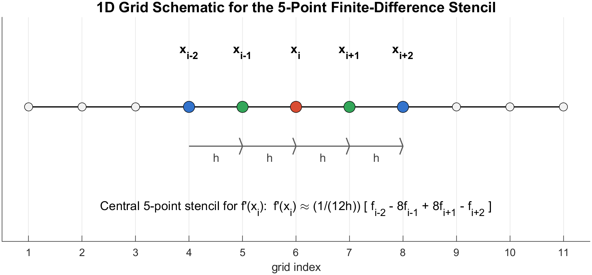
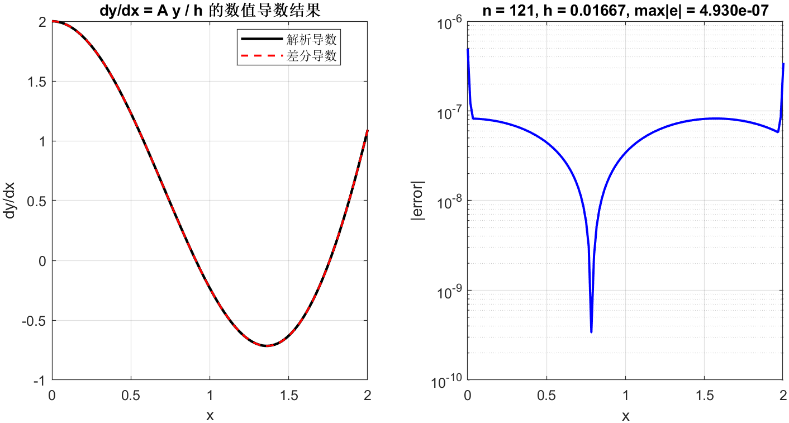
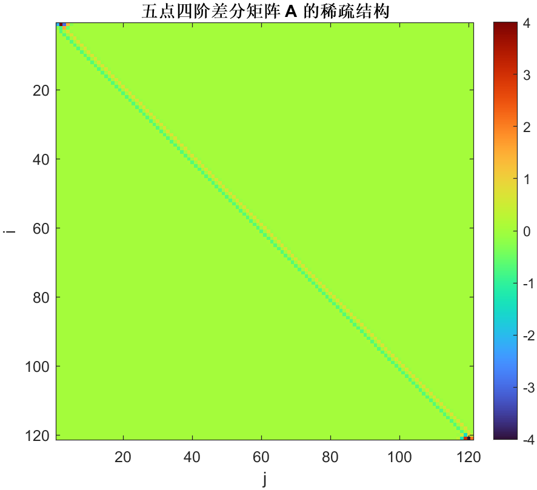
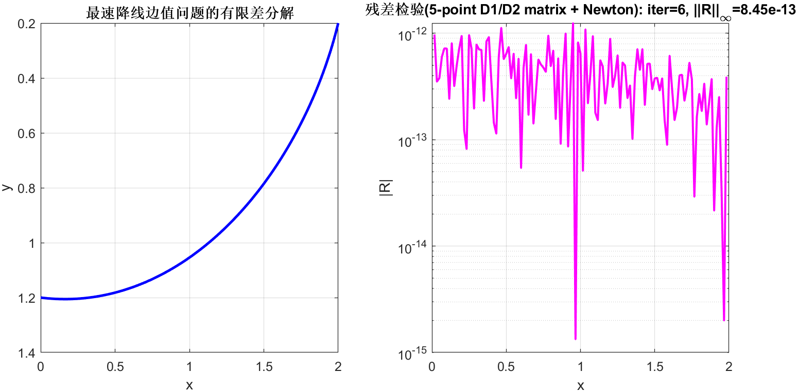
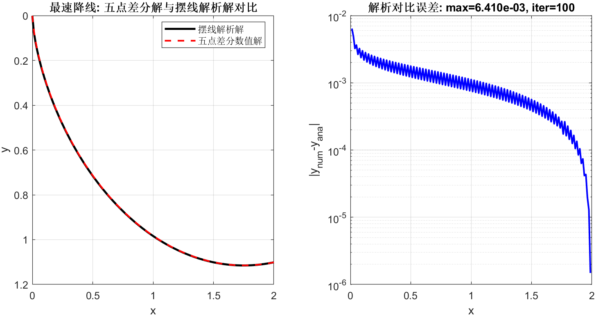

# 有限差分与最速降线的矩阵化求解

## 五点差分矩阵 A 的构造与误差分析

### 由泰勒匹配方程推导五点模板

神奇的泰勒展开不仅能用来分析差分格式的截断误差，还能直接推导出高阶差分模板。

$$
f(x+s\cdot h) = f(x) + s h f'(x) + \frac{(s h)^2}{2!}f''(x) + \frac{(s h)^3}{3!}f'''(x) + \frac{(s h)^4}{4!}f''''(x) + \cdots
$$

我们这里写$s\cdot h$是便后后续在$x$点附近取间距为$h$的离散点。通常我们这样的离散点体系称为网格，$h$是网格步长。对于五点差分，我们选取五个离散点，分别对应$s_j$，并构造线性组合来近似$f'(x)$。

在等距网格 $x_i=x_{\min}+(i-1)h$ 上，设 $y_i=f(x_i)$，目标是构造一次性作用于全区间的离散导数算子。对任意模板点位移集合 $s_j$，令局部近似写成 $f'(x_i)\approx \sum_{j=1}^{5}k_j f(x_i+s_j h)$，将五个采样点做泰勒展开并要求常数项、二至四阶项消失，一阶项系数为 1，就得到与 cd5p_deduction.m 相同的线性系统
$$
\begin{bmatrix}
1 & s_1 & s_1^2/2! & s_1^3/3! & s_1^4/4!\\
1 & s_2 & s_2^2/2! & s_2^3/3! & s_2^4/4!\\
1 & s_3 & s_3^2/2! & s_3^3/3! & s_3^4/4!\\
1 & s_4 & s_4^2/2! & s_4^3/3! & s_4^4/4!\\
1 & s_5 & s_5^2/2! & s_5^3/3! & s_5^4/4!
\end{bmatrix}^{\top}
\mathbf k=
\begin{bmatrix}0\\1\\0\\0\\0\end{bmatrix}.
$$

当左端第一个点使用 $s=[0,1,2,3,4]$ 时得到前向四阶模板 $[-25/12,4,-3,4/3,-1/4]$，第二个点使用 $s=[-1,0,1,2,3]$ 时得到 $[-1/4,-5/6,3/2,-1/2,1/12]$，内部点使用 $s=[-2,-1,0,1,2]$ 时得到中心模板 $[1/12,-2/3,0,2/3,-1/12]$，右端两点由镜像模板给出。将这些系数按行装配，便得到五对角带状矩阵 $A$，从而全局导数可写为
$$
\mathbf y_x\approx \frac{1}{h}A\mathbf y.
$$

### 模板对齐误差与中心差分比较

五点中心模板的截断误差是 $O(h^4)$，而三点中心模板 $[-1/2,0,1/2]$ 的截断误差是 $O(h^2)$，因此在同一网格密度下五点格式理论精度更高。与此同时，边界处不能使用对称模板，只能采用与网格左端或右端对齐的单边模板，这种“模板对齐”会使边界附近的误差常数高于内部中心点，误差曲线通常表现为边界稍高、内部更平滑，这一现象在数值图中可以直接观察到。用测试函数 $f(x)=\sin(2x)+x^3/5$、$n=121$ 的结果比较，五点四阶格式最大误差为 $4.929783314900\times10^{-7}$，三点中心格式最大误差为 $6.293415975329\times10^{-4}$，后者约为前者的 $1276.611075$ 倍，说明在同等离散点数下五点方案显著降低了导数计算误差。

## 最速降线两点边值问题的差分线性化求解

### 从时间函数到常微分方程

最速降线问题在重力场中可写为时间泛函极小化问题。若取竖直向下为正并令轨线为 $y(x)$，质点速度满足能量关系 $v=\sqrt{2gy}$，弧长元为 $ds=\sqrt{1+y'^2}\,dx$，则总时间为
$$
T[y]=\int_{x_a}^{x_b}\frac{ds}{v}
=\frac{1}{\sqrt{2g}}\int_{x_a}^{x_b}\sqrt{\frac{1+y'^2}{y}}\,dx.
$$
将积分核记为 $L(y,y')$ 并应用 Euler-Lagrange 方程，或等价地利用 Beltrami 恒等式，可得到同一条控制方程
$$
y''=-\frac{1+y'^2}{2y},\qquad y(x_a)=y_a,\quad y(x_b)=y_b,
$$
这就是最速降线两点边值问题的常微分方程形式。

### 基于五点矩阵的 Newton 线性方程组

在离散层面，先用同一个五点矩阵 $A$ 构造一阶和二阶算子
$$
D_1=\frac{1}{h}A,\qquad D_2=\frac{1}{h^2}A^2.
$$
对内部未知向量 $\mathbf u=[y_2,\dots,y_{n-1}]^\top$，令边界值 $y_1,y_n$ 固定，残差写为
$$
\mathbf F(\mathbf u)=D_{2,i}\mathbf y+\frac{1+(D_{1,i}\mathbf y)^{\circ 2}}{2\mathbf u}=\mathbf 0,
$$
其中 $D_{1,i},D_{2,i}$ 表示取内部行后的子矩阵，分式和幂为按分量运算。对该非线性系统做 Newton 线性化可得
$$
J(\mathbf u^{(k)})\,\Delta\mathbf u=-\mathbf F(\mathbf u^{(k)}),
$$
$$
J=D_{2,u}+\operatorname{diag}\!\left(\frac{D_{1,i}\mathbf y}{\mathbf u}\right)D_{1,u}-\operatorname{diag}\!\left(\frac{1+(D_{1,i}\mathbf y)^{\circ 2}}{2\mathbf u^{\circ 2}}\right).
$$
每一步都只需求解一个线性方程组，然后做阻尼更新 $\mathbf u^{(k+1)}=\mathbf u^{(k)}+\lambda\Delta\mathbf u$，并通过减小 $\lambda$ 保证 $y>0$。这就是“最速降线差分问题转化为线性方程组迭代求解”的核心机制。当前代码 solve_brachistochrone_fd.m 已按该矩阵化思路实现，demo_fd_and_brachistochrone.m 给出图像与残差检验，典型算例在 5 步左右收敛到 $10^{-11}$ 量级残差。

### 与理论解（摆线解析解）的比较

最速降线问题的经典理论解是摆线。若采用与本文一致的坐标约定（$y$ 向下为正），并设起点与终点分别为 $(x_0,y_0)$、$(x_1,y_1)$，则解析轨线可写为参数方程
$$
x(\theta)=x_0+a(\theta-\sin\theta),\qquad
y(\theta)=y_0+a(1-\cos\theta),\qquad \theta\in[0,\theta_1].
$$
参数 $a$ 与 $\theta_1$ 由端点条件唯一确定。将终点坐标代入可得
$$
x_1-x_0=a(\theta_1-\sin\theta_1),\qquad
y_1-y_0=a(1-\cos\theta_1).
$$
消去 $a$ 后得到一元非线性方程
$$
\frac{x_1-x_0}{y_1-y_0}=\frac{\theta_1-\sin\theta_1}{1-\cos\theta_1},
$$
先数值求得 $\theta_1$，再回代
$$
a=\frac{y_1-y_0}{1-\cos\theta_1}
$$
即可得到完整理论曲线。演示脚本中通过该过程构造解析解，再将其插值到有限差分网格，与五点差分 Newton 求得的数值解逐点比较，误差定义为
$$
e_i=y_i^{\text{num}}-y_i^{\text{ana}},\qquad
\|e\|_\infty=\max_i|e_i|.
$$
在当前对比算例（起点接近零高度的标准化设定）下，两条曲线整体吻合，最大绝对误差约为 $6.410\times10^{-3}$。该结果说明本文的五点差分离散与线性化迭代流程不仅在残差意义下收敛，也能较好逼近最速降线的理论轨线。

### 结果解释与方法评价

从统一视角看，导数计算与最速降线求解都被归结为“矩阵算子 + 线性代数”的流程：对线性求导任务直接计算 $(A\mathbf y)/h$，对非线性边值任务在每次迭代中求解雅可比线性系统。五点高阶格式带来的主要收益是内部区域误差显著降低，并且在边值问题里可减少导数离散误差向残差方程的传播；代价是模板更宽、边界对齐处理更敏感，因此工程上通常采用阻尼 Newton 和正值约束以增强鲁棒性。对本文示例而言，这种组合在精度和稳定性之间取得了较好的平衡。
