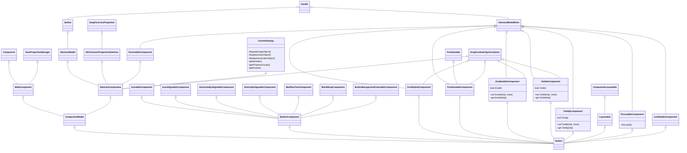

```mermaid
classDiagram
    ComponentModel <|-- Button
    ButtonComponent <|-- Button
    FontStyledComponent <|-- Button        
    PositionableComponent <|-- Button
    EnableableComponent <|-- Button
    VisibleComponent <|-- Button
    TooltipComponent <|-- Button
    Layoutable <|-- Button     
    FocusableComponent <|-- Button   
    IconIDableComponent <|-- Button

    %%%%%%%%%%%%%%%%%%%%%%%%%%%%%%%%%%%%%%%%%%%%%%%%%%
    %% ComponentModel
    WebComponent <|-- ComponentModel
    AbstractComponent <|-- ComponentModel

    %% WebComponent
    Component <|-- WebComponent
    ViewPropertiesManager <|-- WebComponent

    %% AbstractComponent
    AbstractModel <|-- AbstractComponent
    HGCommonPropertiesInterface <|-- AbstractComponent
    ParentableComponent <|-- AbstractComponent
    CustomDisplay <|-- AbstractComponent
    GraphicsDataTypeContainer <|-- AbstractComponent

    %% ABstractModel
    handle <|-- SetGet
    SetGet <|-- AbstractModel

    %% HGCommonPropertiesInterface
    GraphicsCoreProperties <|-- HGCommonPropertiesInterface

    %% ParentableComponent
    handle <|-- AbstractModelMixin 
    AbstractModelMixin <|-- ParentableComponent

    class CustomDisplay {
        #displayEmptyObject()    
        #displayScalarObject()   
        #displayNonScalarObject()
        #getHeader()         
        #getPropertyGroups()  
        #getFooter()         
    }

    %%%%%%%%%%%%%%%%%%%%%%%%%%%%%%%%%%%%%%%%%%%%%%%%%%
    %% ButtonComponent
    IconableComponent <|-- ButtonComponent
    IconAlignableComponent <|-- ButtonComponent
    HorizontallyAlignableComponent <|-- ButtonComponent
    VerticallyAlignableComponent <|-- ButtonComponent
    MultilineTextComponent <|-- ButtonComponent
    WordWrapComponent <|-- ButtonComponent
    ButtonBackgroundColorableComponent <|-- ButtonComponent


    %%%%%%%%%%%%%%%%%%%%%%%%%%%%%%%%%%%%%%%%%%%%%%%%%%
    %% FontStyledComponent
    AbstractModelMixin <|-- FontStyledComponent
    GraphicsDataTypeContainer <|-- FontStyledComponent

    %%%%%%%%%%%%%%%%%%%%%%%%%%%%%%%%%%%%%%%%%%%%%%%%%%
    %% PositionableComponent
    AbstractModelMixin <|-- PositionableComponent
    Positionable <|-- PositionableComponent
    GraphicsDataTypeContainer <|-- PositionableComponent

    %%%%%%%%%%%%%%%%%%%%%%%%%%%%%%%%%%%%%%%%%%%%%%%%%%
    %% EnableableComponent
    AbstractModelMixin <|-- EnableableComponent
    GraphicsDataTypeContainer <|-- EnableableComponent

    class EnableableComponent {
        bool Enable
        +set.Enable(obj, value)
        +get.Enable(obj)
    }

    %%%%%%%%%%%%%%%%%%%%%%%%%%%%%%%%%%%%%%%%%%%%%%%%%%
    %% VisibleComponent
    AbstractModelMixin <|-- VisibleComponent
    GraphicsDataTypeContainer <|-- VisibleComponent

    class VisibleComponent {
        bool Visible
        +set.Visible(obj, value)
        +get.Visible(obj)
    }    

    %%%%%%%%%%%%%%%%%%%%%%%%%%%%%%%%%%%%%%%%%%%%%%%%%%
    %% TooltipComponent <|-- Button
    AbstractModelMixin <|-- TooltipComponent

    class TooltipComponent {
        bool Tooltip
        +set.Tooltip(obj, value)
        +get.Tooltip(obj)
    }    

    %%%%%%%%%%%%%%%%%%%%%%%%%%%%%%%%%%%%%%%%%%%%%%%%%%
    %% Layoutable <|-- Button     
    ComponentLayoutable <|-- Layoutable

    %%%%%%%%%%%%%%%%%%%%%%%%%%%%%%%%%%%%%%%%%%%%%%%%%%
    %% FocusableComponent <|-- Button   
    AbstractModelMixin <|-- FocusableComponent

    class FocusableComponent {
        +focus(obj)
    }    

    %%%%%%%%%%%%%%%%%%%%%%%%%%%%%%%%%%%%%%%%%%%%%%%%%%
    %% IconIDableComponent <|-- Button
    AbstractModelMixin <|-- IconIDableComponent

```