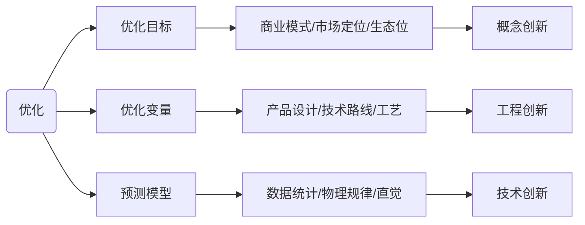
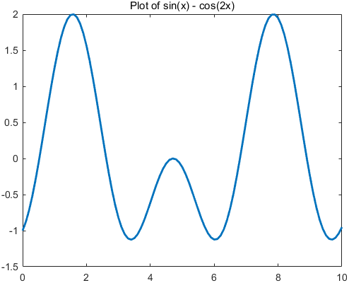
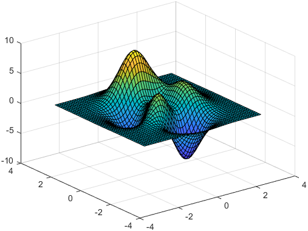
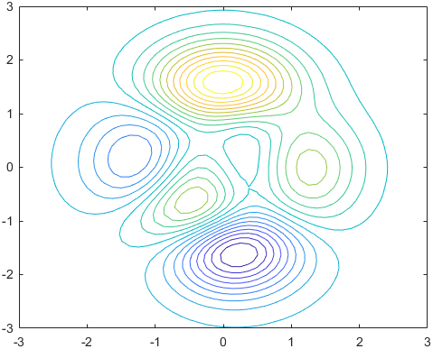
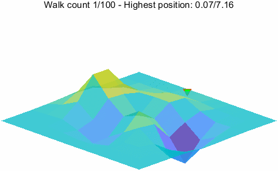
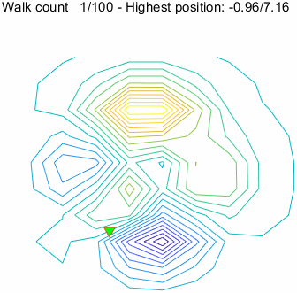

## 优化三问

优化，是一个很高大上的词语，但是在实际工作中，优化通常是一个很无趣而平凡的事情。

顾名思义，优化，也就是使之更优。优化因此有两个核心的要素：

- 优化的目标，何为优，至少这是一个可以量化且有序（这里先不纠结什么偏序、全序）的指标。
- 优化时可以调整的因素，也就是优化变量，变量可以是连续的，也可以是离散的。

用数学语言来描述：

$$
\begin{aligned}
\arg\max_{x} & f(x) \\
 & x \in \Omega
\end{aligned}
$$


在实际的工程中，优化最大的问题基本上是预测的问题，也就是说 $f(x)$。这个问题实际上又是三个问题：

- 到底把什么东西定为优化目标，这个问题说起来轻松，其实是商业公司和商业模式中的核心问题，很多时候是大企业的核心竞争力，通常这是概念创新的核心来源。
- 确定优化变量，到底哪些变量对优化目标有有影响？确定优化变量之后，又如何确定优化变量可能的范围？这部分通常是工程创新来源。
- 怎么预测优化变量和优化目标之间的关系，这部分通常是技术创新的来源。



这个三个问题，说起来通常不是特别简单，使用也不是特别简单，所以基本上，创新都是虚无缥缈的东西。

以上就是我们在讨论优化之前不花钱就能思考的一些无聊的问题。下士闻道，大笑之，不笑不足以为道。

所以，作为一个工程狗，我也不搞上面那些高大上的，我就来讨论最简单的。一个函数，怎么找到它的最大值。这就是最优化算法的范畴。


## 最优化算法

### 优化问题

对上面讨论过的优化问题，再写得明确一点，我们纠正对一个目标，也就是函数 $f(x)$ 是一个数字；优化变量 $x$ 是可能有若干个，当然我们最容易看到的就是一维和二维的情况。

$$
\begin{aligned}
\arg\max_{\mathbf{x}} & f(\mathbf{x}) \\
 & \mathbf{x}=[x_1, x_2, \ldots, x_n] \in \Omega = I_1 \times I_2 \times \ldots \times I_n
\end{aligned}
$$

因为一维和二维的情况容易可视化。

对于一维为题，非常直观，

$$
y = f(x), x \in [a, b]
$$

下面是曲线 $y = sin(x) - cos(2x), x\in[0,10]$ ，我们要找到这条曲线的最大值。



这个一维的山峰，有三个山尖，最高的有两个。

对于二维问题，我们人类也有很好的直观，就是爬山，一个山峰，我们要找到山顶。下面结合优化算法，我们会给一个二维的山峰的例子。

$$
z = f(x, y), x \in [a, b], y \in [c, d]
$$

下面是一个二维的例子，变量、目标函数和数学关系直观的用图表达出来。

- 可以用`contour`函数来表示目标函数的等高线。
- 可以用`surf`函数来表示目标函数的三维图像。


```matlab
[x, y, z] = peaks();
contour(x, y, z, 20);
exportgraphics(gcf, 'peaks-contour.png', Resolution=100);
surf(x, y, z);
exportgraphics(gcf, 'peaks.png', Resolution=100);
```





这两个概念都是非常容易理解和接受的，所以我们讨论优化算法的时候通常会用这样的例子的解释搜索的过程，思考搜索的效果。

### 几个额外的概念

上面两个例子，优化变量取一个实数区间中的连续值，目标为一维变量，优化变量与目标的函数关系是一个映射，在一维和二维的情况下，我们可以直观的看到这个映射关系。通常我们在讨论优化算法是，还会定义如下的概念：

- 设计空间：优化变量的取值范围，也就是上面的 $\Omega$。
- 目标空间：目标函数的取值范围，也就是 $f(\mathbf{x})$ 的取值范围。
- 局部最优：在设计空间中，存在一个局部区域，使得在这个区域内，目标函数的值最大。
- 全局最优：在设计空间中，存在一个区域，使得在这个区域内，目标函数的值最大。

通常我们也会把优化的过程称为搜索设计空间，所以优化算法通常也被称为搜索算法。下面就介绍两个可以作为基线的搜索算法，通常可以用于比较其他优化算法的性能。


## 基线算法
### 网格搜索


### 随机搜索


### 优化过程的可视化






