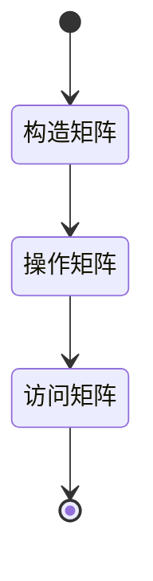

## 矩阵体操

首先，可以复习一下向量、矩阵和索引的基础知识。

- [向量约定](/posts/matlab/vectors-in-matlab/)
- [矩阵约定](/posts/matlab/matrix-in-matlab/)
- [矩阵索引](/posts/matlab/indexing_in_matlab/)

一般而言，我们利用进行计算大概就是以下的步骤：



基本上，这个状态图描述了我们大部分时候利用Matlab来构造一个运算的过程。

### 矩阵定义

矩阵定义的两个基本元素是：类型和大小。

通过`zeros`、`ones`、`eye`、`rand`等函数可以定义不同性质的矩阵。

### 操作矩阵

通过`+`、`-`、`*`、`/`等运算符可以对矩阵进行操作。也可以通过`.*`、`./`、`.^`等运算符对矩阵进行逐元素操作。

当我们把矩阵作为[左值](/posts/matlab/lval-and-rval-in-matlab/)进行赋值，就可以改变部分元素的值。

从索引的角度来看，我们可以通过`:`、`end`两个符号来访问矩阵的部分元素就；逻辑索引也非常强大，对部分满足条件的元素进行赋值。

此外，矩阵还能通过各种函数进行过变换、组合。

### 访问矩阵

最终，通过[矩阵索引](/posts/matlab/indexing_in_matlab/)我们可以访问矩阵的元素作为计算结果，或者输出在终端，或者绘制成图像。

## 例子

这个例子简直是……算了，就这个例子吧。


### 构造矩阵

那么首先，我们构造一个函数来生成这个矩阵：

```matlab
function m = sumMatrix(varargin)
% 产生一个特殊2维矩阵
%   其中矩阵的元素为，矩阵下标的和减去一
%   1 2 3 4 5 6 ...
%   2 3 4 5 6 7 ...
%   3 4 5 6 7 8 ...
%   4 5 6 7 8 9 ...
%   5 6 7 8 9 ...
%   6 7 8 9 ...

%  函数调用的参数，参考`zeros`, `ones`

m = zeros(varargin{:});
sz = size(m(1:2));

for i = 1:numel(m)
    [row, col] = ind2sub(sz, i);
    m(row, col) = row + col - 1;
end
```

这个函数的输入的参数和`zeros`、`ones`等函数一样。

我们从`zeros`函数生成一个矩阵， 然后遍历矩阵的元素（`numel`计算其元素个数），对每个元素，通过`ind2sub`函数来计算矩阵的下标，然后计算矩阵的元素的值。

$$
m_{ij} = i + j - 1, \quad i = 1, 2, \ldots, n_1, \quad j = 1, 2, \ldots, n_2
$$

这是一个非常经典的Matlab遍历矩阵元素的方式。

### 操作矩阵

接下来是第二部，保留矩阵左上角的元素，其他元素置为0。


```matlab
function mNew = leftUpper(m)
arguments
    m (:, :)
end

mNew = m;
sz = size(m);
n = numel(m);
for i = 1:n
    [row, col] = ind2sub(sz, i);

    % top-right
    if col + row > sz(end) + 1 
    % if col + row > size(1) + 1  % left-bottom
        mNew(row, col) = 0;
    end
end
```

此处增加了一点点新的东西，就是`arguments`关键字，用来指定输入参数的类型。

同样，我们命名一个新的矩阵`mNew`，然后遍历原矩阵的元素，如果元素的下标的和大于矩阵对角线下标和，就把这个元素置为0。

这里有一个很好玩的地方，就是在Matlab中，当我们使用`mNew = m;`来定义一个新的矩阵时，并没有内存的拷贝发生，而是两个变量指向了同一个内存地址。

但是，当我们对`mNew`进行赋值时，Matlab会自动为`mNew`分配新的内存空间，这样就不会影响到`m`的值。这个策略叫`copy-on-write`。当然，我也不知道知道这个有什么用……

### 访问矩阵

最后一步，提取矩阵中感兴趣的函数，这里我们需要的是提取左上角 $3\times 3$ 的矩阵。

```matlab
function mSub = subMatrix(m, row, col)
% 返回矩阵的上左部分，由参数`row`和`col`指定行数和列数

arguments
    m (:, :) 
    row (1,1) {mustBeInteger, mustBePositive, mustBeInSize(row, m, 1)}
    col (1,1) {mustBeInteger, mustBePositive, mustBeInSize(col, m, 2)} 
end

mSub = m(1:row, 1:col);

function mustBeInSize(idx, matrix, dim)
if idx > size(matrix, dim)
    eid = 'Size:outsize';
    msg = sprintf("Index (%d) must be less or equal to last index (%d) in given dimesion (%d)", idx, size(matrix, dim), dim);
    throwAsCaller(MException(eid, msg));
end
```

你要问这个为什么要搞这么复杂……我肯定不会回答你的。

这里对于函数的参数，有了更加复杂的检查。我们使用`arguments`关键字来指定输入参数的类型，然后使用`mustBeInteger`、`mustBePositive`等函数来检查输入参数的合法性。

甚至，这里我们定义了一个内部函数`mustBeInSize`，用来检查输入参数的合法性，这个函数的输入参数是`idx`、`matrix`和`dim`，分别是索引、矩阵和维度。确保给的行数和列数小于或等于矩阵对应维的长度。

### 测试

```
>> T1 = sumMatrix(4, 4)

T1 =

     1     2     3     4
     2     3     4     5
     3     4     5     6
     4     5     6     7

>> T2 = leftUpper(T1)

T2 =

     1     2     3     4
     2     3     4     0
     3     4     0     0
     4     0     0     0

>> T3 = subMatrix(T2, 3, 3)

T3 =

     1     2     3
     2     3     4
     3     4     0
```

好吧，这个也太无聊了……


## 总结

1. 矩阵的构造、操作和访问是Matlab的基本操作，也是每次计算的核心流程。
2. 通过`zeros`、`ones`、`eye`、`rand`等函数可以定义不同性质的矩阵。
3. 通过`+`、`-`、`*`、`/`等运算符可以对矩阵进行操作。也可以通过`.*`、`./`、`.^`等运算符对矩阵进行逐元素操作。
4. 通过`:`、`end`两个符号来访问矩阵的部分元素就；逻辑索引也非常强大，对部分满足条件的元素进行赋值。
5. 通过`arguments`关键字可以指定输入参数的类型，通过`mustBeInteger`、`mustBePositive`等函数来检查输入参数的合法性。
6. 通过`copy-on-write`策略，Matlab可以减少内存的使用。
7. 验证函数的输入参数的合法性，可以提高程序的稳定性。