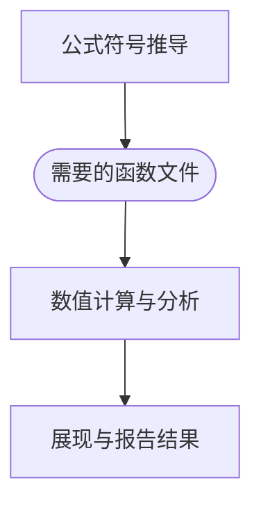

## 符号运算与数值计算

### 缘，妙不可言

给本科、硕士、博士、研究实习员、助理研究员、副研究员改过Matlab代码，最有意思也最好玩的就是兄弟姐妹们喜欢把符号运算跟数值计算混合在一起。

从概念上看，还是挺不错的。

大佬们的计划都是这样的，先`syms`一手，把公式输进去，在符号领域推导一番，最后代入数值，得到结果。

> 【扶额科】……
> 
> 【大佬斜眼科，云】那你就说Matlab有没有这个功能。
> 
> 【颔首科】……
> 
> 【大佬偏头科，云】那你就说报没报错。
> 
> 【摇头科】……
> 【挣扎科】那你看结果对不对。
> 
> 【大佬仰天科，云】结果不对那是你的问题口牙！

其实这个工作流程的确是存在而且好用的，Matlab本来也就是这样设计的。

下面就稍微介绍一下，如何顺滑地把符号计算和数值计算结合起来。

### 建议的实践
结论先行：**把符号计算和数值计算分开**。

工作的流程可以是：



我的建议是，把符号推导的部分专门放在一个LiveScript文件里，推导的结果，产生一系列函数文件，这些函数文件就是不同的Matlab函数，后面就进行正常的Matlab数值计算工程应用。

### 理由
理由主要是：符号运算中的符号会污染所有的计算，把一切涉及到符号的表达式变成符号变量和表达式，这会使Matlab高效矩阵数值计算的优势无法发挥。

符号计算真的很慢、很慢很慢。

我们举一个简单的例子：
    
```matlab
syms f(x,y,z)
f(x,y,z) = y*z*sin(x) + x*sin(z)*cos(y) - z^3;

[xDouble,yDouble,zDouble] = meshgrid(1:20,1:50,1:20);
```

接下来我们比较一下符号计算和数值计算的时间：

```
>> timeit(@()f(xDouble,yDouble,zDouble), 1)

ans =

    2.0569
```

上面的式子中，我们调用`timeit`函数是还包括了输出的赋值（1个输出变量），相当于我们在通过多次计算平均来评估`fDouble = f(xDouble,yDouble,zDouble)`的时间。

那么我们在来看一下同样电脑上数值计算的时间。

```
>> f1 = matlabFunction(f)

f1 =

  包含以下值的 function_handle:

    @(x,y,z)-z.^3+y.*z.*sin(x)+x.*cos(y).*sin(z)

>> timeit(@()f1(xDouble,yDouble,zDouble), 1)

ans =

   9.3786e-04
```
先不管这个`matlabFunction`函数，我们可以看到，这个时间差距是大于3个数量级的。

还有一个，如果你们说问题出在这里的点运算符上，那么我们可以看一下这个：

```matlab
>> syms f3(x,y,z)
>> f3(x,y,z) = y.*z.*sin(x) + x.*sin(z).*cos(y) - z.^3;
>> timeit(@()f3(xDouble,yDouble,zDouble), 1)

ans =

    2.1108
```

综上所述，不要把任何符号带入**成规模**的数值计算中，比如大范围的网格计算，循环数据处理等。

接下来，就主要介绍一下如何把符号推导的结果转化为数值计算中可以高效使用的函数。

## 符号计算工具箱

在前面考虑时间的例子中，我们使用了`matlabFunction`函数，在2008b之后的版本中，这个函数就是符号计算工具箱的一部分。


在符号计算数学工具箱中，主要处理的对象是：

- 符号常量：准确表达的数值
- 符号变量：数学上的代数变量
- 符号表达式：符号表达式

### 符号常量和符号变量


通过`sym`函数，我们可以定义符号常亮和符号变量。

```matlab
a = sym(1/3);
piSym = sym(pi);
```

这有什么区别呢？

```matlab
>> sin(piSym)

ans =

0

>> sin(pi)

ans =

   1.2246e-16
```

可以通过函数`vpa`将浮点数转化为符号常量。

这个函数默认截取32位有效数字，可以通过第二个参数指定有效数字位数。

```matlab
>> vpa(pi, 100)

ans =
 
3.141592653589793238462643383279502884197169399375105820974944592307816406286208998628034825342117068
```

新建符号变量，同样用`sym`函数，它有两种调用方式，除了能建立单纯的数学变量，还能建立符号变量向量和矩阵。

```matlab
>> sym('x', [3, 3])
 
ans =
 
[x1_1, x1_2, x1_3]
[x2_1, x2_2, x2_3]
[x3_1, x3_2, x3_3]
```

另外一种方式就是个语法躺，把符号变量直接列在一起。

```matlab
>> syms x y z [3 3]
```
这样三个符号变量矩阵，这个矩阵的元素都是符号变量。约定向量的元素是`x1,x2,x3,...`，矩阵的元素是`x1_1,x1_2,x1_3,...`。

### 符号表达式

符号表达式是符号变量的组合，可以通过涉及到符号变量和符号常量的运算得到。

```matlab
syms x y z
f = x^2 + y^2 + z^2;
```
这样定义出来的`f`就是一个`sym`类型的对象，可以进行各种运算。

或者，可以用`symfun`函数，定义一个函数。

```matlab
syms x y z
g = symfun(x^2 + y^2 + z^2, [x, y, z]);
```

或者，还可以这样定义，与上面完全相同，通常，下面这个方式更加简洁。

```matlab
syms h(x,y,z)
h(x,y,z) = x^2 + y^2 + z^2;
```

### `sym` 和 `symfun` 的区别

`sym`定义的是一个符号表达式（所有的符号都是符号表达式），`symfun`定义的是一个符号函数。

我找了好久，也没有找到太大的本质区别，在实际的使用中，`symfun`可以当做函数调用，把对应的形式符号替换为实参所对应的符号表达式，最终的结果是一个符号表达式(`sym`)。

当我们推导得到的符号表达式或者符号函数之后，我们可以通过`matlabFunction`函数，将其转化为函数句柄，这样就可以在数值计算中使用。在这一步，无论是`sym`还是`symfun`，都是可以的。


## 符号表达式的转化

